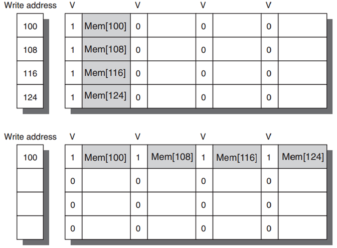

# Cache Opt: Basic

•**1. larger block size**

 reduce miss rate; --- *spatial locality;*

 reduce static power; --- *lower tag #;*

 increase miss penalty, capacity/conflict misses;

•**2. bigger caches**

 reduce miss rate; --- *capacity misses*

 increase hit time;

 increase cost and (static & dynamic) power;

•**3. higher associativity** 

 reduce miss rate; --- *of conflict misses;*

 increase hit time;

 increase power;

•**4. multilevel caches**

 reduce miss penalty;

 reduce power;

average memory access time =

Hit timeL1 + Miss rateL1 x

(Hit timeL2 + Miss rateL2 x Miss penaltyL2)

•**5. giving priority to read misses over writes**

 reduce miss penalty;

 introduce write buffer; 

•**6. avoiding address translation during indexing of the cache**

 reduce hit time;

 use page offset to index cache;

 **virtually indexed, physically tagged**;

==(indexing cache while querying TLB)==

# Cache Opt: Ex

## Intro

* Goal: Lower Memory Access time
* Metrics
    * hit time
    * miss rate
    * miss penalty
    * cache bandwidth
    * power consumption
* To-do
    * Reduce hit time
        * small and simple first-level caches;
        * way prediction;
        * decrease power;
    * Increase cache bandwidth
        * pipelined/multibanked/nonblocking cache;
    * Reduce miss penalty
        * critical word first;
        * merging write buffers;
    * Reduce miss rate
        * compiler optimizations; <u>decrease power</u>;(???)
    * Reduce miss penalty or miss rate via parallelism
        * hardware/compiler prefetching; increase power;

## Methods

### Small and simple L1 cache

* Small size
    * support a <u>fast clock cycle</u>
    * reduce power(clk不变的条件下)
* Lower associativity
    * reduce <u>both hit time and power</u>
        * direct-mapped caches can overlap the tag check with the transmission of the data, there’s only one piece of data for each index

### Way Prediction

> **Way prediction**
>
> block predictor bits are added to each block to predict the <u>way/block within the set</u> of the *next* cache access
>
>  
>
> * the multiplexor is set **early to select the desired block**;
> * only a single tag comparison is performed **in parallel with cache reading**;
> * a miss results in checking the other blocks for matches <u>in the next clock cycle</u>;

Reduce <u>conflict misses and hit time</u>

### Pipelined Cache Access

使第一级缓存命中的实际延迟可以分散到多个时钟周期

* Pro
    * Increase cache bandwidth
* Con
    * Higher latency
    * Greater penalty on mispredicted branches and more clock cycles between issuing load and using data

### Nonblocking cache

在某个指令出现miss时，cache仍能正常被其他指令hit，要求CPU支持乱序

> * Nonblocking/lockup-free cache
>     * leverage out-of-order execution 	
> * allows data cache to continue to supply cache hits during a miss;
>     * hit under miss; 
>     * miss under miss;
>     * hit under multiple misses;

* Increase cache bandwidth

### Multibanked cache

机组里的n-way interleaved

> * Divide cache into independent banks that support simultaneous accesses
> * Sequential interleaving
>     * spread the addresses of blocks sequentially across the banks

* Increase cache bandwidth

### 6 Critical Word First & Early Restart

Motivation：加载一个块但是实际只需要一部分，因此可以等这部分载入后马上issue，然后重启CPU

> * Critical word first
>     1. request the missed word first from the memory and send it to the processor as soon as it arrives; 
>     2. <u>processor continues execution while filling the rest of the words in the block</u>
> * Early restart
>     1. fetch the words <u>in normal order</u>, 
>     2. as soon as the requested word arrives send it to the processor;

* Reduce miss penalty

### 7 Merging Write Buf

> 如果缓冲区种包含其他的经过修改的块，则检查他们的地址，看看新数据的地址是否与写缓冲区种有效entry的地址匹配
>
> * 若匹配，则讲新数据与这个页表合并
>
> 然后将多个entry合并成一个更大（地址范围更大，但是实际存储数据不变）的entry
>
> 
>
> （我觉得大概的意思就是别排队写同一个地址，而是直接把同地址的前面的人挤掉（但是这样会不会有data hazard的问题？））

* Reduce miss penalty

### 8 Compiler Opt

**Loop interchange**

```python
for i in range(100):
    for j in range(50):
        mat[i][j] = 2 * mat[i][j]

for j in range(50):
    for i in range(100):
        mat[i][j] = 2 * mat[i][j]
```

**Blocking**

矩阵分块计算

https://en.wikipedia.org/wiki/Block_matrix

Pro

* Reduce miss rates, w/o hw changes

### 9 Hardware Prefetching

> 对指令和数据及进行硬件预取，放在cache中，或放在cache外部速度快于mem的区域（一般用这种方法，该区域称为流缓冲区）。当有取东西的指令时，如果流缓冲区有相应的东西，就会cancel掉本来取内存取的task，直接从流缓冲区拿。
>
> * Instruction prefetch
>     * fetch two blocks on a miss: requested one into cache + next consecutive one into instruction stream buffer
> * Data prefetch
>     * 一样的

* Reduce miss penalty/rate

### 10 Compiler Prefetching

> Compiler to insert **prefetch instructions** to request data before the processor needs it
>
> * Register prefetch
>     * load the value into a register
> * Cache prefetch
>     * load data into the cache

* Reduce miss penalty/rate


**Example**

```c
for (int i = 0; i < 3; i++)
    for (int j = 0; j < 100; j++)
        a[i][j] = b[j][0] * b[j + 1][0];
```

* 16B block
* 8B \*\*a, \*\*b
* write back

对于a\[0\]\[0\]的miss，会把a\[0\]\[0\]和a\[0\]\[1\]都fetch进来（一个block有两个element）

因此a有150个misses，b有101个misses，共251个misses

如果编译预取，变为：

```c
/*
    假定要至少提前7次进行预取，即在第8次之前进行预取不会有任何好处
    Totally 19 misses
*/
for (int j = 0; j < 100; j++) {
    prefetch(b[j + 7][0]);  // 7: b[0][0]-b[6][0]
    prefetch(a[0][j + 1]);  // 4: a[0][0] - a[0][6]
    a[0][j] = b[j][0] * b[j + 1][0];
}

for (int i = 0; i < 3; i++) {
    for (int j = 0; j < 100; j++) {
        prefetch(a[i][j + 7]);  // 8: a[1][0]-a[1][6], a[2][0]-a[2][6]
        a[i][j] = b[j][0] * b[j + 1][0];
    }
}
```

# Main Mem