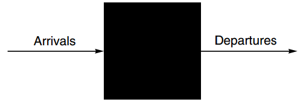
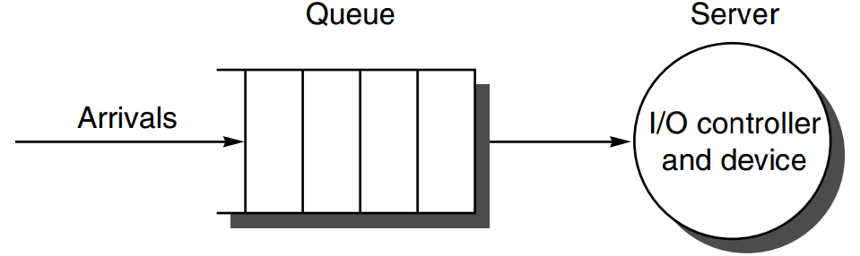

[TOC]

# IO Performance

Unique Measures

* Diversity
    * which I/O devices can connect to the computer system?
* Capacity
    * how many I/O devices can connect to a computer system?

## Producer-Server Model

producer creates tasks to be performed and places them in a buffer;

server takes tasks from the FIFO buffer and performs them;

### Metrics

* **Response time /** Latency
    * the time a task from the moment it is placed in the buffer until the server finishes the task
* **Throughput /** Bandwidth
    * the average number of tasks completed by the server over a time period

#### Choosing Response Time

* Transaction
    * an interaction between user and comp
* Transaction Time consists of
    * Entry time: the time for the user to enter the command
    * System response time: the time between command entered and complete response displayed
    * Think time: the time from response reception to user entering next cmd

## TPC

* Conducted by
    * Transaction-Processing Council
    * OLTP for On-Line Transaction Processing
* I/O rate: the number of disk accesses per second;
    * instead of data rate (bytes of data per second)

**Configuration**

* use a database to simulate an order-entry environment of a wholesale supplier
* Include entering and delivering orders, recording payments, checking the status of orders, and monitoring the level of stock at the warehouses
* Run five concurrent transactions of varying complexity
* Includes nine tables with a scalable range of records and customers

**Metrics**

* tmpC
    * transactions per minute
* System price	
    * hardware
    * software
    * three years of maintenance support

# Queuing Theory

> Give a set of simple theorems that will help <u>calculate response time and throughput</u> of an entire I/O system

* Because of the probabilistic nature of I/O events and because of sharing of I/O devices
* A little more work and much more accurate than best-case analysis,
    * but much less work than full-scale simulation

## Black Box Model

* Type
    * Processor makes I/O requests that arrive at the I/O device
    * Requests depart when the I/O device fulfills them
* Balance
    * If the system is in steady state, then the number of tasks entering the system must equal the number of tasks leaving the system
    * This flow-balanced state is <u>necessary but not sufficient</u> for steady state
    * 通常的判定：The system has reached steady state if the system has been observed for a <u>sufficiently long time</u> and <u>mean</u> waiting times stabilize

## ==Little's Law==

* Assumptions
    * multiple independent I/O requests in <u>equilibrium</u>: input rate = output rate; 只适用于平衡系统
    * a steady supply of tasks independent for how long they wait for service; 与等待时间无关

`Mean number of tasks in system = Arrival rate x Mean response time`

* Param
    * Time~observe~: time period for observing the system
    * Number~tasks~: number of completed tasks *during observation*
    * Time~accumulated~: <u>sum</u> of the times <u>each task</u> spends in the system during observation

得到的步骤：

1. Arrival rate = Number~tasks~ / Time~observe~
2. Mean response time = Time~accumulated~ / Number~tasks~
3. Mean number of tasks in system = Time~accumulated~ / Time~observe~

## ~~Single-Server Model~~

* Time~server~
    * average time to <u>service a task</u>
    * average service rate: 1/Time~server~
* Time~queue~
    * average time per task in the queue
* Time~system~
    * average time per task in the system, or the response time;
    * Time~queue~ + Time~server~
* Arrival rate
    * average # of arriving tasks per second
* Length~server~
    * average # of tasks in service
* Length~queue~
    * average length of queue
* Length~system~
    * average # of tasks in system,
    * Length~server~ + Length~queue~

**Server Utilization / traffic intensity**

* Server utilization
    * the mean <u>number of tasks</u> being serviced divided by the service rate
* Service rate = 1 / Time~server~
* ==<u>Server utilization</u>==
    ==\\	<u>=Arrival rate x Time~server~</u> (little’s law again)==
    * Example
        * an I/O sys with a single disk gets on average 50 I/O requests per sec; 10 ms on avg to service an I/O request;
        * server utilization 
            \\	= arrival rate x timeserver
            \\	= 50 x 0.01 = 0.5 = 1/2
        * Could handle 100 tasks/sec, but only 50
    * 因此：arrival_rate~max~ = 1 / t~ser~

## ~~Queue~~

### ==Queue Discipline==

How the queue delivers tasks to server

* FIFO: first in, first out
    * Time~queue~
        \\	= Length~queue~ x Time~server~ (从刚进queue一直等到自己被执行的长度正好就是queue长度)
        \\		+ Mean time to complete the task being serviced when new task arrives if server is busy (要等当前在执行的任务完成后才能调度第一个queue中的task，这段等待时间)

with exponential/Poisson distribution of events/requests ？？？

* Time~queue~ = Time~server~ \* ServerUtilization / (1 - ServerUtilization)

* Length~queue~ = ArrivalRate \* Time~queue~ = ServerUtilization^2^ / (1 - ServerUtilization)

    * Example

        * an I/O sys with a single disk gets on average 50 I/O requests per sec; 10 ms on avg to service an I/O request;

        * Length~queue~

            \\	0.5^2^ / 0.5 = 0.5

### M/M/1 Queue

**Meaning**

* M: Markov exponentially random request arrival;
* M: Markov exponentially random service time
* 1: single server

**Assumptions**

* The system is in equilibrium
* Interarrival times (times between two successive requests arriving) are <u>exponentially distributed</u>
* Infinite population model: unlimited number of sources of requests
* Server starts on the next job immediately after finishing prior one
* FIFO queue with unlimited length
* One server only

**Example.1**

> a processor sends 40 disk I/Os per sec;
> exponentially distributed requests;
> avg service time of an older disk is 20ms;
>
> （这里的server就是disk，提供的service就是disk I/O）
>
> avg server utilization? 

= ArrivalRate \* Time~server~ = 40 \* 0.01 = 0.4

> avg time spent in the queue?

Time~queue~ = Time~server~ \* SU / (1-SU)

\\				= 10ms \* 0.4 / 0.6 = 6.7ms

> avg response time (queuing+serv)?

Time~sys~ = Time~queue~ + Time~server~ = 16.7ms

### M/M/m Queue

m: multiple

$$
\large
{
    \text {Utilization}=\frac{\text{Arrival rate} \times \text {Time}_{\text {server}}}{\mathrm{N}_{\text {servers }}} \\
    \text {Length}_{\text{queue}}=\text {Arrival rate} \times \text {Time}_{\text {queue}} \\
    \text {Time}_{\text {queue}}=\text {Time}_{\text {server}} \times \frac{P_{\text {tasks}\geq \mathrm{N}_{\text {servers}}}}{\mathrm{N}_{\text {servers}} \times(1-\text {Utilization})}
}
$$
Where,
$$
\large{
    \text { Prob }_{\text {tasks}\geq \mathrm{N}_{\text {servers }}}=\frac{\mathrm{N}_{\text {servers }} \times \text { Utilization }^{\mathrm{N}_{\text {servers }}}}{\mathrm{N}_{\text {servers }} ! \times(1-\text { Utilization })} \times \operatorname{Prob}_{0 \text { tasks }}
    \\
    \text { Prob }_{0 \text { tasks }}=\left[1+\frac{\left(\mathrm{N}_{\text {servers }} \times \text { Utilization }\right)^{\mathrm{N}_{\text{servers }}}}{{\mathrm{N}_{\text {servers }} ! \times(1-\text { Utilization })}}
    +\sum_{n=1}^{\mathrm{N}_{\text {servers }}-1} \frac{\left(\mathrm{N}_{\text {servers }} \times \mathrm{Utilization}\right)^{n}}{n !}\right]^{-1}
}
$$

**Example**

> a processor sends 40 disk I/Os per sec;
> exponentially distributed requests;
> avg service time for read is 20ms;
> two disks duplicate the data;
> all requests are reads;	
>
> avg server utilization? 
40 \* 0.02 / 2 = 0.4

> avg time spent in the queue?

Prob~0\ tasks~ = [1 + (2 \* 0.4)^2^ / (2\! \* 0.6) + 0.8^1^ / 1\!]^-1^ = 2.333^-1^

Prob~taks>=N_servers~ = (2 \* 0.4^2^) / (2\! \* 0.6) \* 2.333^-1^ = 0.229

Time~queue~ = 20ms \* 0.229 / (2 \* 0.6) = 3.8ms

> avg response time (queuing+serv)?

23.8ms