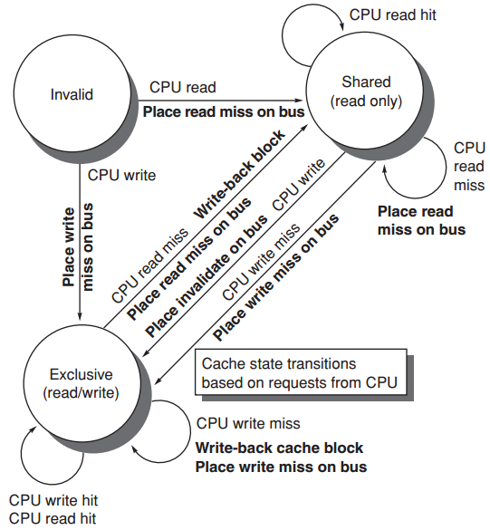

[TOC]

。。。

## Cache Coherence Protocols

* Directory based
    * the sharing status of a particular block of physical memory is kept in one location, called directory
* Snooping
    * every cache that has a copy of the data from a block of physical memory could <u>track the sharing status of the block</u>

### Snooping

#### Writing invalidation protocol

使其他处理器的cache上的数据无效化，on-demand修改

三种block状态 **MSI**

* Invalid
* Shared
    * indicates that the block in the private cache is potentially shared
* Modified
    * indicates that the block has been updated in the private cache;
    * <u>implies that the block is exclusive</u>，在当前处理器的cache上被改过了，但是还没写进mem和其他cache

* 
    * Invalid到exclusive应该是因为是write吧，然后直接写倒也没问题

#### Write update/broadcast protocol

同时更新其他处理器的cache上的数据

### Directory based