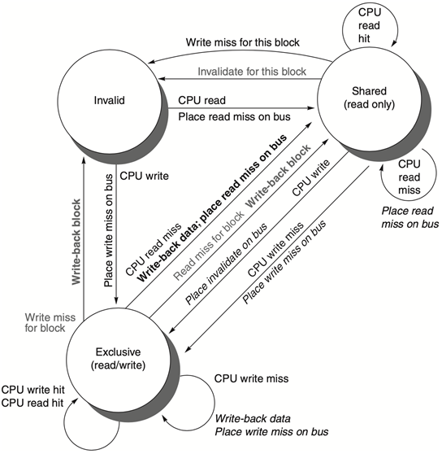

[TOC]

。。。

## Cache Coherence Protocols

* Directory based
    * the sharing status of a particular block of physical memory is kept in one location, called directory
* Snooping
    * every cache that has a copy of the data from a block of physical memory could <u>track the sharing status of the block</u>

### Snooping

#### ==Write invalidate protocol==

使其他处理器的cache上的数据无效化，on-demand修改

三种block状态 **MSI**

* Invalid：我不能用这个块，因为其他cache上的这个块变成exclusive的了
* Shared
    * indicates that the block in the private cache is potentially shared
* Modified
    * indicates that the block has been updated in the private cache;
    * <u>implies that the block is exclusive</u>，在当前处理器的cache上被改过了，但是还没写进mem和其他cache

* From CPU: 
    * Invalid到exclusive应该是因为是write吧，然后直接写倒也没问题
* From Bus: 
* 总图：

[课本英文第六版](file:///C:/Users/Ulysses/OneDrive/Jun_A/CA/%E8%B5%84%E6%96%99/%E8%AE%A1%E7%AE%97%E6%9C%BA%E4%BD%93%E7%B3%BB%E7%BB%93%E6%9E%84%E9%87%8F%E5%8C%96%E6%96%B9%E6%B3%95%E7%AC%AC%E5%85%AD%E7%89%88%E8%8B%B1%E6%96%87%E7%89%88.pdf) 385页

#### Write update/broadcast protocol

同时更新其他处理器的cache上的数据

### Directory based