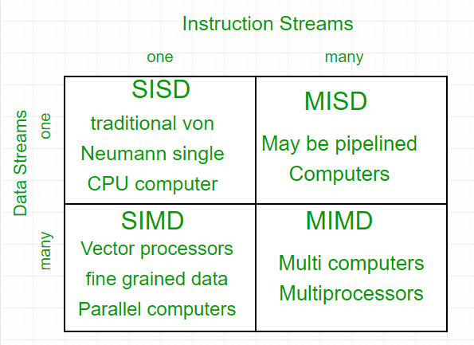

[TOC]

SISD, SIMD, MISD, MIMD

[Flynn's taxonomy - Wikipedia]([Flynn's taxonomy - Wikipedia](https://en.wikipedia.org/wiki/Flynn's_taxonomy))

FA，SA，DM一般用于L1, L2, L3

DM在L3时BlockNum会很大

使用VM节省空间的原因：向OS申请空间时分配的是动态的，但是并不是一直占用的，如果整个被分配的空间都被标记为使用并且让某个程序独占，则会浪费很多物理空间；另外可以将空间碎片化

使用VM进行内存保护：通过映射防止越界访问(映射机制可以记录虚拟空间对应的物理地址)

shared mem/cache：并行更新的问题

## **Amdahl's law**

> S is overall speedup, s is enhanced speedup, p is enhanced partiton

==$S_{\text {latency }}(s)=\frac{1}{(1-p)+\frac{p}{s}}$==

* *S*~latency~ is the theoretical speedup of the execution of the whole task;
* *s* is the number of threads across which the parallel portion is split;
* *p* is the proportion of execution time that the part benefiting from improved resources originally occupied.

$\left\{\begin{array}{l}S_{\text {latency }}(s) \leq \frac{1}{1-p} \\ \lim _{s \rightarrow \infty} S_{\text {latency }}(s)=\frac{1}{1-p}\end{array}\right.$

Computer Type

* Personal
* Server
    * Hight throughput
    * Scalability
* Clusters/WSC
    * price-performance
    * availability
    * power
* Embedded

**Parallelism**

* DataLP
    * CLA
    * Matrix Multiplication
* TaskLP
    * Run many diffferent tasks at the same time on the same data
    * Ex: 输入一个Bitstream，TaskA算bit数，TaskB算反码
* InstructionLP
    * divide a task to steps; simultaneously run different steps of different tasks.
    * Pipline
    * Specualtive exec: Do works in advance
* Vector Architeture, GPUs, Multimedia Instruction Sets
* ThreadLP
* RequestLP

## Classes of Parallel Arch

according to the parallelism in the instruction and data streams called for by the instructions:

SISD, SIMD, MISD, MIMD

## **ISA**

7 Dimensions

1. Class of ISA
    * General-purpose register archittectures
    * Two popular versions
        * register-memory ISA: e.g., 80x86
            * many instructions can access memory
        * load-store ISA: e.g., ARMv8, RISC-V(all ISAs after 1985)
            * only load and store instructions can access memory

2. Memory addressing: Aligment: Less memory access

3. Addressing modes: Reg/Const/Immediate/Displacement(PC-relative)/

    * 参考：[CS201 Lab](https://www.cs.uregina.ca/Links/class-info/201/SPIM-AddressingMode/lecture.html)

    * ~~立即数寻址：MIPS immediate addressing means that one operand is a constant within the instruction itself. The advantage of using it is that there is no need to have extra memory access to fetch the operand. But keep in mind that the operand is limited to 16 bits in size.~~

        ~~~~

        ~~J can also be considered as immediate，计组说叫伪直接~~

        ~~~~

    * ~~For MIPS, Base: lw/sw; Immediate: j; PC-relative: beq;~~

4. Types and sizes of operands

5. Operations

6. Control flow instructions: jump, branch

7. Encoding an ISA
