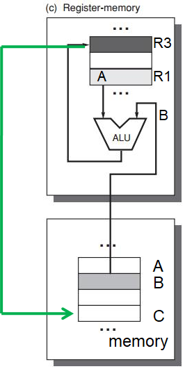

[TOC]

# ISA

==教材第五版 附录A==

## ISA Classes

### By internal storage

这里的internal storage指的是处理器里面从内存/缓存存取的数据

* stack
* accumulator
* reg

### stack architecture

所有数据都存在内存

1. Push A: 
2. Push B: 
3. Add: 
    * first operand removed from stack, second op <u>replaced</u> by the result
4. Pop C: 

### accumulator architecture

* one implicit operand: the accumulator (这里是已经读进来作为accumulator的A)
* one explicit operand: mem location (这里是还在内存里的B)

1. Load A: 
2. Add B: 
3. Store : 

### GPR

general-purpose register architecture

* Only explicit operands
    * registers
    * memory locations
* Operand access:
    * direct memory access
    * loaded into temporary storage first

#### Two Classes

* register-memory architecture
    * any instruction can access memory
    * C=A+B
        1. load r1, A: 
        2. add r2, r1, B: 
        3. store r3, C: 
* load-store architecture
    * only load and store instructions can access memory
    * <u>every new arch designed after 1980 uses a load-store architecture</u>
        * effieciency
    * C=A+B
        1. load r1, A: 
        2. load r2, B: 
        3. add r3, r1, r2: 
        4. store r3, C: 

#### GPR Classification

# Steps of exec

==课后看ppt==

## Get Operands

### Interpret Mem Address

* 大小端
* 是否对齐

### Addressing Modes

* const
* reg
* memory location

## Operate Operands

## Control flow instructions

### Addressing

* PC-relative addr
* Dynamic addr

### Branch

Conditional Branch

## How do hardware understand instructions?

### Compiler Opt

# RISC

信息源熵：$\Large H = -\sum p_i\log p_i$