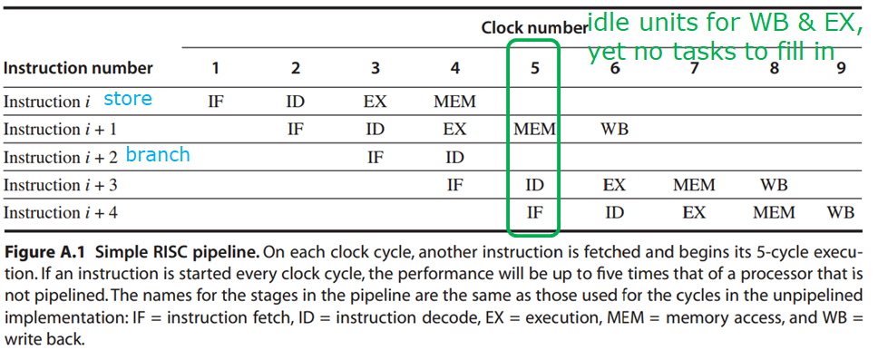
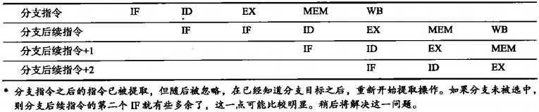
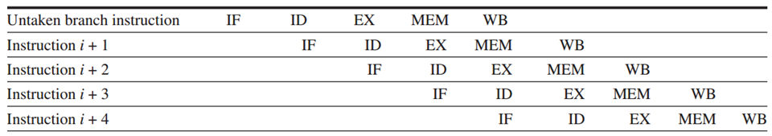
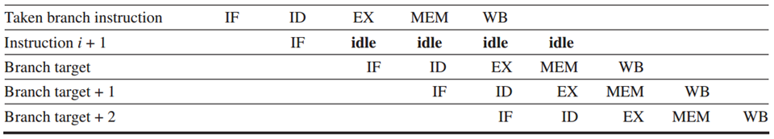

[TOC]

# Basis

**Pipelining Terminology**

* *Latency*: the time for an instruction to complete.
* *Throughput* of a CPU: the number of instructions completed per second.
* Clock cycle: time duration of one lockstep 
    * everything in CPU moves in lockstep;
* Processor Cycle: time required between moving an instruction one step down the pipeline;
    	= time required to complete a pipe stage;
        	= max(times for completing all stages);
        	= one or two clock cycles, but rarely more.
* CPI: clock cycles per instruction


* Average - faster
* Individual – slower *(service time)*
    * *but much less time in queue*
* Individual – faster: queue + service 


流水线的问题

* 某个sec阻塞了
* 多功能流水线中不一定每个操作都需要所有的sec
* 有些可能执行完sec1又回去执行sec0


简单地将指令分为IF, ID, EX三段

则可以分类为三种

* ?
* Signle overlap
* Twice overlap


为什么不能分太多段

* 锁存器时间
* 设计复杂


## 分类

单功能与多功能


静态流水线与动态流水线（针对多功能流水线）

* 静态：一直到所有指令执行完才切换
* 动态：随时切换，如加法一半可以换到乘法


线性与非线性

* 线性
* 非线性：可能有回路
    * 涉及到流水线的调度问题


顺序与乱序

* 是否按照进来的顺序执行
* 要有机制保证乱序执行不影响结果


# Performance

m是指令个数，n是拆分任务数

## TP

*Throughput* of a CPU: the number of instructions completed per second.

* TP < TPmax
* TP = n/(m+n-1)TPmax = n/(m+n-1) \* 1/max(Δt)

解决瓶颈段

* 将task分为多个子task
* 用多个部件同时执行这个task


## SP

*Speedup* 无量纲


## η

*Efficiency*

η=n/(m+n-1)

# How Works

如果是没有MEM阶段的指令，MEM这个阶段也会等



## Dependence

### Data dependency

A Flow dependency, also known as a data dependency or true dependency or read-after-write (RAW), occurs when an instruction depends on the result of a previous instruction:

```
A = 3
B = A
C = B
```

Instruction 3 is truly dependent on instruction 2, as the final value of C depends on the instruction updating B. Instruction 2 is truly dependent on instruction 1, as the final value of B depends on the instruction updating A. Since instruction 3 is truly dependent upon instruction 2 and instruction 2 is truly dependent on instruction 1, instruction 3 is also truly dependent on instruction 1. [Instruction level parallelism](https://en.wikipedia.org/wiki/Instruction_level_parallelism) is therefore not an option in this example. [[1\]](https://en.wikipedia.org/wiki/Data_dependency#cite_note-architecture-1)

### Name dependences

**anti-dependence** (WAR)

```assembly
div $2, $6, $4
add $6, $0, $12
sub $8, $6, $14
```

div and add is **anti-dependence** due to $6

so chaneg $6 to other reg

```
div $2, $6, $4
add $1, $0, $12
sub $8, $1, $14
```

**output dependence **(WAW)

```assembly
div $2, $6, $4
add $6, $0, $12
sub $2, $6, $14
```

如果乱序执行$2可能会不知道是哪个值

==AS3.12.b==

### Control Dependence

。。。。

## Pipeline hazard

### 结构Structural冒险

<u>硬件资源</u>无法支持所有指令的并行

例如，

* 资源的copy不足：例如寄存器只有一个写引脚，如果一个周期要两个WB就会出问题
    * solution：停住其中一个，但是这样会增大CPI
* 数据和指令在不同时期被需要
    * sol：哈弗
* lw/sw会与之后指令的引用冲突
    * sol：停顿一个<u>时钟周期</u>，称为bubble
* 

### 数据Data冒险

运算需要之前的指令的结果（仍是乱序为前提）

==这里的after指的是指令的顺序而不是实际流水线的顺序==

例如：

* RAW(Read after write)
    * ```assembly
        add $5, $28, $29
        sub $30, $5, $31
        ```

* WAR

    * ```assembly
        div $2, $6, $4
        add $6, $0, $12
        ```

* WAW

    * ```assembly
          div $2, $0, $4
        sub $2, $6, $14
      ```

sol

* [forwarding](https://en.wikipedia.org/wiki/Operand_forwarding)(bypassing)
    * directly feed back EX/MEM&MEM/WB pipeline regs’ results to the ALU inputs
* bubble(stall)
    * ==并不是所有data hazard都可以通过forwarding解决，例如`lw r1, 0(r2); sub r4, r1, r5`在lw在第四个周期结束才能得到r4，而sub在第三个周期开始就要用到==

### 控制Control冒险

分支指令等会改变PC的指令可能会导致

#### 分支预测

静态预测：编译器实现

动态预测：

* 预测成功
* 预测失败

#### Freeze or flush

* ~~保留或删除~~分支后的所有指令，直到知道分支目标为止 (holding or deleting any instructions after the branch until the branch destination is known.)
    * 其实不是什么删除的问题，就是爷不执行了，爷搬个凳子看看你是什么妖怪爷再执行
* 实现简单（软硬件
* 分支代价是固定的，无法通过软件优化
* 
    * 分支后续指令包括了taken和untaken的情况，其中只有taken才会有两个IF
        * 由于在分支指令的ID之前不知道它是分支指令，所以还是会执行Untaken情况下的后一条指令的IF
        * 由于在分支指令的EX之前不知道他跳不跳转，所以先IF
            * ==等等，这是怎么在EX开始之前就知道分支跳不跳转的？不知道为啥急着IF==

#### Predicted-untaken 

* 假设所有分支都是未选中分支（即将分支指令看作是普通指令）
* 在知道确切的是否分支之前，不能改变处理器状态；如果是taken的，则还必须undo对处理器状态的修改
    * Untaken: 
    * Taken: 
* ==为什么没有predicted-taken：要ID结束之后才能算出地址，所以还不如延时槽==


#### Delay slot

延迟槽

* 放一条无关指令（不会对其他人造成影响的），作为延时判断错误的缓冲
* [cpu - Why is the branch delay slot deprecated or obsolete? - Stack Overflow](https://stackoverflow.com/questions/54724410/why-is-the-branch-delay-slot-deprecated-or-obsolete)
    * <!--影响效率，完全可以用分支预测来解决-->
    * <!--对于CISC这样的二十几个周期的指令集，加个nop更浪费时间了-->
    * 可以用多发射的方式                                           
    * 可以拉长流水线
    * 用buffer记录历史信息提高预测率（Branch History Table）

