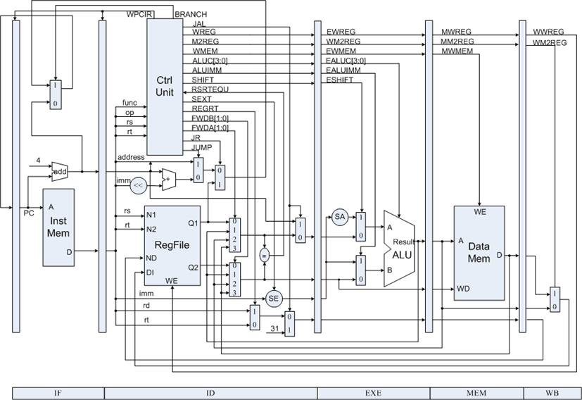

[TOC]

# MIPS Simple Imp



## 5 Stages

Brief description, 忽略了寄存器和控制信号的流水化

* IF

    * ```assembly
        IR <-- Mem[PC]
        NPC <-- PC + 4
        ```

* ID

    * ```assembly
        A <-- Regs[rs]
        B <-- Regs[rt]
        Imm <-- {16{IR[15]}, IR[15:0]}
        ```

* EX

    * Mem Ref

        * ```assembly
            ALUOut <-- A + Imm
            ```

    * Reg ALU

        * ```assembly
            ALUOut <-- A funct B
            ```

    * Imm ALU

        * ```assembly
            ALUOut <-- A opcode B
            ```

    * Branch

        * ```assembly
            ALUOut <-- NPC + (Imm<<2)
            BranchCond <-- (A==0)  # bez
            BranchCond <-- (A==B)  # beq, bne
            # Branch = ((~(zero ^ Branch) & PCWriteCond) | PCWrite) & MIO_ready
            # Branch = (A==B) ^ Opcode[0]  # For beq and bne
            ```

* MEM

    * ```assembly
        PC <-- NPC  # For all
        ```

    * Mem Ref

        * ```assembly
            LMD <-- Mem[ALUOut] # load, LoadMemData
            Mem[ALUOut] <-- B	# save
            ```

    * Branch

        * ```assembly
            if (cond)              # beq
                PC <-- ALUOut
            if (cond ^ Opcode[0])  # beq, bne
                PC <-- ALUOut
            ```

* WB

    * Reg ALU

        * ```assembly
            Reg[rd] <-- ALUOut
            ```

    * Imm ALU

        * ```assembly
            Reg[rt] <-- ALUOut
            ```

    * Load

        * ```assembly
            Regs[rt] <-- LMD
            ```


# MIPS Basic

流水线事件（包括寄存器的流水化）


# MIPS Ctrl

Issue：发射，将指令从ID移入EX的过程，用以控制流水线的阻塞

# Branch

