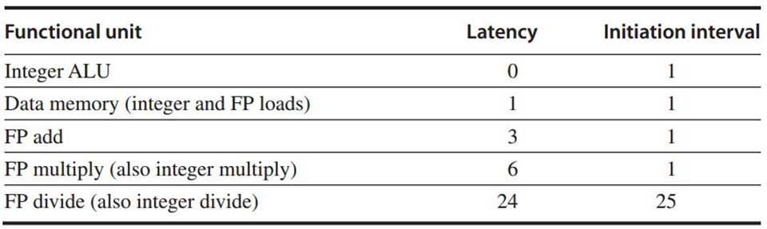

[TOC]

**==Latency & Ini/Repeat Interval==**

* **Latency**
    * the number of intervening cycles between an instruction that produces a result and an instruction that uses the result？不是同一个inst里面的吗？还是说这里的inst是微指令
    * ld/sd指令是针对被存储的值而言的，而不是针对基址寄存器
* **Initiation/Repeat Interval**
    * the number of cycles that must elapse between issuing two operations of a given type
    * 



Essentially, pipeline **latency** is 1 cycle less than the depth of the execution pipeline, which is the number of stages from the **EX stage** to the stage that produces the result 

# 👇不考的东西

# Multi-cycle Stage

## FP Pipeline

* Latency
    * the number of intervening cycles between an instruction that produces a result and an instruction that uses the result
    * `= Cycle(EX) - 1`
* Initiation/Repeat Interval
    * the number of cycles that must elapse between issuing two operations of a given type


## MIPS R4000

8 Statge


* DF: data fetch, first half of data access;
* DS: second half of data fetch, completion of data cache access;
* TC: tag check, determine whether the data cache access hit;

# Nonlinear Pipeling

## Schedule of Nonlinear pipeling

[Difference between Linear Pipeline and Non-Linear Pipeline - GeeksforGeeks](https://www.geeksforgeeks.org/difference-between-linear-pipeline-and-non-linear-pipeline/)

https://gear.kku.ac.th/~watis/courses/188701/Adv-pipeline1.pdf

Reservation Table横的列是不同时期，不同行是不同资源 -- [Reservation Table Analyzer](http://www.ecs.umass.edu/ece/koren/architecture/ResTable/SimpRes/)


* Initial conflict vector

    用二进制数表示初始状态（第一个任务进入）每个部件的忙或闲

    e.g.从初始状态中发现，隔哪些拍数不行，用二进制数表示

    隔1、5、6、8拍调度不行

    从右往左记录 ——C0  = （10110001）

* Conflict vector

    选择一个C0中可以进行的调度（例如空2拍）

    CCV= current Conflict vector

    将1、2、3...任务进入，不停地将CCV与新的冲突向量取并集，找到循环的点（CCV回到C0）

    注意要找到最优，需要将所有的可能列出

* state transition graph

    注意，非线性流水线不一定要保证每次进行固定空N拍的调度，可以进行先空N拍在空M拍...等的循环调度

## Dynamic Scheduling

[Dynamic Scheduling Techniques](http://web.cs.iastate.edu/~prabhu/Tutorial/PIPELINE/dynamSchedTech.html)

* 采用情况

    流水线中已有指令与要提取的指令之间存在数据相关，且无法通过旁路或转发来隐藏这一数据相关

* 特点

    硬件==重新安排指令的执行顺序==以减少停顿，并同时保持数据流和异常行为

* 优

    * 允许针对一种流水线编译的代码在不同流水线上高效执行，不需要在使用不同为体系结构时重新进行编译，并同时拥有多个二进制文件
    * 编译代码时不知道相关性，动态调度可以处理此类情况
    * **<u>允许处理器容忍一些预料之外的延迟</u>**，比如缓存损失

### Scoreboard算法

[记分牌算法 - 汉尼拔草 - 博客园](https://www.cnblogs.com/peanutk/p/10235964.html)


* Def

    * 允许**<u>有足够资源（没有结构冲突）和没有数据相关时</u>**的乱序执行指令

* 优

    * 如果仅在操作数可用时才执行指令，就可以避免RAW冒险

* 缺

    * **<u>仅仅是记录，如果发生冲突只能等，没有措施</u>**

* 阶段

    * 

    * **IS（发射）（看指令状态表）**：**<u>指令译码，检测结构相关==（顺序）==</u>**
* 若某指令所需要的功能单元为空**<u>（无结构冲突）</u>**，且无其他指令用到同一目的寄存器（**<u>确保不会出现WAW冲突</u>**），则把指令发射到功能单元，并更新其内部数据结构；若存在结构冲突或WAW冲突，则**<u>停顿后续指令发射</u>**，直到冲突消失
  
* **RO（读操作数）（看功能部件状态表，没有数据相关时读操作数）**：**<u>检测RAW，若有，停顿该指令（但在动态调度时有多条指令并行操作，所以有可能有另外的指令满足条件执行下去，消除了停顿的损失）</u>**
  
    * 如果以发射的正在运行的指令不对当前指令的源操作数寄存器进行写操作，或者一个正在工作的功能部件已经完成了对该寄存器的写操作，则该操作数有效。操作数有效时，记分牌控制功能部件读操作数，准备执行（**<u>解决了RAW相关，指令可能会乱序发射）</u>**
    
* **EX**
  
* **WB**：**<u>检测WAR，若有则停顿</u>**
  
    * 当记分牌知道功能单元已结束执行流水线，记分牌检查是否存在WAR冲突，若存在，则停顿WB节拍，直到上一条指令读完为止
    * 
    
    WAR冲突
    
    * 在这条已完成EX的指令前面（按发射顺序），有一条指令还未读该操作数
        * 这条已完成EX的指令的一个操作数与其结果采用同一寄存器
    
* Method
    * Instruction status

        每条指令的停顿状态（IS RO EX WB）哪些阶段可以执行

    * 记录**<u>该instruction status下（例如等待MUL.D写回）</u>**的功能部件、寄存器状态

        * Function Componet status
        
            | Name     | Busy | Op     | Fi   | Fj   | Fk     | Qj      | Qk          | Rj   | Rk      |
            | -------- | ---- | ------ | ---- | ---- | ------ | ------- | ----------- | ---- | ------- |
            | Interger | yes  | LD     | F2   | R3   |        |         |             | NO   |         |
            | Multi1   | Yes  | MULT.D | F0   | F2   | ==F4== | Integer |             | NO   | ==YES== |
            | Multi2   | No   |        |      |      |        |         |             |      |         |
            | Add      | Yes  | SUB.D  | F8   | F6   | ==F2== |         | ==integer== | Yes  | ==No==  |
            | Divide   | Yes  | DIV.D  | F10  | F0   | ==F6== | Multi1  |             | no   | ==Yes== |
        
            * 
            * Fj/k：对应源寄存器号
            * Qj/k：产生源寄存器数Fj,Fk的功能部件
            * Rj/k：标识源操作数Fj,Fk是否就绪
                1. 为no且Q不为空是还没ready
                2. 为yes(对应Q必为空，因为已经可以从寄存器里直接取，不再需要器件号了)是已经ready了还没读
                3. 为no且Q为空的时候就是已经读过了
            * Fi：对应目的寄存器号
        
    * Register status
    
        * F0,...F31每个register是由哪些部件写入
    
* e.g.

    

    * 指令L.D2到达写回结果状态时记分牌状况

        
        * ADD.D指令Fpadd被SUB.D占用，<u>出现结构冲突</u>（无加法器可用），处于Stall，未进入issue状态
        * MULT.D,SUB.D,DIV.D均已进入issue状态，但由于源操作数未就绪，不能进入RO

    * 指令MUL.D到达写回结果状态时记分牌状况

        

    * 指令DIV.D到达写回结果状态时记分牌状况

        

|      | IS                    | RO           | EX   | WB   |
| ---- | --------------------- | ------------ | ---- | ---- |
| 1    | T                     | T            | T    | T    |
| 2    | T                     | T            | T    |      |
| 3    | T                     | 数据冒险，F2 |      |      |
| 4    | T                     | 数据冒险，F2 |      |      |
| 5    | T                     | 数据冒险，F0 |      |      |
| 6    | 结构冒险，加法部件，4 |              |      |      |

### Tomasulo算法

[Tomasulo算法 | SunnyChen的小窝](http://www.sunnychen.top/2019/07/06/Tomasulo%E7%AE%97%E6%B3%95/)


**器件**

* 指令队列是一个FIFO的队列，从指令单元将程序指令顺序读入到队列当中。
* 两个浮点运算单元：加法器以及乘法器都各有一个保留站，保留站中存放有发射了的指令以及实际的源操作数，以及用于冒险检测和执行控制的信息。
* 存储缓冲区和加载缓冲区中都有保存地址以及数据的条目，加载缓冲区有3个主要的功能：保存等待有效地址计算完成的load指令条目、保存等待内存有效的load指令条目以及保存等待CDB可用的数据。
* 存储缓冲区的功能相似。执行单元的结果全部放到CDB当中，CDB有多个去向（多个广播目标）：存储缓冲区、所有的保留站以及寄存器组。


下面讨论在托马苏洛算法中3个的执行过程：

1. 发射（issue）将ID变为IS（除了IF、ID还需要结构检测

    在指令队列当中的指令，按照FIFO的顺序出队。如果队首的指令所要使用的执行单元的保留站有空闲的空间，该指令则发射。否则，则会发生结构冒险，此时需要等待目标的执行单元的保留站有空闲的空间为止。发射指令到保留站的时候，会对指令所需要的源操作数进行跟踪。如果源操作数还没准备好，则会在保留站中写入相关的信息跟踪该源操作数，重命名也在这个时候发生，解决WAR以及WAW冒险。

2. 执行（execute）EX

    在保留站中的指令，如果源操作数还不可用，保留站会监控CDB，当所需要的源操作数出现时加载入保留站对应条目当中。当所有源操作数都可用的时候，指令就会执行。这个过程解决的RAW冒险。需要注意的是，在保留站中，可能会出现多条指令在同一个时钟周期内都可行的情况，这时只能够由对应的执行单元来决定执行哪一条指令。对于加载和存储指令来说，执行的执行需要两步：计算内存地址、加载/存储数据。为了避免不必要的冒险情况发生，load和store指令的执行需要按照源程序的顺序来执行。最后，对于分支情况，规定原执行顺序中在分支指令后的指令，需要等待分支执行完毕后才能执行。

3. 写回（Write result）MEM+WB

    执行完毕后执行单元的结果写入到CDB当中，CDB可以将结果发送到任意一个保留站以及寄存器组。存储指令所需要的地址和数据写入到存储缓冲区当中，当内存空闲时则写入。

保留站用于检测数据冒险以及控制执行。保留站中的每个条目都有一个标签（tag），标签的数目比物理寄存器的数目要多。因此，通过在保留站中对指令源寄存器的重命名，可以解决数据冒险的问题。

托马苏洛算法和计分板算法的重要区别在于：托马苏洛算法中，指令发射到保留站后，源寄存器号都会丢弃掉，取而代之的是保留站的标签或者是真实的值。

下面给出托马苏洛算法描述所需要的记号，这些信息在硬件中会实际实现：

* Op：指令所要执行的操作。
* Qj，Qk：产生指令所需要的源操作数的保留站标签（产生对应结果的指令）。0表示真实的值已经存入保留站当中。
* Vj，Vk：源操作数的值。对于load来说，Vk是立即数。
    * 要么在Vjk里要么在Qjk里，如果在Vjk里没东西，说明还未准备好需要从保留站里拿
* A：保存地址计算所需要的信息。对于load和store指令来说，执行前A存放的是立即数，执行后A存放的是有效地址。
* Busy：标志该保留站以及对应的执行单元是否忙。
* Qi：在寄存器组当中，标志将要写入到该寄存器的是哪个保留站Qi中的指令。0表示没有在保留站中的指令需要写入该寄存器。


**Example**

```assembly
L.D F6, 34(R2)
L.D F2, 45(R3)
MUL.D F0, F2, F4
SUB.D F8, F6, F2
DIV.D F10, F0, F6
ADD.D F6, F8, F2
```

第一个表给出的时刻，是所有指令发射后，第一条load指令写回完毕，第二条load指令执行完毕的情况(IS的yes全部填满是因为此时未联系实际，不知道EX需要多少个周期，例如EX需要100个clk，由于IS不存在结构冒险，全发射也没问题)：


可以注意到，在DIV.D.以及ADD.D.指令之间存在WAR的冒险。通过上面的表格，我们可以说明其解决的方式：DIV.D.的F6源寄存器的数据，来自于第一条load的指令。那么就有两种情况：如果load执行完毕，那么其值会直接写入到乘法器的保留站当中；如果load还没执行完毕，则DIV.D.保留站条目中的Qk域会写入Load1。这两种情况，DIV.D.和ADD.D.的执行都是相互独立的。

下面给出进行到MUL.D.指令执行完毕后的情况：


# Hardware-Based Speculation

关键思想：<u>允许指令乱序执行，但强制要求他们顺序提交</u>，以防止指令提交之前采取任何不可挽回的动作（如更新状态或触发异常）

ROB(Reorder Buffer)用于存储已完成但尚未提交的指令

# M&S

## Meltdown

[熔断 (安全漏洞) - 维基百科，自由的百科全书](https://zh.wikipedia.org/wiki/%E7%86%94%E6%AF%81_(%E5%AE%89%E5%85%A8%E6%BC%8F%E6%B4%9E))

* Presiquete
    * 乱序
    * 安全检查是在指令结束后进行
* 因此在CPU对某条指令进行安全检查前，一部分在该指令后面的指令会被提前执行
* 检查出问题的只会rollback CPU(包括regs)的状态，并不会恢复CPU cache的状态
* 攻击者通过遍历CPU cache，找出载入时间远小于其他的数据的地址

## Spectre

* 分支预测
* 预测错误后只会rollback CPU，不会rollback CPU cache