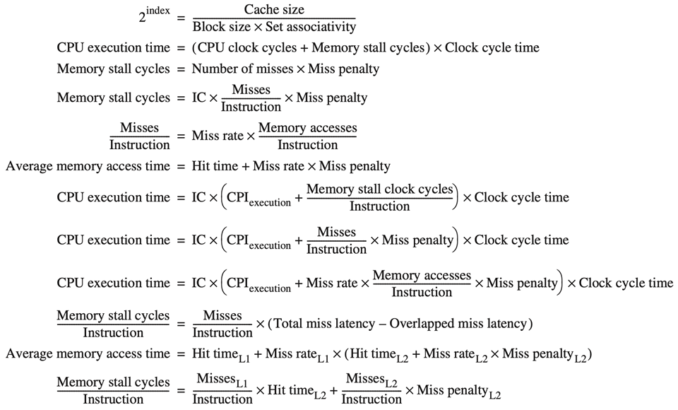
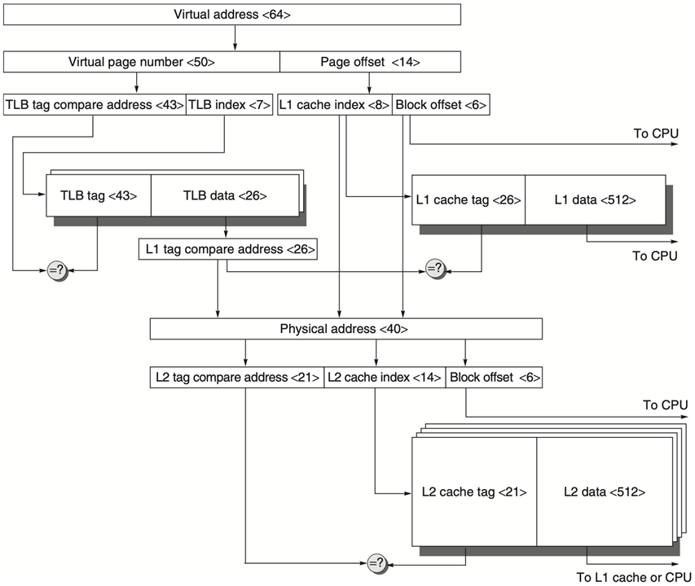

# jCache

## Cache Basis

**SRAM**


[SRAM and DRAM (SDRAM). Everyone of us are familiar with RAM… | by Arunkumar Krishnan | Medium](https://medium.com/@emailarunkumar/sram-and-dram-sdram-9b6d01f09eb7)


**Cache Locality**

* Temporal locality 
    * need the requested word again soon
* Spatial locality
    * likely need other data in the block soon


**Cache Miss**

Time required for cache miss depends on: 

* **Latency**: the time to retrieve the first word of the block (寻址)
    * depends on queueing, cpu scheduling, dram scheduling, etc…
* **Bandwidth**: the time to retrieve the rest of this block
    * depends on how many data can be transmitted per time unit, so the more data can transmit per time unit, the faster to transmit a fixed amount of data.
* 优化时两者基本上没有关系


**Cache Miss Metrics**

* Memory stall cycles per mem access
    * the number of cycles during processor is stalled waiting for a mem access
* Miss rate
    * number of misses over 
    * number of accesses
* Miss penalty
    * the cost per miss (number of extra clock cycles to wait)


## Cache Performance

`CPU time = (CPU execution clock cycles + Memory-stall clock cycles) × Clock cycle time`

读操作阻塞的周期：`Read_stall_cycles = (Reads/Program) × Read_miss_rate × Read_miss_penalty`

写操作阻塞的周期：`Write_stall_cycles = [(Writes/Program) × Write_miss_rate × Write_miss_penalty] + Write_buffer_stalls` (写缺失+写缓冲阻塞)

写缓冲区阻塞：`Write_buffer_stalls`：个人理解应该指的是连续多次写操作中，下一次得等上一次写完才可以写。取决于频率和write的时机(比如你要是能保证mem任意时刻写一次的时间之内不会遇到其他的写要求，那就不存在这个问题)，因此没办法量化计算。

存储器阻塞时钟周期数：`Memory-stall clock cycles `

\\            `= (Read-stall cycles + Write-stall cycles)`

\\            `= (Memory_accesses/Program) × Miss_rate × Miss_penalty`(忽略写缓冲区阻塞，共用读写的MissRate和MissPenalty)

\\            `= (Instructions/Program) × (Misses/Instruction) × Miss_penalty`(这第一个括号应该是只考虑内存中的指令)


**Example**

> a computer with CPI=1 when cache hit;
> 50% instructions are loads and stores;
> 2% miss rate, 25 cc miss penalty;

MemStallCycle = IC \* MemAccPerInst \* MissRate \* MissPenalty

\\                        = IC \* (1+0.5) \* 0.02 \* 025  ==(这里<u>1是IF</u>，0.5是DataAccess)==

\\                        = 0.75IC

## Block Placement

* DM
* FA
* SA

## Block Identification

Tag

## Replacement Strategy

* Random
* LRU
    * 没有Belady’s Anomaly
    * 算blockNum=xxx的时候可以用stack图一次性搞定
    * 这部分建议直接看[OS的第十章的笔记](../OS/10_VM.md)
* FIFO
* Psudo LRU
    * For each cache set, assign one bit per block/line
    * Upon accessing a block, turn on its bit
    * If all bits are turned on, reset them except for that of the most recently accessed block
    * For replacement, randomly choose one whose bit is turned off

## Write Strategy

### Write hit

* Write-back
    * info is written only to the block in the cache
    * to the main memory only when the modified cache block is replaced (use dirty bit)
* Write-through
    * info is written to both the block in the cache and to the block in the lower-level memory

### Write miss

* Write allocate
    * the block is allocated on a write miss, followed by a write hit
* Write around
    * write miss not affect the cache, the block is modified in memory
    * until the program tries to read the block

## Performance Cal



==注意==

* 最后一个公式，不考虑L1的hit

**Example**

> 16KB instr cache + 16KB data cache;
> or, 32KB unified cache;
>
> 36% data transfer instructions; (<u>load/store takes 1 extra cc on unified cache</u>)
> 1 CC hit; 200 CC miss penalty;
>
> For 1000 instructions: 3.82 inst miss on 16KB icache, 40.9 data miss on 16KB dcache; or 43.3 miss on unified cache
>
> Q1: split cache or unified cache has lower miss rate? 

MR_16i = 3.82/1000/1.0 = 0.004

MR_16d = 40.9/1000/0.36 = 0.114 (==此处除以0.36是因为missrate<u>是以访问次数而不是指令数为分母的</u>==，下同)

In all accesses, 1/(1+0.36) = 0.74 are inst accesses, therefore overall miss rate = 0.74\*0.004+0.26\*0.114=0.0326

MR_32u = 43.3/1000/1.36 = 0.0318

> Q2: average memory access time?

= inst_rate \* (hit_time + inst_mr \* mp) + ....

split = 0.74 \* (1 + 0.04 \* 200) + 0.26 \* (1 + 0.114 \* 200) = 7.52

unified = 0.74 \* (1 + 0.00318 \* 200) + 0.26 \* (1 + 1 + 0.0318 \* 200) = 7.52


**Ex.2.**

> 200-cc cache miss penalty;
> 1-cc instruction;
> 2% miss rate;
> 1.5 memory reference per instruction; 
> 30 cache misses per 1000 instructions;
>
> Cache impact on performance?

**with cache:**

* method1
    * CPU time = IC \* (CPI_normal + stall_clk/inst_num) \* clk_time<br />= IC \* (1 + (200 \* 30 / 1000)) \* clk_time = 7 \* ...
* method2
    * CPU time = IC \* (CPI_normal + mr \* accrss_num \* mp / inst_num) \* clk_time<br /> = 7 \* ...

**without cache:**

CPI_avg = 1.0 + 1.5 \* 200 = 301


**Ex.3.**

> 1.6 cc CPI, clock cycle time of 0.35 ns;
> 1.4 memory references per instruction;
> 128 KB cache, 64-byte block;
> for two-way set associative, 1.35 times of clock cycle time for selection mux; 
> 1-cc hit time; 65ns miss penalty
> miss rate: 2.1% - direct, 1.9% - set;
>
> Calculate average memory access time and then processor performance?

AMAT_1way = 0.35 + (0.021 \* 65) = 1.72ns

AMAT_2way = 0.35 \* 1.35 + (0.019 \* 65) = 1.71ns

## Optimization

### Causes of Miss Rates

* Compulsory: 
    * The very first access to a block cannot be in the cache, so the block must be brought into the cache. 
    * 也叫做cold-start/first-reference misses;
        * 尽量让读进来的一个block里的都是有效的
* Capacity
    * The cache cannot contain all the blocks needed during execution of a program
    * cache size limit;
        * 用恰当的映射方式
    * blocks discarded and later retrieved;
        * 优化替换算法
* Conflict
    * If the block placement strategy is set associative or direct mapped, conflict misses (in addition to compulsory and capacity misses) will occur because a block may be discarded and later retrieved if too many blocks map to its set.
    * collision misses: associativity
        * direct mapped or set associative cache;
        * a block discarded and later retrieved in a set;

### Opt

#### Larger Block

* 👍Reduce compulsory misses
    * Leverage spatial locality
* 👎Increase conflict/capacity misses
    * Fewer blocks in the cache
    * Larger blocks increase miss penalty

#### Larger Cache

* 👍Reduce capacity misses
* 👎Increase hit time, cost, and power

#### Higher Associativity

(Higher set way)

* 👍Reduce conflict misses
* 👎Increase hit time
* cache rule of thumb:
    * a direct-mapped cache of size N has about the same miss rate as a two-way set associative cache of size N/2

#### Multilevel Cache

* 👍Reduce miss penalty
* Motivation
    * faster/smaller cache to keep pace with the speed of processors（一级缓存）
    * larger cache to overcome the widening gap between processor and main mem（二级缓存）
        * 如果第二级缓存仅比第一级大一点点，则miss penalty反而更高
* 计算memory stall时不应考虑L1 hit time


> Example
> 	1000 mem references -> 40 misses in L1 and 20 misses in L2;
> 	miss penalty from L2 is 200 cc;
> 	hit time of L2 is 10 cc;
> 	hit time of L1 is 1 cc;
> 	1.5 mem references per instruction;
> Q: 
> 1. various miss rates?
> 2. avg mem access time?
> 3. avg stall cycles per instruction?

1. various miss rates?
    	* L1
         * local = global = 40/1000 = 4%
    * L2
         * local: 20/40=50%; global: 20/1000=2%(global\_2=locaol\_1\*local_2)
2. avg mem access time?
     * average memory access time =Hit_time_L1 + Miss_rate_L1 x (Hit_time_L2 + Miss_rate_L2 x Miss_penalty_L2)
          =1 + 4% x (10 + 50% x 200)
          =5.4
3. avg stall cycles per instruction?
     * average stall cycles per instruction=Misses_per_instruction_L1 x Hit_time_L2 + Misses_per_instr_L2 x Miss_penalty_L2
          =(1.5x40/1000)x10+(1.5x20/1000)x200
          =6.6
     * ==L1 hit not considered in "stall"==

#### Prioritize read misses over writes

Motivation:

```assembly
# DM(blockNum=512), write through
sw r1, 0(r0)	# cache[0]=r1, write_buf=r1(not to mem)
lw r2, 512(r0)	# cache[0]=r2, write_buf=r1(not to mem)
lw r3, 0(r0)	# cache miss, read from mem, but r1 still in write_buf, ERROR
```

* Reduce miss penalty
* not simply stall read miss until write buffer empties, check the contents of write buffer, let the read miss continue <u>if no conflicts with write buffer</u> & memory system is available

#### Avoid address translation during indexing cache

* Cache addressing
    * virtual address – virtual cache
    * physical address – physical cache
* Processor/program – virtual address
* Processor -> address translation -> Cache




Requirements

* L1 cache
    * L1\_entry\_num = page\_entry\_num = 2^8^
    * 因为cache是用phy addr去编址的，所以不能用VPN来寻，只能用PPO=VPO中的高8位作为L1_cache的index先去试一次，这才要求有上面那个条件
* L2 cache
    * L2时已经得到PA了，因此可以把整个PA用来寻数据