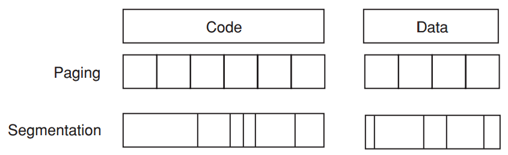
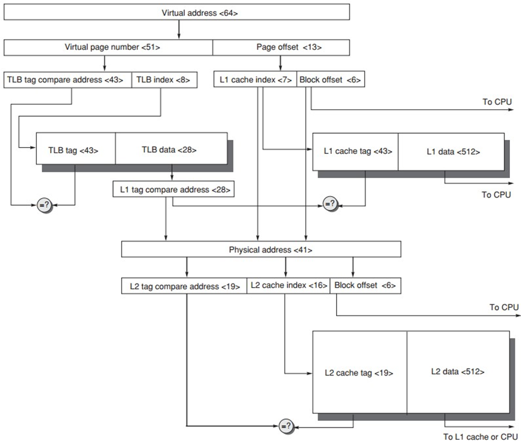

[TOC]

# Basis

## VMem Alloc (Pg&Seg)

* Paged virtual memory

    * page: fixed-size block
    * #Page | Offset

* Segmented virtual memory(类似于OS中的Contiguous Allocation)

    * segment: variable-size block
    * #Seg + Offset

* 

自己看[OS的笔记](../OS/9_MainMem.md)吧

**Paged Segments**

混合式策略

* Segment = a number of pages
* Need not be contiguous
* Simplify replacement

## Four Q

### Placement

允许全相联，因为VM miss的代价实在太高了（进磁盘）

### Finding

PA = {VPN\=\=\>PPN | VPO\=\=PPO}

反转式页表

### Replacement on VM miss

### Write

# TLB

勘误

* L1 cache tag应该是28位的（PA_size - PNO_size
* ==如果TLB miss的话是要读内存刷新的，而不是直接去内存读==

# Page Size

# Protection