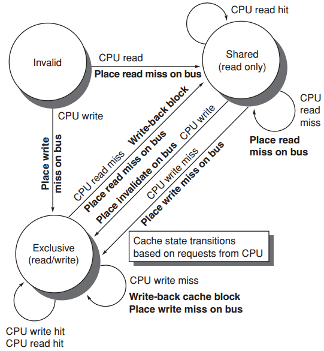

# Intro

**Classes of parallel archs**


**Parallelism**

> a. Please describe the two **kinds** of parallelism in applications.

* Data-Level Parallelism (DLP)
    * Motivation: There are many data items that can be operated on at the same time.
    * Do calculation work by separating workload into many pieces and run them concurrently. (Ex. Matrix Multiplication)
* Task-Level Parallelism (TLP)
    * Motivation: Tasks of work are created that can operate independently and largely in parallel.
    * Do different tasks(in form of process or thread) concurrently.

> b. Please describe the four major **ways** to exploit the preceding two kinds of application parallelism.

* Instruction-level parallelism exploits
    * Divide a single instruction into different stages and executing different instructions' different stages concurrently.
    * DLP at modest levels with compiler help using ideas like pipelining and at medium levels using ideas like speculative execution.
* Vector architectures, Graphic Processor Units (GPUs), and multimedia instruction sets exploit
    * DLP by applying a single instruction to a collection of data in parallel.
* Thread-level parallelism exploits
    * DLP or TLP in a tightly coupled hardware model that allows for interaction between parallel threads.
* Request-level parallelism exploits
    * parallelism among largely decoupled tasks specified by the programmer or the operating system.

# Performance

**Energy & Power**

$\large{\text{Dynamic energy} = \begin{cases} CU^2 & 1\rightarrow0\rightarrow1 \text{ or } 0\rightarrow1\rightarrow0 \\ \frac{CU^2}2 & 1\rightarrow0 \text{ or } 0\rightarrow1 \end{cases} \\ \text{Dynamic power} = \frac{CU^2f}2 \text{, where }f\text{ is the freq of switched} \\ \text{Static power = IU}}$


**Measuring Performance**

* Execution time
    * the time between the start and the completion of an event
* Throughput
    * the total amount of work done in a given time


## Reliablity

$\text{Module availability} = \frac{\text{MTTF}}{\text{MTTF}+\text{MTTR}}$，单位：FIT(Failer per <u>billion</u> hours)

$\displaystyle \text{MTTF}_\text{sys} = (\sum_{i}\frac{num_i}{\text{MTTF}_i})^{-1}$

$\displaystyle \text{MTTF}_\text{pair} = \frac{\text{MTTF}_\text{single}/2}{\text{MTTR}_\text{single}/\text{MTTF}_\text{single}} = \frac{\text{MTTF}_\text{single}^2}{2 \times \text{MTTR}_\text{single}} $

## Quantitative Principles

$\large S_{\text {latency }}(s)=\frac{1}{(1-p)+\frac{p}{s}}$

$\left\{\begin{array}{l}S_{\text {latency }}(s) \leq \frac{1}{1-p} \\ \lim _{s \rightarrow \infty} S_{\text {latency }}(s)=\frac{1}{1-p}\end{array}\right.$

$\Large \rm \frac{秒数}{程序}=\frac{指令数}{程序} \times \frac{时钟周期数}{指令数}(CPI) \times \frac{秒数}{时钟周期数}(clk\_time)$


# ISA

## Type

* stack: 所有数据都存在内存
* accumulator: one implicit operand: the accumulator, one explicit operand: mem location
* GPR: Only explicit operands: reg or mem loc

| Stack  | Accumulator | Reg-Mem       | Load-Store(Reg-Reg) |
| ------ | ----------- | ------------- | ------------------- |
| push A | load A      | load r1, A    | load r1, A          |
| push B | add B       | add r2, r1, B | load r2, B          |
| add    | store C     | store r2, C   | add r3, r1, r2      |
| pop C  |             |               | store r3, C         |

## Addressing Mode


**Encoding**


**MIPS**


# Pipeline

## Basic Implementation


## Dependences

* Data/True dependency: RAW
* Name dependences
    * anti-dependence: WAR
    * output dependence: WAW
* Control
    * 不能放在跳转前面的是cd的，不能放到branch后面的是不cd的

## Hazard

* Structural
    * 例如冯诺依曼体系中ME和IF不能同时进行，除非用Double Bump

### Data Hazard & Forwarding

并不是所有data hazard都可以通过forwarding解决，例如`lw r1, 0(r2); sub r4, r1, r5`中lw在第四个周期结束才能得到r1，而sub在第三个周期开始就要用到


### Control Hazard

* Freeze or flush
    * 本条在ID时，下一条的IF照常执行，当本条执行完ID知道了这是个branch，就会stall之后的内容（刚IF的作废），直到算出跳转地址（和是否跳转）再重新从IF开始（无论是否跳转）
* Predicted-untaken
* Delay slot


## Datapath & Signal


## Exception

复习ppt p146


## Latency & Ini/Repeat Interval

* **Latency**
    * the number of intervening cycles between an instruction that produces a result and an instruction that uses the result？不是同一个inst里面的吗？还是说这里的inst是微指令
    * 存在依赖关系
    * ld/sd指令是针对被存储的值而言的，而不是针对基址寄存器
* **Initiation/Repeat Interval**
    * the number of cycles that must elapse between issuing two operations of a given type


Essentially, pipeline **latency** is 1 cycle less than the depth of the execution pipeline, which is the number of stages from the **EX stage** to the stage that produces the result 

# Cache

## Write Strategy

* Write hit
    * Write-back: write to mem: dirty = 1 && index is diff
    * Write-through
* Write miss
    * Write allocate: the block is allocated on a write miss, followed by a write hit
    * Write around: only write to mem, until the program tries to read the block


AMAT = L1_ht + L1_mr x (L2_ht + L2_mr x L2_mp)

Stall = mem_acc_per_inst x L1_mr x (L2_ht + L2_mr x L2_mp)

Local mr: L1_mr, L2_mr; Global_mr: L1_mr, L1_mr x L2_mr

## Cause of miss

* Compulsory: cold-start/first-reference misses;
* Capacity：cache无法包含所有需要的块
    * 原因：大小不足；替换算法不够好
* Conflict
    * If the block placement strategy is set associative or direct mapped, conflict misses (in addition to compulsory and capacity misses) will occur because a block may be discarded and later retrieved if too many blocks map to its set.
    * collision misses: associativity
        * direct mapped or set associative cache;
        * a block discarded and later retrieved in a set;

## Optimization

### 6 Basic

* Larger block：利用空间局部性，减少compulsory；增大conflict/capacity miss
* Larger cache：减少capacity；增加hit time、cost、power
* Higher Associativity：减少conflict；增加hit time
    * 大小为N的DM的命中率和大小为N/2的2wSA的相近
* Multilevel cache
    * ==L1 hit not considered in "stall"==
* Prioritize read misses over writes
    * 本来是针对那种读到错误的情况需要使write优先，现在可以使
* Avoid address translation during indexing cache: Virtually-indexed physically-tagged

### 10 Advance

* Reduce hit time
    * small and simple first-level caches;
    * way prediction;
    * decrease power;
* Increase cache bandwidth
    * pipelined/multibanked/nonblocking cache;
* Reduce miss penalty
    * critical word first;
    * early restart
    * merging write buffers;
* Reduce miss rate
    * compiler optimizations; decrease power;
* Reduce miss penalty or miss rate via parallelism
    * hardware/compiler prefetching; increase power;


* Small and Simple First-Level Caches: small size and lower associaivity
* Nonblocking Cache: allows data cache to continue to supply cache hits during a miss;
* Multibanked Caches: n-way interleaved
* Critical Word First & Early Restart
    * Critical Word First: 先把要用的word拿进cache拿进CPU，再慢慢填充block中剩下的
    * Early Restart: 一拿到就送进CPU然后restart
* Merging Write Buffer: 把多个有连续地址的entry合成一个
* Compiler Optimizations: Loop Interchange, Blocking
* hardware prefetching：预取到cache或stream buffer
* compiler prefetching：通过指令，将数据预取到寄存器或cache中

```c
for (int i = 0; i < 3; i++)
    for (int j = 0; j < 100; j++)
        a[i][j] = b[j][0] * b[j + 1][0];

/*
    假定要至少提前7次进行预取，即在第8次之前进行预取不会有任何好处
    Totally 19 misses
*/
for (int j = 0; j < 100; j++) {
    prefetch(b[j + 7][0]);  // 7: b[0][0]-b[6][0]
    prefetch(a[0][j + 1]);  // 4: a[0][0] - a[0][6]
    a[0][j] = b[j][0] * b[j + 1][0];
}

for (int i = 0; i < 3; i++) {
    for (int j = 0; j < 100; j++) {
        prefetch(a[i][j + 7]);  // 8: a[1][0]-a[1][6], a[2][0]-a[2][6]
        a[i][j] = b[j][0] * b[j + 1][0];
    }
}
```

# VM

* page定长segment变长

PPT 219 - 251


Tagged way

* Pysically tagged
    * given that each data block has a unique physical address;
    * match tags using physical addresses;
* Virtually tagged
    * index cache sets and match tags using virtual address;
    * shared data may have different virtual addresses: aliasing

# Storage

## RAID


*注：一个颜色一个block，一个小块一个byte*


## Performance

**Little's Law**

Mean number of tasks in system = Arrival rate x Mean response time


~~**Param**~~

* ~~Time~server~~~
    * ~~average time to <u>service a task</u>~~
    * ~~average service rate: 1/Time~server~~~
* ~~Time~queue~~~
    * ~~average time per task in the queue~~
* ~~Time~system~~~
    * ~~average time per task in the system, or the response time;~~
    * ~~Time~queue~ + Time~server~~~
* ~~Arrival rate~~
    * ~~average # of arriving tasks per second~~
* ~~Length~server~~~
    * ~~average # of tasks in service~~
* ~~Length~queue~~~
    * ~~average length of queue~~
* ~~Length~system~~~
    * ~~average # of tasks in system,~~
    * ~~Length~server~ + Length~queue~~~


~~**Server Utilization**~~

~~Service rate = 1 / Time~server~~~

~~Server utilization = Arrival rate x Time~server~~~

~~**Queue Discipline**~~

~~Time~queue~ = Length~queue~ x Time~server~ (从刚进queue一直等到自己被执行的长度正好就是queue长度) + Mean time to complete the task being serviced when new task arrives if server is busy (要等当前在执行的任务完成后才能调度第一个queue中的task，这段等待时间)~~

* ~~Time~queue~ = Time~server~ \* ServerUtilization / (1 - ServerUtilization)~~

* ~~Length~queue~ = ArrivalRate \* Time~queue~ = ServerUtilization^2^ / (1 - ServerUtilization)~~

# Multiprocessor

* From CPU: 
    * Invalid到exclusive应该是因为是write吧，然后直接写倒也没问题
* From Bus: 