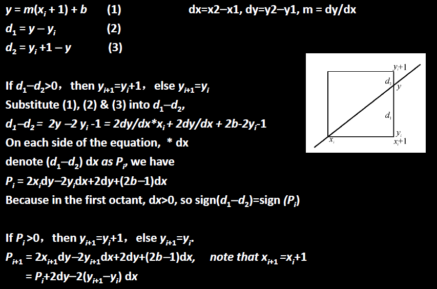
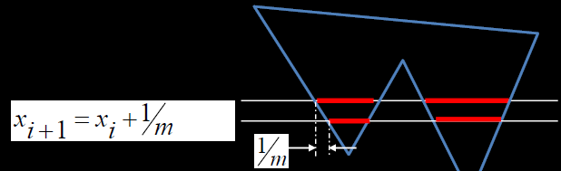
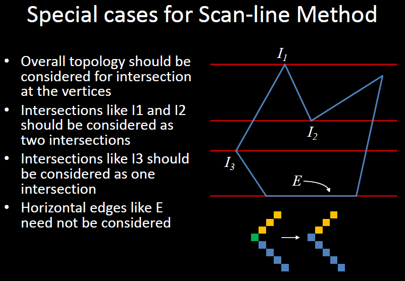

>1. 怎么convert直线：x扫描，找y，rounding
>2. 圆的问题：弯曲的问题
>3. 如何检测线段与屏幕：通过交点的位置
>4. 多边形全部在屏幕外的情况：分类，如果屏幕内任一点在多边形里则屏幕涂满，反之屏幕全空

# Rasterization

光栅化

raster是CRT显示屏上用于控制精准打击的一个mask硬件

Raster Graphics Packages

## Scan Conversion: Line

将连续的形状变成格点

**line's conversion**

要求

* the selected pixels should lie as close to the ideal line
    as possible
* the sequence of pixels should be as straight as
    possible
* all lines should appear to be of <u>constant brightness</u>
    independent of their length and orientation
* should start and end accurately
* should be drawn as rapidly as possible
* should be possible to draw lines with different width
    and line styles

原始的方法要涉及大量浮点运算，在早期电脑上很慢

### DDA

首先要分类讨论，八种情况，每个45°

Digital Differential Analyzer

思路：$\begin{cases}x_i=x_{i-1}+1\\y_i=y_{i-1}+1\end{cases}$

### Bresenham's Algorithm

关键：d1-d2=(y-y~i+1~) - (y~i+1~+1-y)，比较d1和d2哪个大

好处：递推，p~i~得出p~i+1~

## Scan Conversion: Circle Edge

基础：$x=x_{c}+r \cdot \cos \theta, y=y_{c}+r \cdot \sin \theta$

加速：$\theta=i^{*} \Delta \theta, \quad i=0,1,2,3, \ldots$

$x_{i}=x_{c}+r \cdot \cos \left(i^{*} \Delta \theta\right), y_{i}=y_{c}+r \cdot \sin \left(i^{*} \Delta \theta\right)$

更加速：X~i+1~ = r • cos(θi + Δθ) = x~i~cosΔθ-y~i~sinΔθ (sinΔθ和cosΔθ是const)

## Scan Conversion: Polygon Fill

**Winding-number**：只有当“圈数”wn = 0时，点才在外面; 否则，点在里面。

### Scan-line

优化：

## Clipping

为了节省时间要在scan conversion之前做，不然没意义

* 线段
    * 两点都在内
    * 一个在内一个在外
    * 两点都在外
        * 有交点
        * 无交点
* 多边形
    * 所有点都外的特殊情况下

