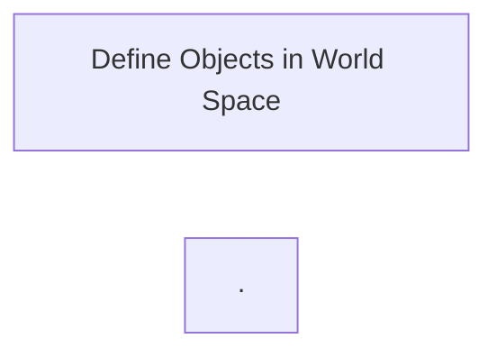

What does OpenGL do?

* ....
* ....


3 Stages in OpenGl




**形状**

GL_LINES, GL_LINE_STRIP, GL_LINE_LOOP


GL_TRIANGLES, GL_TRIANGLE_FAN, GL_TRIANGLE_STRIP, 


glVertex2f, glVertex3f: takes GLFloats or GLFloat* as arguments


GL_FILL, GL_LINE, GL_POINT


**颜色**


Struceture of GLUT-based programs

....

....


Venet Driven Programing

```mermaid
graph LR
MainEventLoop --> MainEventLoop
MainEventLoop --> 
MainEventLoop --> 
MainEventLoop -->  
```


**Double Buffer**

如果只有一个buffer，它即要用于显示，又要同时被modified，如果写的速度不够快，则用户可以看到刷新的过程


More callback func

。。。

鼠标

键盘

Idle

菜单