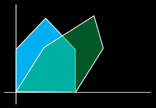
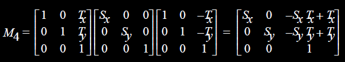

> 如何把三维空间任意轴转到坐标轴

# Vec

点积

叉积

实现应该是`struct{float dx, dy, dz};`不是`struct{Point start, stop};`

# Geometric Transformation

## Scale

$$
\begin{cases}
x^{\prime}=\mathrm{S_x}x \\
y^{\prime}=\mathrm{S_y}x
\end{cases}

\Longrightarrow

\left[\begin{array}{l}
x^{\prime} \\
y^{\prime}
\end{array}\right]=\left[\begin{array}{cc}
S_x & 0 \\
0 & S_y
\end{array}\right]\left[\begin{array}{l}
x \\
y
\end{array}\right]
$$

## Translate

### Homogenous Coordinates

例如本来二维空间的坐标转换无法用矩阵表示，但是升到三维就可以了
$$
\begin{cases}
    x' = x + T_x
    \\
    y' = y + T_y
\end{cases}

\Longrightarrow

\left[\begin{array}{l}
\boldsymbol{x}^{\prime} \\
\boldsymbol{y}^{\prime} \\
\boldsymbol{1}
\end{array}\right]=\left[\begin{array}{lll}
\mathbf{1} & \boldsymbol{0} & \boldsymbol{T}_{x} \\
\boldsymbol{0} & 1 & \boldsymbol{T}_{y} \\
\boldsymbol{0} & \boldsymbol{0} & \boldsymbol{1}
\end{array}\right] \cdot\left[\begin{array}{l}
\boldsymbol{x} \\
\boldsymbol{y} \\
\boldsymbol{1}
\end{array}\right]
$$

## Rotation

$$
\begin{cases}
    x^{\prime}=x \cos \theta-y \sin \theta \\
    y^{\prime}=y \cos \theta+x \sin \theta 
\end{cases}

\Longrightarrow
\left[\begin{array}{l}
x^{\prime} \\
y^{\prime}
\end{array}\right]=\left[\begin{array}{ll}
\cos \theta & -\sin \theta \\
\sin \theta & \cos \theta
\end{array}\right]\left[\begin{array}{l}
x \\
y
\end{array}\right]
$$

绕非原点旋转
$$
\begin{cases}
    x' = x_0 + (x-x_0) \cos\theta - (y-y_0)\sin\theta
    \\
    y' = y_0 + (x-x_0) \sin\theta + (y-y_0)\cos\theta
\end{cases}
$$

### 3D

* 绕z轴
* 绕x轴
* 绕y轴~~（换成左手系，所以要变成$-\theta$）~~
* 绕任意轴（给定两点
    1. 先移动整体，把其中一个点移到原点
    2. 求出dx, dy, dz
    3. arctan求角
    4. 旋转整体至轴与某个坐标轴重合
    5. 绕轴旋转
    6. 移回去

## Shearing

In x dsirection: 
$$
\begin{cases}
    x' = x + ay + bz
    \\
    y = y
    \\
    z = z
\end{cases}
\Longrightarrow
\left[\begin{array}{l}
x \\
y \\
z \\
1
\end{array}\right]=\left[\begin{array}{llll}
1 & a & b & 0 \\
0 & 1 & 0 & 0 \\
0 & 0 & 1 & 0 \\
0 & 0 & 0 & 1
\end{array}\right]

\left[\begin{array}{l}
x \\
y \\
z \\
1
\end{array}\right]
$$

## Composition

q = B(Ap) = (BA)p

==注意顺序==

### Ex. Rotate about **Point** P(Tx, Ty)

Point about which to rotate $P=\left[\begin{array}{l}{T}_{x} \\ T_y \\{1}\end{array}\right]$

$$
\begin{array}{ccc}
    \text{Translate to Origin}
    & \text{Rotate}
    & \text{Translate Back}
    \\
    M_{1}=\left[\begin{array}{ccc}
    1 & 0 & -{T}_{x} \\
    0 & 1 & -{T}_{y} \\
    0 & 0 & 1
    \end{array}\right]
    &
    M_{2}=\left[\begin{array}{ccc}
    \cos (\theta) & -\sin (\theta) & 0 \\
    \sin (\theta) & \cos (\theta) & 0 \\
    0 & 0 & 1
    \end{array}\right]
    &
    M_{3}=\left[\begin{array}{ccc}
    1 & 0 & T_x \\
    0 & 1 & T_y \\
    0 & 0 & 1
    \end{array}\right]
\end{array}
$$
Composition Maps a Point A to new Point B.
$$
\begin{aligned}
M_{4} &=\left[\begin{array}{ccc}
1 & 0 & T \\
0 & 1 & y \\
0 & 0 & 1
\end{array}\right]\left[\begin{array}{ccc}
\cos (\theta) & -\sin (\theta) & 0 \\
\sin (\theta) & \cos (\theta) & 0 \\
0 & 0 & 1
\end{array}\right]\left[\begin{array}{ccc}
1 & 0 & -T_{x} \\
0 & 1 & -T_{y} \\
0 & 0 & 1
\end{array}\right]
\\
&=\left[\begin{array}{ccc}
\cos (\theta) & -\sin (\theta) & -\cos (\theta)T_x+\sin (\theta) T_{y}+{T}_{x} \\
\sin (\theta) & \cos (\theta) & -\sin (\theta) {T}_{x}-\cos (\theta) {T}_x+ T_y \\
0 & 0 & 1
\end{array}\right]
\end{aligned}
$$

### Ex.2 Scaling About Point P

1. Translate P to origin.
2. Apply scaling.
3. Inverse translation.

## Non-linear Transformation

Distortion

棋盘

# OpenGL

## Current Transformation Matrix

* Current Transformation Matrix (CTM)
    * the matrix that is applied to any vertex that is defined after it is set
    * a 4 x 4 matrix that can be altered by a set of functions
* If we change the CTM, the state of the system is changed

## Changing CTM

* Specify CTM mode : `glMatrixMode (mode);`
    * `mode = (GL_MODELVIEW | GL_PROJECTION | GL_TEXTURE )`
* Load CTM : `glLoadIdentity ( void ); glLoadMatrix{fd} ( *m );`
    * m = 1D array of 16 elements arranged by the columns
* Multiply CTM : `glMultMatrix{fd} ( *m );`
* Modify CTM : (multiplies CTM with appropriate
    transformation matrix)
    * `glTranslate {fd} ( x, y, z);`
    * `glScale {fd} ( x, y, z);`
    * `glRotate {fd} ( angle, x, y, z);`
        * Rotate counterclockwise around ray (0,0,0) to (x, y, z)

## Rotation about an axis

* Task: Rotate an object by 45 degrees about the line from (4.0, 5.0, 6.0) to (5.0, 7.0, 9.0)
    * (T-p1, R45, T+p1)

1. `glMatrixMode (GL_MODEVIEW);`
2. `glLoadIdentity ();`
3. `glTranslatef (4.0, 5.0, 6.0);`
4. `glRotatef (45.0, 1.0, 2.0, 3.0);`
5. `glTranslatef (-4.0, -5.0, -6.0);`

## Order of Transformations

* The transformation matrices appear in reverse order to that in which the transformations are applied.
* In OpenGL, the transformation specified most recently is the one applied first
    * q = M1* M2* M3*p

## Matrix Stacks

* OpenGL uses the matrix stack mechanism to manage modeling transformation
    * `glPushMatrix ( void );`
    * `glPopMatrix ( void );`
* OpenGL provides matrix stacks for each type of supported matrix
    * Model-view / Projection / Texture