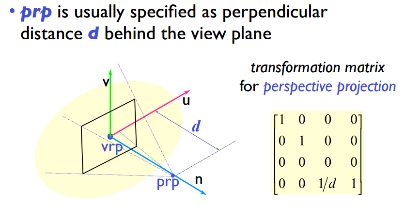

## 2D viewing transformation

**Aspect Ratio** 长宽比

gluOrthoD(left, right, bottom, top)

glViewport(x, y, width, height)

**projection**

* Perspective Projection
    * PRP (Projection Relative Point)
* Prallel Projection

## View specifications

<!--以正上方和相机上方的向量的叉积作为x轴-->

<!--正上方和x轴的叉积作为y轴-->

* VPR: view reference point
* viewDirection
* upVector (照片的上方向，大致即可，不一定要和viewDirection正交)

新的坐标系：

## World-to-View Transformation

* **View orientation**
    * 
* **Transformation for Perspective Projection**
    * 
* **View window**
    * 

**Results**

* Perspective
    * 
* Parallel
    * 

**View Volume**

* 透视投影：四棱台
* 平行投影：长方体