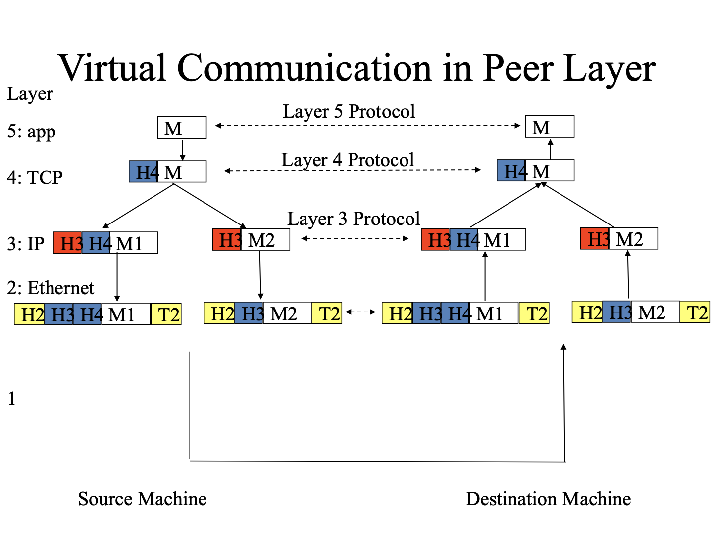
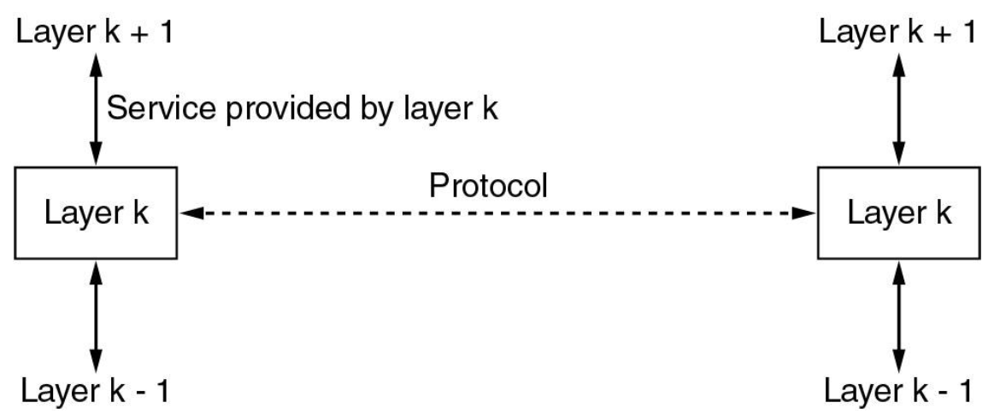
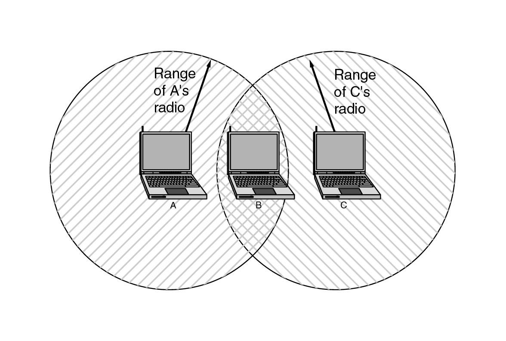

[TOC]

# Network Basis

## 划分

* Transmission technology: Broadcast networks; Point-to-point networks
* 区域
    * PAN(个人，蓝牙之类的)
    * LAN：802.11
    * MAN：
    * WAN
    * Inter-networks(I是特指，i是指多个计算机互联而成的网络)

### Transmission

Three transmission modes and network primitives:

– Unicasting (单播),
– Broadcasting (广播),
– Multicasting (组播).

### WAN

* WAN = subnet + hosts
* Subset = transmission lines + switching elements
* Network: e.g. LAN
* Many interconnected networks→internetworks.
    * Different owners
    * Different technologies.

## Protocol hierarchies

A protocol (协议) is an agreement between the communicating parties on how communication is to proceed.

The peers (对等实体) are the entities comprising the corresponding layers on different machines. The peers may be OS kernel, processes, hardware devices, or even human beings. It is the peers that communicate by using the protocol.

协议层次结构：逻辑上水平，物理上垂直

## Service

### Primitive原语

| Primitive  | Meaning                                  |
| ---------- | ---------------------------------------- |
| Listen     | Block waiting for an incoming connection |
| Connect    |                                          |
| Receive    | Block waiting for an incoming message    |
| Send       |                                          |
| Disconnect |                                          |

## Service & Protocol

• **A** **service** is a set of primitives (operations) that a layer provides to the layer above it.

• **A** **protocol** is a set of rules governing the format and meaning of the packets, or messages that are exchanged by the peer entities within a layer.

Ref: A protocol is an agreement between the communicating parties on how communication is to proceed

An analogy with programming

* A service：一个对象
* An interface：对象的公有成员函数
* A protocol：成员函数的实现(对外不可见)

# Model

## OSI模型

偏理论

## TCP/IP模型

偏工程

|      | **OSI**      | **TCP/IP**                |
| ---- | ------------ | ------------------------- |
| 7    | App          | App(HTTP, SMTP, RTP, DNS) |
| 6    | Presentation | N/A                       |
| 5    | Session      | N/A                       |
| 4    | Transport    | Transport(TCP, UDP)       |
| 3    | Network      | Internet(IP, ICMP)        |
| 2    | Data link    | Network Access            |
| 1    | Physical     | Network Access            |

|      |                                                              |
| ---- | ------------------------------------------------------------ |
| TCP  | TCP协议以建立连接高可靠性的消息传输为目的，它负责把大量的用户数据按一定的长度组成多个数据包进行发送，并在接收到数据包之后按分解顺序重组和恢复用户数据。TCP协议具有数据包的顺序控制、差错检测、检验以及再发送控制等功能。 |
| UDP  | UDP协议主要用于端主机和网关以及Internet运营管理中心等的消息通信，以达到控制管理网络运行的目的。 |
| ICMP | 在传输的数据包有误或丢失时，利用ICMP协议发送出错消息给发送数据包的端主机。  在数据包流量过大时，ICMP协议还具有限制流量的功能。 |

## Hybrid

|      |           |
| ---- | --------- |
| 5    | App       |
| 4    | Transport |
| 3    | Network   |
| 2    | Data link |
| 1    | Physical  |

# Development

* ARPANET, NSFNET

* TCP/IP

* WWW, URI, HTTP, HTML

* WLAN

    * About

        * Multi-path fading: 干涉

        * Hidden Terminal：A和C不知道对方存在，同时往B发包导致丢包(如果知道有其他存在就会先检查当前是否有包)

            

    * WiFi(802.11)

    * Mobile Phone Networks

        * handover：从一个基站移动到另外一个基站，什么时候进行切换
            * b>a切换：红移或者在两个基站中间区域导致的频繁切换，5G更严重(基站更密集)

    * RFID
    
        * sensor network：野外将传感器组网(如果单个传感器直接发得很远非常耗电)

**特点**

* 分布式
* 协议

==内存：1kB=2^10^Bytes==

==网络：1kBps=1000Bytes/sec==