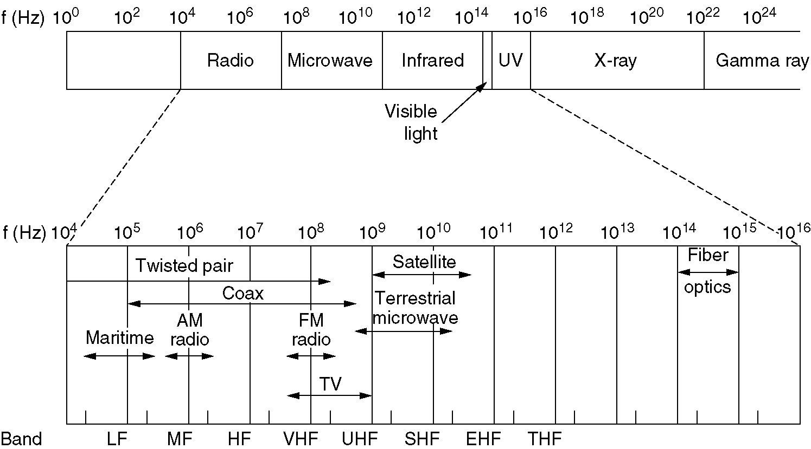
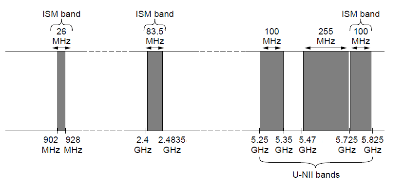
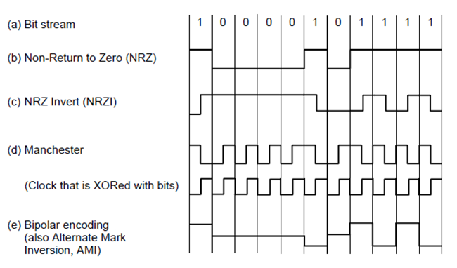
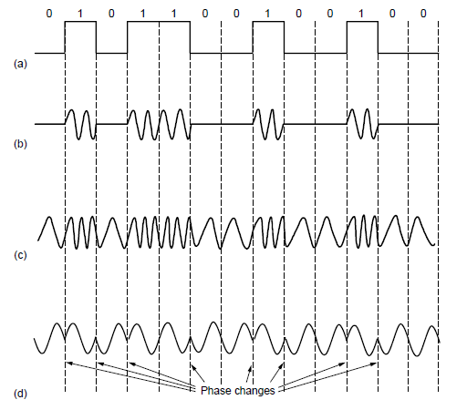
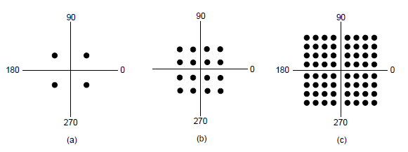
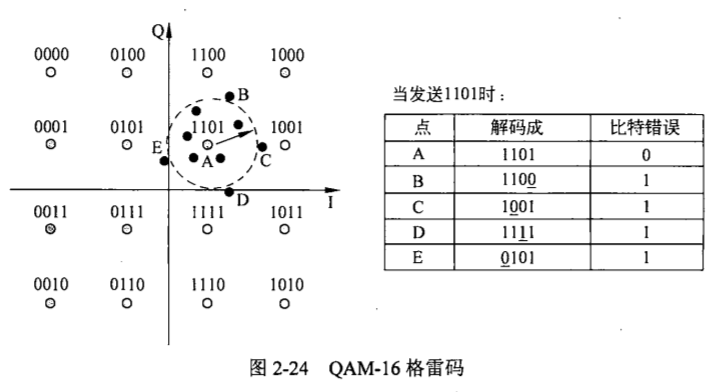
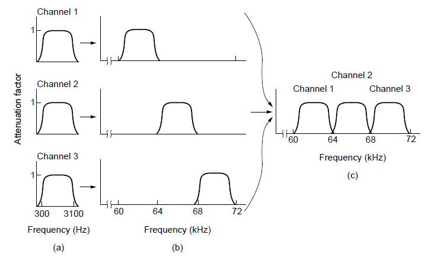

[TOC]

# Basis for DataCom

建立在传输媒介之上的层

* Guided Transmission Media (Terrestrial 大地的
* Wireless Transmission (Terrestrial 大地的
* Digital Modulation and Multiplexing
    * OFDM

## Fourier Analysis

## Data Com

带宽：最高频的减最低频的，例如人说话的带宽是20000-20Hz，在这里指的是傅里叶展开后的最高频和最低频

bandwidth-limited：

截止(cutoff)频率：因为bandwidth有限，所以不能无限传输

Given a bit rate b bits/sec,

* the time to send 1 bit is 1/b ,
* the time required to send n bits is n/b sec,
* the frequency of the m-th harmonic ( 第m次谐波 ) is $\large\frac{mb}{n}$

**Bit and Symbol**

* Bit
    * bit rate
* Symbol
    * baud rate 波特率
* 信号的级别数 ≤ 2^比特数^

> Denotation: B: data rate (bits/s), S: symbol rate (symbol/s), H: bandwidth (Hz)

**Nyquist** (no noise)

Max data rate = 2H•log~2~V bps
Max symbol rate = 2H ps
where H is the bandwith, V is the discrete levels(信号包含的离散等级：0, 1, 2, ..., V-1，例如对于NRZ编码，V=2)

**Shannon** (with random noise)

Max data rate = H•log~2~(1+S/N) bps
dB = 10•lg(S/N)（10的信噪比为10dB，100的信噪比为20dB）
where S/N is the signal to noise ratio(信噪比, 也可直接用xx dB来表示，S是信号功率，N是噪声功率)

# Guided Trans Media (有线)

**Magnetic media (磁介质)**

将数据装磁盘，磁盘装卡车，卡车高速路上跑，带宽高得很，数据中心的迁移就可以这么搞

**Twisted pair (双绞线)**

UTP是没有屏蔽层的

* Twisted pairs: analog or digital signals.
* Full-Duplex, Half-Duplex, Simplex
* Types
    * Category 5 (100Mbps, 1Gbps)
    * Category 6 (10Gbps)
    * Category 7 (Shielded Twisted Pair)

**Coaxial cable (同轴电缆)**

早期📺，已淘汰

**Power Lines (电力线)**

电线复用

**Fiber optics (光纤)**

# Wireless Transmission

$\lambda f=c$

LF(Low), MF(Medium), HF(High), VHF(Very), UHF(Ultra), SHF(Super), EHT(Extremely), THF(Tremendously), (IHF(Incredibly), AHF(Astonishingly), PHF(Prodigiously))

扩频

* 跳频扩频（蓝牙就是跳频的
* 直接序列扩频
* 超宽带通信：变换位置

HF以下可以通过大气电离层反射再高就基本上只能走直线了

Free frequencies:

* The location of the ISM (Industrial, Scientific, Medical) band varies from country to country.
* ISM and U-NII (Unlicensed National Information Infrastructure) bands used in the United States by wireless devices.

## Digital Modulation & Multiplexing 数字调制和复用

### Baseband Trans

* NRZ：容易失去同步（时钟漂移，100还是101个）；B bps的比特率至少要B/2 Hz的带宽（Nyquist，V=2）
* Manchester：clk xor bitstream= 数据，解决了漂移的问题，但是f更高，需要两倍于NRZ的带宽（但是和data rate一样）
* NRZI：bitS为1，NRZI变，bitS为0，NRZI变，解决了连续1的问题，连续0仍不行
* 4B/5B：将4个bit映射成5个bit的，保证结果不含有超过4个连续的0
* 

**Multiplexing**

* Freq Div
* Time Div
* **Code Div**
    * 

### Passband Trans 通带传输

* a: bit stream
* b: Amplitude Shift Keying 幅移键控
* c: Frequency Shift Keying 频移键控
* d: Quadrature Phase Shift Keying 正交相移键控

**星座图**

* a: QPSK: bits/symbol=logV=2
* b: QAM16 (Quadrature Amplitude Modulation): bits/symbol=logV= 4
* c: QAM64: bits/symbol=V=6

**分配方式**

### Frequency Division Multiplexing 频分复用

以三个语音信道的复用为例

* a：原始带宽
* b：提升到频谱上的带宽
* c：多路复用的信道
* 原来语音主要在300Hz~3100Hz，现在提升到每个有4kHz，多出来的频带为guard band，使信道完全隔离（但是仍有可能有重叠）；

#### OFDM

* 

### TDM

循环地复用多路信道，切换信道中间要加guard time

### CDM 码分复用

#### CDMA 码分多址

CDMA允许每个站利用整个频段发送信号，而且没有任何时间限制。利用编码理论可以将多个并发的传输分离开。CDMA不再假设冲突的帧被完全丢弃掉。相反，它假设多个信号可以线性叠加。在讨论具体算法之前，我们来看一个类似的场景：

在一个机场候机大厅里，许多人正在两两交谈。TDM可以看作是所有的人都聚集在大厅里按顺序进行交谈。FDM可以看作是大厅里的人以不同的语调交谈，某些语调高些，某些语调低些，所有的交谈可同时进行并相互独立。CDMA可以看作是大厅里的每一对交谈使用不同的语言。讲法语的这一对在谈论有关法国的事情，并且把所有与法国无关的内容都当作噪声拒绝掉。因此，CDMA的关键在于：能够提取出期望的信号，同时拒绝所有其他的信号，并把这些信号当作噪声。下面简单描述CDMA的工作原理。

* 每个比特时间被分为更小的时间间隔，被称为chip 码片
* Each station is assigned 一个m位 chip sequence
    * The chip sequences are orthogonal？将任意两站S T的chipSeq(m位 )记作S T，则$S \cdot T = \frac1m \sum_{i=1}^mS_iT_i=0$
* Station transmits bit 1 represented by its chip sequence(1 * chipSeq), and bit 0 represented by the inverse of its chip sequence(-1 \* chipSeq)
* The transmissions are synchronized
* The channel is additive

还原方法(点积)：

理论上，对于2^n^个站，Walsh码可以提供2^n^个长度为2^n^的正交码片序列（无噪声，同步接受）

* 将多个宽带信号变成窄带信号的叠加
* 问题：通过不同的channel的path到达会有延迟，叫delay spread，它会导致不同channel叠加，可能会相干相消
    * 解决方案：通过改wideband(用窄的)减少symbol time

## Public Switched Telephont Sys

### Local

### Trunks 干线

**SONET**

用光纤

**Switching**

Circuit switching：接线

Packet switching：

卫星及之后的不做要求