[TOC]

# Design Issues

## Services provided to the network layer

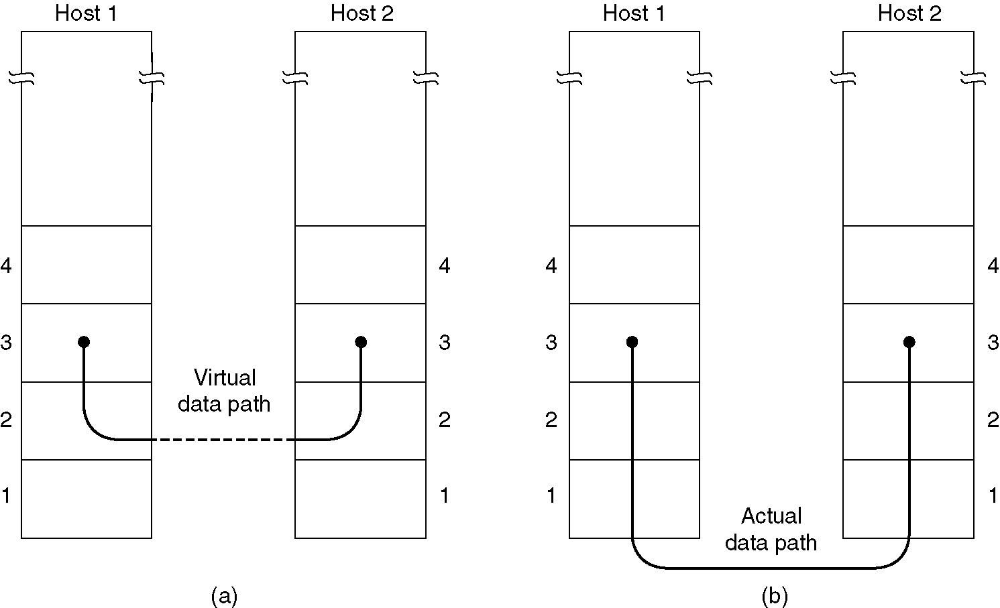 virtual and actual communication

acknowledged：有确认

connection：能发送状态信息，上一个和下一个包之间的关系，而不是直接发数据

3 types

* Unacknowledged connectionless service ( 无确认的无连
    接服务
    * No connection is established beforehand or released
        afterward. 快
    * The source sends frames; the destination does not
        acknowledge. No attempt is made to recover any lost
        frames in the data link layer.
    * Appropriate when the error rate is very low.
        Appropriate for real time traffic ( Ethernet
* Acknowledged connectionless service (有确认的无连接服务)
    * No connection
    * Each frame sent is acknowledged.
    * Useful for unreliable channels, such as wireless systems. (WIFI)
* Acknowledged connection--oriented service (有确认的面向连接服务)
    * A connection is established before transmission. 有了确认才能有连接的概念
    * Each frame sent over the connection is numbered and acknowledged.
    * Each frame is received exactly once and that all frames are received in the right <u>order</u>.

## Framing

用checksum验证，身份证最后一位

How to break the bit stream up into frames

* Byte count
    * 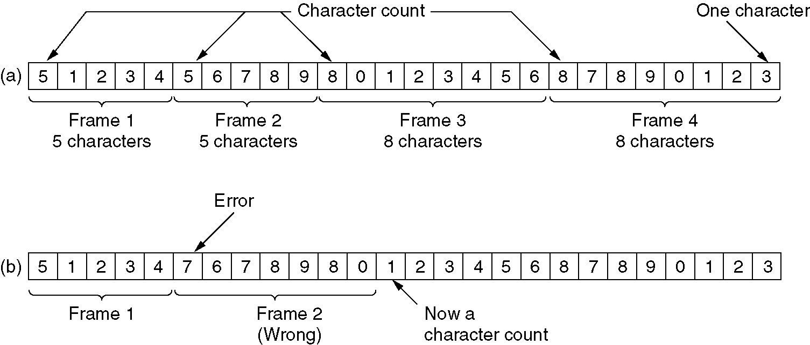
    * 有一个错（特别是charCount位）会导致全部乱掉
* Flag bytes with byte stuffing(填充)
    * 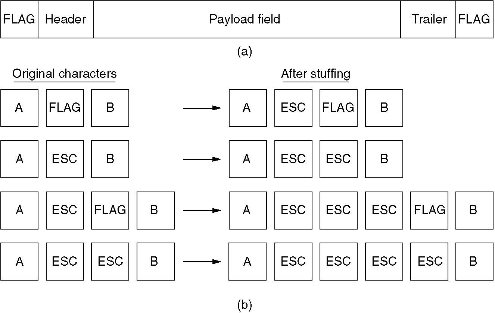
    * 问题：data里面也有可能有flag
    * 解决：使用转义字符，见上图b（esc为转义符
        * 问题：overhead很高
* ==Flag bits with bit stuffing==
    * 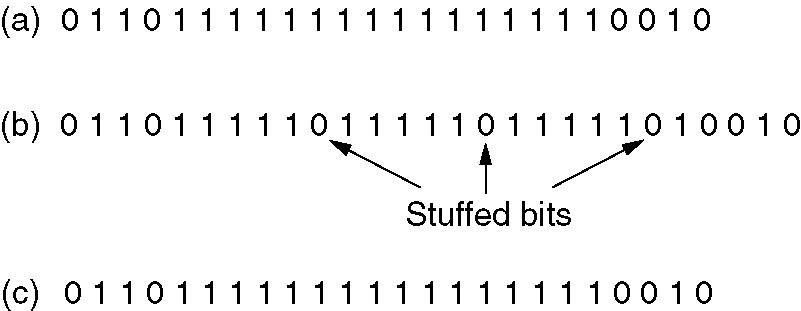
    * Ex: flag bits 01111110 (0x7E)
        (a) The original data.
        (b) The data as they appear on the line.
        (c) The data as they are stored in receiver’s memory after destuffing
    * 遇到连续5个1就填一个0，强制划出边界
* Physical layer encoding violation.
    * 类似Baseband Trans中的4B/5B的方法，将位映射，同时也能作为check：如果有出现了 与预设的不一样的，就可以认为传输出错
    * 例如将1bit的数据映射位2bit的物理数据，0=01, 1=10，如果出现三个及以上连续的0或1就是传输出错了

## Error control

* Ensure reliable frame delivery: every frame arrives without damaging, frames arrive in order.
    * To provide the sender with some feedback
        * Positive acknowledgement (ACK)
            * 正确收到了发ACK，否则不发
        * Negative acknowledgement (NAK)
            * 收到坏包（例如checksum错误）发NAK，否则不发
        * An ACK (acknowledgment) is a confirmation of receipt. When data is transmitted between two systems, the recipient can acknowledge that it received the data. If a station receives packets that are corrupted, it can return a NAK (negative acknowledgment) to the sender. A checksum error may indicate a corrupted packet. A NAK is different than a normal acknowledgment in that it indicates that a packet was received in a corrupted state rather than not received at all.
    * To provide timeout timers
        * Resend as necessary
    * To number frames
        * To distinguish retransmissions from originals

## Flow control

What to do with a sender that systematically wants to transmit frames faster than the receiver can accept them.

* To introduce flow control to <u>throttle the sender</u> into sending <u>no faster than the receiver</u> can handle the traffic.
* Flow control protocol contains well defined rules about
    when a sender may transmit the next frame.
* Two approaches
    * Feedback based flow control 比如接收者丢包率上升就知道发送速度要降低了
    * Rate based flow control

# Error Detection and Correction

## Basis

* Transmission errors are going to be a fact of life for many years to come:
    * The local loops in the PSTN (trunks and switching elements are digital)
    * Wireless communication.
* Error types:
    * isolated errors
    * burst errors 突然一段数据错很多
        * 比如蓝牙和wifi的包多协议共存，WiFi包短、能量高，会影响蓝牙

### Hamming distance

* Key idea of dealing with errors: add redundancy
* m message bits => n bit codeword ( n=m+r，r是检验位的位数 )
* **Hamming distance of 2 codewords** :
    * of bit positions in which the 2 codewords differ
    * <u>use **XOR** to get</u>
* **Hamming distance of complete code** (all valid codewords
    * The <u>minimum</u> Hamming distance of two valid codewords in the code.

**Ex**.

* Ex1 : the Hamming distance of 2 codewords (10001001 and 10110001) is 3
* Ex2 : consider a coding
    00 => 00000 00000
    01 => 00000 11111
    10 => 11111 00000
    11 => 11111 11111
    Its Hamming distance is 5 （最小的）
* Ex3 : A code with a single parity bit
    1011010 -> 1011010 **0** ; 1011000 -> 1011000 **1** .
    Hamming distance = 2 (Why?)
    * 不考虑相同的；相差一位的检验位也不同；相差两位的校验位相同

**For detection and correction**

<u>To **detect** d errors:</u> （只要检测有没有错，不需要知道是哪个变来的）

* <u>you need d+1 Hamming distance code.</u> (Because with such a code there is no way that d single bit errors can change a valid code into another valid codeword：任意错d个bits还是没办法变成另外一个合法的，因为至少要变d+1个，所以能检测出错
* Ex2 : can detect 4 bit
* Ex3 : can detect single errors.

<u>To use Hamming distance to **correct** d errors:</u>

* <u>you need 2d+1 Hamming distance code.</u> (Because that way the legal codewords are so far apart that even with d changes (A -->A’), the original codeword A is still closer to A’ than any other codeword B , so it can be uniquely determined.)，错不超过2d+1的一半(d+0.5)，还是可以找出离这个错的最近的
* Ex2 :
    * Can correct 2 errors: 00000 11111 => 00000 00111, the receive
        know that the original code is 0000011111 (the closest valid
        codeword
    * Cannot correct 3 errors: 0000000000 => 0000000111 , the
        error will not be corrected properly. 0000000000 or 0000011111?

## Correction codes

* To design a code with <u>**m** message bits</u> and <u>**r** check bits</u> that will allow all single errors to be corrected:
    * Each valid codeword of the **2^m^** legal messages has **n** illegal codewords at a distance 1 from it.  Thus each of the **2^m^** legal messages requires **n+1** bit patterns dedicated to it.
    * The total number of bit patterns is **2^n^**
        * (m+r+1) 2^m^ <= 2^n^ = 2^m+r^
        * (m+r+1) <= 2^r^
    * Given m, this puts a lower limit on the number of check bits needed to correct single errors.
    * This theoretical limit can be achieved using a method due to Hamming (1950).

### Hamming codes

* Hamming code **for single error**:
    * The bits of the codeword are numbered consecutively, starting with bit 1 at the left end.
    * The bits(第几位的) that are powers of 2 (1,2,4,8, etc) are check bits. The rest are filled up with the m data bits.
    * Each check bit forces the parity of some collection of bits, including itself, to be even (or odd). A bit may be included in several parity computations.
    * To see which check bits the data bit in position k contributes to, rewrite k as a sum of powers of 2. For example, 11=1+2+8 and 29=1+4+8+16 . A bit is checked by just those check bits occurring in its expansion (e.g., bit 11 is checked by bits 1, 2, and 8).
    * 我如何确保所有的数据位都能恰好被1248这样的校验位检验？
        * 是反向校验，例如用所有奇数位去校验第1位，所有含2的去校验第二位，这样生成校验位也容易
    * Check
        * When a codeword arrives, the receiver initializes a counter to zero.
        * It then examines each check bit, k (k=1,2,4,8,...) to see if it has the correct parity. If not, it adds k to the counter.
        * If the counter is zero after all the check bits have been examined, the codeword is accepted as valid. If the counter is nonzero, it contains the position of the incorrect bit.
    * <u>主要目的是便于定位，比如假设发送端处理不出错，仅传输会出错，发现第1位和第8位的校验位与实际不符合，就知道是第9位错了</u>
* Hamming codes can be used to correct burst errors indirectly.
    * A sequence of **k** consecutive codewords are arranged as a
        matrix, <u>one codeword per **row**</u>.
    * <u>Transmit</u> the matrix <u>by one **column**</u> at a time.
    * When the frame arrives at the receiver, the matrix is
        reconstructed, one column at a time.
    * If a burst error of length k occurs, <u>at most 1 bit in each of</u>
        <u>the k codewords will have been affected</u>, but the
        Hamming code can correct one error per codeword, so
        the entire block can be restored.
    * This method uses **kr** check bits to make blocks of **km** data
        bits immune to a <u>single burst error of length **k** or less</u>.
* Hamming codes to correct burst errors
    * 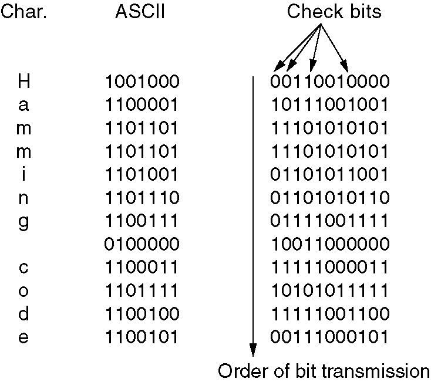

### Other codes

* Binary Convolutional Codes
    * NASA GSM 802.11
    * NB IoT downlink
* Reed Solomon Codes
* Low Density Parity Check Codes (LDPC)

### Convolutional Code

卷积码

* An encoder processes a sequence of input bits and generates a sequence of output bits.
* <u>The output depends on the current and previous input bits.</u> That is, the encoder has memory. #previous input bits is called constraint length.
* Convolutional code is characterized by its coding rate and constraint length
* Example: NASA Convolutional Code
    * Constraint length(约束长度) k=\#registers+1=7, 码率r=1/2（一个输入产生两个输出）
    * 输出位是输入位和内部状态的XOR和，$(\oplus x_i)=(\sum x_i)\%{2}$
        * O1=I\^S2\^S3\^S5\^S6
        * O2=I\^S1\^S2\^S3\^S6
    * Input bits: 111; Initial internal state state s1...s6=000000
        1. 1st input bit: state=100000, output=11 (10?)
        2. 2nd input bit: state=110000, output=10 (01?)
        3. 3rd input bit: state=111000, output=01 (10?)

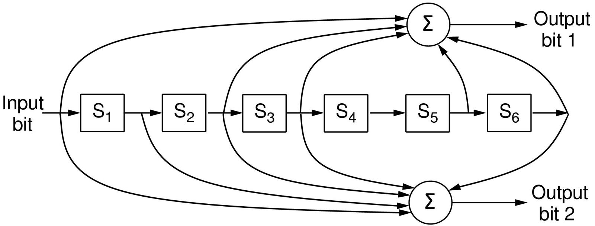

##### [Trellis diagram](https://www.sharetechnote.com/html/Encode_Decode_ConvolutionalCode.html)

先画个真值表

红线是input的过程，"1/11"表示"input/output"，<u>实际就是个Mealy型的状态机</u>

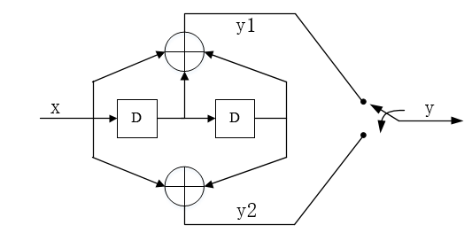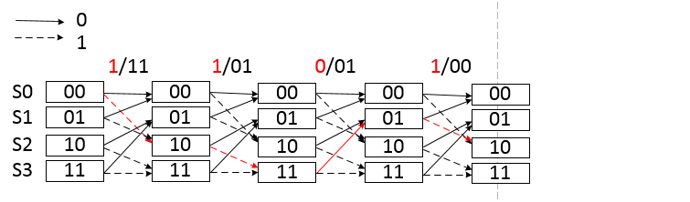

decode倒着推就行

## Detection codes

### Parity

### Chechsum

Checksum treats data as N bit words and adds N check bits that are the modulo 2 N sum of the words

Ex: Internet 16 bit 1 complement checksum

Properties:

* Improved error detection over parity bits
* Vulnerable to systematic errors, e.g., added zeros

### CRC

中文课本P166

Polynomial code or CRC (<u>Cyclic Redundancy Check</u>)

目的：让微小的扰动也能使checksum有巨大变化

#### 发送

* To treat bit strings as representations of polynomials with coefficients of 0 and 1 only.
* A k bit frame is regarded as the coefficient list for a polynomial with k terms, ranging from x k 1 to x 0 .
* For example, 110001 -> x^5^ + x^4^ + x^0^
* Polynomial arithmetic is done modulo 2, according to the rules of algebraic field theory. There are no carries for addition or borrows for subtraction. Both addition and subtraction are identical to exclusive OR.

* The sender and receiver agree upon a generator polynomial, G(x)
* Let M(x) be the polynomial corresponding to some frame with m bits.
* The polynomial T(X) represented by the checksummed frame is divisible by G(x)
* When the receiver gets the checksummed frame, it tries dividing it by G(x). <u>If there is a remainder, there has been a transmission error.</u>

* <u>Let r be the degree of G(x).</u>（位数-1？）
* Divide the bit string corresponding to G(x) into the bit string corresponding to M(x)x^r^（左移r位）, using modulo 2 division, i.e. M(x)x^r^/G(x)
* Subtract the remainder from the bit string corresponding to M(x)x^r^ using modulo 2 subtraction. The result is the checksummed frame to be transmitted. Call its polynomial T(x)
* Clearly, T(x) is divisible (modulo 2) by G(x)

**Ex.**

G(x) = x^4^+x+1

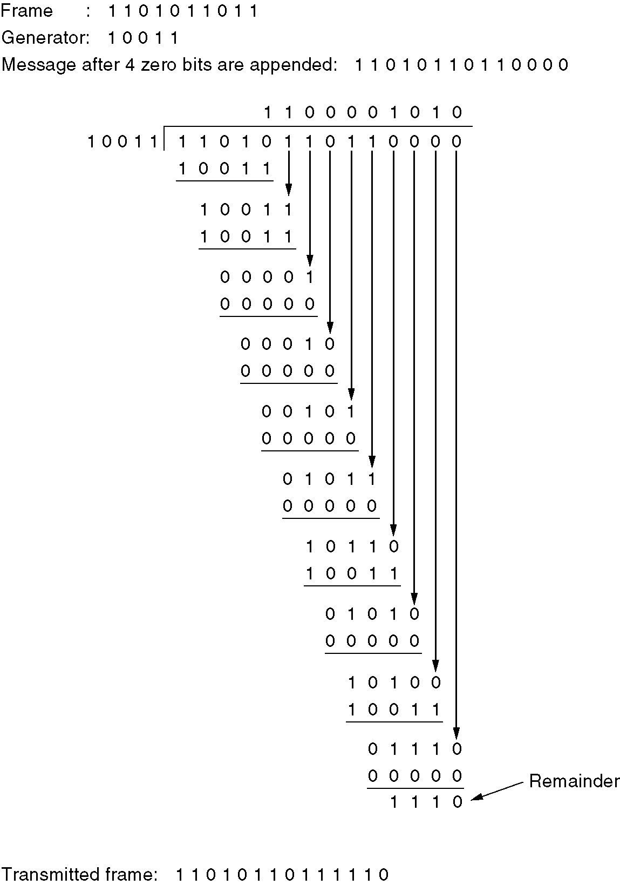

M: 859, G: 19, Mx^r^: 13744=F<<4, T: 13758=Mx^r^+Mx^r^%G = 13744+0b1110 (此处%为特殊数域的模)

==这里的运算不是减，而是异或。。。为什么啊？==

Remainder要加回去，保证接收端检验的时候没有余数

~~==草泥马第一步就写错了，11010-10011=111，你他妈写了个寂寞，真的是傻逼吧，给爷爬==~~

==此处多项式的运算遵守数域理论规则，以2为模完成，加法不进位，减法不借位（加减法都等同于**异或**）==

#### 接收

* Imagine that a transmission error occurs, so that instead of the bit string for T(x) arriving, T(x) + E(x) arrives.
* Each 1 bit in E(x) corresponds to a bit that has been inverted.
    * If there are k 1 bits in E(x), k single-bit errors have occurred.
    * A single burst error is characterized by an initial 1, a mixture of 0s and 1s, and a final 1, with all other bits being 0.
* [T(X)+E(X)] / G(X) = E(X)/G(X)
* Those errors that happen to correspond to polynomials containing G(X) as a factor will slip by; all other errors will be caught
* All single errors can be detected as long as G(X) has more than one term
* All double errors can be detected as long as G(X) does not divide xk+1 for some k. E(X) = x^i^+x^j^= x^j^(x^i-j^ +1).
    * Ex. x^15^+x^14^+1 will not divide x^k^+1 for any value of k below 32768
* All errors with an odd # of bits can be detected as long as G(X) has x+1 as its factor
* A polynomial code with r check bits will detect all burst errors of length <= r.
* If the burst length is r+1, the remainder of the division by G(x) will be zero iff the burst is identical to G(x). This probability is 1/2^r-1^
* When an error burst longer than r+1 bits occurs, or several shorter bursts occur, the probability of a bad frame getting through unnoticed is 1/2^r^

# Elementary Data Link Protocols

网络层一般叫package

## \#1 Utopian Simplex

* Data are transmitted in <u>one direction</u> only .
* The communication channel never damages or loses frames (<u>error free</u>)
* Both the transmitting and receiving network layers are <u>always ready</u>
* Processing <u>time can be ignored</u>.
* <u>Infinite buffer</u> space is available.

## \#2 Simplex Stop-and-Wait

* Data traffic is still <u>simplex</u>.
* The communication channel is assumed to be <u>error free</u>
* The <u>sender is always ready</u>. The <u>receiver is NOT always ready</u> or the receiver has <u>limited buffer</u> space.
    * The sender simply inserts a delay into protocol 1 to slow it down sufficiently to keep from swamping the receiver. 
        * low utilization of bandwidth.
    * The receiver provides feedback to the sender, permitting the sender to transmit the next frame.
* Protocol (p2) ensures sender can’t outpace receiver:
    * Receiver returns a dummy frame ( ack ) when ready
    * Only one frame out at a time called stop and wait
    * We added flow control!

相比Utopian，sender多了一个`wair_for_event(&event)`，receiver多了一个`to_physical_layr(&s)`

## \#3 Simplex Protocol for a noisy channel

* Data traffic is still <u>simplex</u>.
* The communication channel is <u>NOT free of errors</u>.
* The receiver is <u>NOT always ready</u>.

* The possible solutions:
    * Protocol 2 + timer --> duplicate packets
    * Protocol 2 + timer + to number the frame
* Protocols in which the sender waits for a positive acknowledgement before advancing to the next data item are often called PAR (Positive Acknowledgement with Retransmission) or ARQ (Automatic Repeat reQuest

SeqNumber：B收到了0号包之后，发送ACK、将expected改为1，若再收到一个0，则知道是dup了

。。。

## \#4

* Duplex
* Stop-and-wait

Utlization = T~frame~/(2T~propagation~+T~frame~)

像卫星传输这种，用stop-and-wait的话利用率非常之低

# Sliding Window Protocols

## Sliding Window

Utlization = NT~frame~/(2T~propagation~+T~frame~)

* Window = Set of sequence numbers permitted to send/receive
* Sender window
    * Sender window increases when ack received
    * Packets in sender window must be buffered at Source
    * Sender window may grow in some protocols
    * 窗中的是正在传输还未确定是否收到的，窗左边的是已发送且已收到ACK的
    * 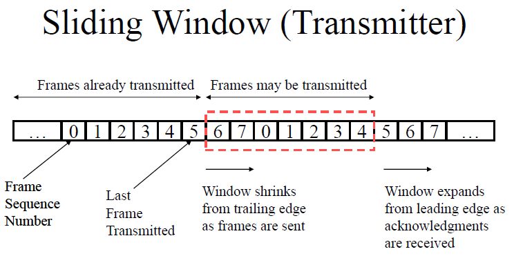
* Receiver window
    * 同理
    * 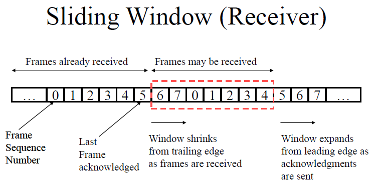

### piggybacking\

捎带确认，暂时延缓确认以便<u>将Ack信息搭载在下一个出境的dataFrame上</u>的技术

## \#5 Go Back N

<u>要求收到的包一定要按顺序收到</u>。如果2错了，由于receive window的size为1，后面再收到的345678得全部丢掉，重新从2开始收

window size要求：

* Send Window Size <= MAX_SEQ (2^n^-1个，0…2^n^-2)
    * Ex : max seqno =5, send window=6 is not allowed since seqno 0
        can be assigned to both new pkt or old pkt (不知道是正确的新包还是重传的旧包)
* Receive Window Size=1
    * 如果丢了一个就会丢掉后面继续发的
* Utilization = WinSize\*T~frame~/(2T~propagation~+T~frame~)

## \#6 Selective repeat

当接收方收到坏帧时，会将坏帧丢掉，但是<u>会接受并缓存这个坏帧后面的所有好帧</u>，

windows size要求：

* Send Window Size = Receive Window Size <= (MAX_SEQ+1)/2 (2^n-1^个，0...2^n-1^-1)
    * 确保当send window和receive windows完全错开的情况下（为什么要完全错开？见中文课本P187最下面的例子），seqno都能放得下
* Utilization = WinSize\*T~frame~/(2T~propagation~+T~frame~)

# Example Data Link Protocols

**历年卷的题目 1**、

1) 3, 012

2) 5, S~5,2~, S~1,2~ (WinSize=7)

3) 3, S2,3 ~ S4,3

4) 两倍的prog time