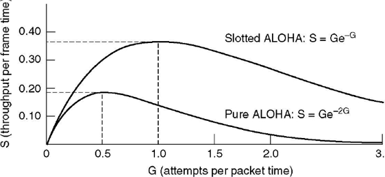
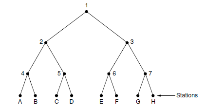
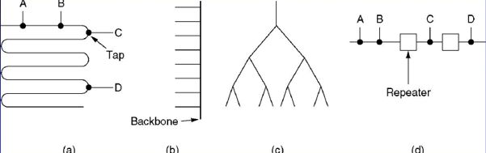
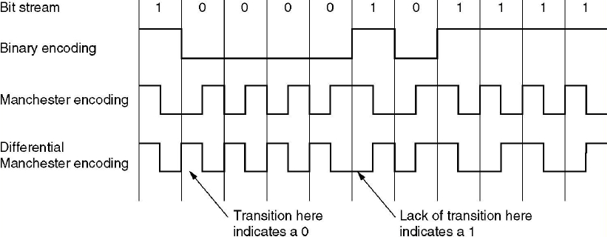
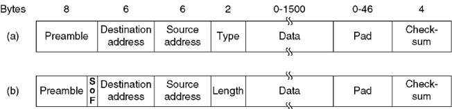
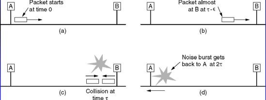
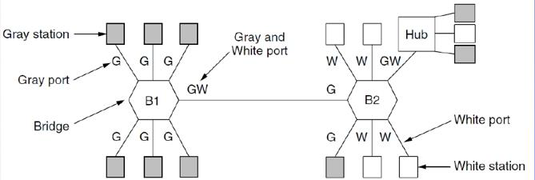

# THE MEDIUM ACCESS CONTROL (MAC) SUBLAYER (介质访问子层)

[TOC]

# The channel allocation problem

* In any broadcast network, the key issue is how to determine who gets to use the channel when there is competition for it.
* The protocols used to determine who goes next on a multiaccess channel belong to a sublayer of the data link layer called the MAC (**Medium Access Control**). The MAC sublayer is the bottom part of the data link layer.

## Static

### TDM

### FDM

Frequency Division Multiplexing

* 如果频段有限，用户多了，可能会饥饿
* 如果某个用户使用的带宽很低，另一个用的很高，两个人却都能独占信道，这样很低效

## Dynamic

5 key assumptions

1. Independent Traffic (独立传输). The model consists of 𝑁 independent stations, each with a program or user that generates frames for transmission.
2. Single channel (单信道假设). A single channel is available for all communication.
3. Collision assumption (冲突假设).
4. Time assumption (时间假设): (a) Continuous Time.(b) Slotted Time.
5. Carrier assumption (载波假设): (a) Carrier Sense.(b) No Carrier Sense.

in LANs and MANs

* ALOHA
* CSMA
* Collision free
* Limited-contention

# Multiple access protocols

## ALOHA

Let users transmit whenever they have data to be sent. (想发就发，当数据量越大时，占用的信道资源越多，)

* There will be collisions and the colliding frames will be destroyed.
    * 用重传等机制来解决丢包的问题
* The sender just waits a random amount of time and sends it again if a frame is destroyed.

### Efficiency

泊松分布

N是包，G是包括重传的所有包

Concepts:

* Frame time: frame length / bit rate
    Stations generate N (Poisson mean) new frames per frame time
* Offered load: G (Poisson mean) transmission attempts per frame time. G includes retransmissions.
    * At low loads: G≈N
    * At high loads: G>N
* Throughput(flow capacity) S = GP~0~ where P~0~ is the probability that a frame does not suffer a collision.

原泊松分布：$P(X=k)=\frac{\lambda^{k}}{k !} e^{-\lambda}, k=0,1, \cdots$

* 带入Poisson mean = $G$：$P(X=k)=\frac{G^{k}e^{-G}}{k !} , k=0,1, \cdots$
* The average amount of transmission-attempts for 2 consecutive frame-times is 2*G*. Hence, for any pair of consecutive frame-times, the probability of there being *k* transmission-attempts during those two frame-times is: $\frac{(2G)^{k}e^{-2G}}{k !}$
* 对分布从$P_0 = e^{-2G}$
* Throughput $S = G e^{-2G}$
    * ==G=0.5时，S~max~ = 1/(2e) ≈ 0.184==

附[公式推导](https://en.wikipedia.org/wiki/ALOHAnet#ALOHA_protocol)

计算题看作业4.1

### Slotted ALOHA

* <u>Time is slotted. A computer is not permitted to send at any time. Instead it is required to wait for the beginning of the next slot.</u>
* The vulnerable period is halved for Slotted ALOHA.

## CSMA without CD

Carrier Sense Multiple Access, collision detection

对ALOHA的简单优化：先看有没有人在发。确保信道忙时，不会再发送数据

。。。

### persistent

坚持：一直等到idle然后马上发 (possibility is 1, 1-persistent)

问题：如果两个站都在等空闲，一空闲了就都发，还是冲突了（所以其实应该先等一会

### nonpersistent

* Before sending, a station senses the channel.
    * If the channel is idle, the station transmits a frame.
    * If the channel is in use, the station does not continually sense it. Instead, it waits a random period of time and then repeats the algorithm. (可以避免一空闲就发的情况，但是也增大了延时)
    * If a collision occurs, the station waits a random amount of time and starts all over again.

### p-persistent

如果检测到信道空，有p的概率发送，有1-p的概率不发。

一般p较小（如0.1、0.01），所以延迟很高

## CSMA/CD

How long will it take to detect collisions?

* The time for transmitting one full frame?
* The time for transmitting from one end to the other end of the cable?
* In the worst case, a station cannot be sure that it has seized the channel until it has transmitted for 2τ without hearing a collision. Here τ is the time for a signal to propagate between the two farthest stations. 

## Collision free protocol

### bitmap

一个竞争期包含N个槽，每经过i号站，如果i号站有东西要发，他就会把i号槽置1。这样最后大家都知道谁要发东西，只要按数字顺序依次开始传送即可。

主要的问题是如果我刚好错过了一个槽，就得再等一个竞争期，在这种情况下，每个站平均要等N个槽（低序号的平均等1.5N，高序号的平均等0.5N）。假设dataFrame要d的发送时间，则

* 信号利用率低（如仅有一个站）：平均信道利用率为d/(N+d)
* 所有站都有数据要发：平均信道利用率为d/(N/N+d)=d/(1+d)
    * 等待时间为：(N-1)(d+1)+1 = (N-1)d+N

### 802.5 token ring

将所有站连成一个单环（仅拓扑结构，物理结构无需）。令牌在上面单向传输，数据帧在上面与令牌同向传输（如果没人取下来，会被发送站取下，防止无限循环）。

每个站的等待时间

* 全部有数据发：(N-1)d+N
* 都没数据发：N

### binary countdown 

从高位开始竞争，例如对于0010, 0100, 1001, 1010，最高位的OR为1，所有0010和0100知道由高位为1的，于是退出竞争；剩下两个第二高位OR为0，两个都继续竞争；到了第三位OR为1，1001退出竞争，所以最高的1010赢得竞争，可以传输一帧。然后进入下一轮。

信道利用率d/(d+log~2~N)

什么叫发送方的地址正好是帧内的第一个字段？？

## Limited-Contention protocols

有限竞争协议，由于发现当站点数目较小时，p-persistent的成功率较高，获得信道的概率会增加，因此可以将站点分组。

关键在于如何将站分配到各个时间槽中

### Adaptive Tree Walk Protocol

大概思路：检查N个站有没有人要发数据，有的话分为两组，分别检测，递归

* the stations as the leaves of a binary tree
* In slot 0 , all stations are permitted to try to acquire the
* If one of them does so, fine.
* If there is a collision , then during slot 1 only those stations falling under node 2 in the tree may compete.
* If one of them acquires the channel, the slot following the frame is reserved for stations under node 3.
* If there is collision under node 2 for slot 1, stations under node 4 may compete during slot 2.

Adaptive Tree Walk Protocol

* At what level in the tree should the search begin?
* The heavier the load, the farther down the tree the search should begin.
* Begin at 𝑖 log~2~𝑞where q is the estimate of the number of ready stations.
* Numerous improvements to the basic algorithm have been discovered (Bersekas and Gallager, 1992)

# 802.3: Ethernet

## Classic Ethernet Physical Layer

中继器：接收、放大信号（再生）

**线缆拓扑结构**

(a) Linear, (b) Spine, (c) Tree, (d) Segmented.

**Encoding**：使用曼彻斯特编码

Manchester encoding (used by Ethernet
\\	0: low high; 1: high low;
Differential Manchester encoding (used by Token Ring
\\	0: presence of transition; 1: absence of transition

## Classic Ethernet: MAC Sublayer Protocol

### Frame Format

a) DIX Ethernet,
b) IEEE 802.3.
T/L <= 0x600 (1536): length; otherwise, type

* Preamble: 前导码
* Dest Addr
    * 第一位为0：Unicast, 普通地址
    * 第一位为1：Multicast, 组地址，表示允许多个站同时监听这个地址；如果某个帧被发送到一个组地址，该组中所有站都要接收它。
    * 全部为1：Broadcast, 广播地址
* Src Addr：全球唯一
* Type：网络协议类型
* Length：
* Pad：填充字段，因为要求一帧至少有64bytes，如果Data比46bytes(64-6-6-2-4，不考虑前导码)还少，就得有填充
    * 限制最小帧长的目的：当帧还没到接收方时发送就已经结束了，此时可能与其他帧冲突
    * 假设A传到B要时间τ，在τ-ε时刻B开始发送一帧，这时候B如果检测到有接收，就会主动放弃那一帧的发送，然后发一个48位的突发噪声来告知其他站，A就会知道传输失败然后停止传输
        * 
    * 如果A发的帧非常短（<u>发送时间小于2τ</u>），就会以为传送成功了
    * **Ex**. For a 10-Mbps LAN with a maximum length of 2500 meters and four repeaters, the maximum RTT is about 50us.
        * Min frame length = 50us * 10 Mbps = 500 bits ≈ 64 B
        * Min payload length = 64 - 18 (src:6,dest:6,type:2,crc:4) = 46 B

### Binary Exponential Backoff Algorithm

* Time is divided into discrete slots (51.2us).
* After i-th collisions, each station picks either 0, 1, 2, …, 2^i^−1 at random and waits that number of slot times.
    * After 10th collisions, the randomization interval is **frozen** at a maximum of 1023 slots. (避免时间槽太多了延时太大)
    * After 16 consecutive collisions, the controller **reports failure** back to the computer. (为了保证limited contention.

## Type

* Switched Ethernet
* Fast Ethernet(100Mbps)
* Gigabit Ethernet
* 10-Gigabit Ethernet

## Retrospective on Ethernet

* Ethernet has been around for over 20 years
* Simple and flexible
    * Cheap
    * Easy to maintain
    * Ethernet works easily with TCP/IP
* There are 3 LAN standards:
    * 802.3 (Ethernet),
    * 802.4 (Token bus),
    * 802.5 (Token ring).
* They use roughly similar technology and get roughly similar performance. 
* 802.3 (Ethernet):
    * most widely used, simple, easy installation, low delay at low load. nondeterministic, no priorities, 64 byte minimum frame, collision problem
* 802.4 (Token bus(令牌总线) )
    * more deterministic, short minimum frames, priorities, real-time, multiple channels.
    * a lot of analog engineering and including modems and wideband amplifiers, extremely complex protocol, substantial delay at low load, poorly suited for fiber optic implementations and a small installed base of users.
* 802.5 (Token Ring(令牌环) )
    * Easy engineering, fully digital, priorities, excellent throughput and efficiency at high load.
    * centralized monitor, delay at low load.
* the winner is 802.3.

# 802.11: Wireless LANs

## The 802.11 Architecture and Protocol Stack

## The 802.11 Physical Layer

## The 802.11 MAC Sublayer Protocol

DCF (Distributed Coordination Function, 分布协调功能): CSMA/CA (CSMA with Collision Avoidance)

PCF (Point Coordination Function, 集中协调功能): the access point controls all activity in its cell, just like a cellular base station (not used in practice)

## The 802.11 Frame Structure

## Services

# Data link layer switching

## Uses of Bridges

Multiple LANs connected by a <u>backbone</u> to <u>handle a total load higher than the capacity of a single LAN</u>.

Why bridges are used?

* Different organizations have different LANs, but need communicate.
* Different locations have different LANs. Using bridges are cost effective than using a centralized switch.
* Multiple LANs are used to accommodate the load.

## Learning Bridges

* The first 802 bridge is a learning bridge or transparent bridge (透明网桥).
* The bridge has a big (hash) table inside it. <u>The table can list each possible destination and tell which output line (LAN) it belongs on.</u>
* When a frame arrives, a bridge must decide whether to <u>discard</u> or <u>forward</u> it and if the latter, on which LAN to put the frame. (unique or flooding)
* The hash table for the bridge
    * When the first bridges are first plugged in, all the hash tables are empty. None of the bridges know where any of the destinations are, so they use the flooding algorithm.
    * As time goes on, the bridges learn where destinations are. (backward learning)
    * Whenever a frame whose source is already in the table arrives, its entry is updated with the current time. (time updating)
    * Periodically, a process in the bridge scans the hash table and purges all entries more than a few minutes old. (Aging)
* The routing procedure for an incoming frame depends on the LAN it arrives and the LAN its destination is on.
    * If destination and source LANs are the same,
        →Discard the frame.
        * 为什么会这样？
    * If the destination and source LANs are different,
        →Forward the frame.
    * If the destination LAN is unknown,
        →Use flooding.

## Spanning Tree Bridges

如果网络的拓扑结构成环，则有可能会有redundant的link在发送同样的frame。

解决方法是overlay the actual topology with a spanning tree that reaches every LAN

成树协议工作原理：任意一交换机中如果到达根网桥有两条或者两条以上的链路.生成树协议都根据算法仅仅保留一条，把其他切断，从而保证任意两个交换机之间只有一条单一的活动链路。因为这种生成的这种拓扑结构，很像是以根交换机为树干的树形结构.故为生成树协议。

How to build the spanning tree

* The bridges have to choose one bridge to be the root of the tree. They make this choice by having each one broadcast its serial number, installed by the manufacturer and guaranteed to be unique worldwide. ==<u>The bridge with the lowest serial number(MAC) becomes the root.</u>==
* A tree of shortest paths from the root to every bridge and LAN is constructed. This tree is the spanning tree.
* If a bridge or LAN fails, a new one is computed.

和root switch相连的switch的port是root port，若有两个和root switch相连的switch，则MAC小的那个上和另一个非根switch相连的是Designated的用于Forwarding的port；MAC大的那个和MAC小的那个相连的是NonDesignated的Blocked的port

## Virtual LANs

**目的**

* To increase the scope of a LAN
    * Ex: International Company
* To increase flexibility.
    * e.g., how to dynamically move the user from one LAN to another LAN?
        * Pulling out plugs and pushing them back in somewhere else
    * VLAN (Virtual LAN), IEEE 802.1Q standard

* To setup a VLAN-based network
    * The network administrator decides how many VLANs there will be, which computers will be on which VLAN, and what the VLANs will be called.
    * The VLANs are <u>marked/named by colors</u> since it is then possible to print color diagrams showing the physical layout of the machines.
    * To make the VLANs function correctly, configuration tables have to set up in the bridges or switches. <u>These tables tell which VLANs are accessible via which ports (lines).</u>
    * <u>A port may be labeled with multiple VLAN colors.</u>
    * 
        * B1需要发送G/W给B2所以是GW，B2只需要发送G给B1所以是G
* How do bridges and switches know what color an incoming frame is:
    * Every port is assigned a VLAN color.（或更多？
    * Every MAC address is assigned a VLAN color.（？
    * Every layer 3 protocol or IP address is assigned a VLAN color.（关协议和IP啥事？

## Hubs, Repeaters, Bridges, Switches, Routers, Gateways

* Hubs (网络集线器)
    * A hub has a number of input lines that it joins electrically.
    * <u>Frames arriving on any of the lines are sent out on **all** the others.</u>
    * If two frames arrive at the same time, they will collide, just as on a coaxial cable.
    * Hubs do not examine the 802 addresses or use them in any way.
    * They do not amplify the incoming signals.
* Repeaters (中继器)
    * Repeaters are analog devices that connected two cable segments.
    * A signal appearing on one of them is **amplified** and put out on the other.
    * Repeaters do not understand packets, frames, or headers. They understand volts.
* Bridges (网桥)
    * A bridge <u>connects two or more LANs.</u>
    * When a frame arrives, software in the bridge <u>extracts</u> the <u>destination</u> address from the <u>frame header</u> and <u>looks it up</u> in a <u>table</u> to see where to send the frame.
    * A bridge may have line cards for different network types and different speeds.
    * With a bridge, each line is its own collision domain, in contrast to a hub.
* Switches (交换机)
    * Switches are similar to bridges in that both route on frame addresses. 
    * Each port is its own <u>collision domain</u>, switches never lose frames to collisions.
        * [What are Collision Domain and Broadcast Domain, Difference between Collision Domain and Broadcast Domain](https://www.omnisecu.com/cisco-certified-network-associate-ccna/what-are-collision-domain-and-broadcast-domain.php#:~:text=Usually%20switches%20are%20used%20to%20segment%20%28divide%29%20a,are%20connected%20to%20different%20ports%20of%20a%20Switch.)
    * <u>If frames come in faster than they can be retransmitted, the switch may run out of buffer space and have to start discarding frames.</u>
    * Modern switches (cut-through switch) start forwarding frames as soon as the destination header field has come in, but before the rest of the frame has arrived.
* Routers (路由器)
    * Routers <u>use the packet header to choose an output line</u>.
    * Routing algorithm: RIP, OSPF, …
    * QoS
* Gateways (网关)
    * Transport gateway
        * Transport gateways connects two computer that use different connection-oriented transport protocols.
        * For example, suppose a computer using the connection-oriented TCP/IP protocol needs to talk to a computer using the connectionoriented ATM transport protocol. The transport gateway can copy the packets from one connection to the other, reformatting them as need be.
    * Application gateways
        * Application gateways understand the format and contents of the data and translate messages from one format to another.
        * An email gateway could translate Internet messages into SMS messages for mobile phones, for example

