[TOC]

网络层：进行逻辑地址寻址，实现不同网络之间的路径选择。

# Network Layer Design Issues

* **Store and Forward Packet Switching**
    * 存储转发数据包交换
    * A host with a packet to send transmits it to the nearest router.
        1. The packet is received, verified, and stored .
        2. Then it is forwarded to the next router.
        3. This step can be repeated many times.
        4. Finally the packet reaches the destination host.
* **Services Provided to the Transport Layer**
    * 为传输层提供的服务
    * 目标
        * 向上提供的服务应独立于路由器技术
        * 向传输层（网络层的上一层）屏蔽路由器的数量、类型和拓扑关系
        * 传输层可用的网络地址应该有统一的编址方案，甚至可以跨越LAN和WAN
    * 分类
        * Connection-less service ( 无连接服务 )):
            * 40+ years of experience with the computer network, unreliable internet, hosts doing error control and flow control.
        * Connection oriented service ( 面向连接服务 )):
            * 100+ years of experience with the worldwide
                telephone system, quality of service.
        * Connection=less + connection oriented services .
* **Implementation of Connectionless Service**
    * 无连接服务的实现
    * 在这样的网络中，数据包被称为数据报（datagram）
    * 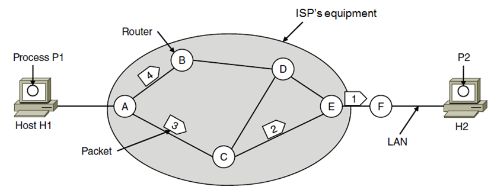 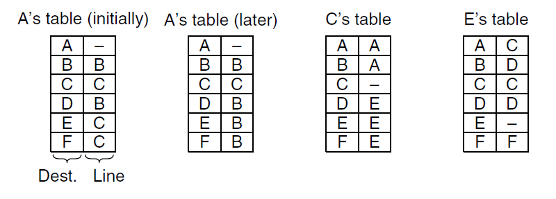
        * 由于知道了AEC路上有阻塞，所以later中将EF更新了
        * 通过路由算法进行路由表的管理和更新
* **Implementation of Connection Oriented Service**
    * 面向连接服务的实现
    * 在发送数据包之前，要在src和dest之间建立一个虚电路VC (virtual circuit)
    * 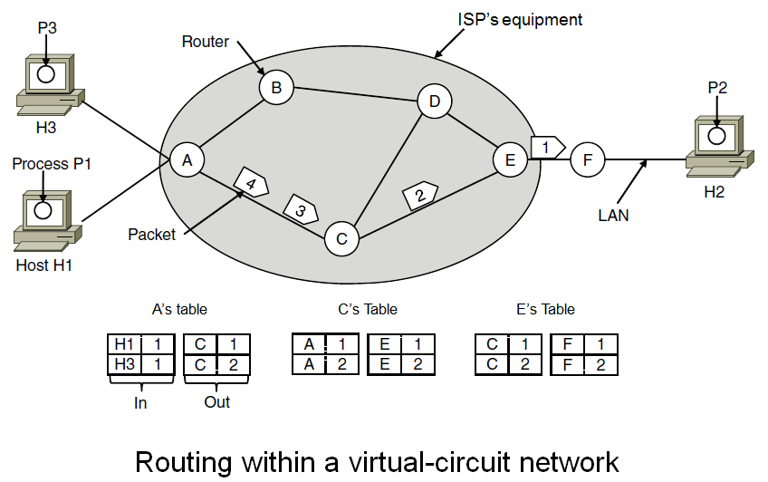
* **Comparison of Virtual Circuit and Datagram Subnets**

# Routing Algorithm

距离的定义：跳数或物理距离或延时

1. The Optimality Principle ( 最优化原则
    * 对于路由器abc，若b在从a到c的最优路径上，则b到c的最佳路径必然也在这上面
    * 汇集树
2. **Shortest Path Routing ( 最短路径路由**
3. Flooding ( 泛洪路由
    * 向除了包来的端口以外的全部端口都发送
    * 优点：可靠性高（如战争场景）、每个路由器只需要知道自己的邻居
    * 缺点：overhead
4. **Distance Vector (DV) Routing ( 距离向量路由**
5. **Link State (LS) Routing ( 链路状态路由**
6. **Hierarchical Routing ( 分层路由**
7. Broadcast Routing ( 广播路由
8. Multicast Routing ( 组播路由
9. Anycast Routing ( 选播路由
10. Routing for Mobile Hosts ( 移动主机的路由
11. Routing in Ad Hoc Networks ( 自组织网络的路由

Forwarding和routing的区别：

* FWD：数据本身的传播
* Routing：路由表的更新

## Shortest Path

Dij

## Distance Vector

* 每个路由器上有个向量，每个item存到所有路由器的最优距离、跳到那个路由器的下一个路由器
* 每个路由器和邻居交换距离向量，对于每个dest，将距离更新为通过这个邻居到dest的最短路径（假设自己到邻居的距离是已知的，且不能不更新（比如某个站停机了，没更新会出问题）），就更新向量
    * 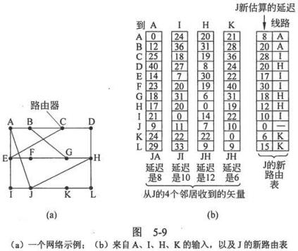

### Count to infinity

将整个网络的最佳路径的寻找过程称为收敛（convergence）。

DV算法存在的问题：对于好消息的反应很迅速，但是对于坏消息的反应很慢

**Ex**. 当A忽然停机了，B还会从C那里得到错的距离信息

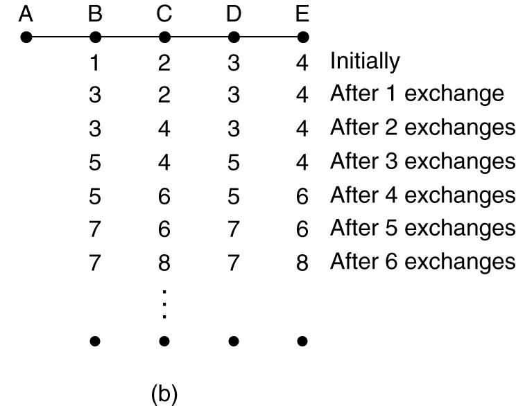

**Poisoned reverse**

* If C routes through B to get to A:
    * C tells B its(指的是C自己) distance to A is infinite
    * C告诉D自己到A的距离是？
* will this completely solve count to infinity problem?
    * No
    * Can you give an example?
    * **HW5.3**

## Link State

设计思路（每个路由器必须完成的事情）：

1. 发现邻居节点，并了解其网络地址
    * 发送HELLO包，同时要保证自己的名字必须是全局唯一的
    * 可以将LAN线视作一个节点
        * 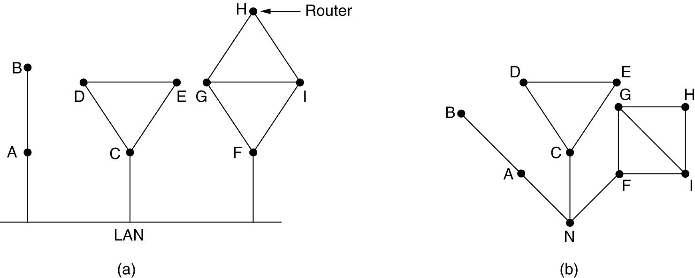
2. 设置到每个邻居节点的距离或成本度量值
    * 小网络可以让成本与带宽成反比，如1Gbps为1，100Mbps为10
    * 地理上分散的网络可以用延迟作为成本，使用ECHO数据包的往返时间/2
3. 构造一个包含所有获知的链路信息的包
    * 包含Seq（唯一）、Age（）和到每个邻居的延时
    * 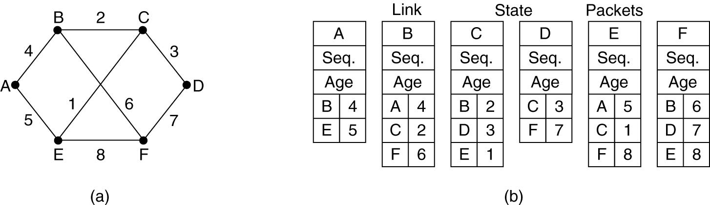
4. 将这个包发给所有其他路由器，并接受来自所有其他路由器的包
    * basic: flooding
        * 每经过一个路由器，age--，当age被减到0时，丢弃该包
    * Refinement :
        * Sequence number <u>increases</u> for each new pkt sent.
        * Routers keeps track of all the `(source router, sequence)` pairs they see.
        * If pkt is new, forward to lines except the incoming one
        * Else (duplicate), discard.
        * If sequence number is lower than highest one seen so
            far, reject as obsolete. (说明是旧的包)
5. 计算到每个其他路由器的最短路径
    * 第四步每个路由器已经获得了完整的网络拓扑结构，只要使用Dij就可以找出自己到其他所有路由器的最短路。

### LS & DV

|                   | DV                                   | LS                               |
| ----------------- | ------------------------------------ | -------------------------------- |
| Summary           | "Tell the neighbors about the world" | "Tell the world about neighbors" |
| Message Num       | Less(Exchange)                       | More(Boardcast)                  |
| Message Size      | Larger(DVs)                          | Smaller(Link Costs)              |
| Convergence Speed | Slower                               | Faster                           |
| Robustness        | Worse                                | Better                           |

## Hierarchical Routing

降低成本。当网络里路由器很多时，路由表就很大。由于路由表用的是特殊(贵)的存储介质，因此成本会很高

层次：region => clusters => zones => groups

**Reduction of routing tables**

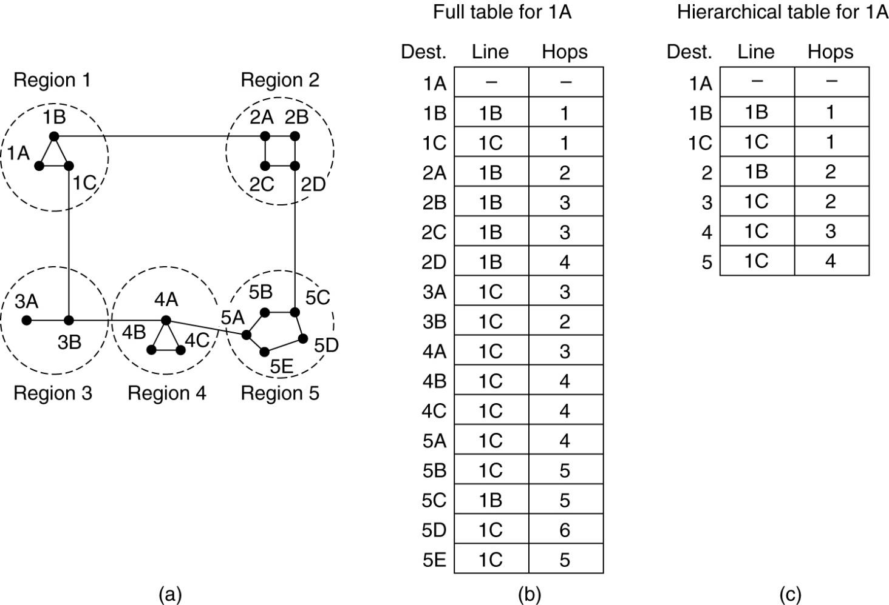

**How many levels**

Consider a subnet with 720 routers

* No hierarchy: every router needs 720 routing table entries.
* 30 routers/region x 24 regions: every router needs 30 for local entries + 23 for other regions = 53 table entries.
* 10 routers/region x 9 regions/cluster x 8 clusters: every router needs 10 + 8 + 7 = 25 table entries.

<u>对于一个包含N个路由器的网络，最优层数是lnN，每个路由器所需的路由器表项个数是elnN。</u>

# Inter-networking

目的：不同网络使用不同的协议（如以太网和卫星通信网络肯定不一样），要将其连接起来

## How Networks Differ

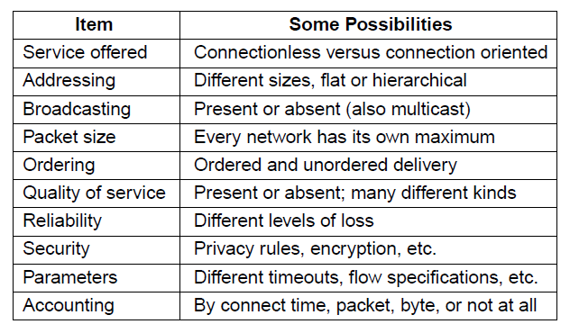

## How Networks Can Be Connected

两种方法

* 制造一种可以在将一种网络的数据包翻译成其他类别网络的数据包的设备
* 在不同网络中间加一个间接层，并且构造一个公共层来解决这个问题

* 
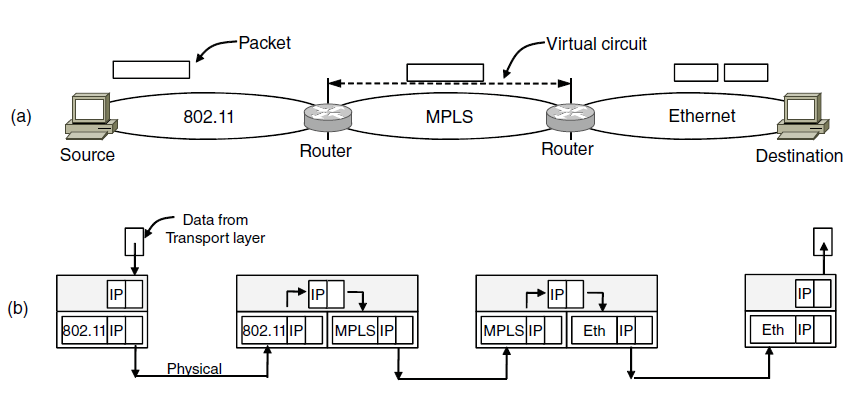

    * a：跨越不同网络的数据包
    * b：网络层和链路层的协议处理

## Tunneling

特殊的internetworking：dest和src所在网络的协议类型相同，但是与中间隔着的网络的协议不同。可以直接把子网的整个包视作中间网络的数据包进行封装，例如：

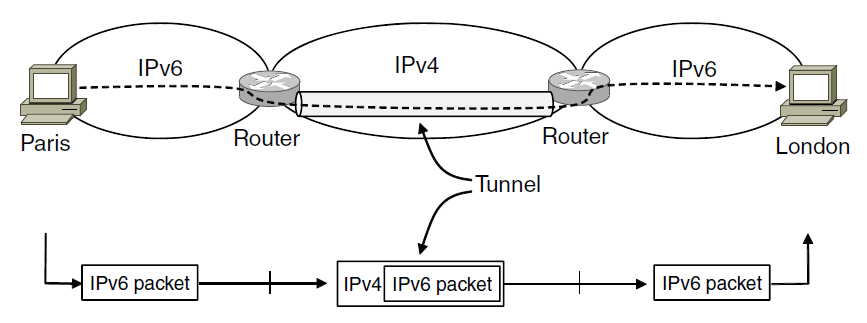

## Internetwork Routing

* Two level routing
    * internet (inter-AS) routing: Exterior gateway protocol
        * Internet使用BGP(Border Gateway Protocol)
    * intranet (intra-AS) routing: Interior gateway protocol
* AS (Autonamous System)
    * Each network is operated independently of all the others, it is often referred to as an AS.
    * A good mental model for an AS is an ISP network.

## Packet Fragmentation

Each network imposes some <u>maximum size on its packets</u>. These limits have various causes , among them:

* Hardware (e.g., the width of a TDM transmission slot).
* Operating system (e.g., all buffers are 512 bytes).
* Protocols (e.g., the number of bits in the packet length field).
* Compliance with some (inter)national standard.
* Desire to reduce error-induced retransmissions to some level.
* Desire to prevent one packet from occupying the channel too long.

### 2 kinds of fragmentation

允许路由器将数据包拆分

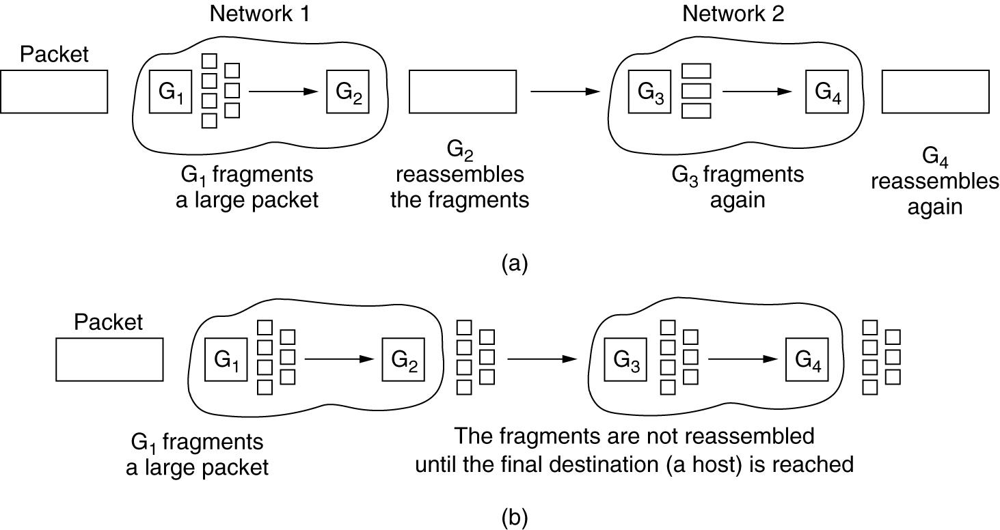

* (a) Transparent fragmentation.
    * 每次都要重新组合再拆分，因此不会出现 到了某个路由器，加上一个协议header后，包的大小超额了 的情况
    * 对于网络来说是透明的，后续数据包根本意识不到发生过分段
    * 存在的问题：出口路由器必须知道什么时候它接收到了全部的段
        * sol：每个分段中提供一个计数段或一个数据包结束标志位
* (b) Nontransparent fragmentation.
    * 一旦数据包在开始的时候被分段，则后续的网络都将每个段看作一个独立的数据包(即不会重组)
    
    * To define an elementary fragment size small enough that the <u>elementary fragment can pass through every network</u>.
    
    * When a packet is fragmented, all the pieces are multiple of the elementary fragment size.
    
    * 优点：路由器所作工作少
    
    * 
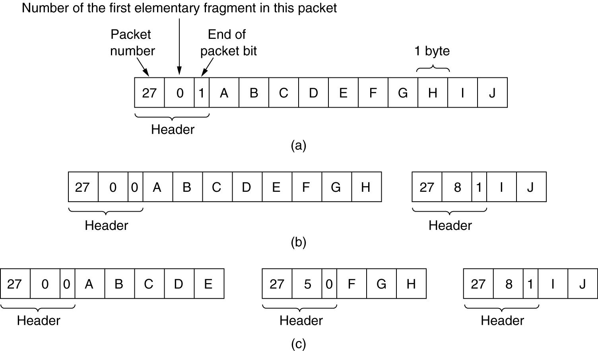

        * a：原始数据包，10B
        * b：经过一个max=8的网络后的分段加头
        * c：经一个大小为5的网关后的分段

### Path MTU Discovery

Path Maximum Transmission Unit Discovery：确保不会出现传输过程中的分段行为

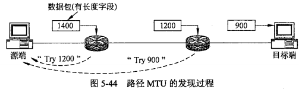

# Internet's Network Layer

Top 10 principles for the Internet

1. Make sure it works.
2. Keep it simple.
3. Make clear choices.
4. Exploit modularity. 模块开发
5. Expect heterogeneity. 为了处理不同的软硬件条件，网络设计必须简单通用灵活
6. Avoid static options and parameters.
7. Look for a good design; it need not be perfect.
8. Be strict when sending and tolerant when receiving. 只发送严格符合标准的数据包，但是允许接受不符合标准的数据包并试图处理之
9. Think about scalability.
10. Consider performance and cost.

## IPv4

### Header fields

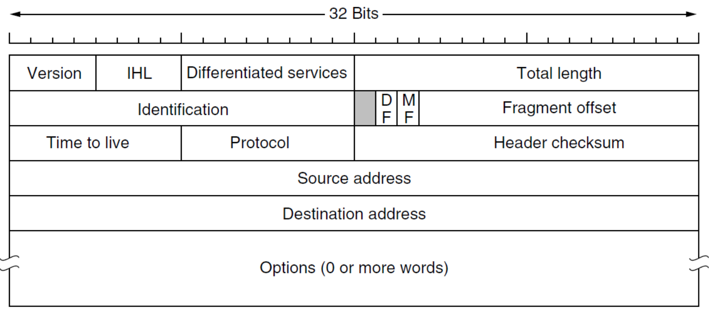

* **Version**(4) : to keep track of which version of the protocol the datagram belongs to.
* **IHL**(4) : to tell how long the header is, <u>in 32 bit words</u>. 5 <= IHL <= 15(最大60 bytes).
* **Differentiated service**(8):
    * **Type of service** (past): 3 bits for priority, 3 bits for Delay, Throughput, and Reliability(最关心三个中的哪一个), and 2 unused.
    * **Differentiated services** (now): 6 for service class, 2 for congestion(拥塞) (e.g. ECN).
    * **Total length**(16) : the length of header and data. The maximum is 65,535 bytes.（并不是单个数据报的长度，单个数据报的长度会受到MTU的影响
* **Identification**(16) : datagram ID. All fragments belong to same ID
* **DF**(1) : Don't Fragment，用在PathMTU discovery中（仅当为0时才能分片
* **MF**(1) : More Fragment. <u>The flag is set for all fragments except the last（1表示后面还有分片）</u>
* **Fragment offset**(13) : to tell where in the current datagram this fragment belongs
    * ==一个frag有8个bytes==
    * 因此每个datagram最多8192段
    * 与Identification和MF配合使用可以实现[分段操作](# Packet Fragmentation)
* **Time to Live**(8) : a counter used to limit packet lifetimes. 每一跳减1，并且当在某一台路由器上有排队时，还得多减一点
* **Protocol**(8) : which transport process to give this datagram to. (http://www.iana.org/assignments/protocol numbers)
* **Header checksum**(16) : to verify the header only
* **Source and destination address**(32 each) : to indicate the network number and host number.
* <u>==首部长度、总长度、片偏移的单位分别是4B、1B、8B==</u>
* **Options**
    * 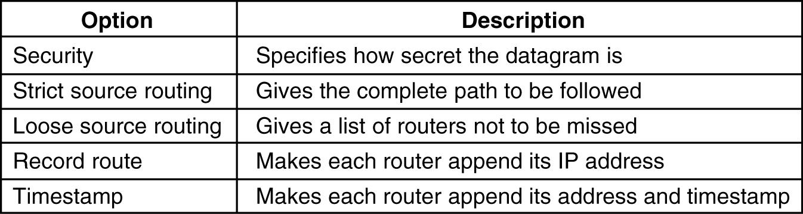

**Ex**. ???

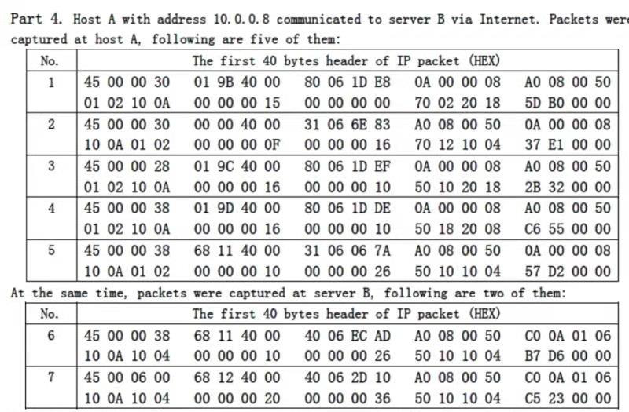

## IP Addr

IP addressing

* Prefixes
* Subnets (division)
* CIDR (mergement)
* Classful and Special Addressing
* NAT

### Prefixes

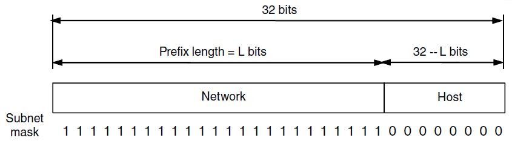

### Subnets

* Splitting an IP prefix into separate networks with subnetting
    * EE: 10000000 11010000 1|xxxxxxx xxxxxxxx
    * CS: 10000000 11010000 00|xxxxxx xxxxxxxx
    * Art: 10000000 11010000 011|xxxxx xxxxxxxx
* 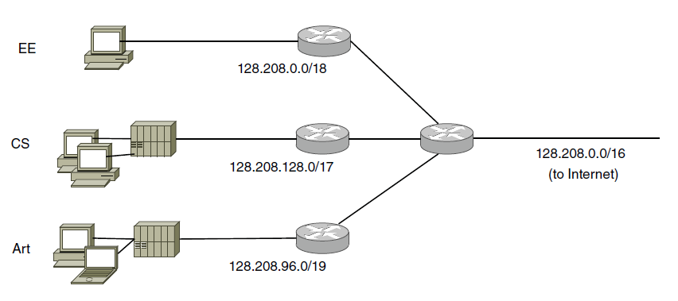

### CIDR

Classless Inter Domain Routing (无类域间路由)

即使分了子网，也会有路由表爆炸的问题存在：路由器存不下所有其他子网的所有主机的地址

**Aggregation of IP prefixes @New York**

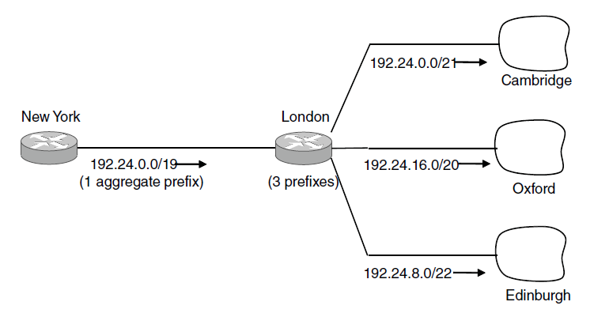

**Longest matching prefix routing @New York router.**

数据包按[最长/最具体/最少IP地址]的路由发送

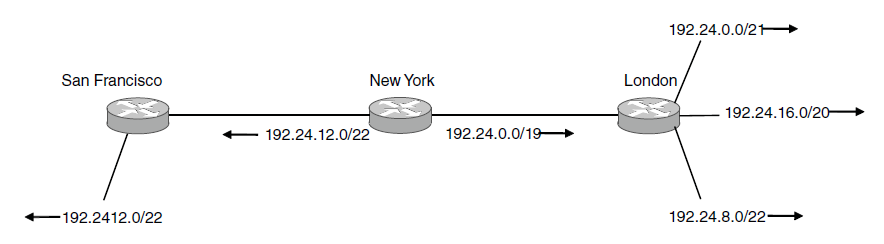

例如图中192.24.12.0/22会被法发往旧金山而不是伦敦

### Classful and Special Addressing

分类和特殊寻址

**Classful addressing (past)**

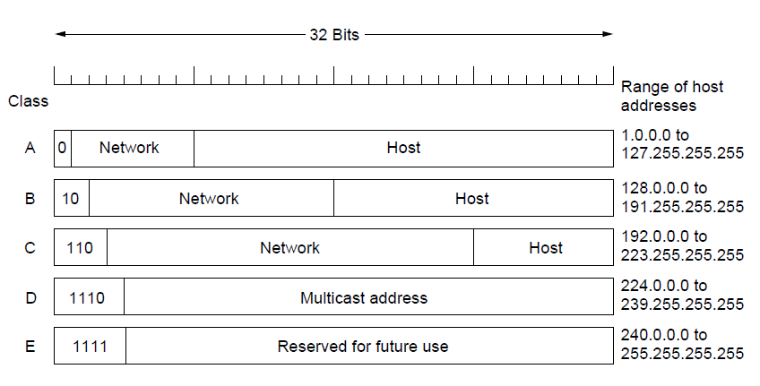

**Special IP addresses**

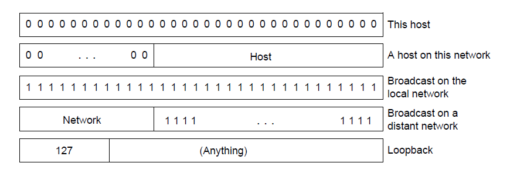

### NAT

Network Address Translation (网络地址转换)

解决 IPv4不够的问题

* To assign each company a single IP address (or at most, a small number of them) for Internet traffic
* Within the company, every computer gets a unique IP address

三个内网网段

* 10.0.0.0/8
    10.0.0.0 ~ 10.255.255.255 , 16,777,216 hosts
* 172.16.0.0/12
    172.16.0.0 ~ 172.31.255.255 , 1,048,576 hosts
* 192.168.0.0/16
    192.168.0.0 ~ 192.168.255.255 , 65,536 hosts

**Drawbacks of NAT**

1. NAT violates the architectural model of IP, which states that every IP address uniquely identifies a single machine worldwide
2. NAT breaks the end to end connectivity model of the Internet, which says that any host can send a packet to any other host at any time. Since the mapping in the NAT box is set up by outgoing packets, incoming packets cannot be accepted until after outgoing ones ( NAT tranversal problem ).
3. NAT changes the Internet from a connectionless network to a peculiar kind of connection oriented network.
4. NAT violates the most fundamental rule of protocol layering
5. Processes on the Internet are not required to use TCP or UDP.
6. Some applications use multiple TCP/IP connections or UDP ports in prescribed ways
7. Since the TCP Source port field is 16 bits, at most 65,536 machines
can be mapped onto an IP address.

## IPv6

### IPv6 Header

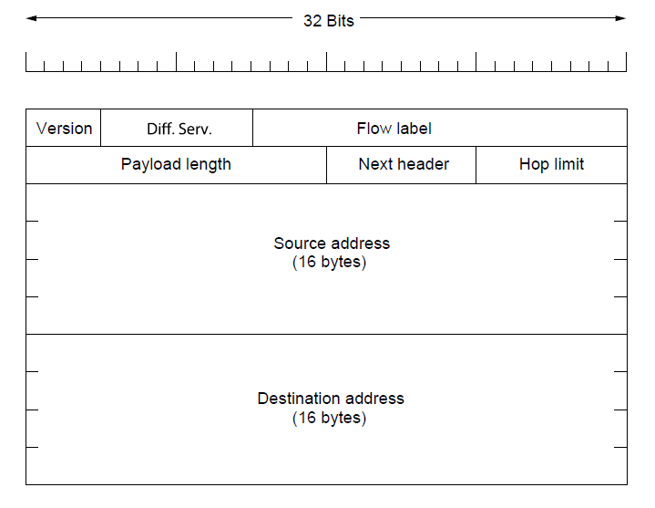

* Differentiated services(8): used to distinguish the class of service
    * 6 for service class, 2 for congestion(拥塞) (e.g. ECN). 同IPv4
* Flow Label(20): identify datagrams in same “flow.” (concept of “flow” not well defined)
* Payload length(16): tells how many bytes follow the 40 byte header
    * 与IPv4不同：header的40字节不算进去了
* Next header(8): tells which of the (currently) six extension headers, if any, follow this one
    * 额外可选的拓展头的类别
* Hop limit(8): 避免包永垂不朽(可还行)，与IPv4的TTL完全一样（之所以改名是因为time的单位一般是秒，而实际用起来是跳）
* ~~Checksum~~: removed entirely to reduce processing time at each hop
* Options: allowed, but outside of header, indicated by "Next Header" field

### IPv6 notations

* eight groups of four hexadecimal digits with colons between the groups
    * e.g. 8000:0000:0000:0000:0123:4567:89AB:CDEF
* Three optimizations
    1. Leading zeros within a group can be omitted
        * e.g. 0123 can be written as 123
    2. One or more groups of 16 zero bits（4个hex） can be replaced by a pair of colons
        * e.g. 8000::123:4567:89AB:CDEF
    3. **IPv4** addresses can be written as a pair of colons and an old dotted decimal number
        * e.g. ::192.31.20.46

### Extension header

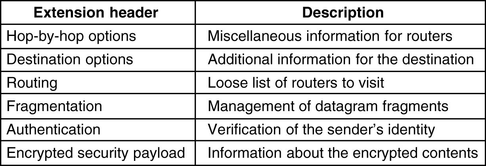

The hop-by-hop extension header for large datagrams (jumbograms, 巨型报)

* Next header: a byte telling what kind of header comes next
* Next byte (0): how long the hop by hop header is in bytes, excluding the first 8 bytes
* Next two bytes(194,4): defines the datagram size (code 194) and that the size is a 4 byte number.
* **Jumbo payload length** give the size of the datagram. Sizes less than 65,536 bytes are not permitted and will result in the first router discarding the packet and sending back an ICMP error message.
* 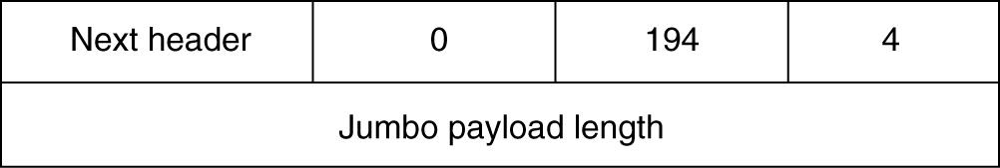
* **The routing header** lists one or more routers that must be visited on the way to the destination.
    * 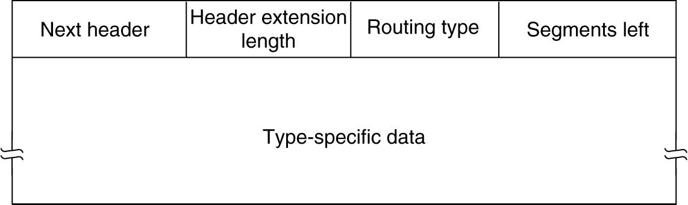

### Controversies

* Address length: 8 byte, 16 byte, 20 bytes \=\=\>bytes
* Hop limit: 8 bits or more \=\=\> 8 bits
* Maximum packet size: 64 KB or larger \=\=\> normal 64KB and permit jumbograms.
* Checksum: needed or not \=\=\> not needed any more.
    * 有传输层checksum一次，且开销实在太大
* Mobile support: yes or no \=\=\> no but.
* Security: yes or no \=\=\> no but.

## ICP

**Internet Control Protocols**

### ICMP

Internet Control Message Protocol

**traceroute**：利用TTL——向目标发送一系列TTL为1、2、3、、的数据包，因此路上<u>各跳就会返回一个超时信息</u>，根据超时信息就可以确定沿途的路由器IP地址

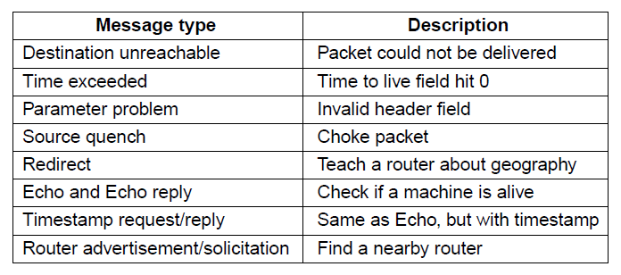

### ARP

The Address Resolution Protocol

问题：路由器的MAC地址(48位)虽然是唯一的，但是他们对32位的IPv4一无所知，那么如何将IP地址映射到数据链路层的MAC地址呢？

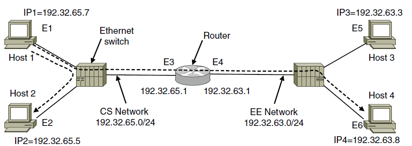

* How does a user on host 1 send a packet to a user on host 2?
    1. Find the IP address for host 2 (e.g. DNS)
    2. Build a packet with 192.31.65.5 in the Destination address field
    3. Find the destination's Ethernet address( using its IP Addr): Conf File or ARP
    4. Build an Ethernet frame addressed to E2 and dump it into the Ethernet.
    5. The Ethernet board of host 2 detects this frame, recognizes it as a frame for itself, and causes an interrupt.
    6. The Ethernet driver extracts the IP packet from the payload and passes it to the IP software.
* How does a user on host 1 send a packet to a user on host 4?
    * Host 1 knows the dest not on local net. So need to send to default gateway 198.32.65.1. It finds the link address E3 by ARP.
    * When the router gets the Ethernet frame, it knows it should be sent to EE network. So it finds the link address(MAC addr) E6 by ARP. It then inserts the packet into the payload field of a frame addressed to E6 and puts it on the net.

### DHCP

Dynamic Host Configuration Protocol

* used to dynamically obtain IP address. 用于配置主机上的基本信息，比如自己的IP地址
* Link address --> IP

## Label Switching and MPLS

MultiProtocol Label Switching: a technology close to circuit switching, called tag switching.

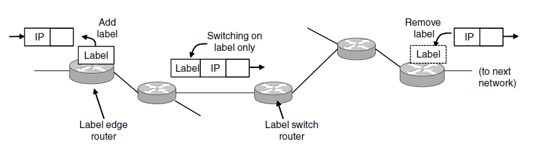

## OSPF

Open Shortest Path First

**The Interior Gateway Routing Protocol**

* The internet is made up of a large number of autonomous
    systems ( **AS** ).
* A routing algorithm within an AS is called an interior gateway protocol
    * Distance vector ( **DV** ) protocol
        * **RIP** (Routing Information Protocol)
    * Link state ( **LS** ) protocol
        * **OSPF** (Open Shortest Path First in 1990), IS-IS (Intermediate-System & IS)
* A routing algorithm between ASes is called an exterior gateway protocol
    * BGP (Border Gateway Protocal)

**OSPF overview**

* uses Link State algorithm
    * LS packet dissemination
    * topology map at each node
    * route computation using Dijkstra’s algorithm
* OSPF advertisement carries one entry per neighbor router
* advertisements disseminated to entire AS (via flooding), carried in OSPF messages directly over IP (rather than TCP or UDP)

## BGP

Border Gateway Protocal

**The Exterior Gateway Routing Protocol**

用于AS之间通信有时候一个国家到另一个国家要避开某些国家，这时的optimal路径不能仅通过时间或跳数来定义了(政治因素)

## Internet Multicasting

## Mobile IP