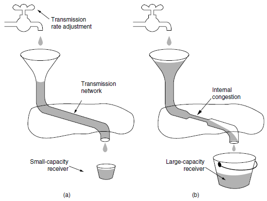
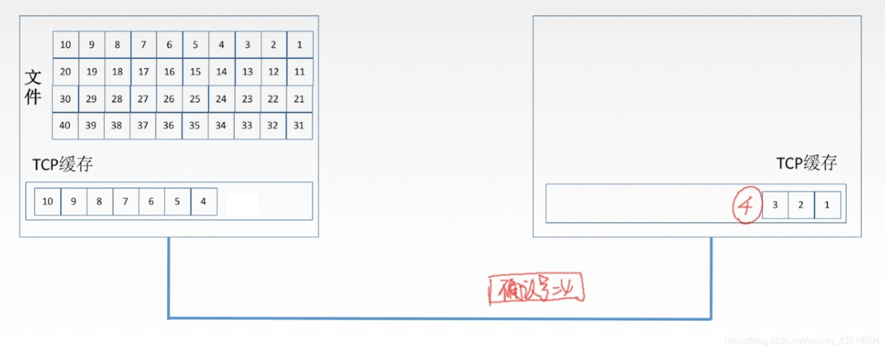

[TOC]

# The Transport Service ( 传输服务

* **Transport layer services** (传输服务) 
    * To provide efficient, reliable, and cost effective service to its users, processes in the application layer.
    * To make use of the services provided by the network layer.
* **The transport entity** (传输实体): the hardware and/or software within the transport layer that does the work. Its positions:
    * in the OS kernel, in a separate user process, in a library package bound to network applications, or
    * on the network interface card (NIC).


**OSI model** (注意右侧的unit的名字)


* There are two types of transport services
    * Connection-oriented transport service
    * Connectionless transport service
* The **similarities** between transport services and network services
    * The connection-oriented service is similar to the connection oriented network service in many ways:
        * Establishment --> data transfer --> release;
        * Addressing;
        * Flow control
    * The connectionless transport service is also similar to the connectionless network service.
* The **differences** between transport services and network services. Why are there two distinct layers?
    * The transport code runs entirely on the user’s machines, but the network layer mostly runs on the routers which are usually operated by the carrier.
    * Network layer has problems (losing packets, router crashing, …)
    * The transport layer improves the QoS of the network layer.
    * \=\=\> The transport service is <u>more reliable</u> than the network service.
    * \=\=\> Application programmers can write code <u>according to a standard set of transport service primitives</u> and have these programs work on a wide variety of networks.

## Hypothetical Primitives


## Berkeley Sockets


# ~~Elements of Transport Protocols~~

Transport protocol and data link protocol

* Similarities : Error control, sequencing, flow control,
* The key difference : environments the two protocols operate
    * Link layer: two routers communicate directly via a physical channel
    * Transport layer: physical channel --> entire network
* Other differences
    * Addressing:
        * Link: implicit
        * Transport: explicit
    * Connection establishment
        * Link: simple
        * Transport: complicated
    * Storage capacity:
        * Link: no
        * Transport: yes => a network can delay a packet
    * Buffering
        * Link: allocate a fixed number of buffers to each line
        * Transport: a large number of connections and variations in the bandwidth may require a dynamic and complicated approach.

## Addressing

## Connection Establishment

### Delayed Duplicates & Wrap around of seqno


#### Solution

* Asseumption: Time for pkt delayed is usally <u>much shorter</u> than time for seqno wrap.
* Set a time limit T: <T, discard, >T, accept
* 

Here needs two things to do

1. restrict packet life time
2. limit sending rate

#### Forbidden Region


Time Gap must be larger than *T*.

The increments of seqno cannot be too fast or too slow.

> Question
> In a network whose max segment is 128 bytes, max segment lifetime is 30 sec, and has 8 bit sequence numbers, what is the maximum data rate per connection?

### Three-way handshake for estb

(CR for Connection Request)


## Connection Release

主要面向传输中断的情况

* Asymmetric release and symmetric release
    * Asymmetric release: When one part hangs up, the connection is broken.
        * Asymmetric release is abrupt and may result in data loss
    * Symmetric release: to treat the connection as two separate unidirectional connections and require each one to be released separately.
        * One way to avoid data loss is to use symmetric release.

### Three-way handshake for rele

(DR for disconnection Request & Response)


* Normal case
* FInal ACK lost
* Lost Response
* Lost Response and subsequent Response

## Error Control and Flow Control

* Error control is ensuring that the <u>data(网络层不检查数据，只检查IP头)</u> is delivered with the desired level of reliability, usually that all of the data is delivered without any errors.
* Flow control is keeping <u>a fast transmitter from overrunning a slow receiver</u>.


Solutions to these issues (same as data link layer):

* A frame carries error detecting codes , e.g., CRC
* [ARQ](https://en.wikipedia.org/wiki/Automatic_repeat_request) : Automatic Repeat reQuest
* Max send window size *w* : stop and wait(w =1), large *w* enables pipelining
* Sliding window protocol : combines the above features and supports bidirectional data transfer.


Flow Ctrl and buffering

* When buffer space no longer limits the maximum flow, another bottleneck will appear: the carrying capacity of the subnet.
    * The sender dynamically <u>adjusts the window size to match the network's carrying capacity</u>.
    * In order to adjust the window size periodically, the sender could <u>monitor both parameters(both指的是什么？)</u> and then compute the desired window size.

## Multiplexing


## Crash Recovery

# ~~Congestion Control~~

## Desirable Bandwidth Allocation

### Goodput & power

\> Def: *Goodput* : rate of useful packets arriving at the receiver


为了解决拥塞对带宽计算的影响，定义 $\large \text{power} = \frac{\text{load}}{\text{delay}}$

### Max-Min Fairness

情况：一个链路上有多个了流，一个流可能要穿过多个链路

定义：如果分配给一个流的带宽在不减少分配给另外一个六的带宽的前提下无法进一步增长，那就不给这个流更高带宽。


* Assume the bandwidth of each link is unit 1.
* A max min bandwidth allocation for 4 flows.

### Convergence

收敛到最优的分配方案上，一个拥塞控制算法的好坏就取决于收敛速度

## Regulating the sending rate



* a：网络带宽高、接收方capacity低
* b：网络带宽低、接收方capacity高

## Wireless Issues

# UDP

## UDP basis

User Datagram Protocol 用户数据报协议

### Advantages of UDP


**为什么应用开发人员宁愿在UDP之上构建应用，也不选择TCP?既然TCP提供可靠的服务，而UDP不提供，那么TCP总是首选吗?答案是否定的，因为有很多应用更适合用UDP，主要是因为UDP具有如下优点:**

**1)UDP无须建立连接。**

- UDP不会引入建立连接的时延。
- 试想如果DNS运行在TCP而非UDP.上，那么DNS的`速度`会慢很多。
- HTTP使用TCP而非UDP，是因为对于基于文本数据的Web网页来说，`可靠性`是至关重要的。

**2)无连接状态。**

- TCP需要在端系统中维护连接状态。此连接状态包括接收和发送缓存、拥塞控制参数和序号与确认号的参数。
- 而UDP不维护连接状态，也不跟踪这些参数。
- 因此，`某些专用应用服务器使用UDP`时，`一般都能支持更多的活动客户机`。

**3)分组首部开销小。**

- `TCP`有`20B`的`首部`开销，而`UDP`仅有`8B`的开销。

**4)应用层能更好地控制要发送的数据和发送时间。**

- UDP没有拥塞控制，因此网络中的拥塞`不会影响主机的发送效率`。
- `某些实时应用要求以稳定的速度发送`，能容忍一些数据的丢失，但`不允许有较大的时延`，而UDP正好满足这些应用的需求。

**5)UDP常用于一次性传输较少数据的网络应用**

- 如DNS、SNMP等，因为对于这些应用，若采用TCP，则将为连接创建、维护和拆除带来不小的开销。
- UDP也常用于多媒体应用(如IP电话、实时视频会议、流媒体等)，显然，可靠数据传输对这些应用来说并不是最重要的，但TCP的拥塞控制会导致数据出现较大的延迟，这是它们不可容忍的。

**6)UDP提供尽最大努力的交付，即不保证可靠交付**

- 但这并不意味着应用对数据的要求是不可靠的，因此所有维护传输可靠性的工作需要用户在应用层来完成。
- `应用实体可以根据应用的需求来灵活设计自己的可靠性机制`。

**7)UDP是面向报文的。**

- 发送方UDP对`应用层交下来的报文`，在添加首部后就向下交付给IP层，`既不合并，也不拆分`，而是保留这些报文的边界;
- 接收方UDP对IP层交上来UDP用户数据报，在去除首部后就原封不动地交付给上层应用进程，一次交付一个完整的报文。
- 因此`报文不可分割，是UDP数据报处理的最小单位`。

### UDP Header


**各字段意义如下：**

- 1)源端口。源端口号。在需要对方回信时选用，不需要时可用全0。
- 2)目的端口。目的端口号。这在终点交付报文时必须使用到。
- 3)长度。UDP数据报的长度(包括首部和数据)，其最小值是8 (仅有首部)。
- 4)校验和。检测UDP数据报在传输中是否有错。有错就丢弃。该字段是可选的，当源主机不想计算校验和时，则直接令该字段为全0。

### When TransLy receive UDP from IPLy

根据首部中的目的端口，把UDP数据报通过相应的端口.上交给应用进程

如果接收方UDP发现收到的报文中的目的端口号不正确(即不存在对应于端口号的应用进程)，那么就丢弃该报文，并由ICMP发送“端口不可达”`差错报文给发送方`。

### UDP checksum


- 伪首部和全0字节是不发送的，仅供校验使用

## RPC

* RPC (**Remote Procedure Call**) <u>allows programs to call procedures located on remote hosts</u>.
    * When a process on machine 1 calls a procedure on machine 2, the calling process on 1 is suspended and execution of the called procedure takes place on 2
    * Information can be transported from the caller to the callee in the parameters and can come back in the procedure result.
    * No message passing is visible to the programmer.
* The idea behind RPC is to make a remote procedure call look as much as possible like a local one.
* stub：客户/服务器的程序绑定到的数据库


C Proc <--> C Stub <--> S Stub <--> S Proc

The steps in making an RPC

1. client calling the client stub.
2. client stub packing the parameters into a message (marshaling) and making a system call to send the message.
3. kernel sending the message from the client machine to the server machine.
4. kernel passing the incoming packet to the server stub and unpacking the packet to extract the parameters ( unmarshaling
5. server stub calling the server procedure with
    the unmarshaled parameters.

## RTP

**Real-time Tansport Protocol**

**Motivation**: Multimedia applications such as Internet radio, Internet telephony, music on demand, video conferencing, video on demand, require real time transport protocols


* (a) The position of RTP in the protocol stack
* (b) packet nesting

### RTP Header


* Version: 2 bits, already at 2.
* P bit: 数据包是否进行字填充（4bytes的倍数
* X bit: an extension header or not.
* CC: how many contributing sources are present (0\~15).
* M bit: marker bit.
* Payload type: which encoding algorithm has been used（如mp3等
* Sequence number: incremented on each RTP packet sent，可用于检测丢包
* Timestamp: 标明数据包中第一个样本产生的时间，用于reducing jitter（通过将数据包到达于播放的时间分开）
* Synchronization source identifier: which stream the packet belongs to，因此可以将多个数据流复用到一个UDP数据包流（一个UDP夹带多个RTP）
* Contributing source identifiers：演播室中使用混合器

### Smoothing

抖动指的是到达接受端的相对时间不同（因此间隔时间也不同）

加个缓冲可以一定程度上去抖动


# TCP

## TCP Basis

==tcp协议特点、tcp报文段首部格式、tcp连接---三次握手、tcp连接释放---四次握手==

### TCP Features


### TCP Header

- `TCP传送的数据单元称为报文段`。一个TCP报文段分为TCP首部和TCP数据两部分，整个TCP报文段作为IP数据报的数据部分封装在IP数据报中

- 其首部的前20B是固定的。TCP报文段的首部最短为20B，后面有4N字节是根据需要而增加的选项，通常长度为4B的整数倍。

- TCP报文段既可以用来运载数据，又可以用来建立连接、释放连接和应答。

- 

    1. `源端口和目的端口字段`。各占2B。端口是运输层与应用层的服务接口，运输层的复用和分用功能都要通过端口实现。
    2. `序号字段`。占4B。TCP是面向字节流的(即TCP传送时是逐个字节传送的)，所以TCP连接传送的数据流中的==每个字节都编上一个序号==。<u>序号字段的值指的是本报文段所发送的数据的第一个字节的序号。</u>
        
    3. `确认号字段`。占4B,是期望收到对方的==下一个报文段的数据的第一个字节==的序号。<u>若确认号为N，则表明到序号N- 1为止的所有数据都已正确收到。</u>
        * 
    4. `数据偏移(即首部长度)`。占4位，这里不是IP数据报分片的那个数据偏移，而是表示首部长度，它指出TCP报文段的数据起始处距离TCP报文段的起始处有多远。“数据偏移”的单位是32位(以4B为计算单位)。因此当此字段的值为15时，达到TCP首部的最大长度60B.
        * 
    5. `保留字段`。占6位，保留为今后使用，但目前应置为0，该字段可以忽略不计。
    6. `紧急位URG`。URG= 1时，表明紧急指针字段有效。它告诉系统报文段中有紧急数据，应尽快传送(相当于高优先级的数据)。但`URG需要和紧急指针配套使用`，即`数据从第一个字节到紧急指针所指字节`就是`紧急数据`。
        * 
    7. `确认位ACK`。只有当ACK= 1时确认号字段才有效。当ACK=0时，确认号无效。TCP规定，<u>在连接建立后所有传送的报文段都必须把ACK置1</u>.
    8. `推送位PSH (Push)`。 接收TCP收到PSH= 1的报文段，就尽快地交付给接收应用进程而不再等到整个缓存都填满后再向上交付。
        * 
    9. `复位位RST (Reset)`。RST=1时，表明TCP连接中出现严重差错(如主机崩溃或其他原因)，必须释放连接，然后再重新建立运输连接。
    10. `同步位SYN`。同步SYN= 1表示这是一个`连接请求或连接接收报文`。当`SYN=1, ACK=0`时，表明这是一个`连接请求`报文，对方若同意建立连接，则在响应报文中使用`SYN=1, ACK=1`。即SYN= 1表示这是一个连接请求或连接接收报文。
        * 
    11. `终止位FIN (Finish)`。用来释放一个连接。FIN= 1表明此报文段的发送方的数据已发送完毕，并要求释放传输连接。
    12. `窗口字段`。占2B。它指出现在<u>允许对方发送的数据量</u>，接收方的数据缓存空间是有限的，因此<u>用窗口值作为接收方让发送方设置其发送窗口的依据</u>，<u>单位为字节</u>。例如，假设确认号是701，窗口字段是1000。这表明，从701号算起，发送此报文段的接收方方还有接收1000B数据(字节序号为701 ~1700)的接收缓存空间。
        * 
    13. `校验和`。占2B。校验和字段检验的范围包括首部和数据两部分。在计算校验和时，和UDP一样，要在TCP报文段的前面加上12B的伪首部(只需将UDP伪首部的第4个字段，即协议字段的17改成6，其他的和UDP一样)。
        * [UDP协议](https://blog.csdn.net/weixin_43914604/article/details/105453096)
    14. `紧急指针字段`。占16 位，指出在本报文段中紧急数据共有多少字节(紧急数据放在本报文段数据的最前面)。
         * 
    15. `选项字段`。长度可变。TCP最初只规定了一种选项，即最大报文段长度(Maximum SegmentSize，MSS)。MSS是TCP报文段中的数据字段的最大长度。窗口扩大、时间戳、选择确认
    16. `填充字段`。这是为了使整个首部长度是4B的整数倍。填充0.

## TCP Com

- TCP是面向连接的协议，因此每个TCP连接都有三个阶段:`连接建立、数据传送和连接释放`。
- `TCP连接的管理就是使运输连接的建立和释放都能正常进行`。

**在TCP连接建立的过程中，要解决以下三个问题:**

- 1)要使每一方都能够确知对方的存在。
- 2)要允许双方协商一些参数(如最大窗口值、是否使用窗口扩大选项、时间戳选项及服务质量等)。
- 3)能够对运输实体资源( 如缓存大小、连接表中的项目等)进行分配。

每条TCP连接通过通信两端的`两个端点( 即两个套接字)`确定。


### Com Est: 3HS

- seq为序号字段，标明本次报文段数据部分的第一个字节的序号
- ack是`确认号字段`，告诉对方我接下来应该接收的数据是从字节序号ack开始的数据
- ACK是确认位,0时`确认号字段ack`无效，1时`确认号字段ack`有效
- SYN是同步位
- 
    1. 第一步:客户机的TCP首先向服务器的TCP发送一个连接请求报文段。这个特殊的报文段中不含应用层数据，其首部中的<u>SYN标志位被置为1</u>。另外，客户机会随机选择一个起始序号 <u>seq= x</u>(连接请求报文不携带数据，但要消耗一个序号)。
    2. 第二步:服务器的TCP收到连接请求报文段后，如同意建立连接，就向客户机发回确认，并为该TCP连接分配TCP缓存和变量。在确认报文段中，<u>SYN和ACK位都被置为1,确认号字段的值为x+1</u>, 并且服务器随机产生起始序号<u>seq = y</u>(确认报文不携带数据,但也要消耗-一个序号)。确认报文段同样不包含应用层数据。
    3. 第三步:当客户机收到确认报文段后，还要向服务器给出确认，并且也要给该连接分配缓存和变量。这个报文段的<u>ACK标志位被置1,序号字段为x+1,确认号字段ack=y+1</u>。该报文段可以携带数据，若不携带数据则不消耗序号。
- 成功进行以上三步后，就建立了TCP连接，接下来就可以传送应用层数据。

**TCP提供的是全双工通信，因此通信双方的应用进程在任何时候都能发送数据。**

- 服务器端的资源是在完成第二次握手时分配的
- 而客户端的资源是在完成第三次握手时分配的，这就使得服务器易于受到SYN洪泛攻击。

**SYN Flooding**


### Com Rel: 4HS

- 天下没有不散的筵席，TCP同样如此。参与TCP连接的两个进程中的任何- 一个都能终止该连接。TCP连接释放的过程通常称为四次握手
- 
- 
    1. 第一步:客户机打算关闭连接时，向其TCP发送一个连接释放报文段， 并停止发送数据，主动关闭TCP连接，该报文段的<u>FIN标志位被置1</u>, `seq=u, 它等于前面已传送过的数据的最后一个字节的序号加1` (FIN报文段即使不携带数据，也要消耗一个序号)。
        TCP 是全双工的，即可以想象为一条TCP连接上有两条数据通路。
        发送FIN报文时，发送FIN的一端不能再发送数据，即关闭了其中一条数据通路，但对方还可以发送数据。
    2. 第二步:服务器收到连接释放报文段后即发出确认，`确认号是ack=u+ 1,而这个报文段自己的序号是v,等于它前面已传送过的数据的最后一个字节的序号加1`。
        此时，从客户机到服务器这个方向的连接就释放了，TCP连接处于半关闭状态。
        但服务器若发送数据，客户机仍要接收，即`从服务器到客户机这个方向的连接并未关闭`。
    3. 第三步:若服务器已经没有要向客户机发送的数据，就通知TCP释放连接，此时其`发出FIN= 1的连接释放报文段`。
    4. 第四步:`客户机收到连接释放报文段后，必须发出确认`。在确认报文段中，ACK字段被置为1，确认号ack=w+1,序号seq=u+1.此时TCP连接还未释放，`必须经过时间等待计时器设置的时间2MSL后，A才进入连接关闭状态`。

### Summary of TCP Con

- 1)连接建立。分为3步:
    ①SYN=1，seq=x。
    ②SYN=1, ACK=1, seq=y, ack=x+ 1。
    ③ACK=1，seq=x+1, ack=y+ 1。
- 2)释放连接。分为4步:
    ①FIN=1, seq= u
    ②ACK=1, seq=v, ack=u+ 1。
    ③FIN=1，ACK=1, seq=w，ack=u+ 1。
    ④ACK=1, seq=u+1, ack=w+ 1。

```
关于连接和释放，ACK、 SYN、 FIN 一定等于1
```


## TCP Reliability 

Mechanism 


**Seqno**


**确认**


**重传**


## TCP Flow Ctrl: SliWin

- 在通信过程中，接收方根据自己接收缓存的大小，动态地调整发送方的发送窗口大小，这称为`接收窗口rwnd`, 即<u>调整`TCP报文段首部中的“窗口”字段值`，来限制发送方向网络注入报文的速率</u>。
- 同时，发送方根据其对当前网络拥塞程序的估计而确定的窗口值，这称为`拥塞窗口cwnd`，其大小与网络的带宽和时延密切相关。
    
- `例如`，在通信中，有效数据只从A发往B，而B仅向A发送确认报文，这时B可以通过设置确认报文段首部的窗口字段来将rwnd通知给A。
- rwnd 即接收方允许连续接收的最大能力，单位是字节。
- 发送方A总是根据最新收到的rwnd值来限制自己发送窗口的大小，从而将未确认的数据量控制在rwnd大小之内，保证A不会使B的接收缓存溢出。
- 当然，`A的发送窗口的实际大小取rwnd和cwnd中的最小值`。
- Sample
    - 
    - 

**传输层和数据链路层的流量控制的区别是:**

- 传输层定义`端到端`用户之间的流量控制，数据链路层定义`两个中间的相邻结点`的流量控制。
- 另外，`数据链路层`的滑动窗口协议的`窗口`大小`不能动态变化`，<u>`传输层`的则可以`动态变化`</u>。

## TCP Timer

**Retransmission timer**

* SRTT (Smoothed Round Trip Time) (α=7/8)
    * SRTT~new~ = α \* SRTT~old~ + (1-α) \* R（R表示测量这次确认所花的时间，这是个**更新**公式
* RTTVAR(Round Trip Time VARiation) (β=3/4)
    * RTTVAR~new~ = β \* RTTVAR~old~ + (1-β) \* |SRTT-R|
* **RTO (Retransmission TimeOut)**
    * RTO = SRTT + 4 \* RTTVAR

## TCP Cgs Ctrl

### What is

- 所谓`拥塞控制，是指防止过多的数据注入网络，保证网络中的路由器或链路不致过载`。出现拥塞时，端点并不了解到拥塞发生的细节，对通信连接的端点来说，拥塞往往表现为通信时延的增加。当然，拥塞控制和流量控制也有相似的地方，即它们都通过控制发送方发送数据的速率来达到控制效果。

### Diff betw Flow & Cgs Ctrl

- `拥塞控制`是让网络能够承受现有的网络负荷，是一个全局性的过程，涉及所有的主机、所有的路由器，以及与降低网络传输性能有关的所有因素。
- `流量控制`往往是指点对点的通信量的控制，即接收端控制发送端，它所要做的是抑制发送端发送数据的速率，以便使接收端来得及接收。
    
    **例如：**
- 某个链路的传输速率为10Gb/s,某巨型机向一台PC以1Gb/s的速率传送文件，显然网络的带宽是足够大的，不存在拥塞问题，但如此高的发送速率将导致PC可能来不及接收，因此必须进行`流量控制`。
- 但若有100万台PC在此链路上以1Mb/s的速率传送文件，则现在的问题就变为网络的负载是否超过了现有网络所能承受的范围。就像我们上网一样，有时候加载会很慢，提示访问请求过多，请稍后再试，就是网络产生了拥塞，带宽小，一下不能支持给多个请求终端发送数据。

**为了更好地对传输层进行拥塞控制，因特网建议标准定义了以下4种算法:`慢开始、拥塞避免、快重传、快恢复。`**

### 4 Algs for Cgs Ctrl


#### Slow Start & Cgs Avoidance


**(1)慢开始算法**

- 在TCP刚刚连接好并开始发送TCP报文段时，先令拥塞窗口cwnd= 1,即一个最大报文段长度MSS.每收到一个对新报文段的确认后，将cwnd加1,即增大一个 MSS.用这样的方法<u>逐步增大发送方的拥塞窗口cwnd,可使分组注入网络的速率更加合理</u>。

> 例如，A向B发送数据，发送时A的拥塞窗口为2,那么A一次可以发送两个TCP报文段，经过一个RTT后(也称一个`传输轮次`)，A收到B对刚才两个报文的确认，于是把拥塞窗口调整为4，下一次发送时就可一次发送4个报文段。

- 使用慢开始算法后，每经过一个传输轮次(即往返时延RTT)，拥塞窗口cwnd就会加倍，即cwnd的大小指数式增长。这样，慢开始一直把拥塞窗口cwnd增大到一个规定的`慢开始门限ssthresh(阈值)`，然后`改用拥塞避免算法`。

**(2)拥塞避免算法**

- 拥塞避免算法的做法如下:发送端的拥塞窗口cwnd每经过- -一个往返时延RTT就增加一个MSS的大小，而不是加倍,使cwnd按线性规律缓慢增长(即加法增大),而当出现一次超时(网络拥塞)时，令慢开始门限ssthresh等于当前cwnd的一半(即乘法减小)。
- 根据cwnd的大小执行不同的算法，可归纳如下:
    ●当cwnd < ssthresh时，使用慢开始算法。
    ●当 cwnd > ssthresh时，停止使用慢开始算法而改用拥塞避免算法。
    ●当cwnd = sthresh时，既可使用慢开始算法，又可使用拥塞避免算法(通常做法)。

**(3)网络拥塞的处理**

- 网络出现拥塞时，无论是在慢开始阶段还是在拥塞避免阶段，<u>只要发送方检测到超时事件的发生(未按时收到确认，重传计时器超时)，就要把慢开始门限ssthresh设置为出现拥塞时的发送方的cwnd值的一半(但不能小于2)</u>。
    然后把拥塞窗口cwnd重新设置为1,执行慢开始算法。这样做的目的是迅速减少主机发送到网络中的分组数，使得发生拥塞的路由器有足够时间把队列中积压的分组处理完。
- 拥塞避免并不能完全能避免拥塞。利用以上措施要完全避免网络拥塞是不可能的。`拥塞避免是指在拥塞避免阶段把拥塞窗口控制为按线性规律增长，使网络比较不容易出现拥塞。`

> 在慢开始和拥塞避免算法中使用了`“乘法减小”和“加法增大”方法`。
>
> - `“乘法减小”`是指不论是在慢开始阶段还是在拥塞避免阶段，只要出现一次超时(即很可能出现了网络拥塞)，就把慢开始门限值ssthresh设置为当前拥塞窗口值的一半。网络频繁出现拥塞时，ssthresh 值就下降得很快，以大大减少注入网络的分组数。
> - `“加法增大”`是指执行拥塞避免算法后，在收到对所有报文段的确认后(即经过一个 RTT),就把拥塞窗口cwnd增加一个MSS大小，使拥塞窗口缓慢
>     增大，以防止网络过早出现拥塞。

#### Fast Retransmission & Fast Recovery

<u>快重传和快恢复算法是对慢开始和拥塞避免算法的改进。</u>

**(1)快重传**

- 在TCP可靠传输机制中，`快重传技术`使用了`冗余ACK来检测丢包的发生`。同样，`冗余ACK也用于网络拥塞的检测`(丢了包当然意味着网络可能出现了拥塞)。快重传并非取消重传计时器，而是在某些情况下可更早地重传丢失的报文段。
    当发送方连续收到三个重复的ACK报文时，`直接重传对方尚未收到的报文段，而不必等待那个报文段设置的重传计时器超时`。

**(2)快恢复**

- `快恢复算法`的原理如下:
- 发送端收到连续三个冗余ACK (即重复确认)时，执行`“乘法减小”算法`，把慢开始门限ssthresh 设置为出现拥塞时发送方cwnd的一半。
- 与慢开始(慢开始算法将拥塞窗口cwnd设置为1)的`不同之处`是，它把cwnd的值设置为慢开始门限ssthresh改变后的数值，然后开始执行`拥塞避免算法(“ 加法增大”)`，使拥塞窗口缓慢地线性增大。
- `由于跳过了cwnd从1起始的慢开始过程,所以被称为快恢复`。

#### Tahoe & Reno

区别：

* Tahoe：Fast Retransmission时使用Slow Start，将cwnd设为1
* Reno：Fast Retransmission时使用Fast Recovery，将cwnd减半

**快恢复算法的实现过程如图所示，作为对比，虚线为慢开始的处理过程。**


- 在`流量控制`中，发送方发送数据的量由接收方决定，而在`拥塞控制`中，则由发送方自己通过检测网络状况来决定。
- 实际上，`慢开始、拥塞避免、快重传和快恢复几种算法`应是同时应用在拥塞控制机制之中的
- 当发送方检测到超时的时候，就采用慢开始和拥塞避免，
- 当发送方接收到冗余ACK时，就采用快重传和快恢复。

> `注意：` `发送方发送窗口的实际大小`由`流量控制`和`拥塞控制`共同决定。
> 因此，当题目中同时出现接收端窗口(rwnd) 和拥塞窗口(cwnd) 时，发送方实际的发送窗口大小是由rwnd和cwnd中较小的那一个确定的。

