[TOC]

# DNS

## Intro of DNS

- `域名系统(Domain Name System, DNS)`是因特网使用的命名系统，用来`把便于人们记忆的具有特定含义的主机名(如www.BitHachi.com)转换为便于机器处理的IP地址`。
- 相对于IP地址，人们更喜欢使用具有特定含义的字符串来标识因特网上的计算机。
- DNS系统采用客户/服务器模型，其协议运行在`UDP`之上，使用`53`号端口。
- 从概念上可将DNS分为3部分:`层次域名空间、域名服务器和解析器`。
    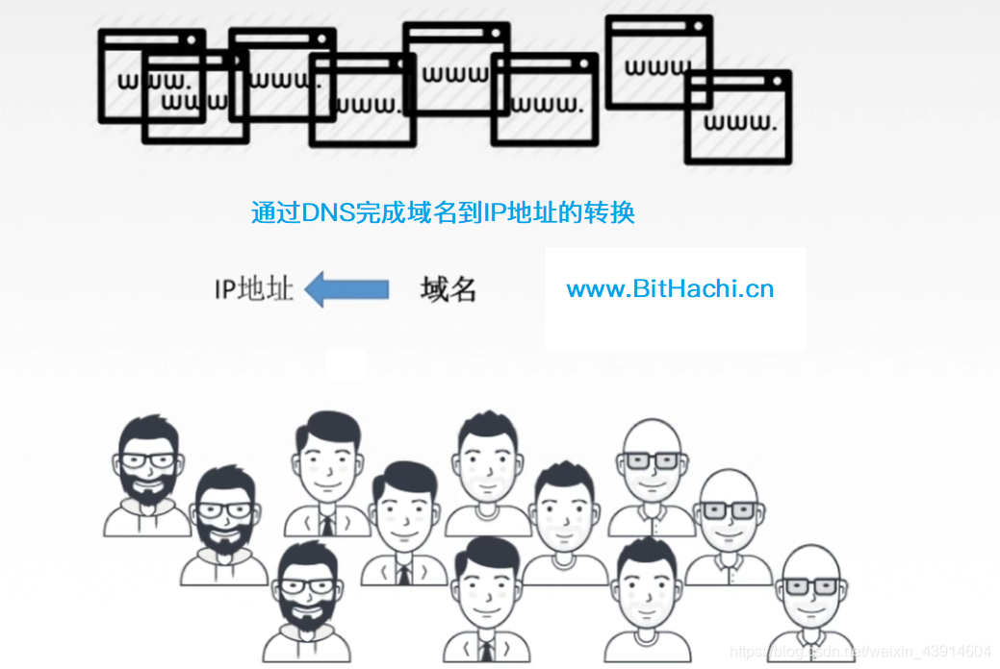
- 某台主机访问网站www.bithachi.cn网站为例，DNS的大致流程
    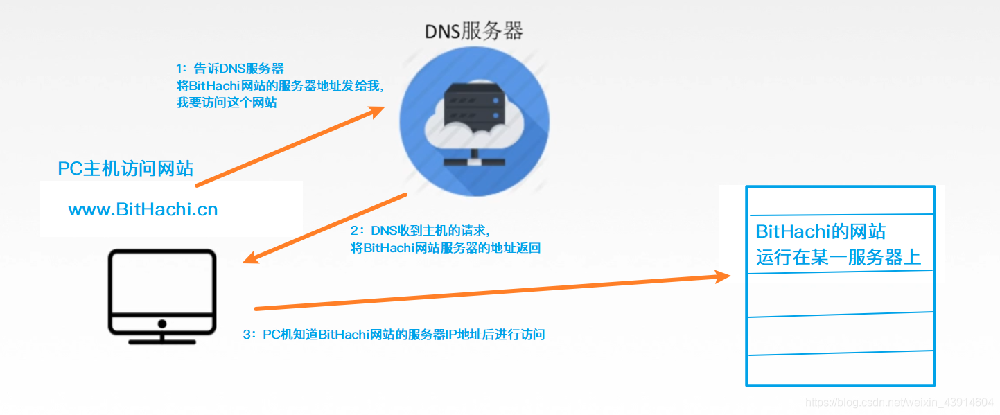

## Domain Name

- `因特网采用层次树状结构的命名方法`。采用这种命名方法，任何一个连接到因特网的主机或路由器，都有一个唯一的层次结构名称，即`域名(Domain Name)`。
- `域(Domain)`是名字空间中一个可被管理的划分。
- 域还可以划分为子域，而子域还可以继续划分为子域的子域，这样就形成
    了顶级域、二级域、三级域等。

**在域名系统中，每个域分别由不同的组织进行管理。每个组织都可以将它的域再分成一定数目的子域，并将这些子域委托给其他组织去管理。**

- 例如，管理CN域的中国将EDU.CN子域授权给中国教育和科研计算机网(CERNET)来管理。
- 比如我的域名bithachi.cn是一个二级域名，我可以任意分配三级域名，比如1001.bithachi.cn和1002.bithachi.cn，这两个网址是可以访问的，小项目。

**域名空间的树状结构：**
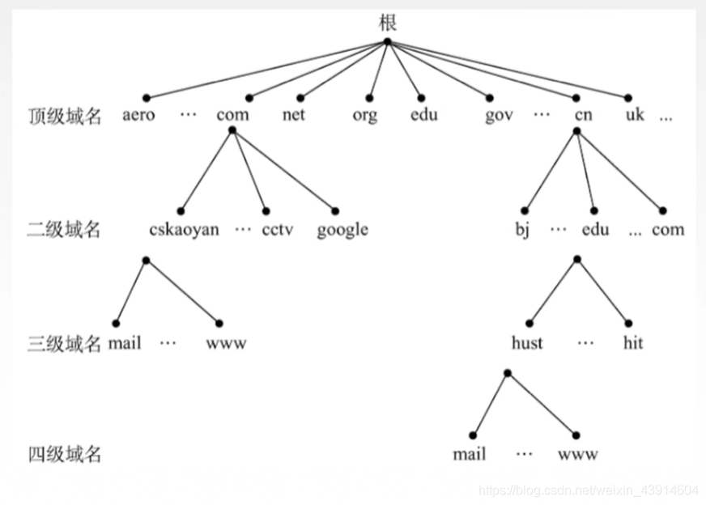
每个域名都由`标号`序列组.成，而各标号之间用点`(“.”)`隔开。

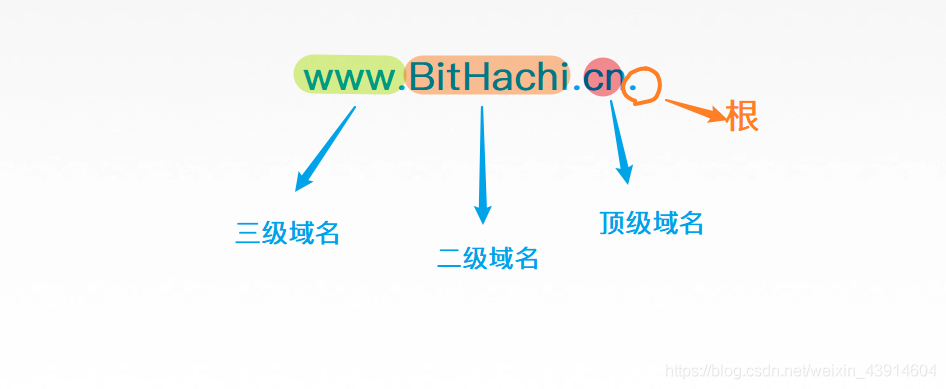

**关于域名中的标号有以下几点需要注意:**

- 1)标号中的英文`不区分大小写`。.
- 2)标号中除连字符(-) 外不能使用其他的标点符号。
- 3)每个标号不超过63个字符，多标号组成的完整域名最长不超过255个字符。
- 4)级别最低的域名写在最左边，级别最高的顶级域名写在最右边。

`顶级域名(Top Level Domain, TLD)`分为如下三大类:

- 1)国家顶级域名(nTLD)。国家和某些地区的域名，如“.cn”表示中国，“.us”表示美国，.uk”表示英国。
- 2)通用顶级域名(gTLD)。 常见的有“.com” (公司)、“.net" (网络服务机构)、“.org”(非营利性组织)和“.gov" (国家或政府部门)等。
- 3)基础结构域名。`这种顶级域名只有一个，即arpa,用于反向域名解析`，因此又称反向域名。`反向域名解析与通常的正向域名解析相反，提供IP地址到域名的对应`，反向域名格式如：X.X.X.in-addr.arpa。很多网络服务提供商要求访问的IP地址具有反向域名解析的结果，否则不提供服务。

```
国家顶级域名下注册的二级域名均由该国家自行确定。
```

## Domain Server

- `因特网的域名系统被设计成一个联机分布式的数据库系统，并采用客户/服务器模型`。
- 域名到IP地址的解析是由运行在域名服务器上的程序完成的，`一个服务器所负责管辖的(或有权限的)范围称为区(不以“域”为单位)`，各单位根据具体情况来划分自己管辖范围的区，但在一个区中的所有结点必须是能够连通的，每个区设置相应的`权限域名服务器`，用来保存该区中的所有主机的域名到IP地址的映射。
- 每个域名服务器不但能够进行一些域名到IP地址的解析，而且还必须具有连向其他域名服务器的信息。当自己不能进行域名到IP地址的转换时，能够知道到什么地方去找其他域名服务器。
- DNS使用了大量的域名服务器，它们以层次方式组织。没有一台域名服务器具有因特网上所有主机的映射，相反，该映射分布在所有的DNS上。
- 采用分布式设计的DNS，是一个在因特网上实现分布式数据库的精彩范例。主要有4种类型的域名服务器。

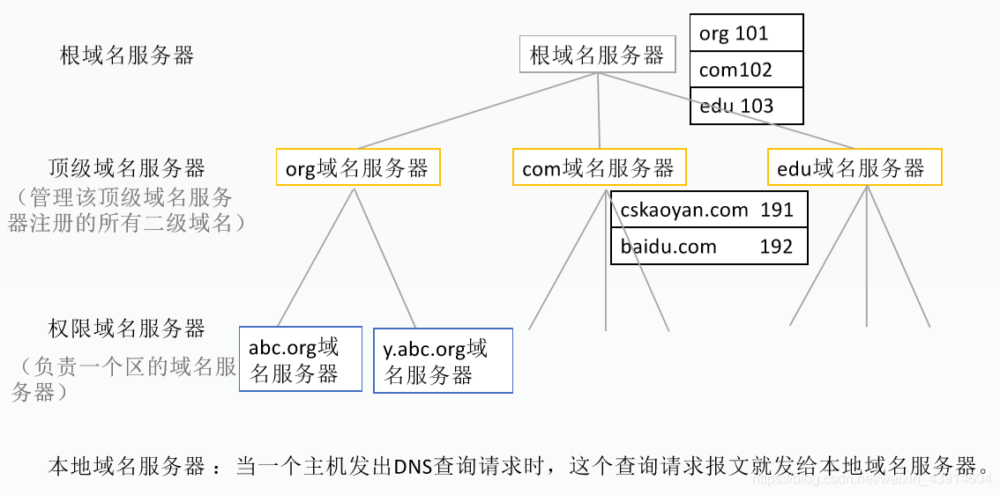

- **根域名服务器**
    - `根域名服务器`是`最高层次`的域名服务器，所有的`根域名服务器`都知道`所有`的`顶级域名服务器的IP地址`。
    - 根域名服务器也是最重要的域名服务器，不管是哪个`本地域名服务器`，若要对因特网上任何一个域名进行解析，只要自己无法解析，就首先要求助于`根域名服务器`。
    - 因特网上有`13个根域名服务器`，尽管我们将这13个根域名服务器中的每个都视为单个服务器，但`每个“服务器”实际上是冗余服务器的集群`，以提供安全性和可靠性。
        - called "a.root-servers.net" through "m.root-servers.net". They have information about each top level domain.
    - 需要注意的是，`根域名服务器`用来`管辖顶级域(如.com)`， 通常它并不直接把待查询的域名直接转换成IP地址，而是`告诉本地域名服务器`下一步应当找哪个`顶级域名服务器`进行查询。
- **顶级域名服务器**
    - 这些域名服务器负责`管理在该顶级域名服务器注册的所有二级域名`。
    - 收到DNS查询请求时,就给出相应的回答(可能是最后的结果，也可能是下一步应当查找的域名服务器的IP地址)。
- **授权域名服务器**(权限域名服务器)
    - `每台主机`都必须在`授权域名服务器`处登记。为了更加可靠地工作，一台主机最好至少有两个授权域名服务器。
    - 实际上，许多`域名服务器`都`同时`充当`本地域名服务器`和`授权域名服务器`。
    - `授权域名服务器`总能将其管辖的`主机名`转换为该主机的`IP地址`。
- **本地域名服务器**
    - 本地域名服务器对域名系统非常重要。
    - 每个因特网服务提供者(ISP)， 或一所大学，甚至一所大学中的各个系，都可以拥有一个本地域名服务器。
    - `当一台主机发出DNS查询请求时，这个查询请求报文就发送给该主机的本地域名服务器`。
    - 事实上，我们在Windows系统中配置`“本地连接”`时，就需要填写DNS地址，这个地址就是`本地DNS (域名服务器)的地址`。

### Server Record

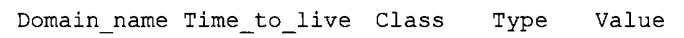

Type:

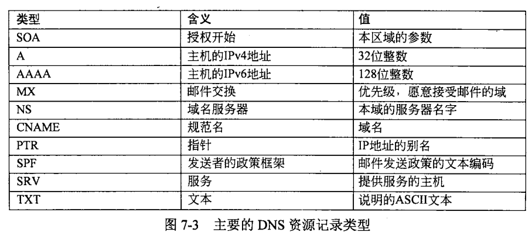

## Query Mechanism

- `域名解析是指把域名映射成为IP地址或把IP地址映射成域名的过程。前者称为正向解析，后者称为反向解析。`
- 当客户端需要域名解析时，通过本机的DNS客户端构造一个`DNS请求报文`，以`UDP数据报`方式发往`本地域名服务器`。
- 域名解析有两种方式:`递归查询`和`递归与迭代`相结合的查询。

### Recursive Query

<u>The mechanism that a host queries the local name server.</u> E.g. when the host flits.cs.vu.nl sends its query to the local name server, that name server handles the resolution on behalf of flits until it has the desired answer to return. It does not return partial answers. They might be helpful, but they are not what the query was seeking.

- **递归查询的过程如下图所示**， 由于该方法给根域名服务造成的负载过大，所以在实际中几乎不使用。
    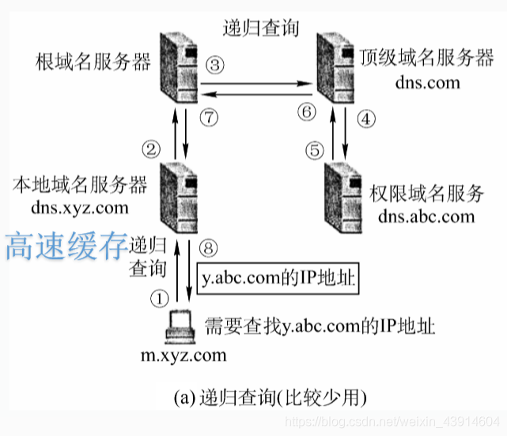

### Iterative Query

<u>The mechanism that the local name server queries the root name server and each subsequent name server.</u> e.g. root name server does not recursively continue the query for the local name server. It just returns a partial answer and moves on to the next query. The local name server is responsible for continuing the resolution by issuing further queries.

### Iterative + Recursive

**常用递归与迭代相结合的查询方式如下图所示，该方式分为两个部分。**

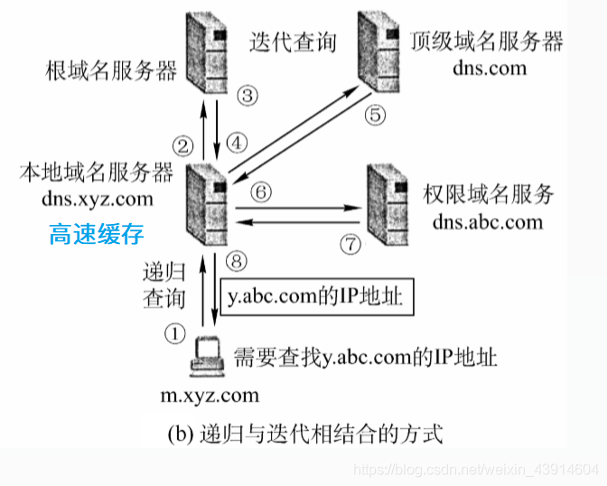
**(1)`主机`向`本地域名服务器`的查询采用的是`递归`查询**

- 也就是说，如果`本地主机`所询问的`本地域名服务器`不知道被查询域名的IP 地址，那么`本地域名服务器`就以`DNS客户`的身份，向`根域名服务器`继续发出`查询请求报文`(即替该主机继续查询)，而不是让该主机自己进行下一步的查询。
- 在这种情况下，`本地域名服务器`只需向`根域名服务器查询`一次，后面的几次查询都是递归地在其他几个域名服务器之间进行的[见图6.6(a)中的步骤③~⑥]。
- 在步骤⑦中，`本地域名服务器`从`根域名服务器`得到了所需的`IP地址`,最后在步骤⑧中，`本地域名服务器`把查询结果告诉`主机`m.xyz.com.

**(2)`本地域名服务器`向`根域名服务器`的查询采用`迭代`查询**

- 当`根域名服务器`收到`本地域名服务器`发出的`迭代查询请求报文`时，要么给出所要查询的IP地址，要么告诉`本地域名服务器`:“你下一步应当向哪个`顶级域名服务器`进行查询”。
- 然后让`本地域名服务器`向这个`顶级域名服务器`进行后续的查询，如图6.6(b)所示。
- 同样，`顶级域名服务器`收到查询报文后，要么给出所要查询的IP地址，要么告诉`本地域名服务器`下一步应向哪个·权限域名服务器·查询。
- ......
- 最后，知道所要`解析的域名的IP地址`后，把这个`结果返回`给发起查询的`主机`。

**`下面举例说明域名解析的过程:`**
**假定某客户机想获知域名为y.abc.com主机的IP地址，域名解析的过程(共使用8个UDP报文)如下:**

- ①`客户机`向其`本地域名服务器`发出`DNS请求报文`。
- ②`本地域名服务器`收到请求后，查询`本地缓存`，若没有该记录，则以DNS客户的身份向`根域名服务器`发出解析请求。
- ③`根域名服务器`收到请求后，判断该域名属于.com域，将对应的`顶级域名服务器`dns.com的IP地址返回给`本地域名服务器`。
- ④`本地域名服务器`向`顶级域名服务器dns.com`发出解析`请求报文`。
- ⑤`顶级域名服务器dns.com`收到请求后，`判断`该域名`属于abc.com域`，因此将对应的`授权域名服务器dns.abc.com`的IP地址返回给`本地域名服务器`。
- ⑥`本地域名服务器`向`授权域名服务器dns.abc.com`发起解析`请求报文`。
- ⑦`授权域名服务器dns.abc.com`收到请求后，将查询`结果`返回给`本地域名服务器`。
- ⑧`本地域名服务器`将查询结果保存到`本地缓存`，同时返回给`客户机`。


> - 为了提高DNS的查询效率，并减少因特网上的DNS查询报文数量，在域名服务器中广泛地使用了`高速缓存`。
> - 当一个DNS服务器接收到DNS查询结果时，它能将该DNS信息缓存在高速缓存中。这样，当另一个相同的域名查询到达该DNS服务器时，该服务器就能够直接提供所要求的IP地址，而不需要再去向其他DNS服务器询问。
> - 因为`主机名和IP地址之间的映射不是永久的，所以DNS服务器将在一段时间后丢弃高速缓存中的信息`。

# WWW

## Architectural Overview

### Basis

- `万维网(World Wide Web, WWW)是一个资料空间，在这个空间中:`
    `一样有用的事物称为一样“资源”,并由一个全域“统一资源定位符”(URL)标识。`
    `这些资源通过超文本传输协议(HTTP)传送给使用者，通过单击链接来获取资源。`
- 万维网使用链接的方法能让用户非常方便地从因特网上的一个站点访问另一个站点，从而主动地按需获取丰富的信息。
- 超文本标记语言(HyperText Markup Language，HTML)使得万维网页面的设计者可以很方便地用一个超链接从本页面的某处链接到因特网上的任何一个万维网页面，并能够在自己的计算机屏幕上显示这些页面。

### Components

**万维网的内核部分是由三个标准构成的:**

- 1)`统一资源定位符(URL)`。 负责标识万维网上的各种文档，并使每个文档在整个万维网的范围内具有唯一的标识符URL。
- 2)`超文本传输协议(HTTP)`。 一个应用层协议，它使用TCP连接进行可靠的传输，HTTP是万维网客户程序和服务器程序之间交互所必须严格遵守的协议。
- 3)`超文本标记语言(HTML)`。 一种文档结构的标记语言，它使用一些约定的标记对页面上的各种信息(包括文字、声音、图像、视频等)、格式进行描述。

### URL

**Universal Resource Locator**

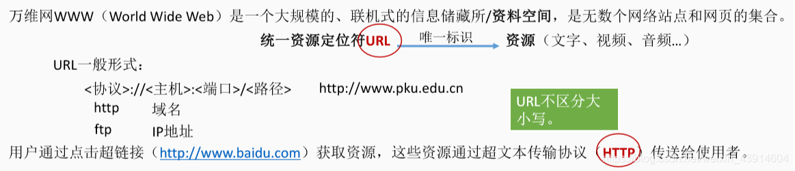

- URL是对可以从因特网上得到的资源的位置和访问方法的一种简洁表示。URL相当于一个文件名在网络范围的扩展。
- URL的一般形式是: `<协议>://<主机>:<端口>/<路径>`。
    常见的<协议>有http、ftp 等;
    < (主机>是存放资源的主机在因特网中的域名，也可以是IP地址;
    <端口>和<路径>有时可以省略。
- `在URL中不区分大小写。`

### Workflow

- 万维网以`客户/服务器`方式工作。
- `浏览器`是在用户计算机上的`万维网客户程序`，而`万维网文档所驻留的计算机`则`运行服务器程序`，这台计算机`称万维网服务器`。
- 客户程序向服务器程序发出请求，服务器程序向客户程序送回客户所要的文档。工作流程如下:
    ① Web 用户使用浏览器(指定URL)与Web服务器建立连接，并发送浏览请求。
    ② Web服务器把URL转换为文件路径，并返回信息给Web浏览器。
    ③ 通信完成，关闭连接。

### Browser

What does the browser do when one link is selected:

1. The browser determines the URL (by seeing what was selected).
2. The browser asks DNS for the IP address of www.zju.edu.cn
3. DNS replies with 210.32.0.9
4. The browser makes a TCP connection to port 80 on 210.32.0.9.
5. It then sends over a request asking for file /home/index.html
6. The www.zju.edu.cn server sends the file /home/index.html
7. The TCP connection is released.
8. The browser displays all the text in /home/index.html
9. The browser fetches and displays all images in this file.


* Browsers can handle many additional types besides HTML pages.
* Browser can use MIME types.
* How to handle other <u>MIME(Multipurpose Internet Mail Extensions)</u> types:
    * Plug-ins: A plug-in is a <u>code module</u> that the browser fetches from a special directory on the disk and installs as an extension to itself.
    * Helper applications: A help application is a complete program, <u>running as a separate process</u>.

### Server

The browser sends over a command containing the file name on that server. Then the server returns the file for the
browser to display.

The short steps that the server performs in its main loop:

1. Accept a TCP connection from a client (a browser).
2. Get the name of the file requested.
3. Get the file (from disk).
4. Return the file to the client.
5. Release the TCP connection.


The detailed steps that the server performs in its main loop are:

1. Resolve the name of the Web page requested.
2. Perform <u>access control</u> on the Web page.
3. Check the cache.
4. Fetch the requested page from disk or run a program to build it.
5. Determine the rest of the response (e.g., the MIME type to send).
6. Return the response to the client.
7. Make an entry in the server log.

### Cookies

* The Web is basically <u>stateless</u>.
    * How to distinguish between requests from registered users and everyone else?
    * How to keep track of the contents of the cart (for e-commerce)?
    * How to customize Web portals such as Yahoo?
* To track users by observing their IP addresses? No
    * The IP address merely identifies the computers, not the user.
    * Many ISP use NAT (Network Address Translation).
* To track users by cookies.


A cookie may contain up to 5 fields

* Domain : where the cookie came from
* Path : which parts of the server’s file tree may use it
* Content : `name=value` lists
* Expires : when the cookie
* Secure : can be set to indicate that the browser may only return the cookie to a server using a secure transport.

## Static Web Pages

### HTML

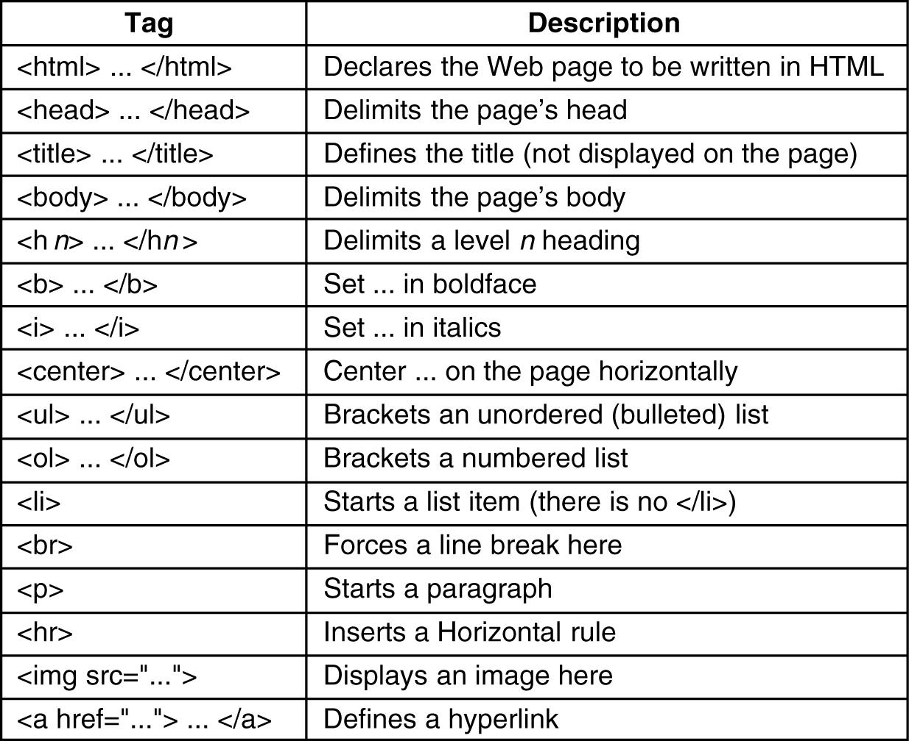

#### Form

建议渲染看看效果

```html
<html>

<head>
    <title> AWi CUSTOMER ORDERING FORM </title>
</head>

<body>
    <h1> Widget Order Form </h1>
    <form ACTION=" http://widget.com/cgi-bin/widgetorder " method=POST>
        <p> Name <input name="customer" size=46> </p>
        <p> Street Address <input name="address" size=40> </p>
        <p>
            City <input name="city" size=20>
            State <input name="state" size=4>
            Country <input name="country" size=10>
        </p>
        <p>
            Credit card # <input name="cardno" size=10>
            Expires <input name="expires" size=4>
            M/C <input name="cc" type=radio value="mastercard">
            VISA <input name="cc" type=radio value="visacard">
        </p>
        <p>
            Widget size:
            Big <input name=" product" type=radio value="expensive">
            Little <input name="product" type=radio value="cheap">
            Ship by express courier <input name="express" type=checkbox>
        </p>
        <p> <input type=submit value="Submit order"> </p>
        Thank you for ordering an AWi widget, the best widget money can buy!
    </form>
</body>

</html>
```

#### CSS

```html
<font face="helvetica " size="24" color="red"> Deborah’s Photos </font>
```


```css
body {background-color:lightcyan; color:navy; font-family:Arial;}
h1 {font-size:200%;}
h2 {font-size:150%;}
```

```html
<head>
    <title> AMALGAMATED WIDGET, INC. </title><!-- 这个title是tag的标题，并不是文本内的 -->
    <h1> Hello </h1>
    <h2> OK </h2>
    <link rel="stylesheet" type="text/css" href="./a.css" />
</head>
```

## Dynamic Web Pages

* Two methods
    * **CGI** (Common Gateway Interface): provides an interface to allow Web servers to talk to back-end programs and scripts (e.g. Python, Ruby, Perl ) that can <u>accept input</u> (e.g. from forms) and <u>generate HTML pages in response</u>.
    * **Server pages**: to embed little scripts inside HTML pages and have them be executed by the server itself to generate the page.
        * PHP : Hypertext Preprocessor
        * JSP : Java Server Pages
            * the dynamic part is written in the Java programming language.
        * ASP.NET : Active Server Page .NET
            * Microsoft’s version of PHP and JavaServer Pages. It uses programs written in Microsoft’s proprietary .NET networked application framework for generating the dynamic content. Pages using this technique have the extension . aspx.

### PHP

Sample code

```html
<html>

<body>
    <h1>Reply:</h1>
    Hello
    <?php
        echo $name;
     ?>
    Predication: next year you will be
    <?php
        echo $age+1;
    ?>
</body>

</html>
```

Generated HTML

```html
<html>

<body>
    <h1>Reply:</h1>
    Hello cxy
    Predication: next year you will be 21
</body>

</html>
```

### JS

```html
<html>

<head>
    <script language="javascript" type="text/javascript">
        function response(test_form) {
            var person = test_form.name.value;
            var years = eval(test_form.age.value) + 1;
            document.open();
            document.write("<html><body>");
            document.write("Hello " + person + ".<br />");
            document.write("Prediction: next year you will be " + years + ".");
            document.write("</body></html>");
            document.close();
        }
    </script>
</head>

<body>
    <form>
        <p> Please enter your name: <input type="text" name="name"> </p>
        <p> Please enter your age: <input type="text" name="age"> </p>
        <p> <input type="button" value="submit" onclick="response(this.form)"> </p>
    </form>
</body>

</html>
```

### XML/XSLT

## HTTP

* HTTP is an application layer protocol because it <u>runs on top of TCP</u> and is closely associated with the Web.
* Now HTTP is becoming more like a transport protocol that provides a way for processes to communicate content across the boundaries of different networks. <u>These processes do not have to be a Web browser and Web server.</u>
    * A media player could use HTTP to talk to a server and request album information.
    * Antivirus software could use HTTP to download the latest updates.

> - HTTP定义了浏览器(万维网客户进程)怎样向万维网服务器请求万维网文档，以及服务器怎样把文档传送给浏览器。
> - 从层次的角度看，HTTP是面向事务的(Transaction-oriented) 应用层
>     协议，它规定了在浏览器和服务器之间的请求和响应的格式与规则，是万维网上能够可靠地交换文件(包括文本、声音、图像等各种多媒体文件)的重要基础。

### HTTP Operation

> - 在浏览器和服务器之间的请求与响应的交互，必须遵循规定的格式和规则，这些格式和规则就是HTTP。
> - 因此HTTP有两类报文:
>     `请求报文`(从Web客户端向Web服务器发送服务请求)
>     `响应报文`(从Web服务器对Web客户端请求的回答)

- 从协议执行过程来说，浏览器要访问WWW服务器时，首先要完成对www服务器的`域名解析`。
- 一旦获得了服务器的IP地址，`浏览器`就通过TCP向服务器`发送连接建立请求`。万维网的大致工作过程如图所示
    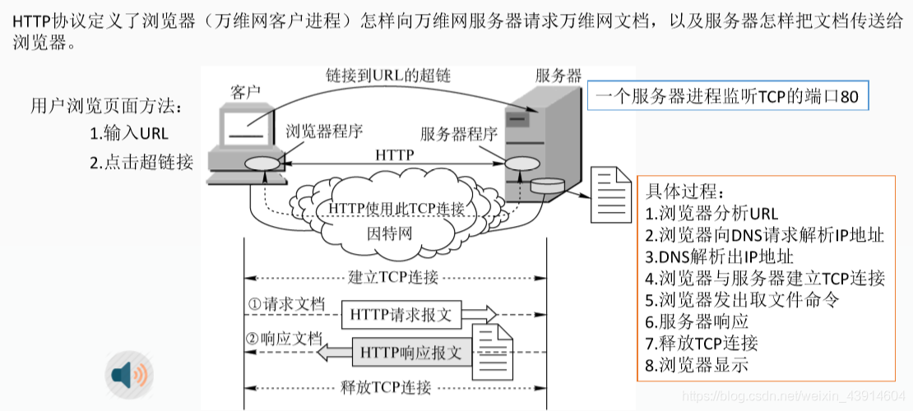
- 每个万维网站点都有一个服务器进程，它不断地监听TCP的端口`80`(默认)，当监听到连接请求后便与浏览器`建立连接`。
- TCP连接建立后, 浏览器就向服务器发送请求`获取某个Web页面的HTTP请求`。
- 服务器收到HTTP请求后，将`构建所请求Web页的必需信息`，并通过HTTP响应返回给浏览器。
- 浏览器再将信息进行`解释`, .然后将Web页`显示`给用户。
- 最后，TCP连接`释放`。

------

**用户单击鼠标后所发生的事件按顺序如下(以访问清华大学的网站为例):**

1)浏览器分析链接指向页面的URL (http://www.tsinghua edu.cn /chn/index.htm)。
2)浏览器向DNS请求解析www.tsinghua.edu.cn的IP地址。
3)域名系统DNS解析出清华大学服务器的IP地址。
4)浏览器与该服务器建立TCP连接(默认端口号为80)。
5)浏览器发出HTTP请求: GET /chn/index.htm.
6)服务器通过HTTP响应把文件index.htm 发送给浏览器。
7) TCP连接释放。
8)浏览器解释文件index.htm,并将Web页显示给用户。

### HTTP Features

> **Def**
>
> * **RTT** : round trip time; is the time it takes for a small packet to travel <u>from client to server and then back to the client</u>.
> * The RTT includes
>     * packet propagation delays,
>     * packet queuing delays in intermediate routers and switches
>     * packet processing delays.
> * also known as the *ping time*

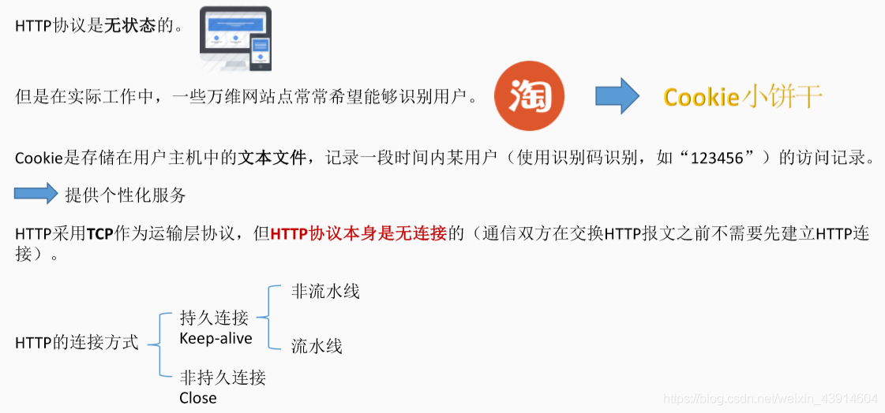

> `HTTP是无状态的。`也就是说，同一个客户第二次访问同一个服务器上的页面时，服务器的响应与第一次被访问时的相同。
> 因为服务器并不记得曾经访问过的这个客户，也不记得为该客户曾经服务过多少次。
> HTTP的无状态特性简化了服务器的设计，使服务器更容易支持大量并发的HTTP请求。

> 在实际应用中，通常使用`Cookie 加数据库的方式来跟踪用户的活动`(如记录用户最近浏览的商品等)。
> Cookie 是一个存储在用户主机中的文本文件，里面含有一-串“识别码”，如“123456”，用于Web服务识别用户。
> Web服务器根据Cookie就能从数据库中查询到该用户的活动记录，进而执行一些个性化的工作，如根据用户之前浏览过的商品向其推荐新产品等。

> `HTTP采用TCP作为运输层协议，保证了数据的可靠传输`。
> HTTP不必考虑数据在传输过程中被丢弃后又怎样被重传。
> 但是，`HTTP本身是无连接的`。也就是说，虽然HTTP使用了TCP连接，但`通信的双方在交换HTTP报文之前不需要先建立HTTP连接`。

> ```
> HTTP既可以使用非持久连接，也可以使用持久连接(HTTP/1.1支持)。
> ```
>
> - 对于`非持久连接`，`每个网页元素对象(如JPEG图形、Flash 等)的传输都需要单独建立一个TCP连接`，如图6.12所示(第三次握手的报文段中捎带了客户对万维网文档的请求)。
>     也就是说，`请求一个万维网文档所需的时间是该文档的传输时间`(与文档大小成正比)`加上两倍往返时间RTT`(一个RTT用于TCP连接，另一个RTT用于请求和接收文档)。

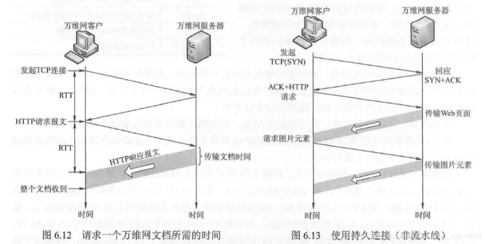

> - `持久连接`，是指万维网服务器在发送响应后仍然保持这条连接，使同一个客户和服务器可以继续在这条连接上传送后续的HTTP请求与响应报文，如图6.13所示。
> - `持久连接`又分为`非流水线`和`流水线`两种方式。
>     对于`非流水线`方式，客户在收到前一个响应后才能发出下一个请求;
>     HTTP/1.1 的默认方式是使用`流水线`的持久连接。这种情况下，客户每遇到一个对象引用就立即发出一个请求，因而客户可以逐个地连续发出对各个引用对象的请求。如果所有的请求和响应都是连续发送的，那么所有引用的对象共计经历1个RTT延迟，而不是像非流水线方式那样，每个引用都必须有1个RTT延迟。

### HTTP Datagram

- HTTP是面向文本的(Text-Oriented)， 因此报文中的每个字段都是一一些ASCII码串，并且每个字段的长度都是不确定的。有两类HTTP报文:
    ●请求报文: 从客户向服务器发送的请求报文
    ●响应报文: 从服务器到客户的回答 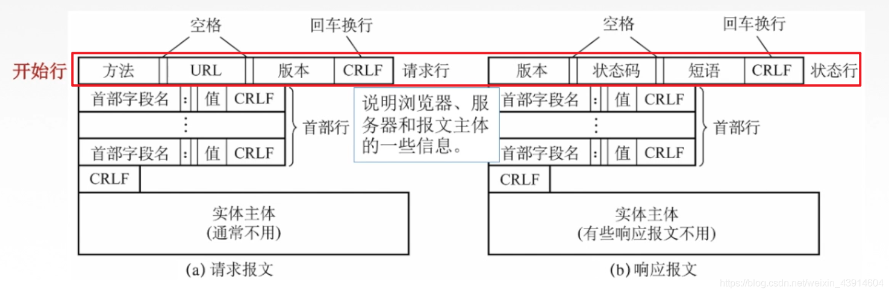
- HTTP请求报文和响应报文都由三个部分组成。
    这两种报文格式的区别是开始行不同。
- `开始行:用于区分是请求报文还是响应报文。`
    在`请求报文`中的开始行称为`请求行`；
    `响应报文中`的开始行称为`状态行`；
    开始行的三个字段之间都以空格分隔，最后的`“CR"和“LF”`分别代表`“回车”和“换行”`。

#### Req Dtg

**请求报文的“请求行”有三个内容:方法、请求资源的URL及HTTP的版本**

- 其中，`“方法”是对所请求对象进行的操作`，这些方法实际上也就是一些命令。HTTP请求报文中常用的几个方法:
    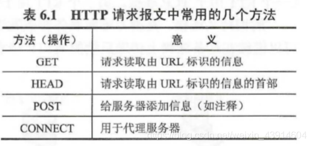
    
    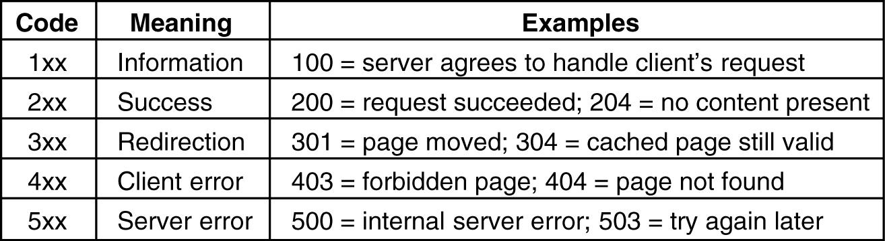
    
    - The **GET** method requests the server to send the page.
    - The **HEAD** method just asks for the message header, without the actual page. This method can be used to collect information for indexing purposes, or just to test a URL for validity.
    - The **POST** method is used when forms are submitted. Both it and GET are also used for SOAP Web services.
        - It uploads data to the server (i.e., the contents of the form or RPC
            parameters).
        - The server then does something with the data that depends on the URL, conceptually appending the data to the object.
        - Finally, the method returns a page indicating the result.
    - The **PUT** method is the reverse of GET: instead of reading the page, it writes the page. This method makes it possible to build a collection of Web pages on a remote server.
    - **DELETE** removes the page, or at least it indicates that the Web server has agreed to remove the page. As with PUT, authentication and permission play a major role here.
    - The **TRACE** method is for debugging. It instructs the server to send back the request.
    - The **CONNECT** method lets a user make a connection to a Web server through an intermediate device, such as a Web cache.
    - The **OPTIONS** method provides a way for the client to query the server for a page and obtain the methods and headers that can be used with that page.
    
- `首部行`:用来说明浏览器、服务器或报文主体的一些信息。
    首部可有几行，但可不使用。
    在每个首部行都有首部字段名和它的值，每行在结束的地方都要有“回车”和"换行”。
    整个首部结束时，还有一空行将首部行和后面的实体主体分开。
    
- `实体主体`:在请求报文中一般不用这个字段，而在响应报文中也可能没有这个字段。

#### Msg Header


### Caching

* HTTP has built in caching support.
* How to determine that a previously cached copy of a page is the same as the page would be if it was fetched again?
* The first strategy is page validation (step 2). The cache is consulted, and if it has a copy of a page for the requested URL that is known to be fresh (i.e., still valid), there is no need to fetch it anew from the server.
* The second strategy is to ask the server if the cached copy is still valid. This request is a conditional GET (step 3).
* Both of these caching strategies are overridden by the directives carried in the Cache Control header (e.g. no cache).
* Other caching issues: proxy caching, caching effect, ……

### WireShark捕获HTTP报文实例

- 请求报文
    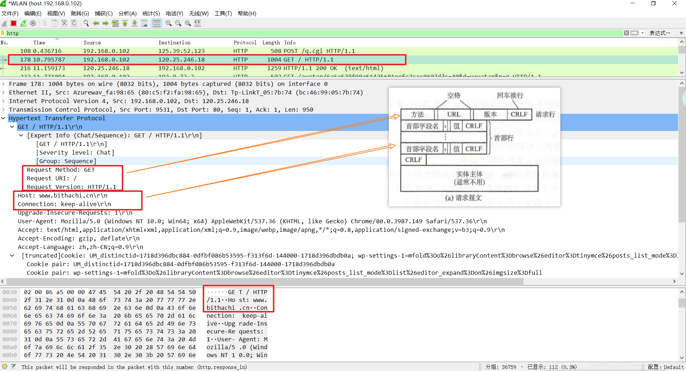
    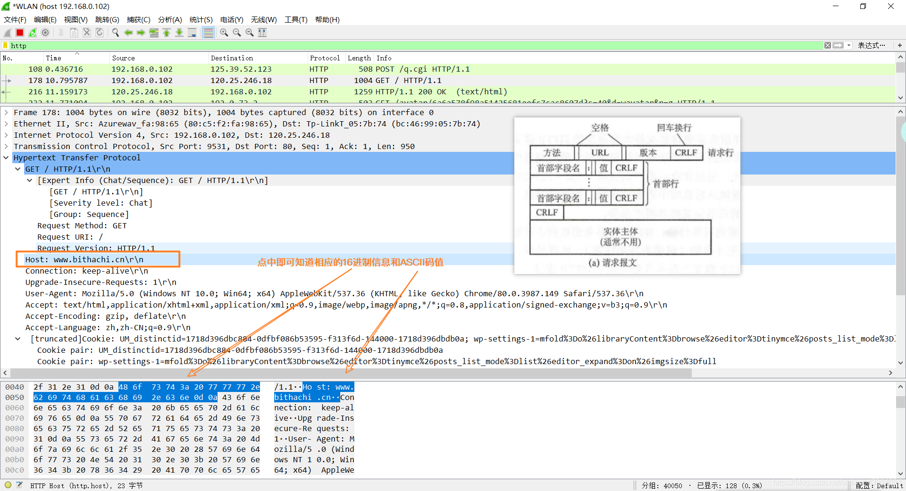
- 响应报文
    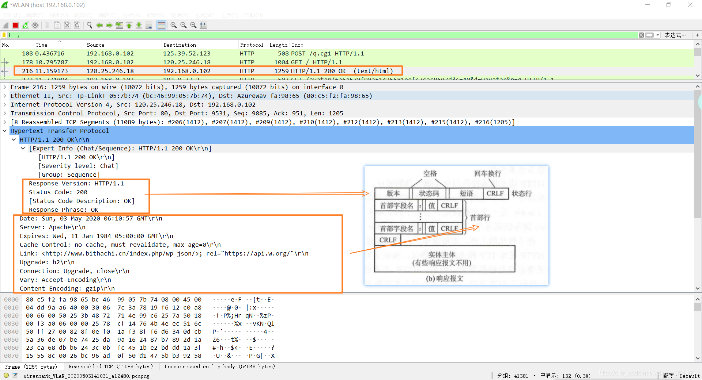

## The Mobile Web

## Web Search

## 3.常用应用程序的协议及端口号

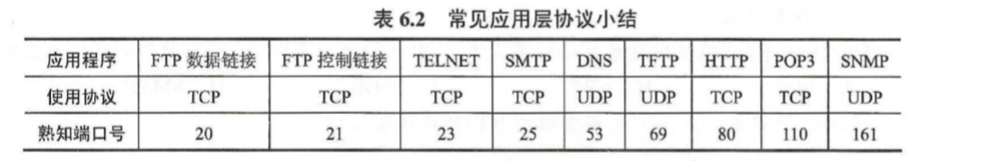

# EMAIL

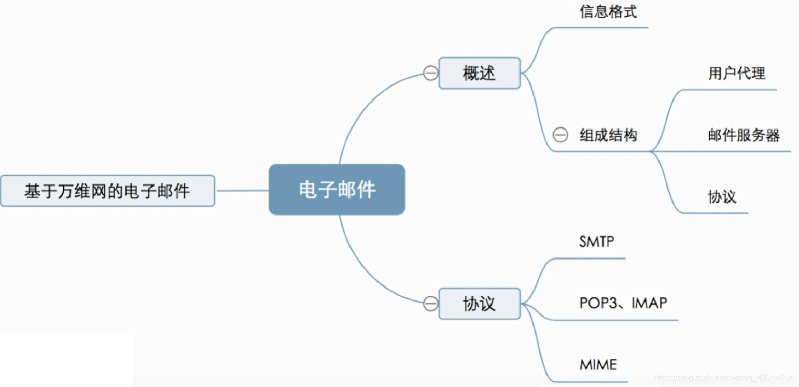

## Message Formats

- 一个电子邮件分为`信封和内容`两大部分，邮件`内容`又`分为首部和主体`两部分。
- RFC 5322 header fields related to message transport. Some fields used in the RFC 5322 message header:
    - 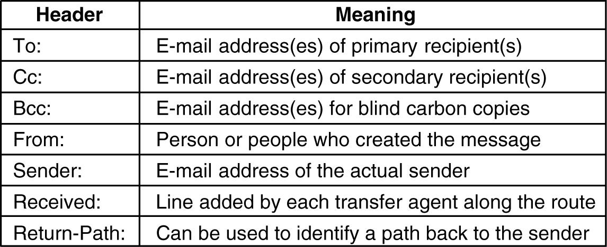
    - 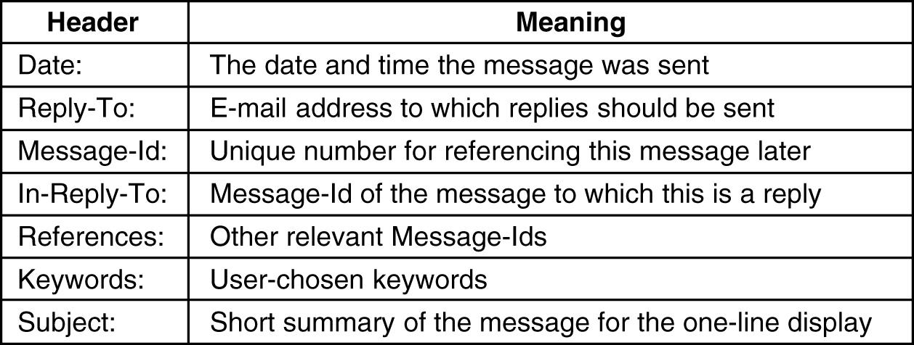

## Architecture

- 电子邮件是一种异步通信方式，通信时不需要双方同时在场。
- 电子邮件把邮件发送到收件人使用的邮件服务器，并放在其中的收件人邮箱中，收件人可以随时上网到自己使用的邮件服务器进行读取。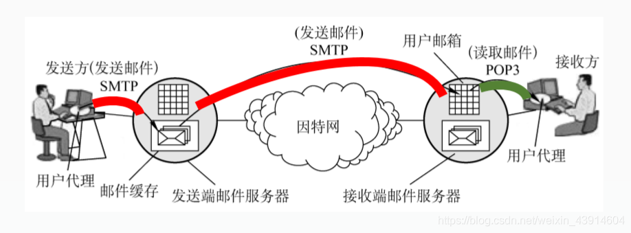

------

- 一个 电子邮件系统应具有三个最主要的组成构件：
    用户代理(User Agent)
    邮件服务器
    电子邮件使用的协议，如SMTP、POP3 (或IMAP)等。
    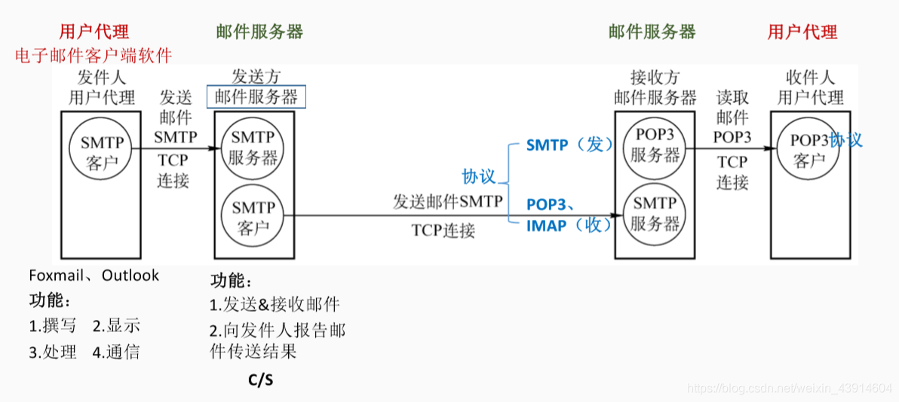

`用户代理(UA):`用户与电子邮件系统的接口。

- 用户代理使用户能够通过一个很友好的接口发送和接收邮件，用户代理至少应当具有撰写、显示和邮件处理的功能。
- 通常情况下，用户代理就是一个运行在PC.上的程序，常见的有Outlook、Foxmail 和Thunderbird等。

`邮件服务器:`组成电子邮件系统的核心。

- 邮件服务器的功能是发送和接收邮件，同时还要向发信人报告邮件传送的情况(已交付、被拒绝、丢失等)。
- 邮件服务器采用客户/服务器方式工作，但它能够同时充当客户和服务器。
- 例如，当邮件服务器A向邮件服务器B发送邮件时，A就作为SMTP客户，而B是SMTP服务器;反之，当B向A发送邮件时，B就是SMTP客户，而A就是SMTP服务器。

`邮件发送协议和读取协议:`

- `邮件发送协议`用于用户代理向邮件服务器发送邮件或在邮件服务器之间发送邮件，通常使用的是`SMTP`;
- `邮件读取协议`用于用户代理从邮件服务器读取邮件，如`POP3`。
- SMTP采用的是“推”(Push)的通信方式，即在用户代理向邮件服务器发送邮件及在邮件服务器之间发送邮件时，SMTP客户端主动将邮件“推”送到SMTP服务器端。
- POP3采用的是“拉”(Pull)的通信方式，即用户读取邮件时，用户代理向邮件服务器发出请求，“拉”取用户邮箱中的邮件。

## Email Protocol

* 发：SMTP
* 收：POP3、IMAP

### SMTP (25)

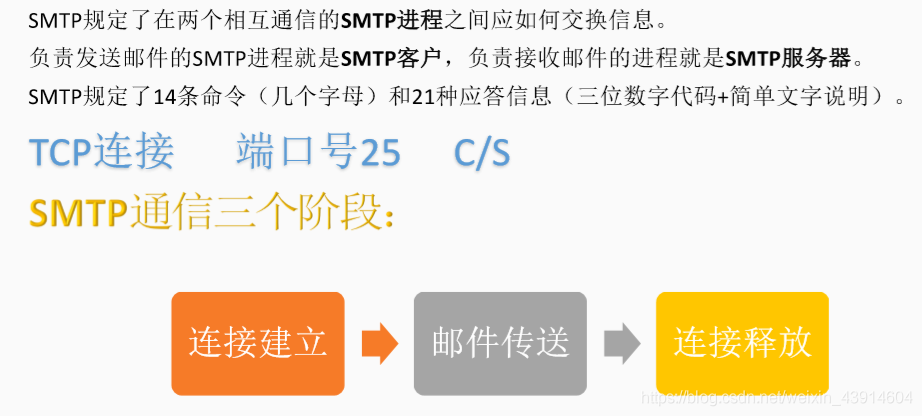

`(1)连接建立`
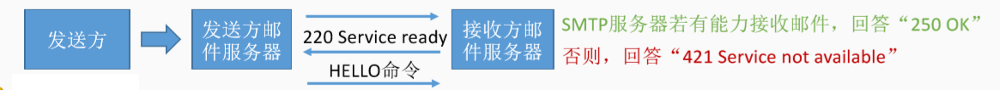

- 发件人的邮件发送到发送方邮件服务器的邮件缓存中后，SMTP客户就每隔一定 时间对邮件缓存扫描一次。
    如发现有邮件，就使用SMTP的熟知端口号(25) 与接收方邮件服务器的SMTP服务器建立TCP连接。
- 连接建立后，接收方SMTP服务器发出220 Service ready (服务就绪)。然后SMTP客户向SMTP服务器发送HELO命令，附上发送方的主机名。
- SMTP不使用中间邮件服务器。
    TCP连接总是在发送方和接收方这两个邮件服务器之间直接建立，而不管它们相隔多远。
    接收方的邮件服务器因故障暂时不能建立连接时，发送方的邮件服务器只能等待一段时间后再次尝试连接。

`(2)邮件传送`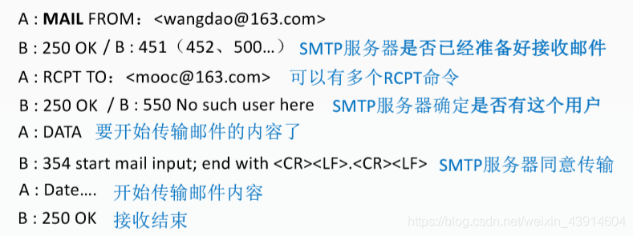

- 连接建立后，就可开始传送邮件。邮件的传送从MAIL命令开始，MAIL 命令后面有发件人的地址。如MAIL FROM: hoopdog@hust.edu.cn。
- 若SMTP服务器已准备好接收邮件，则回答250 OK。
- 接着SMTP客户端发送一个或多个RCPT (收件人recipient的缩写)命令，格式为RCPTTO: <收件人地址>。
    每发送一个 RCPT命令，都应有相应的信息从SMTP服务器返回，如250 OK或550 No such user here (无此用户)。
    RCPT命令的作用是，先弄清接收方系统是否已做好接收邮件的准备，然后才发送邮件，以便不至于发送了很长的邮件后才知道地址错误，进而避免浪费通信资源。
- 获得OK的回答后，客户端就使用DATA命令，表示要开始传输邮件的内容。
    正常情况下，SMTP服务器回复信息是"354 Start mail input; end with CRLF.CRLF"。此时SMTP客户端就可开始传送邮件内容，并用"CRLF.CRLF"(两个回车，中间一个点)表示邮件内容的结束。

`(3)连接释放`

- 邮件发送完毕后，SMTP客户应发送QUIT命令。
- SMTP服务器返回的信息是221 (服务关闭)，表示SMTP同意释放TCP连接。邮件传送的全部过程就此结束。

#### MIME

- 由于SMTP只能传送一定长度的ASCII码，许多其他非英语国家的文字(如中文、俄文，甚至带重音符号的法文或德文)就无法传送，且无法传送可执行文件及其他二进制对象，因此提出了多用途网络邮件扩充( Multipurpose Internet MailExtensions，MIME)。
- MIME并未改动SMTP或取代它。MIME的意图是继续使用目前的格式，但增加了邮件主体的结构，并定义了传送非ASCII码的编码规则。也就是说，MIME邮件可在现有的电子邮件程序和协议下传送。MIME与SMTP的关系如图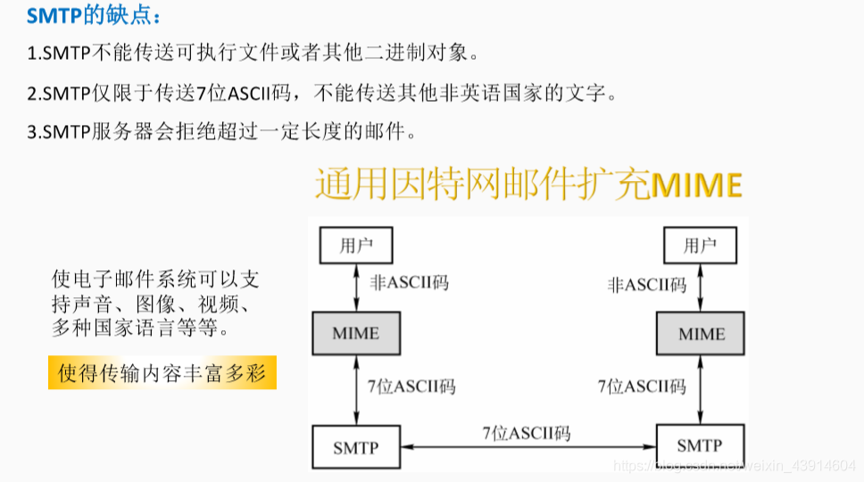

**MIME主要包括以下三部分内容:**

- ①5个新的邮件首部字段，包括MIME版本、内容 描述、内容标识、内容传送编码和内容类型。
    - 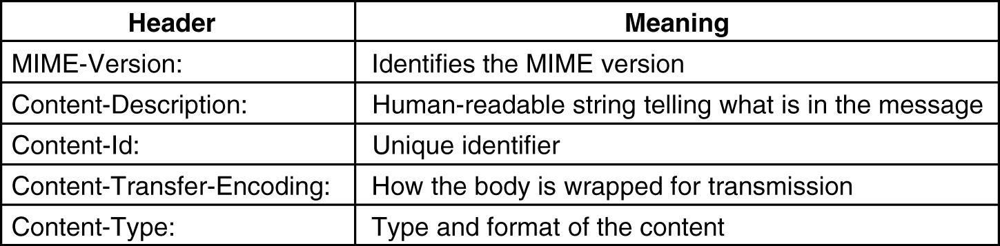
- ②定义了许多邮件内容的格式，对多媒体电子邮件的表示方法进行了标准化。
- ③定义了传送编码，可对任何内容格式进行转换，而不会被邮件系统改变。

### POP3 (110)

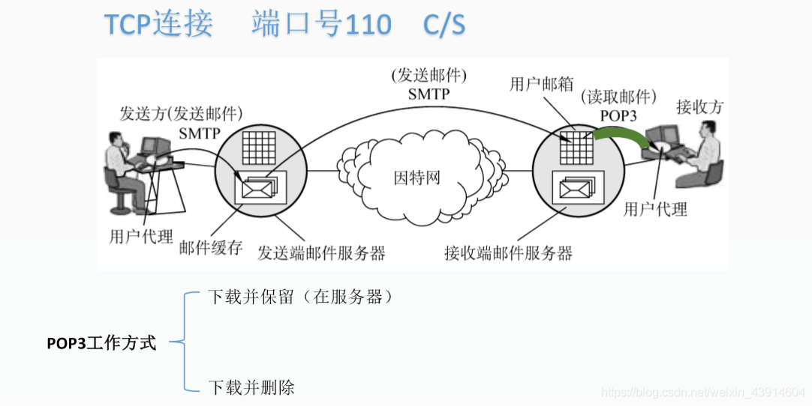

- 邮局协议( Post Office Protocol, POP) 是一个非常简单但功能有限的<u>**邮件读取协议**</u>，现在使用的是它的第3个版本POP3。
- POP3 采用的是“拉”(Pull)的通信方式，当用户读取邮件时，用户代理向邮件服务器发出请求，“拉”取用户邮箱中的邮件。
- POP也使用客户/服务器的工作方式，在传输层使用TCP,端口号为110。接收方的用户代理上必须运行POP客户程序，而接收方的邮件服务器上则运行POP服务器程序。
- POP有两种工作方式:`“下载并保留”和“下载并删除”。`
    - 在`“下载并保留”`方式下，用户从邮件服务器上读取邮件后，邮件依然会保存在邮件服务器上，用户可再次从服务器上读取该邮件;
    - 使用`“下载并删除”`方式时，邮件一旦被读取，就被从邮件服务器上删除，用户不能再次从服务器上读取。

------

### IMAP

因特网报文存取协议

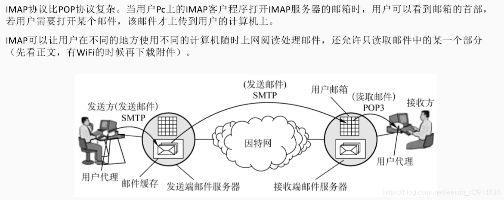

- 另一个**<u>邮件接收协议</u>**是`因特网报文存取协议(IMAP)`,它比POP复杂得多，IMAP为用户提供了创建文件夹、在不同文件夹之间移动邮件及在远程文件夹中查询邮件的命令，为此==IMAP服务器维护了会话用户的状态信息==。
- IMAP的另一特性是`允许用户代理只获取报文的某些部分`，例如可以只读取一个报文的首部,或一个多部分MIME报文的一部分。这非常适用于低带宽的情况，用户可能并不想取回邮箱中的所有邮件，尤其是包含很多音频或视频的大邮件。

------

### 万维网的电子邮件

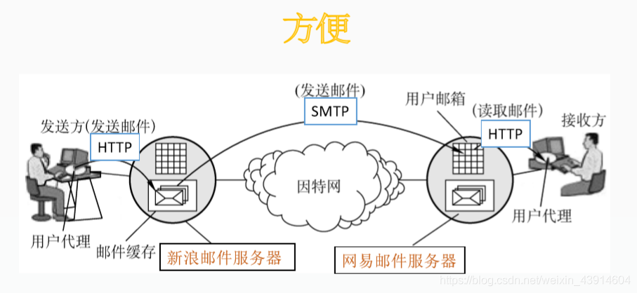

- 随着万维网的流行，目前出现了很多基于万维网的电子邮件，如Hotmail、Gmail 等。
- 这种电子邮件的特点是，用户浏览器与Hotmail或Gmail的邮件服务器之间的邮件发送或接收使用的是HTTP，而`仅在不同邮件服务器之间传送邮件时才使用SMTP.`