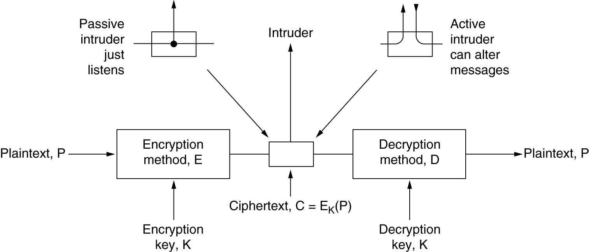

[TOC]

# Introduction

Network security problems can be divided roughly into four interwined areas: secrecy, authentication, nonrepudiation, and integrity control.

* Secrecy 机密性）: to keep information out of the hands of unauthorized users.
* Authentication 认证）: to determine whom you are talking to before revealing sensitive information or entering into a business deal. (to authenticate people by recognizing their faces, voices, and handwriting).
* Nonrepudiation 不可否认性）: to deal with signature. (personal signature).
* Integrity 完整性）: How can you be sure that a message you received was really the one sent and not something that a malicious adversary modified in transit or concocted.

Every layer has something to contribute:

* Physical layer : Wiretapping can be foiled by enclosing transmission lines in sealed tubes containing argon gas at high pressure. (not always work)
* Data link layer : Packets on a point to point line can be encoded as they leave one machine and decoded as they enter another. (not routed)
* Network layer : Firewalls can be installed to keep packets in or keep packets out.
* Transport layer : Entire connections can be encrypted, end to end, that is, process to process.
* Application layer : Issues such as authentication and nonrepudiation can only be solved at the application layer.

# Cryptography

## Intro to Cryptography

**Encryption model**

E和D都是以P、K为参数的数学函数，且D~K~(E~K~(P)) == D~K~(C) == P

**Kerchoff’s principle**: <u>all *algorithms* must *be public* while the *key is secret*.</u>

## Substitution Cipher

置换密码

* **Monoalphabetic substitution**
    * 原始：凯撒密码，将字母表位移k位，k即为密钥
    * 进阶：将原文字母和密文字母一一对应
    * 破解
        * 可以通过词频的不同以及多字母组合（th、in、er、an、the、ing、and、ion）加以破解
        * 还可以通过猜测可能词，例如会计事务所的消息，猜测有financial这个词存在，而其中会有一对中间隔了四个其他字母的i

## Transposition Cipher

换位密码

对字母重排序，但<u>并不伪装明文</u>

常用方式：列换位

* 按行放置，以密钥的顺序对列进行重排，然后按排好的顺序按列输出

破解方式

1. 确定是否是替代密码：看e、t、a、o、i、n等的词频是否还是最高的
2. 猜有几列
3. 确定列顺序

## One-Time Pads

* Constructing an unbreakable cipher is easy; the technique has been known for decades.
    * Choose a random bit string as the key.
    * Convert the plaintext into a bit string.
    * Compute the XOR of these two strings, bit by bit.
* The resulting ciphertext cannot be broken, because every possible plaintext is an equally probable candidate. The ciphertext gives the cryptanalyst no information at all.

缺点

* 密钥很大坨
* 每发一次得换一次密钥，因此可发消息总数有限
* 一旦发送过程中失去同步，则全部报废

## Cryptography: Two principles

* **Redundancy** : All encrypted messages must contain some redundancy, that is, information not needed to understand the message. All messages must contain considerable redundancy so that active intruders cannot send random junk and have it be interpreted as a valid message.
* **Freshness** : Some measures must be taken to prevent active intruders from playing back old messages (replay attack).

# Symmetric key algorithms

明文密文长度一样

## DES

The Data Encryption Standard

## AES

The Advanced Encryption Standard

# Public key algorithms

## RSA

# Digital signatures

## SHA

Secure Hash Algorithm

# Management of public keys

# Authentication protocols

# Email security

# Communication security