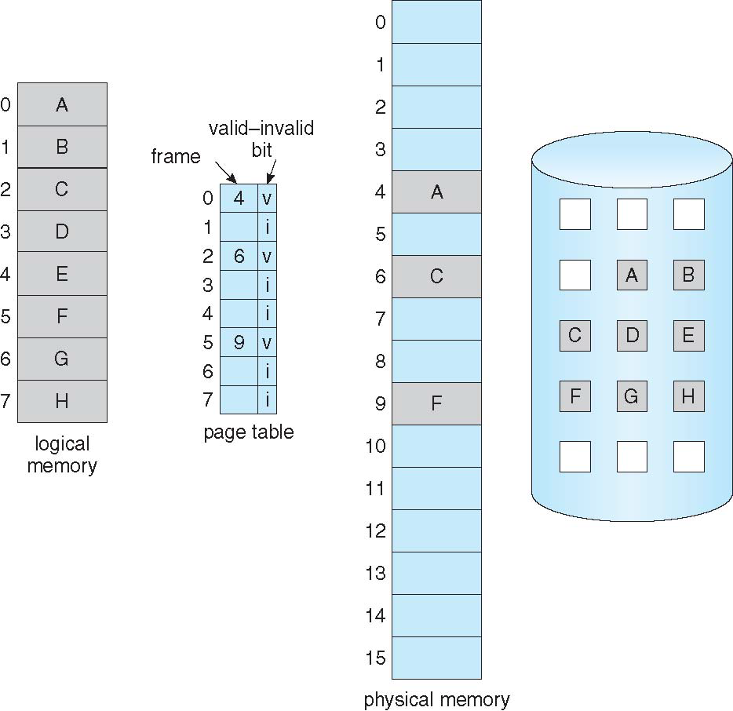
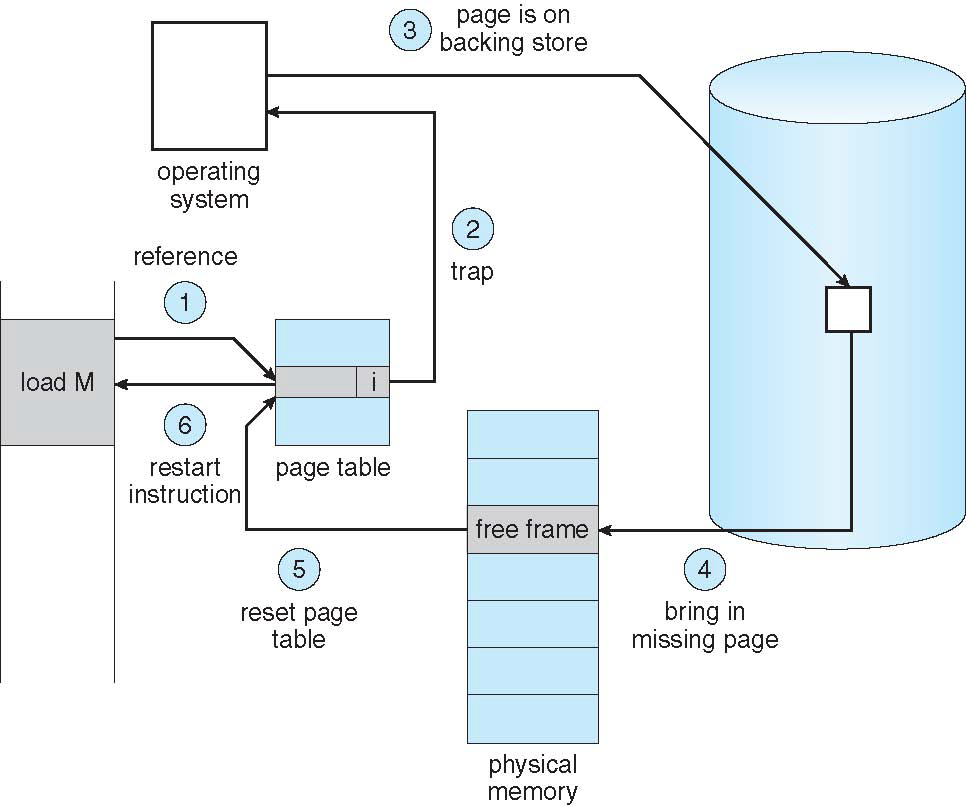
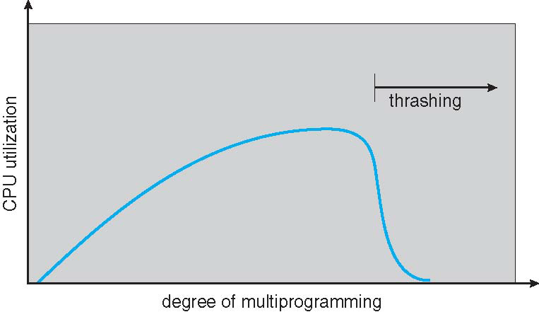
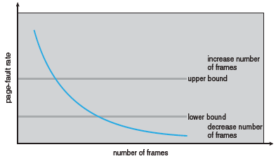
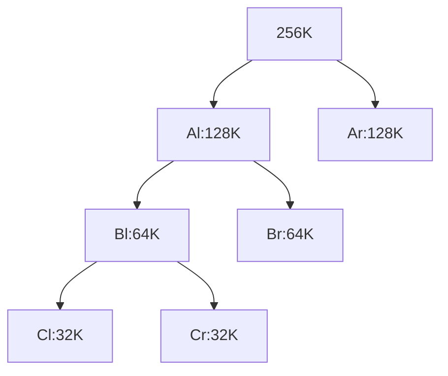
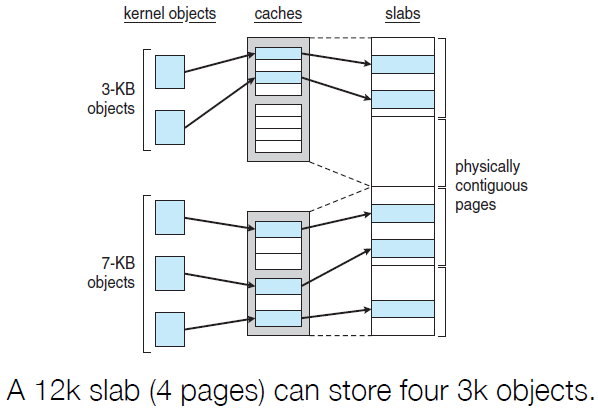
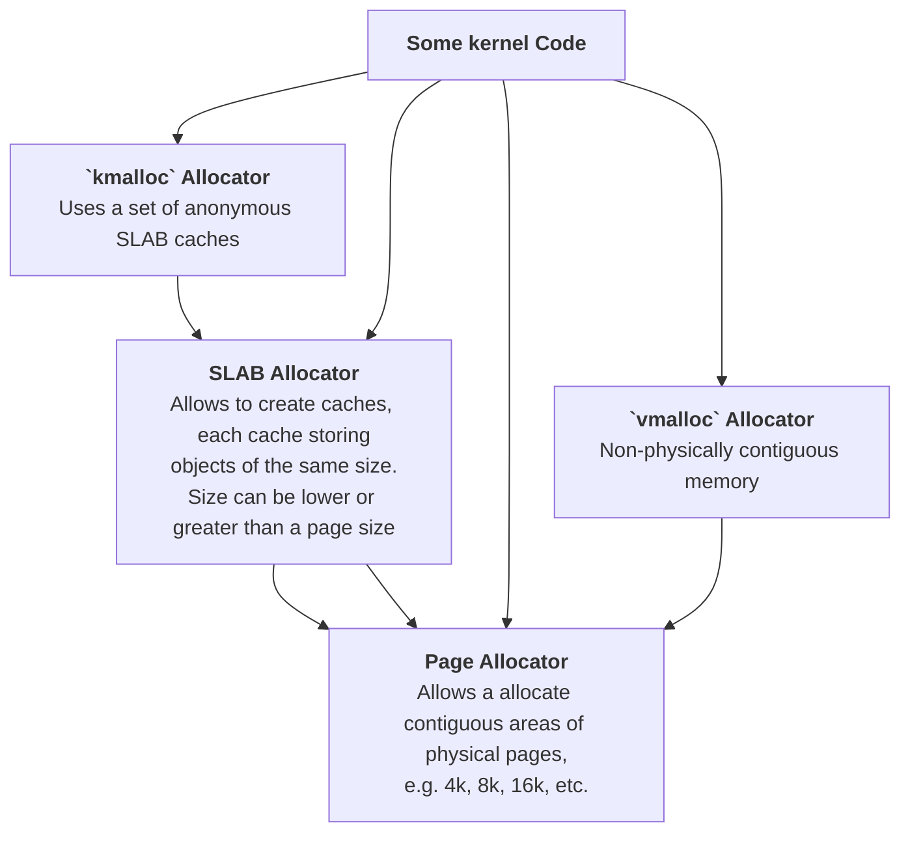
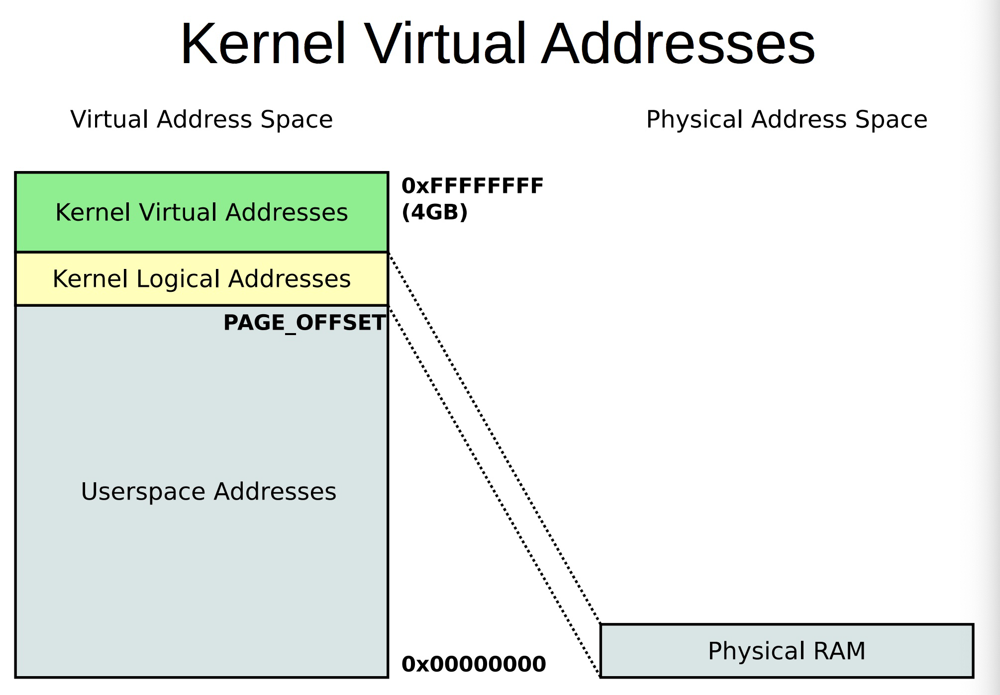
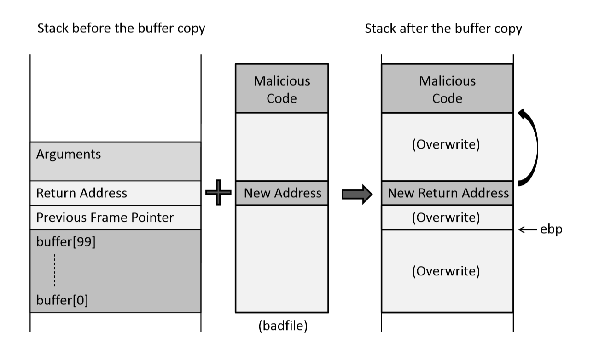
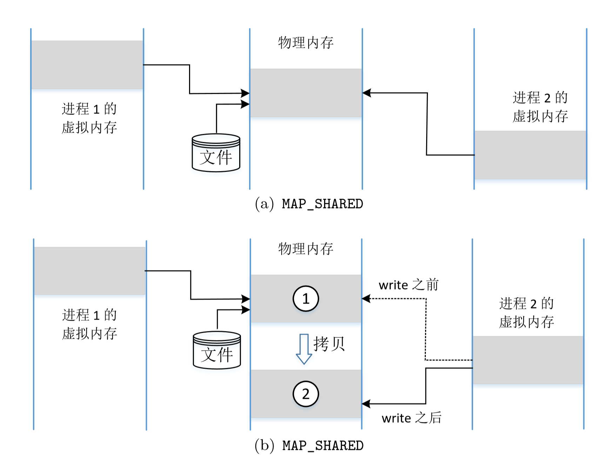

[TOC]

# Basis

Dynamic Loading (Partially-loaded program)

* Save phy space
* speed up startup (only load necessary code)


Shared Lib: See [chap9](./9_MainMem.md).Paging.Page\\sSharing


如何判断地址是否合法：

* kernel分配给进程logical上的空间并maintain
* 对应的physical空间的申请时会先检查logical空间是否合法
    * 检查是由kernel在logical级别进行的

# ==Demand Paging==

==不是lab6中的==

## Basis

* Demand paging brings a page into memory only when it is accessed (对于需要swap in的外存上的文件来说)
    * Situations
        1. if page is invalid ➠ abort the operation
        2. if page is valid but not in memory ➠ bring it to memory via swapping
    * no unnecessary I/O, less memory needed, faster response, more apps
* Lazy swapper: <u>never swaps a page in memory unless it will be needed</u>
    * the swapper that deals with pages is also caller a pager
    * 好处：省内存
    * 坏处：可能增大缺页导致的开销（例如code段，第一次读了一个page，然后发现刚执行没几条指令就跳转到第二个页。而如果不使用lazy swapper，则可以一次swap in多个页(之后可能用上)，这样可以节省IO操作的附带开销（但是传输本身的开销是不变或更大的）
* Pre-Paging: pre-page all or some of pages a process will need, before they are referenced
    * it can reduce the number of page faults during execution
    * if pre-paged pages are unused, I/O and memory was wasted
        * although it reduces page faults, total I/O# likely is higher


**Valid-Invalid Bit**

Each page table entry has a valid–invalid (present) bit

* v ➠ in memory (memory is resident), i ➠ not-in-memory
    * ==这里的invalid和上面的不一样==
* initially, valid–invalid bit is set to i on all entries
* during address translation, if the entry is invalid, it will trigger a page fault




## Page Fault

First reference to a non-present page will trap to kernel: page fault

* Operating system looks at memory mapping to decide:
    * invalid reference ➠ deliver an exception to the process
        * 需要程序自己注册一个接受函数，内核default的会直接kill这个进程
    * valid but not in memory ➠ swap in
        1. get an empty physical frame
        2. swap page into frame via disk operation
        3. set page table entry to indicate the page is now in memory
        4. <u>restart the instruction that caused the page fault</u>
* Handling
    * 

**Pure Demand Paging**

* Extreme case: start process with no pages in memory (aka. pure demand paging)
    * OS sets instruction pointer to first instruction of process
        * invalid page ➠ page fault
    * every page is paged in on first access
        * program locality reduces the overhead
    * an instruction could access multiple pages ➠ multiple page faults
        * e.g., instruction, data, and page table entries for them
    * Demand paging needs hardware support
        * page table entries with valid / invalid bit
        * backing storage (usually disks)
        * instruction restart


**Instruction Restart**

对于能改变多个内存地址的指令（如将一个block从一处移到另一处），如果src和dst的位置有重叠，且其中任一块会跨越两个页并触发page fault&swap in，这时不能简单地redo inst，因为src中overlap的部分可能已经被改过了


**Free-Frame List**

* When a page fault occurs, the operating system must bring the desired page from secondary storage into main memory.
* Most operating systems maintain a free-frame list -- a pool of free frames for satisfying such requests.
* Operating system typically allocate free frames using a technique known as **zero-fill-on-demand** -- the content of the frames zeroed-out(填充0去初始化) before being allocated.
* When a system starts up, all available memory is placed on the free-frame list.


## Performance

### Steps

**Worse Case**

1. Trap to the operating system
2. Save the user registers and process state (已进入异常处理函数，内核态)
3. Determine that the interrupt was a page fault
4. Check that the page reference was legal and determine the location of the page on the disk
5. Issue a read from the disk to a free frame:
  1. Wait in a queue for this device until the read request is serviced
  2. Wait for the device seek and/or latency time
  3. Begin the transfer of the page to a free frame
6. While waiting, allocate the CPU to some other user (回到用户态)
7. Receive an interrupt from the disk I/O subsystem (I/O completed)
8. Save the registers and process state for the other user (已进入异常处理函数，内核态))
9. Determine that the interrupt was from the disk
10. Correct the page table and other tables to show page is now in memory
11. Wait for the CPU to be allocated to this process again
12. Restore the user registers, process state, and new page table, and then resume the interrupted instruction (这里是回到第6步中的另一个进程，会继续执行直到cnt=0)

### EAT

* Page fault rate: 0 ≤ p ≤ 1
* Effective Access Time (EAT):
    `(1 – p) x memory access + p x (page_fault_overhead + swap_page_out + swap_page_in + instruction_restart_overhead)`

### Opt

* Swap space I/O faster than file system I/O even if on the same device
    * Swap allocated in larger chunks, less management needed than file system
* Copy entire process image to swap space at process load time
    * Then page in and out of swap space
    * Used in older BSD Unix
* Demand page in from program binary on disk, but discard rather than paging out when freeing frame (and reload from disk next time)
    * Still need to write to swap space
        * Pages not associated with a file (like stack and heap) – anonymous memory
        * Pages modified in memory but not yet written back to the file system
* Mobile systems
    * Typically don’t support swapping
    * 见[chap9](./9_MainMem.md)
    * Instead, demand page from file system and reclaim read-only pages (such as code)

# ==COW==

fork子进程时不拷贝数据，仅有写操作时才去拷贝

* Copy-on-write (COW) allows parent and child processes to initially share the same pages in memory
    * the page is shared as long as no process modifies it
    * if either process modifies a shared page, only then is the page copied
* COW allows more ==efficient== process ==creation==
    * no need to copy the parent memory during fork
    * only changed memory will be copied later
* vfork(老式嵌入设备使用) syscall optimizes the case that child calls exec immediately after fork (假设fork完，子进程马上会调用exec函数)
    * parent is suspend until child exits or calls exec
    * child shares the parent resource, including the heap and the stack (由程序员保证不修改，没有底层检查)
        * child cannot return from the function or call exit
    * vfork could be fragile, it is invented when COW has not been implemented

# Page Replacement

* Memory is an important resource, system may run out of memory
* To prevent out-of-memory, swap out some pages
    * page replacement usually is a part of the page fault handler
    * policies to select victim page require careful design
        * need to reduce overhead and avoid thrashing
    * <u>use modified (dirty) bit to reduce number of pages to swap out</u>
        * only modified pages are written to disk
    * select some processes to kill (last resort)
* Page replacement completes separation between logical memory and physical memory – large virtual memory can be provided on a smaller physical memory


2 I/Os for an page fault

## Algorithm

### Evaluation

1. run it on a particular string of memory references (reference string)
    * string is just page numbers, not full addresses
    * in all our examples, the ==reference string== is `7,0,1,2,0,3,0,4,2,3,0,3,0,3,2,1,2,0,1,7,0,1`
2. compute <u>the number of page faults on that string</u>
    * repeated access to the same page does not cause a page fault

### FIFO Alg

* FIFO: replace the first page loaded
    * similar to sliding a window of n in the reference string
    * our reference string will cause 15 page faults with 3 frames
    * how about reference string of 1,2,3,4,1,2,5,1,2,3,4,5 /w 3 or 4 frames?
* <u>**Belady's Anomaly**: For FIFO, adding more frames can cause more page faults!</u>
    * Frames数与PF数不一定完全负相关
* 前三次必缺页

### Optimal Alg

* Optimal(最优): replace page that <u>**will** not be used for the longest time</u>
    * 是个预测
    * 9 page fault is optimal for the example on the next slide
* How do you know which page will not be used for the longest time?
    * can’t read the future
    * used for measuring how well your algorithm performs

### LRU Alg

LRU和OPT(最优)没有Belady’s Anomaly

LRU是对OPT的approximation

* LRU replaces pages that have not been used for the longest time
    * associate time of last use with each page, select pages w/ oldest timestamp
    * generally good algorithm and frequently used
    * 12 faults for our example, better than FIFO but worse than OPT


**2 implementation**

(理论实现，实际并不)

* Counter-based implementation
    * every page table entry has a counter
    * every time page is referenced, copy the clock into the counter
    * when a page needs to be replaced, search for page with smallest counter
        * <u>min-heap</u> can be used
* Stack-based implementation
    * keep a stack of page numbers (in double linked list)
    * when a page is referenced, move it to the top of the stack
    * each update is more expensive, but no need to search for replacement
    * 由于涉及到元素的插入，因此可以用链表实现


### LRU Approx Alg

* Counter-based and stack-based LRU have high performance overhead
* Hardware provides a reference bit
* LRU approximation with a reference bit
    * associate with each page a reference bit, initially set to 0
    * when page is referenced, set the bit to 1 (done by the hardware)
    * replace any page with reference bit = 0 (if one exists)
        * We do not know the order, however

#### Additional-Reference-Bits

Reordering the bits at regular intervals

* Suppose we have 8-bits byte for each page
* During a time interval (100ms), <u>sets the high bit and shifts bit rights by 1 bit</u>, and then discards the low-order bits
* 00000000 => has not been used in 8 time intervals
* 11111111 => has been used in all time intervals

因为是右移，所以最高位是最新的


\>？刚换进来的只有一次reference，那不是刚换进来就出去的概率很高？是直接看大小而不是看各位bit之和，所以其实是最大的，因为其他的最高位全是0。


#### Second-chance

* Generally FIFO, plus hardware-provided reference bit
* Clock replacement
* If page to be replaced has
    * Reference bit = 0 -> replace it
    * reference bit = 1 then:
        1. set reference bit 0, leave page in memory
        2. ~~replace~~ skip to next page, subject to same rules

避免reference bit记录了太长时间的信息（这样基本上全是1），遍历一遍PT去找0开销就很大

#### Enhanced SC

* Improve algorithm by using <u>reference</u> bit and <u>modify</u> bit (if available) in concert
* Take ordered pair <u>(reference, modify)</u>:
    * (0, 0) neither recently used nor modified – best page to replace
    * (0, 1) not recently used but modified – not quite as good, must write out before replacement
    * (1, 0) recently used but clean – probably will be used again soon
    * (1, 1) recently used and modified – probably will be used again soon and need to write out before replacement
* When page replacement called for, use the clock scheme but use the four classes replace page in lowest non-empty class
    * Might need to search circular queue several times

### Page-Buffering Alg

(Counting-based Page Replacement omitted

并不是个选择牺牲帧的算法

* Keep a pool of free frames, always
    * Then frame available when needed, not found at fault time
    * Read page( from from buffer pool???) into free frames without waiting for victims(使用前面的算法来得到) to write out
        * Restart as soon as possible
    * When convenient, evict victim (victim之后慢慢swap out，然后再标记为free)
* Possibly, keep list of modified pages
    * When backing store otherwise idle, write pages there and set to non-dirty: this page can be replaced without writing pages to backing store
* Possibly, keep free frame contents intact and note what is in them - a kind of cache
    * If referenced again before reused, no need to load contents again from disk
        * cache hit

# Frame Alloc

* Each process needs minimum number of frames -according to instructions semantics
* Example: IBM 370 – 6 pages to handle SS MOVE instruction:
    * instruction is 6 bytes, might span 2 pages
    * 2 pages to handle from
    * 2 pages to handle to
* Maximum of course is total frames in the system


## Allocation schemes

* fixed allocation
    * Equal allocation – For example, if there are 100 frames (after allocating frames for the OS) and 5 processes, give each process 20 frames
        * Keep some as free frame buffer pool
    * Proportional allocation – Allocate <u>according to the size</u> of process
        * Dynamic as degree of multiprogramming, process sizes change
* priority allocation

* Many variations

## Global/Local Alloc

* Global replacement – process selects a replacement frame from the set of all frames; <u>one process can take a frame from another</u>
    * But then process execution time can vary greatly - depends on others
    * But greater throughput so more common
    * 目前主流
* Local replacement – each process selects from only its <u>own set of allocated frames</u>
    * More consistent per-process performance
    * But possibly underutilized memory

## Reclaiming Pages

* A strategy to implement global page-replacement policy
* All memory requests are satisfied from the free-frame list, <u>rather than waiting for the list to drop to zero before we begin selecting pages for replacement</u>
* Page replacement is triggered when the list falls below a certain
    threshold.
* This strategy attempts to ensure there is always sufficient free
    memory to satisfy new requests.


如果内存比下限还少，就会Reclaim pages aggressively

* Kill some processes
* [OOM score](https://serverfault.com/questions/571319/how-is-kernel-oom-score-calculated)


**Major and minor page faults**

* Major: page is referenced but not in memory (需要进辅存)
* Minor: mapping does not exist, <u>but the page is in memory</u> (不需要进辅存)
    * Shared library
    * Reclaimed and not freed yet

```zsh
$ ps eo min_flt,maj_flt,cmd
 MINFL  MAJFL CMD
   689     31 /bin/bash PATH=/usr/local/sbin:/usr/local/bin:/usr/sbin:/usr/bin:/sbin:/bin HOSTNAME=10a3bea4265b TERM=xte
  1811      0 bash PATH=/usr/local/sbin:/usr/local/bin:/usr/sbin:/usr/bin:/sbin:/bin HOSTNAME=10a3bea4265b TERM=xterm HO
   775      0 bash PATH=/usr/local/sbin:/usr/local/bin:/usr/sbin:/usr/bin:/sbin:/bin HOSTNAME=10a3bea4265b TERM=xterm HO
  6009      0 -zsh HOSTTYPE=x86_64 LANG=C.UTF-8 PATH=/usr/local/sbin:/usr/local/bin:/usr/sbin:/usr/bin:/sbin:/bin:/usr/g
   194      0 ps eo min_flt,maj_flt,cmd HOSTTYPE=x86_64 LANG=C.UTF-8 PATH=/home/ulysses/anaconda3/condabin:/usr/local/sb
```

## Special: NUMA

Non-Uniform Memory Access

* So far all memory accessed equally
* Many systems are NUMA – speed of access to memory varies
    * Consider system boards containing CPUs and memory, interconnected over a system bus
* NUMA multiprocessing architecture
* Optimal performance comes from <u>allocating memory “close to” the CPU on which the thread is scheduled</u>
    * And modifying the scheduler to <u>schedule the thread on the same system board</u> when possible
    * Linux
        * Kernel maintains scheduling domains: does not allow threads to migrate across domains
        * A separate free-frame list for each NUMA node - allocating memory from the node it is running

# ~~Thrashing~~

## ~~Reasons~~

* If a process doesn’t have “enough” pages, page-fault rate may be high
    * page fault to get page, replace some existing frame
    * <u>but quickly need replaced frame back</u> (我有10个页是常用的，然而只有5个页的空间)
    * this leads to:
        * low CPU utilization ➠ kernel thinks it needs to increase the degree of multiprogramming to maximize CPU utilization ➠ another process added to the system
        * 恶性循环
* Def: <u>Thrashing: a process is busy swapping pages in and out</u>




**Demand Paging and Thrashing**

* Why does demand paging work?
    * process memory access has high locality
    * process migrates from one locality to another(不同时间都有locality，但是location不一样), localities may overlap
* Why does thrashing occur?
    * <u>total size of locality > total memory size</u>


**Option**

1. Limit thrashing effects by using local or priority page replacement
    * One process starts thrashing does not affect others -> it cannot cause other processes thrashing
2. Provide a process with as many frames as it needs.
    * total memory size < total size of locality
    * needs
        1. 足够的空间
        2. 能够预测total size of locality


## ~~Working-set Model~~

* Working-set window(Δ): a fixed number of page references (检查最近Δ个pages的引用)
    * if Δ too small ➠ will not encompass entire locality（一个局部都不够）
    * if Δ too large ➠ will encompass several localities（包含了多个局部，估计开始不准确了）
    * if Δ = ∞ ➠ will encompass entire program（进程执行所接触到的所有页的集合）
* Working set of <u>process</u> pi (WSSi): total number of pages referenced in the most recent Δ (varies in time)
* Total working sets( of system): D = ΣWSS~i~
    * approximation of total locality
    * if D > m ➠ possibility(取决于预测的准确性) of thrashing
    * to avoid thrashing: if D > m, suspend or swap out some processes


**Tracking of the WS**

Δ=10000，每5000个引用会有一次中断，对于每个页，本身有一个引用位，内存中放10000/5000=2个额外位

* 每当有中断，先将引用位拷贝到内存，然后清零
* 如果内存中有一个为是1，就表明这个page在working set里
* 问题：能知道是在1-5000还是5001-10000，但是不知道更具体的
* 解决：每1000个引用一次中断，内存中10个位，这样就可以精确到1000次引用
    * 问题：更多中断、更多内存


**Working Sets and Page Fault Rates**

* Assumes there is no thrashing
* Direct relationship between working set of a process and its page-fault rate
* Working set changes over time
* Peaks and valleys over time


## ~~Page-Fault Frequency~~

* More direct approach than WSS
* Establish “acceptable” page-fault frequency (PFF) rate
    * If actual rate too low, process loses frame
    * If actual rate too high, process gains frame
* Need to swap out a process if no free fames are available
* 


# Kernel MemAlloc

* Kernel memory allocation is treated differently from user
    memory, it is often allocated from a free-memory pool
    * kernel requests memory for structures of varying sizes
        -> minimize waste due to fragmentation
    * Some kernel memory needs to be physically
        contiguous
        * e.g., for device I/O
            * DMA：DMA是脱离了CPU直接操作物理内存的，由于其是对整块内存的搬运，因此如果物理地址不连续就会错


## Buddy System

* Memory allocated using power-of-2 allocator
    * memory is allocated in units of the size of power of 2
        * round up a request to the closest allocation unit
        * split the unit into two “buddies” until a proper sized chunk is available
    * e.g., assume only 256KB chunk is available, kernel requests 21KB
        * split it into Al and Ar of 128KB each
        * further split an 128KB chunk into Bl and Br of 64KB
        * again, split a 64KB chunk into Cl and Cr of 32KB each
        * give one chunk for the request
* advantage: it can quickly coalesce unused chunks into larger chunk
* disadvantage: <u>internal fragmentation</u>
    * 33k request -> 64k segment

这连续的256K怎么分配的？实际上也是去free-frame list(pool)找多个连续的页凑在一起的




## Slab Allocator (不考)

https://www.kernel.org/doc/gorman/html/understand/understand011.html

* Slab allocator is a cache of objects
    * a cache in a slab allocator consists of one or more slabs
    * a Slab contains one or more pages, divided into equal-sized objects
    * kernel uses one cache for each unique kernel data structure
        * when cache created, allocate a slab, divided the slab into free objects
        * objects for the data structure is allocated from free objects in the slab
        * if a slab is full of used objects, next object comes from an empty/new slab
    * 大概明白了，就是一个将一个物理的page（例如4K）分成很多很多个cache（大概32Bytes，物理上是mem），里面存类似mm_struct, task_struct这样的struct，然后里面会有各种参数，是记录外面内存里的东西（process）之类的属性的，因为这些参数就包括了base, limit之类的数据，因此不用像buddy一样一定要是power of 2的大小了
* Benefits: <u>no fragmentation</u> and fast memory allocation
    * 不一定完全没有内部碎片化，slab本身是没有碎片化的，但是slab allocator会有，例如`struct a {int a; char b[20];}`是24 bytes的，但是会被分配32 bytes的空间
    * some of the object fields may be reusable; no need to initialize again
* 


**Slab Allocator in Linux**

* For example process descriptor is of type struct task_struct
    * Approx 1.7KB of memory
    * New task -> allocate new struct from cache
        * Will use existing free struct task_struct
* A Slab can be in three possible states
    * Full – all used
    * Empty – all free
    * Partial – mix of free and used
* Upon request, slab allocator
    1. Uses free struct in partial slab
    2. If none, takes one from empty slab
    3. If no empty slab, create new empty


# Other Considerations

* Prepaging
    * 冷启动很慢，可以提前写进去
* Page size
    * Page size selection must take into consideration:
        • Fragmentation -> small page size
        • Page table size -> large page size
        • Resolution -> small page size
        • I/O overhead -> large page size
        • Number of page faults -> large page size
        • Locality -> small page size
        • TLB size and effectiveness -> large page size
    * Usally 2^12^ \~ 2^22^ (4K \~ 4M)
* TLB reach
    * 通过所有TLB可以访问到的mem的大小
* Inverted page table
* Program structure
    * `for i; for j;`和`for j; for i;`
* I/O interlock and page locking
    * Pages must sometimes be locked into memory


# ~~Linux~~

[courseware](../../OS/CW/10_Linux_virtual_memory.pdf)

API func




**3 kinds of Virtual Address**

1. Kernel Logical Address
2. Kernel Virtual Address
3. Usersapce Virtual Address

 

内核态在physical上从0开始，所以实际上Kernel Logical Addr --> physical addr的转换直接减0xC0000000就行

* 如果是小内存的机器（<1GB），就另外有个Kernel Virtual Addr用于不连续的内核数据的mapping
* 如果是内存非常大的机器，physical上只有一部分用于存整个内核数据（留下96还是128MB<!--zyj忘了-->给Kernel Virtual Address）




## Confuse

Virtual/Logical: what's th diff

Linear

Physical

# ~~Buffer Overflow~~

stack frame是func-unique的，frame pointer是指向这个栈的栈底的指针

```assembly
# i386里ebq是frame pointer

# 调用时的栈切换
push %ebp       # 存住上一个函数的栈底
mov %esp, %ebp  # 用上一个函数的栈顶作为当前的栈底

# `leave` macro
mov %ebp, %esp
pop %ebp

# `ret` macro
pop %eip        # cs:ip <-- return_addr
```


`objdump -S a.out > dasm.txt`


两种安全性问题

* bug
* vulnerability


Consequence: the buffer will overwrite the return address!
• case I: the overwritten return address is invalid -> crash (why?)
• Case II: the overwritten return address is valid but in kernel space
• Case III: the overwritten return address is valid, but points to data
• Case IV: the overwritten return address happens to be a valid one


## Overflow case



* gcc -z stackexec
* 在恶意代码前插入nop，增大命中率（如果没有可能会因为invalid inst触发异常）

### Sol

* Use ASLR，这样每次恶意代码的位置都一样了，可以一定程度上增加安全性，但是BF还是很好破解
* Use stack guard，在local var和ret value之间加一个stack guard，值是由编译器指定的，备份在另一个位置，运行时检查它的值，如果和备份不一样就说明栈被修改了，直接abort整个进程
    * 无法解决data-only（没有修改控制流，而是通过修改某个重要变量影响了程序的运行）的情况

# ~~Dirty COW~~

## mmap

```c
#include <sys/mman.h>
void *mmap(void *addr, size_t length, int prot, int flags,
           int fd, off_t offset);
int munmap(void *addr, size_t length);
```

If *<u>addr</u>* is NULL, then the kernel chooses the address at which to create the mapping; this is the most portable method of creating a new mapping. If *addr* is not NULL, then the kernel takes it as a hint about where to place the mapping; on Linux, the mapping will be created at a nearby page boundary. The address of the new mapping is returned as the result of the call.

The contents of a file mapping (as opposed to an anonymous mapping; see MAP_ANONYMOUS below), are initialized using *<u>length</u>* bytes starting at offset *<u>offset</u>* in the file (or other object) referred to by the file descriptor *<u>fd</u>*. *<u>offset</u>* must be a multiple of the page size as returned by sysconf(_SC_PAGE_SIZE).

The *<u>prot</u>* argument describes the <u>desired memory protection</u> of the mapping (and must not conflict with the open mode of the file). It is either PROT_NONE or the bitwise OR of one or more of the following flags:

* PROT_EXEC Pages may be executed.
* PROT_READ Pages may be read.
* PROT_WRITE Pages may be written.
* PROT_NONE Pages may not be accessed.

The *<u>flags</u>* argument determines <u>whether updates to the mapping are visible to other processes mapping the same region</u>, and <u>whether updates are carried through to the underlying file</u>. This behavior is determined by including exactly one of the following values in *<u>flags</u>*:

* MAP_SHARED
    * Share this mapping. Updates to the mapping are visible to other processes mapping the same region, and (in the case of file-backed mappings) are carried through to the underlying file. (To precisely control when updates are carried through to the underlying file requires the use of msync(2).)
* MAP_PRIVATE
    * Create a private copy-on-write mapping. Updates to the mapping are not visible to other processes mapping the same file, and are not carried through to the underlying file. It is unspecified whether changes made to the file after the mmap() call are visible in the mapped region.
* 
    * a: SHARED, b: PRIVATE

本来RO的文件通过PRIVATE打开是save的，因为会有cow，所以映射的内存的东西会被修改，但是文件不会被修改。但是👇

**madvise**可以通过将RO(MAP_PRIVATE)的文件映射的指针指向cow之前的内存的地址，就可以向里面写东西了（比如可以用普通用户去修改"/etc/passwd"，把自己的UID改成0，直接提权，但是zyj是在Ubuntu12上操作的，所以可能新版修复了这个问题

