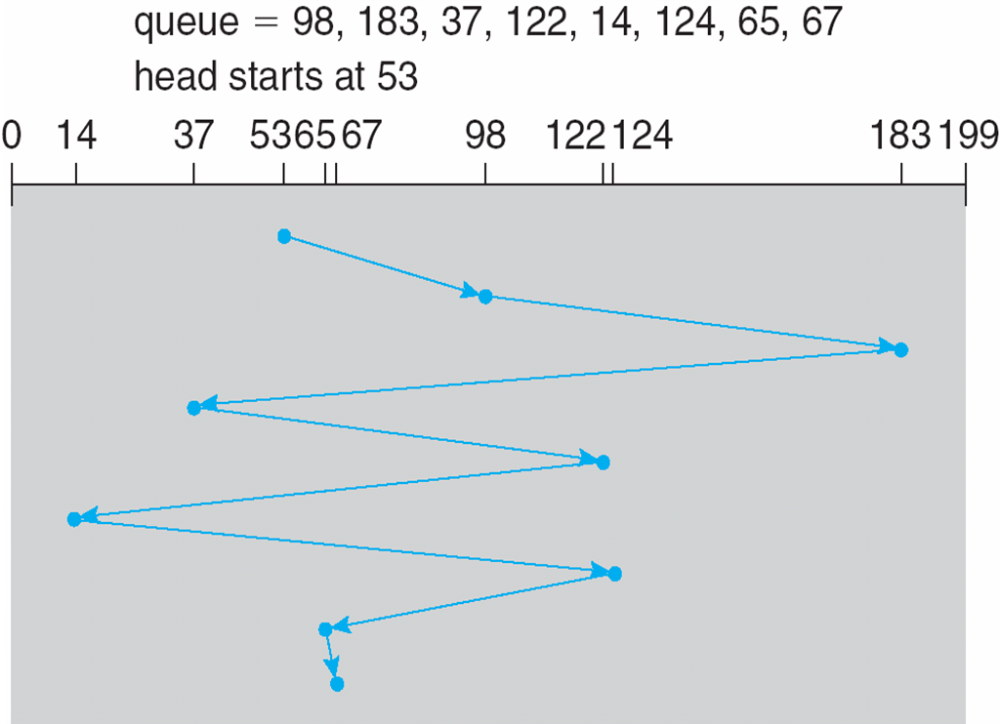
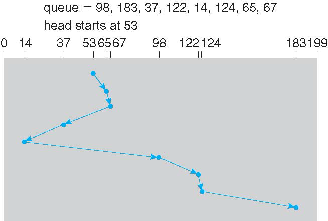
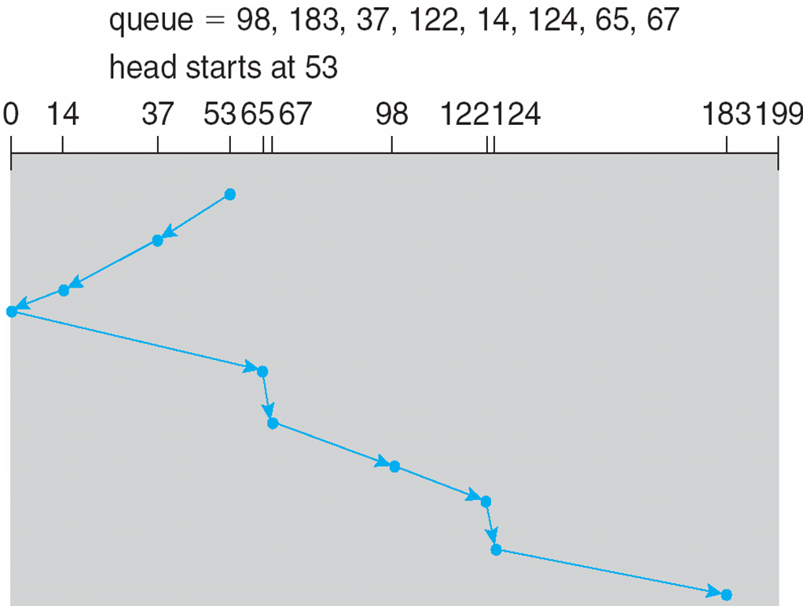
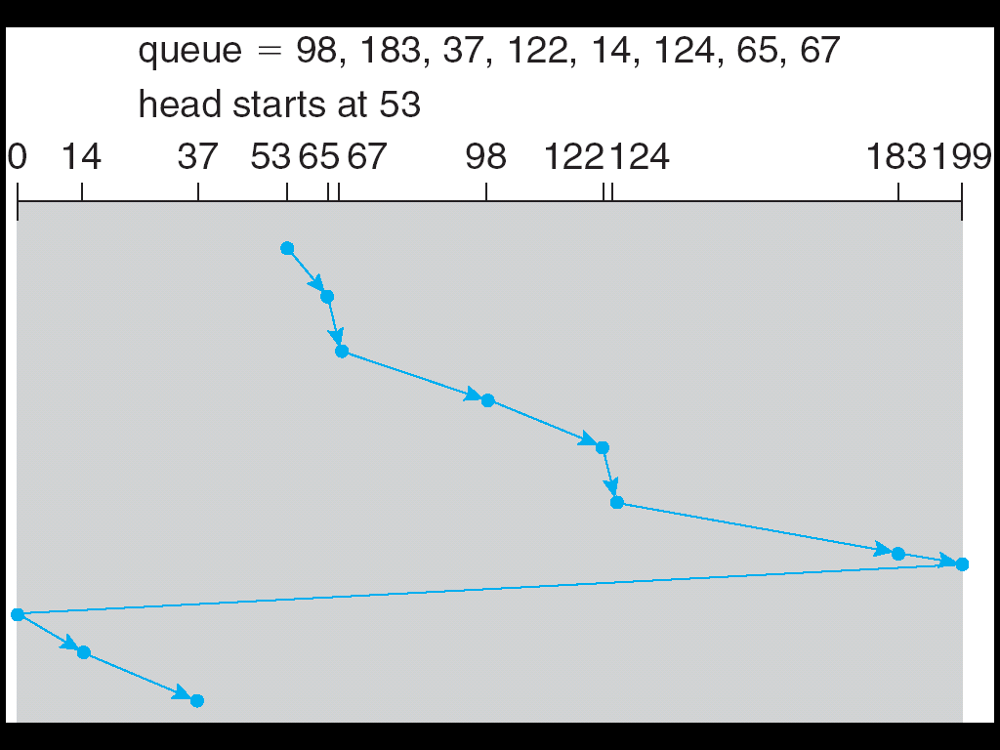
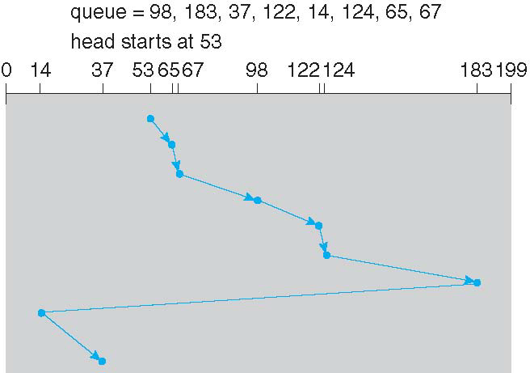

[TOC]

Review

* Disk: platter, cylinder, sector, track
* Time: positioning time = seek time + rotational latency
* SSD: read/write in page, but cannot overwrite in place
* Flash translation layer, gc, over-provisioning area
* Disk structure, Disk attachment: host- ,network-, storage area network
* Disk scheduling: CFS, SSTF, SCAN, C-SCAN, C-LOOK
* Disk management: physical formatting, partition disk, logical formatting
* RAID: redundant array of inexpensive disk
    * RAID 0: split, RAID 1: mirror, RAID4/RAID 5/RAID 6: block with parity
* ZFS

# Disk Structure

cylinder --> track --> sectors

# ==Disk Scheduling==(得知道每个算法怎么搞的，能会算时间)

合理安排访问顺序，==减少用在寻道上的时间==

* FCFS: First came, first served
    * 
* SSTF: Shortest seek time first
    * may cause starvation: 远端的可能一直无法被调度到
    * 响应时间波动大
    * 
* SCAN: Elevator Alg，一次只向一个方向移动，到无地址可读再掉头
    * 
* C-SCAN: 1, 2, ..., end, 1, 2, ...
    * 
* **LOOK/C-LOOK**
    * 在SCAN/C-SCAN的基础上，不走到两端，只到最远的一个
    * 常用
    * 

# Disk Management（可能考）

* Physical formatting: divide disk into sectors for controller to read/write
    * Each sector can hold header information, plus data, plus error correctio}n code (ECC)
    * Usually 512 bytes of data but can be selectable
* OS records its own data structures on the disk
    * partition disk into groups of cylinders, each treated as a logical disk
    * logical formatting partitions to make a file system on it
        * some FS has spare sectors reserved to handle bad blocks
        * FS can further group blocks into clusters to improve performance
            * Disk I/O done in blocks
            * File system I/O done in clusters
    * initialize the boot sector if the partition contains OS image

==**Device names**==

* By convention, **IDE** drives will be given device names /dev/hda to /dev/hdd. Hard Drive A (/dev/hda) is the first drive and Hard Drive C (/dev/hdc) is the third.
* **SCSI** drives follow a similar pattern; They are represented by <u>'sd' instead of 'hd'</u>. The first partition of the second SCSI drive would therefore be /dev/sdb1.

**Partition**

* There are at most 4 primary partitions on a disk
* 带数字是分区，不带数字是整个磁盘设备
* If we need to have more than 4 partitions, we need to use the logical partition - number starts from 5. (1-4是物理分区，5开始是逻辑分区

# Swap-space Management

* Used for moving entire processes (swapping), or pages (paging), from DRAM to secondary storage when DRAM not large enough for all processes
* Operating system provides **swap space management**
    * Secondary storage slower than DRAM, so important to optimize performance
    * Multiple swap spaces possible – decreasing I/O load on any given device
    * Best to have dedicated devices
    * Can be in raw partition or a file within a file system (for convenience of adding)
    * Data structures for swapping on Linux systems:

# RAID (不需要细节)

==Redundant Array of Inexpensive Disks==