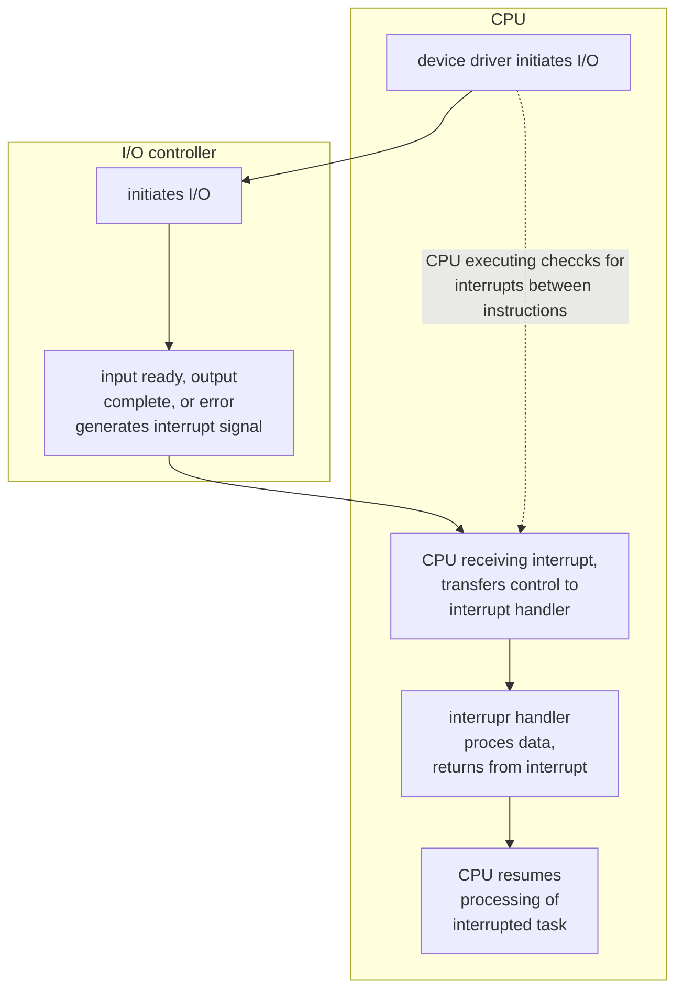
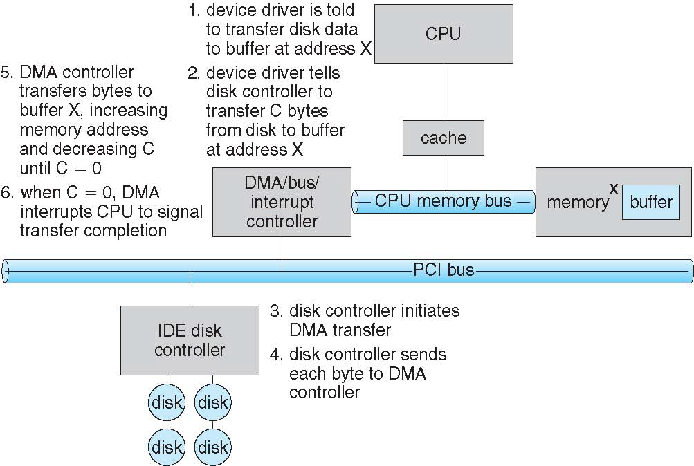
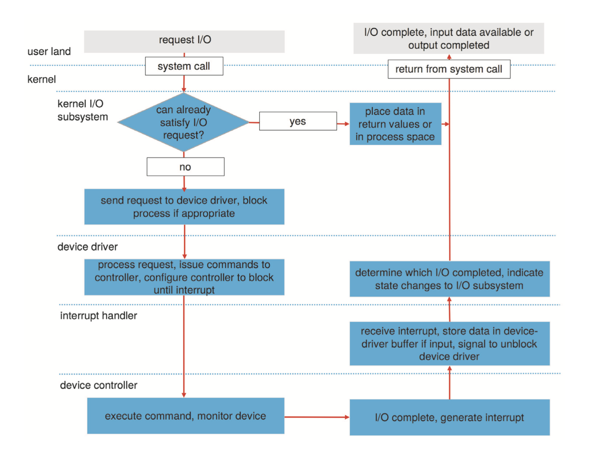

[TOC]

# Hardware

* Common concepts: signals from I/O devices interface with computer
    * bus: an interconnection between components (including CPU)
    * port: connection point for device
    * controller: component that control the device
        * can be integrated to device or separate circuit board
        * usually contains processor, microcode, private memory, bus controller, etc
* I/O access can use polling or interrupt

**IO Instructions**

* Some CPU architecture has dedicated I/O instructions
    * e.g., x86: in, out, ins, outs
    * 早期IO设备较简单，可以直接往指定端口号写数据
* Devices usually provide registers for data and control I/O of device
    * device driver places (pointers to) commands and data to register
    * registers include data-in/data-out, status, control (or command) register
    * typically 1-4 bytes, or FIFO buffer

Devices are assigned addresses for registers or ondevice memory

* direct I/O instructions
    * to access (mostly) registers
* memory-mapped I/O
    * <u>data and command registers mapped to processor address space</u>
    * to access (large) on-device memory (graphics)

## Polling

* For each I/O operation:
    1. busy-wait if device is busy (status register)
    2. send the command to the device controller (command register)
    3. read status register until it indicates command has been executed
    4. read execution status, and possibly reset device status
* Polling requires busy wait
    * reasonable if device is fast; inefficient if device slow

## Interrupt

* Polling requires busy-wait, inefficient use of CPU resource
* Interrupts can avoid busy-wait
    1. device driver send a command to the controller, and return（不需要wait
    2. OS can schedule other activities
    3. device will interrupt the processor when command has been executed
    4. OS retrieves the result by handling the interrupt
* Interrupt-based I/O requires context switch at start and end
    * if interrupt frequency is extremely high, context switch wastes CPU time
    * solution: use polling instead
        * example: NAPI in Linux enables polling under very high network load

* Interrupt is also used for exceptions
    * protection error for access violation
    * page fault for memory access error
    * software interrupt for system calls
* Multi-CPU systems can process interrupts concurrently
    * sometimes a CPU may be dedicated to handle interrupts
    * interrupts can also have CPU affinity
        * 如果只在一个core上处理中断，则可能可以提高cache命中率

### Interrupt Handler

#### ※ Linux Interrupt Handler

* **Top-halves** (interrupt handlers) must <u>run as quickly as possible</u>
    * They are interrupting other kernel/user code
    * They are often timing-critical because they deal with hardware.
    * They run in interrupt context: they cannot block
        * 因为没有自己的context，所以不能再被中断
    * One or all interrupt lines are disabled
* Defer the less critical part of interrupt processing to a **bottom-half**
    * 下半段于后台执行，可以有新的中断发生

**Top Half**

* 最⼩的化公共例程
* 保存寄存器、屏蔽中断 – 恢复寄存器，返回现场
* 最重要:调⽤合适的由硬件驱动提供的中断处理handler
* 因为中断被屏蔽，所以不要做太多事情(时间、空间)
* 将请求放⼊队列(或设置flag)，将其他处理推迟到 bottom half 内

**Bottom Half**：延迟完成

* 提供可以推迟完成任务的机制
    * softirqs
    * tasklets (建⽴在softirqs之上)
    * work queue
    * 内核线程
* <u>这些机制都可以被中断</u>

**Softirqs** (软中断)

静态分配：在内核编译时就确定

* 特点
    * 执行时间点
        1. 中断（top half）之后
        2. syscall或异常之后
        3. 调度器显示执行ksoftirqd
    * 并发
        1. 可以多核
        2. 必须是可重入的（？？
        3. 可根据需要枷锁
    * 可中断：<u>softirq运行时可再被中断抢占</u>
* Softirq Rescheduling
    * softirq要求能被重调度，即再处理软中断A时，能挂起A切换至软中断B
    * 处理方式
        1. 等A完：B倍延迟响应
        2. 总是马上处理B：可能会有starvation（对于A来说）
        3. 解决方式：配额（quota），调度器每次只运行有限数量的请求

**Tasklet**

* 优点
    * 可动态分配，数量不限
    * 直接运行再调度它的CPU上（cache affinity）
    * 执行期间不能被其他的bottom-half抢占
        * 不存在再入的问题
        * 无需锁
* 缺点
    * 和softirq一样没有上下文，无法睡眠

**Work Queues**

* 不同于使用中断上下文的softirq和tasklet，work queue使用的时进程上下文，因此可以睡眠
* 方式
    * 在内核空间维护FIFO队列，work queue内核进程不断polling队列
    * 中断负责`enqueue(fn, args)`，work queue负责dequeue并执行`fn(args)`
* 特点
    * 只在内核空间，不和任何用户进程关联，没有跨模式切换和数据拷贝

## DMA

# Application I/O Interface

* I/O system calls encapsulate device behaviors in generic classes
    * in Linux, devices can <u>**be accessed as files**</u>; low-level access with ioctl
        * `/dev/`
* Device-driver layer hides differences among I/O controllers from kernel
    * each OS has its own I/O subsystem and device driver frameworks
    * new devices talking already-implemented protocols need no extra work

## Characteristics of I/O Devices

Devices vary in many dimensions

* character-stream or block
* sequential or random-access
* synchronous or asynchronous (or both)
* sharable or dedicated
* speed of operation
* read-write, read only, or write only

**Synchronous/Asynchronous I/O**

* Synchronous I/O includes blocking and non-blocking I/O
    * blocking I/O: process suspended until I/O completed
        * easy to use and understand, but may be less efficient
        * insufficient for some needs
    * non-blocking I/O: I/O calls return <u>as much data as available</u>
        * process does not block, returns whatever existing data (read or write)
        * <u>use **select** to find if data is ready</u>, then use **read** or **write** to transfer data (blocking during this process); 如果没有就再non-blocking地IO
* Asynchronous I/O: process runs while I/O executes,
    * I/O subsystem signals process when I/O completed <u>via signal or callback</u>（不需要通过select来判断是否已经IO好了） - <u>data is already in the buffer, no need to use read() to get the data</u>
    * difficult to use but very efficient

# Kernel I/O Subsystem

## I/O scheduling

* to queue I/O requests via per-device queue
* to schedule I/O for fairness and quality of service

## Buf/Cache

缓冲和缓存的区别

* Buffering - store data in memory while transferring between devices
    * to cope with device <u>speed mismatch</u>: receive from network and write to ssd, double buffering
    * to cope with device transfer size mismatch: network buffer reassembly of message
    * to maintain “copy semantics”: write()
        * 需要把数据从用户缓冲区拷贝到内核缓冲区
* Caching: hold a copy of data <u>for fast access</u>
    * key to performance
    * sometimes combined with buffering
        * Buffer in memory is also used as caching for file operations

## Spooling/DevRes

* Spooling(假脱机): <u>hold **output**</u> if device can serve only one request at a time
    * i.e., printing，每次只能打一张纸，若有多个打印任务则需要排队？？
* Device reservation: provides <u>exclusive access</u> to a device
    * system calls for allocation and de-allocation
    * watch out for deadlock

## Error Handling

* Some OSes try to recover from errors
    * e.g., device unavailable, transient write failures
    * sometimes via retrying the read or write
    * some systems have more advanced error handling
        * track error frequencies, stop using device with high error frequency
* Some OSes just return an error number or code when I/O request fails
    * system error logs hold problem reports

## I/O Prot

* OS need to protect I/O devices
    * e.g., keystrokes can be stolen by a keylogger if keyboard is not protected 防止浏览器能获取键盘信息然后获得密码等等
    * always assume user may attempt to obtain illegal I/O access
* To protect I/O devices:
    * define all I/O instructions to be privileged
        * <u>I/O must be performed via system calls</u>
    * memory-mapped I/O and I/O ports must be protected too

## Kernel DS

* Kernel keeps state info for I/O components
    * e.g., open file tables, network connections, character device state
    * many data structures to track buffers, memory allocation, “dirty” blocks
        * sometimes very complicated
* Some OS uses message passing to implement I/O, e.g., Windows
    * message with I/O information passed from user mode into kernel
    * message modified as it flows through to device driver and back to process

# I/O Req to HW Op

## Performance

影响因素

* CPU to execute device driver, kernel I/O code（此时执行的代码对用户态进程并没有实际的帮助）
* context switches due to interrupts
* data buffering and copying
    * network traffic especially stressful

改进方法

* Reduce number of context switches（多吃少次）
* Reduce data copying
* Reduce interrupts by using large transfers, smart controllers, polling
* Use DMA
* Use smarter hardware devices（offloading，硬件计算）
* Balance CPU, memory, bus, and I/O performance for highest throughput
* Move user-mode processes / daemons to kernel threads