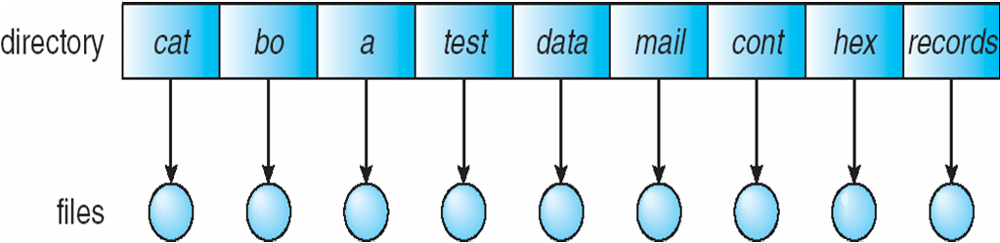
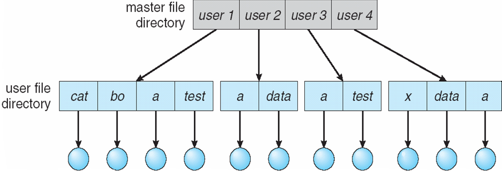
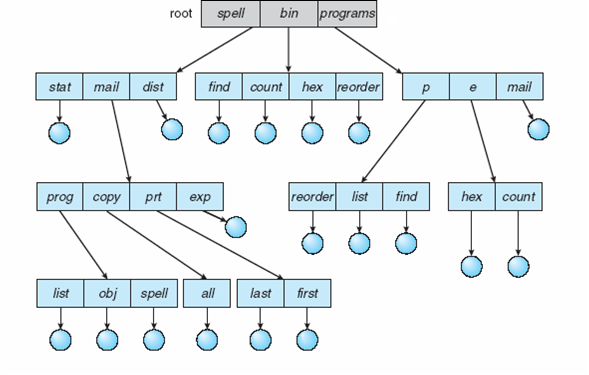
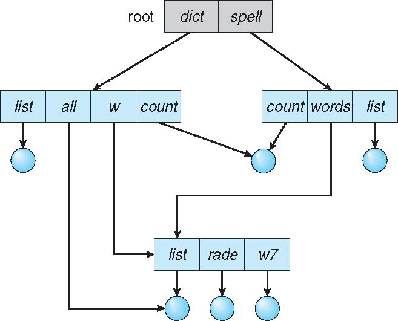
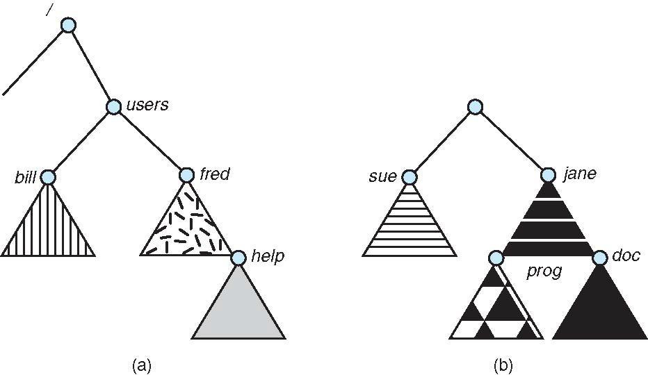
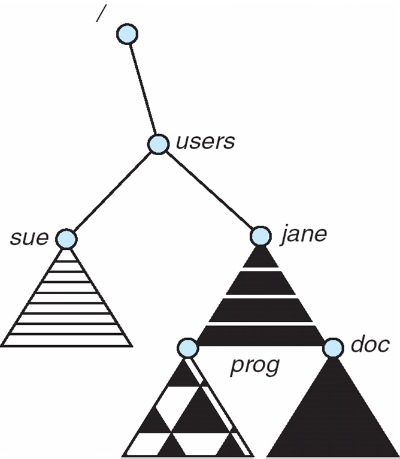

[TOC]

# File Concept

## File Attributes（proc）

* Name – only information kept in human-readable form
* Identifier – unique tag (number) identifies file within file system
* Type – needed for systems that support different types
    *  There are different types of file:
        * data: numeric, character, binary
        * program
        * ==special one: proc file system - use file-system interface to retrieve system information==
            * 为了将内核的信息暴露给用户态程序，并不是真正的文件
* Location – pointer to file location on device
* Size – current file size
* Protection – controls who can do reading, writing, executing
* Time, date, and user identification – data for protection, security, and usage monitoring
* Information about files are kept in the directory structure, which is maintained on the disk
* Many variations, including extended file attributes such as file checksum


## File Operations（hardlink）

* OS provides file operations to
    * **create**:
        * space in the file system should be found
        * an entry must be allocated in the directory
            * metadata存在一起的，且总数有限
    * **open**: most operations need to file to be opened first
        * return a handler(file descriptor) for other operations
    * **read/write**: need to maintain a pointer (per-process)
    * **reposition within file**: seek (offset from文件开头的位置，是文件内部的指针)
    * **delete**
        * Release file space
        * ==Hardlink: <u>maintain a counter</u> - delete the file until the last link is deleted==
    * **truncate**: delete a file but maintains its attributes
* Other operations can be implemented using these ones
    * Copying: create and read/write


### Open Files

* Most of file operations need to search the directory to find the named file
    * To avoid the searching, OS maintains a table - **open-file table** contains information about all open files
    * Then following operation is specified via an index to the table - no searching is required
* For os that several processes may open the file simultaneously
    * ==Per-process table: current location pointer, access rights==
    * ==System-wide table: location on the disk …==


### Info with Open Files

Several pieces of information are associated with an open file

* **file position**: pointer to last read/write location
    * file position is <u>per-process</u> that has the file open - since file could be opened by multiple processes
* **file-open count**: the number of a file is open
    * to <u>allow removal of data from open-file table</u> when last processes closes it
* **disk location**: cache of data access information
* **access rights**: per-process access mode information


### File Locking

Some file systems provide file lock to mediates access to a file

* Two types of lock
    * Shared lock - multiple processes can acquire the lock concurrently
    * Exclusive lock - one process can acquire such an lock
* Two locking mechanisms
    * mandatory lock: access is denied depending on locks held and requested（操作系统控制
    * advisory lock: processes can find status of locks and decide what to do（用户程序打开前自己检查

## File Type

File types

* as part of the file names - file extension
* **magic number** of the file - elf
    * 保存在文件的开始部分

## File Struct

A file can have different structures, determined by OS or program

* no structure: a stream of bytes or words
    * linux files
* simple record structure
    * lines of records, fixed length or variable length
    * e.g., database
* complex structures
    * e.g., word document, relocatable program file
* simple and complex structure can be encoded in the first method

Usually user programs are responsible for identifying file structure

# Access Methods

是由硬件决定的，例如tapes（磁带）就没法直接访问

* Sequential access
    * a group of elements is access in a predetermined order
    * for some media types, the only access mode (e.g., tape)
* Direct access
    * access an element at an arbitrary position in a sequence in (roughly) equal time, independent of sequence size
        * it is possible to emulate random access in a tape, but access time varies
    * sometime called random access
    * 需要存储被访问的记录的块是定长（这样才能直接算地址）
* Other Methods
    * Based on direct-access method
    * An index for the file points to blocks
        * Find a record in the file, <u>first</u> search the index and <u>then</u> use the pointer to access the block
        * We may use multiple layers of index

# Directory Struct

> Def: Directory is a collection of nodes containing information about all files

## Disk Struct

* Disk can be subdivided into partitions
    * partitions also known as minidisks, slices
    * different partitions can have different file systems
        * a partition <u>containing file system</u> is known as a **volume**
        * each volume tracks file system info in the volume’s table of contents
        * a file system can be general purpose or special purpose
    * disk or partition can be used raw (without a file system)
        * applications such as database prefer raw disks

## Directory Basis

==存储文件名和inode之间的映射关系==

**Operations Performed on Directory**

* Search for a file: pattern matching
* Create a file: new files need tone created and added to directory
* Delete a file: remove a file from directory
* List a directory: list all files in directory
* Rename a file: 
* Traverse the file system: access every directory and file with a directory


**Motivation**

* **efficiency**: to locate a file quickly
* **naming**: organize the directory structure to be convenient to users
    * two users can have same name for different files
    * the same file can have several different names
* **grouping**: provide a way to logically group files by properties
    * e.g., all Java programs, all games, …


## Diretctory Methods

### ==Single-Level==(感觉要考)

A single directory for all users

* naming problems: Two users want to have same file names
* grouping problems: Hard to group files



### Two-Level

Separate directory for <u>each user</u>

* different user can have the same name for different files
    * Each user has his own user file directory (UFD), it is in the master file directory (MFD)
* efficient to search, still cannot group files
* How to share files between different users, and how to share the system files?



### Tree-Structured

Files organized into trees（在2L基础上改进）

* Efficient in searching, can group files, convenient naming
* File can be accessed using absolute or relative path name
* <u>Sharing a file/directory is not allowed</u>
* Delete directory
    * If directory is empty, then it’s easy to handle
    * If not
        * Option I: directory cannot be deleted, unless it’s empty
        * Option II: delete all the files, directories and sub-directories



## Acyclic-Graph

Organize directories into acyclic-graphs

* allow links to a directory "entry/files" for aliasing (no longer a tree)


* Dangling pointer problem:
    * e.g., if delete file "/dict/all", "/dict/w/list" and "/spell/words/list" are dangling(悬挂) pointers
    * Solution: <u>backpointers/reference counter</u>
        * backpointers record all the pointers to the entity, a variable size record
        * Or count # of links to it and only (physically) delete it when counter is zero




==**Soft & Hard Link**==

Basically hard link <u>increases reference count</u> of a location while soft links work as a shortcut (like in Windows)删掉源文件之后hardlink还能访问但是symbolic不行（inaccessible）

https://www.geeksforgeeks.org/soft-hard-links-unixlinux/

hard link不能跨文件系统但是soft可以

## General Graph

Allowing arbitrary links may generate cycles in the directory structure

问题

* 会重复搜索同一部分（甚至无法停止）
* 由于存在自我引用，因此ref counter可能会无法减至0

Solution

* allow cycles, but use garbage collection to reclaim disk spaces
* every time a new link is added use a cycle detection algorithm

# Mounting

* ==<u>A file system must be mounted before it can be accessed</u>==
    * mounting link a **file system** to the system, usually forms a single name space
    * the location of the file system being mounted is call the mount point
    * a mounted file system makes the <u>old directory at the mount point **invisible**</u>
    *  $\Longrightarrow$ 
        * 本来的bill和fred变成invisible了

==Linux指令==

```bash
NAME
       mount - mount a filesystem

SYNOPSIS
       mount [-l|-h|-V]

       mount -a [-fFnrsvw] [-t fstype] [-O optlist]

       mount [-fnrsvw] [-o options] device|dir

       mount [-fnrsvw] [-t fstype] [-o options] device dir
# -t 表示类型, vfat...
# device是要挂载的partition(sda1)而不是device(sda)，dir是要mount到的目录
```


# File Sharing

* Sharing of files on multi-user systems is desirable
    * sharing must be done through a protection scheme
        * User IDs identify users, allowing protections to be peruser
        * Group IDs allow users to be in groups, permitting group access rights
* On distributed systems, files may be shared across a network
    * Network File System (NFS) is a common distributed filesharing method


**Remote File Sharing**

* Use **networking** to allow file system access between systems
    * manually via programs like FTP
    * automatically, seamlessly using distributed file systems
    * semi automatically via the world wide web
* Client-server model allows clients to <u>mount remote FS from servers</u>
    * a server can serve multiple clients
    * client and user-on-client identification is complicated
        * server cannot assume the client is trusted
        * standard OS file calls are translated into remote calls
    * NFS is standard UNIX file sharing protocol, CIFS is standard for Windows

# Protection

## ACL

Access Control List

* Assign each file and directory with an access control list (ACL)
    * 设定每个用户名及其所允许的访问类型
* Advantages: fine-grained control
* Disadvantages
    * 创建很麻烦，特别是当事先不知道系统的用户列表时
    * 是resizable的，控制起来更麻烦

## Unix Access Control

* Three modes of access: **read**, **write**, **execute** (encoded in three bits **RWX**，chmod也是这个顺序)
* Three classes of users: **owner**, **group**, and **others** (chmod按这个顺序来)
* 3 × 3 = 9 bits
    * ==Ex. `chmod 761`: owner：RWX，group：RW，other：X==


```zsh
# ulysses @ JVAIOSX12 in ~/rrshareweb [16:06:22]
$ ll
total 21M
drwxr-xr-x 2 ulysses ulysses 4.0K Dec 30 22:21 conf
drwxr-xr-x 2 ulysses ulysses 4.0K Aug  4 07:57 data
-rwxr-xr-x 1 ulysses ulysses 581K Aug 30  2018 p4pclient
-rwxr--r-- 1 ulysses ulysses  306 Jun 16  2018 readme.txt
-rwxr-xr-x 1 ulysses ulysses  20M Aug  4 07:52 rrshareweb
drwxr-xr-x 3 ulysses ulysses 4.0K Jun 11  2020 web
```

第二行表示“number of hard links to the file”

# File & Dir in Practice

## ==缩写考点==

```
boot 存image（实验中的
etc 存cfg
proc 存系统info
var 它代表的是variable，就是他这个var下面是放那些系统里面多变的信息非常经常变化的。
```

## Open

```c
NAME
       open, openat, creat - open and possibly create a file

SYNOPSIS
       #include <sys/types.h>
       #include <sys/stat.h>
       #include <fcntl.h>

       int open(const char *pathname, int flags);
       int open(const char *pathname, int flags, mode_t mode);

       int creat(const char *pathname, mode_t mode);

       int openat(int dirfd, const char *pathname, int flags);
       int openat(int dirfd, const char *pathname, int flags, mode_t mode);
```

**Flag**

* O_CREAT: create the file if not exists (not O_CREATE)
* O_WRONLY: can only write to the file
* O_TRUNC: if the file exists, truncate it to zero bytes


### ==Ex. of cat==

==fd=0, 1, 2分别会被stdin, stdout, stderr占用==，所以从3开始

```zsh
$ echo hello > foo
$ cat foo
$ strace cat foo
......
openat(AT_FDCWD, "foo", O_RDONLY)       = 3    # be used at `read`
fstat(3, {st_mode=S_IFREG|0644, st_size=4, ...}) = 0
fadvise64(3, 0, 0, POSIX_FADV_SEQUENTIAL) = 0
mmap(NULL, 139264, PROT_READ|PROT_WRITE, MAP_PRIVATE|MAP_ANONYMOUS, -1, 0) = 0x7f25a61bf000
read(3, "hhh\n", 131072)                = 4
write(1, "hhh\n", 4hhh
)                    = 4
read(3, "", 131072)                     = 0
munmap(0x7f25a61bf000, 139264)          = 0
close(3)                                = 0
close(1)                                = 0
close(2)                                = 0
exit_group(0)                           = ?
+++ exited with 0 +++

# my try: touch non-exist and touch exist use same syscall
$ strace touch foo > touch1.txt
$ strace touch foo > touch2.txt
$ diff touch1.txt touch2.txt
```

## Seek

**lseek**

```c
NAME
       lseek - reposition read/write file offset

SYNOPSIS
       #include <sys/types.h>
       #include <unistd.h>

       off_t lseek(int fd, off_t offset, int whence);
```

`lseek()` repositions the file offset of the open file description associated with the file descriptor fd to the argument offset according to the directive whence as follows:

* SEEK_SET
    The file offset is set to offset bytes.
* SEEK_CUR
    The file offset is set to its current location plus offset bytes.
* SEEK_END
    The file offset is set to the size of the file plus offset bytes.


**fsync**

write不一定会马上写进磁盘，fsync可以把dirty data写到磁盘，可以减少单个程序的响应时间

```c
NAME
       fsync, fdatasync - synchronize a file's in-core state with storage device

SYNOPSIS
       #include <unistd.h>

       int fsync(int fd);
       int fdatasync(int fd);
```

`fsync()` transfers ("flushes") all modified in-core data of (i.e., modified buffer cache pages for) <u>the file referred to by the file descriptor fd</u> to the disk device (or other permanent storage device) so that all changed information can be retrieved even if the system crashes or is rebooted. This includes writing through or flushing a disk cache if present. The call blocks until the device reports that the transfer has completed.

## Info

```c
struct stat {
    dev_t st_dev;      // Device ID of device containing file.
    ino_t st_ino;      // File serial number.
    mode_t st_mode;    // Mode of file (see below).
    nlink_t st_nlink;  // Number of hard links to the file.
    uid_t st_uid;      // User ID of file.
    gid_t st_gid;      // Group ID of file.
    dev_t st_rdev;     // Device ID (if file is character or block special).
    off_t st_size;     // For regular files, the file size in bytes.
                       // For symbolic links, the length in bytes of the pathname contained in the symbolic link.
                       // For a shared memory object, the length in bytes.
                       // For a typed memory object, the length in bytes.
                       // For other file types, the use of this field is unspecified.
    time_t st_atime;       // Time of last access.
    time_t st_mtime;       // Time of last data modification.
    time_t st_ctime;       // Time of last status change.
    blksize_t st_blksize;  // A file system-specific preferred I/O block size for this object. In some file system types, this may vary from file to file.
    blkcnt_t st_blocks;    // Number of blocks allocated for this object.
};
```


## Removing

```zsh
$ strace rm foo
......
ioctl(0, TCGETS, {B38400 opost isig icanon echo ...}) = 0
newfstatat(AT_FDCWD, "foo", {st_mode=S_IFREG|0644, st_size=4, ...}, AT_SYMLINK_NOFOLLOW) = 0
geteuid()                               = 1000
newfstatat(AT_FDCWD, "foo", {st_mode=S_IFREG|0644, st_size=4, ...}, AT_SYMLINK_NOFOLLOW) = 0
faccessat(AT_FDCWD, "foo", W_OK)        = 0
unlinkat(AT_FDCWD, "foo", 0)            = 0
lseek(0, 0, SEEK_CUR)                   = -1 ESPIPE (Illegal seek)
close(0)                                = 0
close(1)                                = 0
close(2)                                = 0
exit_group(0)                           = ?
+++ exited with 0 +++
```

rm的时候不能直接delete而是要unlink因为reference count可能不为1

## Mk Dir

```zsh
# ulysses @ JVAIOSX12 in ~ [17:07:34]
$ strace mkdir foo
......
mkdir("foo", 0777)                      = 0
close(1)                                = 0
close(2)                                = 0
exit_group(0)                           = ?
+++ exited with 0 +++

# ulysses @ JVAIOSX12 in ~ [17:08:53]
$ ll -a foo
total 8.0K
drwxr-xr-x  2 ulysses ulysses 4.0K Dec 14 17:07 .
drwxr-xr-x 18 ulysses ulysses 4.0K Dec 14 17:08 ..

# ulysses @ JVAIOSX12 in ~ [17:09:50]
$ ll
drwxr-xr-x  2 ulysses ulysses 4.0K Dec 14 17:07 foo
```

## Rd Dir

```c
struct dirent {
    char d_name[256];             // filename
    ino_t d_ino;                  // inode number
    off_t d_off;                  // offset to next dirent
    unsigned short int d_reclen;  // length of this record
    unsigned char d_type;         // type of file
};
```


Sample

```c
#include <assert.h>
#include <dirent.h>
#include <stdio.h>

int main(int argc, char *argv[]) {
    DIR *dp = opendir(".");
    assert(dp != NULL);
    struct dirent *d;
    while ((d = readdir(dp)) != NULL) {
        printf("%d   %s\n", (int)d->d_ino, d->d_name);
    }
    closedir(dp);
    return 0;
}

// Output:
571690   .
571690   ..
571973   .vscode
572007   bin
572010   run.sh
571988   test.c
```


## Hard link

```zsh
$ ls --help
  -i, --inode                print the index number of each file
```


```zsh
# ulysses @ JVAIOSX12 in ~ [13:59:36]
$ touch foo

# ulysses @ JVAIOSX12 in ~ [13:59:40]
$ ln foo foo2

# ulysses @ JVAIOSX12 in ~ [13:59:57]
$ ls -i foo*
2409 foo  2409 foo2    # !!!! inode是一样的

# ulysses @ JVAIOSX12 in ~ [14:00:23]
$ stat foo2
  File: foo2
  Size: 0               Blocks: 0          IO Block: 4096   regular empty file
Device: 810h/2064d      Inode: 2409        Links: 2  # Links表示Ref Cnt
Access: (0644/-rw-r--r--)  Uid: ( 1000/ ulysses)   Gid: ( 1000/ ulysses)
Access: 2020-12-14 13:59:40.220000000 +0800
Modify: 2020-12-14 13:59:40.220000000 +0800
Change: 2020-12-14 13:59:57.630000000 +0800
 Birth: -

# ulysses @ JVAIOSX12 in ~ [14:09:34]
$ ln foo2 foo3

# ulysses @ JVAIOSX12 in ~ [14:09:45]
$ stat foo
  File: foo
  Size: 0               Blocks: 0          IO Block: 4096   regular empty file
Device: 810h/2064d      Inode: 2409        Links: 3
Access: (0644/-rw-r--r--)  Uid: ( 1000/ ulysses)   Gid: ( 1000/ ulysses)
Access: 2020-12-14 13:59:40.220000000 +0800
Modify: 2020-12-14 13:59:40.220000000 +0800
Change: 2020-12-14 14:09:45.490000000 +0800
 Birth: -

# ulysses @ JVAIOSX12 in ~ [14:09:50]
$ rm foo2

# ulysses @ JVAIOSX12 in ~ [14:09:54]
$ stat foo
  File: foo
  Size: 0               Blocks: 0          IO Block: 4096   regular empty file
Device: 810h/2064d      Inode: 2409        Links: 2
Access: (0644/-rw-r--r--)  Uid: ( 1000/ ulysses)   Gid: ( 1000/ ulysses)
Access: 2020-12-14 13:59:40.220000000 +0800
Modify: 2020-12-14 13:59:40.220000000 +0800
Change: 2020-12-14 14:09:54.080000000 +0800
 Birth: -
```


**Hard link and removing**

* Create a file
    1. making a structure (the inode) that will track virtually all relevant information about the file
    2. linking a human-readable name to that file (or inode), and putting that link into a directory
* To remove a file, we unlink it

## Symbolic Link

```zsh
# ulysses @ JVAIOSX12 in ~ [17:24:40]
$ touch foo

# ulysses @ JVAIOSX12 in ~ [17:24:44]
$ ln -s foo foo2

# ulysses @ JVAIOSX12 in ~ [17:24:53]
$ ls -i foo*
3026 foo  3371 foo2    # !!!! inode是不一样的

# ulysses @ JVAIOSX12 in ~ [17:25:07]
$ stat foo
  File: foo
  Size: 0               Blocks: 0          IO Block: 4096   regular empty file
Device: 810h/2064d      Inode: 3026        Links: 1
Access: (0644/-rw-r--r--)  Uid: ( 1000/ ulysses)   Gid: ( 1000/ ulysses)
Access: 2020-12-14 17:24:44.122835400 +0800
Modify: 2020-12-14 17:24:44.122835400 +0800
Change: 2020-12-14 17:24:44.122835400 +0800
 Birth: -

# ulysses @ JVAIOSX12 in ~ [17:25:35]
$ stat foo2
  File: foo2 -> foo
  Size: 3               Blocks: 0          IO Block: 4096   symbolic link
Device: 810h/2064d      Inode: 3371        Links: 1
Access: (0777/lrwxrwxrwx)  Uid: ( 1000/ ulysses)   Gid: ( 1000/ ulysses)
Access: 2020-12-14 17:25:07.722835400 +0800
Modify: 2020-12-14 17:24:53.612835400 +0800
Change: 2020-12-14 17:24:53.612835400 +0800
 Birth: -
```

