[TOC]

# FS Struct

## Conflict Perm

```zsh
# ulysses @ JVAIOSX12 in ~ [14:18:56]
$ touch foo

# ulysses @ JVAIOSX12 in ~ [14:18:59]
$ chmod 464 foo

# ulysses @ JVAIOSX12 in ~ [14:19:18]
$ ll foo
-r--rw-r-- 1 ulysses ulysses 0 Dec 14 14:18 foo

# ulysses @ JVAIOSX12 in ~ [14:19:33]
$ echo hhh > foo
zsh: permission denied: foo

# 即使ulysses在ulysses group里，且ulysses group有W权限，但是Linux会先检查owner的权限，且失败后就不再看group的权限了
```

## FS Struct Basis

* File is a logical storage unit for a collection of related information
* There are many file systems; OS may support several simultaneously
    * Linux has Ext2/3/4, Reiser FS/4, Btrfs…
    * Windows has FAT, FAT32, NTFS…
    * new ones still arriving – ZFS, GoogleFS, Oracle ASM, FUSE
* File system resides on secondary storage (disks)
    * disk driver provides interfaces to read/write disk blocks
    * <u>FS provides user/program interface to storage, mapping logical to physical</u>
        * file control block – storage structure consisting of information about a file
* File system is usually implemented and organized into layers

## Layered File Sys

**Hierarchy**

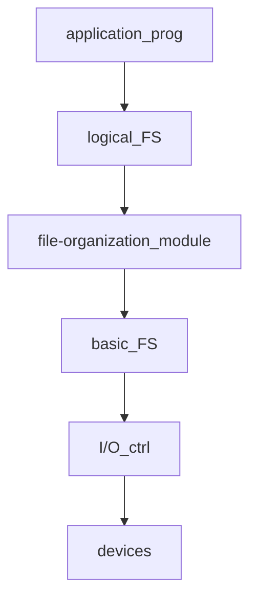

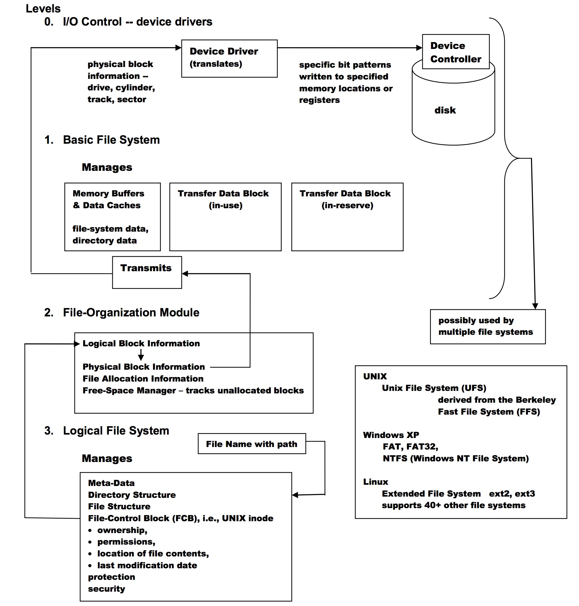

* Device drivers manage I/O devices at the I/O control layer
    * Given commands like “read drive1, cylinder 72, track 2, sector 10, into memory location 1060”
    * outputs <u>low-level hardware specific commands</u> to hardware controller
* Basic file system given command like “retrieve block 123” translates to device driver
    * Also manages memory buffers and caches (allocation, freeing, replacement)
        * Buffers hold data in transit
        * Caches hold frequently used data
* File organization module understands files, logical address, and physical blocks
    * Translates logical block \# to physical block \#
    * Manages free space, disk allocation
* Logical file system manages metadata information
    * Translates filename into **file number**, **file handle**, **location** by maintaining **file control blocks** (inodes in UNIX)
    * Directory management
    * Protection
    * FCB(file control block)
* Layering useful for reducing complexity and redundancy, but adds overhead and can decrease performance
    * Translates file name into file number, file handle, location by maintaining file control blocks (inodes in UNIX)
    * Logical layers can be implemented by any coding method according to OS designer

# FS Implementation

## FS Struct

* partition == volume == file system storage space
* File-system needs to maintain on-disk and in-memory structures
    * <u>on-disk for data storage, in-memory for data access</u>

### On-Disk FS Struct

On-disk structure has several control blocks

* boot control block contains info to boot OS from that volume - per volume
    * only needed if volume contains OS image, usually first block of volume
* volume control block (e.g., superblock) contains volume details - per volume
    * total # of blocks, # of free blocks, block size, free block pointers, free FCB count, free FCB pointers
* **directory structure** organizes the directories and files - per file system
    * A list of (file names and associated **inode** numbers)
* **per-file file control block** contains many details about the file - per file
    * permissions, size, dates, data blocks or pointer to data blocks

#### ==FCB==

==inode==

**File Control Block**, Typically inclludes:

* Perm
* Dates (Create, Access, Write)
* Owner, Group, ACL
* Size
* file data blocks or pointers to file data blocks

### In-Mem FS Struct

In-memory structures reflects and extends on-disk structures

* **Mount table** storing file system mounts, mount points, file system types
* **In-memory directory-structure cache** holds the directory information about recently accessed directories
* **system-wide open-file table** contains a copy of the FCB of each file and other info
* **per-process open-file table** contains <u>pointers</u> to appropriate entries in system-wide open-file table as well as other info
    * 不同process打开同一个文件的offset、perm等参数可能不同，所以必须要有这个表
* **I/O Memory Buffers** hold file-system blocks while they are being read from or written to disk

## FS Operation

### Creation

1. application process requests the creation of a new file
2. logical file system allocates a new FCB, i.e., inode structure
3. appropriate directory is updated with the new file name and FCB, i.e., inode

### Open & Close 

**Open**

1. search System-Wide Open-File Table to see if file is currently in use
    * if it is, create a Per-Process Open-File table entry <u>pointing to the existing System-Wide Open-File Table</u>
    * if it is not, search the directory for the file name; once found, place the <u>FCB</u> in the System-Wide Open-File Table
2. make an entry (i.e., Unix file descriptor, Windows file handle) in the Per-Process Open-File Table, with pointers to the entry in the System-Wide Open-File Table and other fields which include a pointer to the current location in the file and the access mode in which the file is open
3. increment the open count in the System-Wide Open-File Table
4. returns a pointer to the appropriate entry in the Per-Process Open-File Table
    * all subsequent operations are performed with this pointer

**Close**

1. process closes file -> Per-Process Open-File Table entry is removed; open count decremented
2. all processes close file -> copy in-memory directory information to disk and System-Wide Open-File Table is removed from memory


==**Illustration of open**==

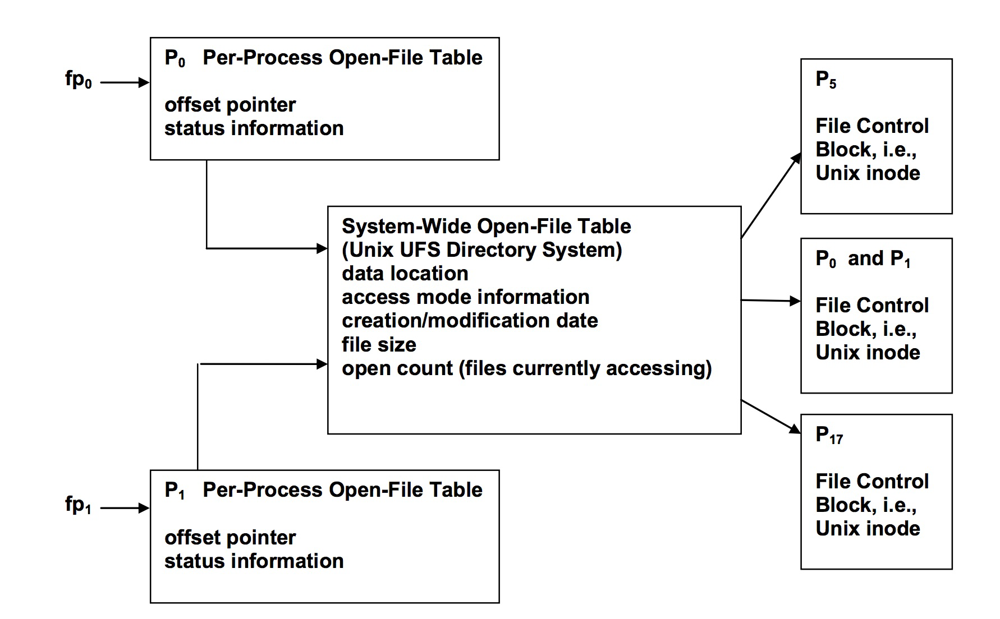

使用类似于多级页表的结构进行inode的存储，但是不同点在于多级页表中除了最低级的页表，其他都是存储指向页表的指针，而在inode的存储中，高级的inode表也能混着存储指向数据和inode表的指针：

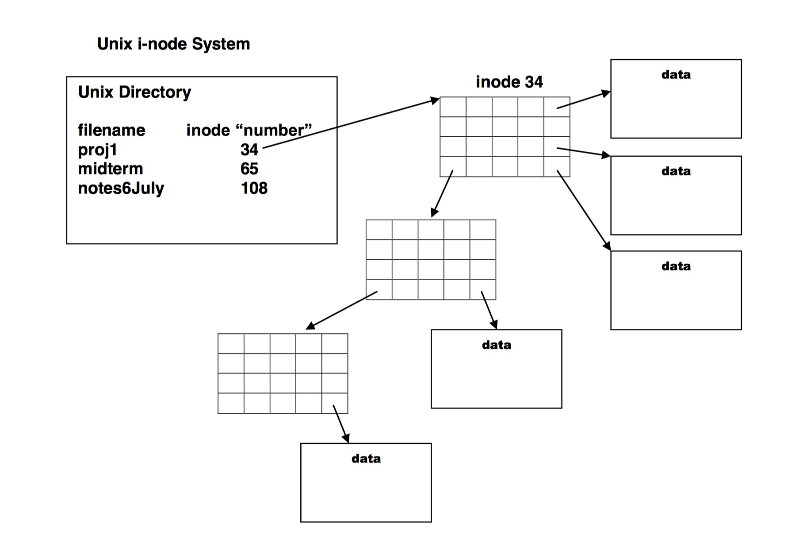

==Steps:==

1. 根据目录里的文件找到inode号
2. 把磁盘上的inode读进来
3. 根据inode里面的方式（连续、索引）找到data

==课上的例子==

1. 找目录的inode
2. 从中找到目录inode指向的data
3. 从中找到文件的inode
4. 从中找到文件的data

## Mounting

* Boot Block – series of sequential blocks containing a memory image of a program, call the boot loader, that locates and mounts the root partition; the partition contains the kernel; the boot loader locates, loads, and starts the kernel executing
* In-memory mount table – external file systems must be mounted on devices, the mount table records the mount points, types of file systems mounted, and an access path to the desired file system
* Unix – the in-memory mount table contains a pointer to the **superblock** of the file system on that device

## ==Virtual FS==(含义和数据结构)

不是一种系统，而是一种实现方式，提供一套OO特性的API供不同的文件系统使用

* VFS provides an object-oriented way of implementing file systems
    * OS defines a common interface for FS, <u>all FSes implement them</u>
    * system call is implemented based on this common interface
        * <u>it allows the same syscall API to be used for different types of FS</u>（类似重载）
* VFS separates FS generic operations from implementation details
    * implementation can be one of many FS types, or network file system
    * OS can dispatches syscalls to appropriate FS implementation routines

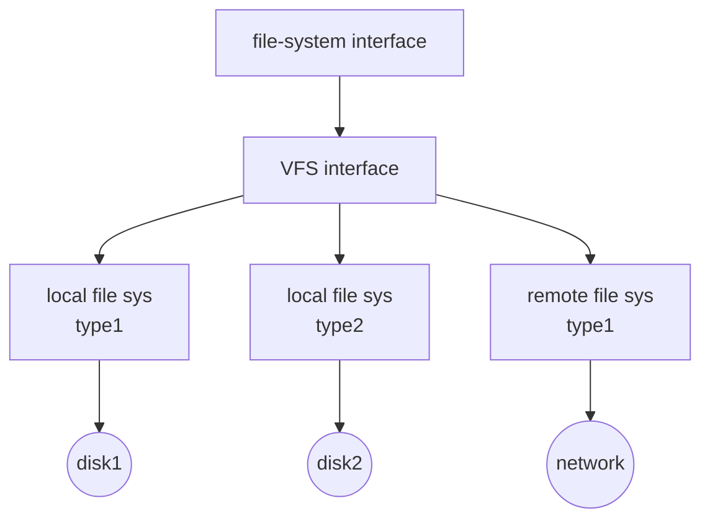

### Linux VFS

* ==Linux defines four VFS object types:==
    * **superblock**: defines the file system type, size, status, and other metadata
    * ==**inode**: contains metadata about a file (location, access mode, owners…)==
    * ==**dentry**: <u>associates names to inodes, and the directory layout</u>==
    * **file**: actual data of the file
* VFS defines set of operations on the objects that must be implemented
    * the set of operations is saved in a function table

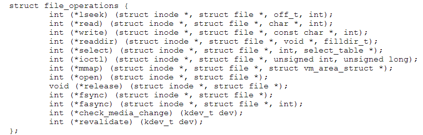

```c
struct file_operations {
    struct module *owner;
    loff_t (*llseek)(struct file *, loff_t, int);
    ssize_t (*read)(struct file *, char __user *, size_t, loff_t *);
    ssize_t (*write)(struct file *, const char __user *, size_t, loff_t *);
    ssize_t (*read_iter)(struct kiocb *, struct iov_iter *);
    ssize_t (*write_iter)(struct kiocb *, struct iov_iter *);
    int (*iopoll)(struct kiocb *kiocb, bool spin);
    int (*iterate)(struct file *, struct dir_context *);
    int (*iterate_shared)(struct file *, struct dir_context *);
    __poll_t (*poll)(struct file *, struct poll_table_struct *);
    long (*unlocked_ioctl)(struct file *, unsigned int, unsigned long);
    long (*compat_ioctl)(struct file *, unsigned int, unsigned long);
    int (*mmap)(struct file *, struct vm_area_struct *);
    int (*open)(struct inode *, struct file *);
    int (*flush)(struct file *, fl_owner_t id);
    int (*release)(struct inode *, struct file *);
    int (*fsync)(struct file *, loff_t, loff_t, int datasync);
    int (*fasync)(int, struct file *, int);
    int (*lock)(struct file *, int, struct file_lock *);
    ssize_t (*sendpage)(struct file *, struct page *, int, size_t, loff_t *, int);
    unsigned long (*get_unmapped_area)(struct file *, unsigned long, unsigned long, unsigned long, unsigned long);
    int (*check_flags)(int);
    int (*flock)(struct file *, int, struct file_lock *);
    ssize_t (*splice_write)(struct pipe_inode_info *, struct file *, loff_t *, size_t, unsigned int);
    ssize_t (*splice_read)(struct file *, loff_t *, struct pipe_inode_info *, size_t, unsigned int);
    int (*setlease)(struct file *, long, struct file_lock **, void **);
    long (*fallocate)(struct file *file, int mode, loff_t offset, loff_t len);
    void (*show_fdinfo)(struct seq_file *m, struct file *f);
#ifndef CONFIG_MMU
    unsigned (*mmap_capabilities)(struct file *);
#endif
    ssize_t (*copy_file_range)(struct file *, loff_t, struct file *, loff_t, size_t, unsigned int);
    loff_t (*remap_file_range)(struct file *file_in, loff_t pos_in, struct file *file_out, loff_t pos_out, loff_t len, unsigned int remap_flags);
    int (*fadvise)(struct file *, loff_t, loff_t, int);
};
```

# Dir Implementation

* Linear list of file names with pointer to the file metadata
    * simple to program, but time-consuming to search (e.g., linear search)
        * could keep files ordered alphabetically via linked list or use B+ tree
* Hash table: linear list with hash data structure to reduce search time
    * collisions are possible: two or more file names hash to the same location

# ==Disk Block Alloc==

## Contiguous

==文件size无限制==

* Contiguous allocation: each file occupies set of contiguous blocks
    * best performance in most cases（就先std::vector比std::list快一样）
    * simple to implement: base + limit
* Contiguous allocation is not flexible(不好resize)
    * how to increase/decrease file size?
        * need to know file size at the file creation?
    * external fragmentation
        * how to compact files offline or online to reduce external fragmentation
    * need for compaction off-line (downtime) or on-line
* appropriate for sequential disks like tape
* Some file systems use **extent-based contiguous allocation** (用pointer把"在不同地方的连续的block"(如`1,2,3->6,7->11,12,13,14`这样)串起来)
    * extent is a set of contiguous blocks
    * a file consists of extents, extents are not necessarily adjacent to each other

## Linked

* Linked allocation: each file is a linked list of disk blocks
    * <u>each block contains pointer to next block, file ends at *nil* pointer</u>
    * blocks may be scattered anywhere on the disk (no external fragmentation, no compaction)
    * Disadvantages
        * locating a file block can take many I/Os and disk seeks (==No Random Acces==)
        * Pointer size: 4 of 512 bytes are used for pointer - 0.78% space is wasted
        * Reliability: what about the pointer has corrupted!
    * Improvements: cluster the blocks - like 4 blocks
        * however, has internal fragmentation
* Ex. FAT(File Allocation Table) of MS-DOS uses linked allocation

## ==Indexed (看Ex)==

* Indexed allocation: <u>each file has its own index blocks of pointers to its data blocks</u>
    * index table provides random access to file data blocks
    * <u>no external fragmentation, but overhead of index blocks</u>
    * allows holes in the file
    * Index block needs space - waste for small files
    * 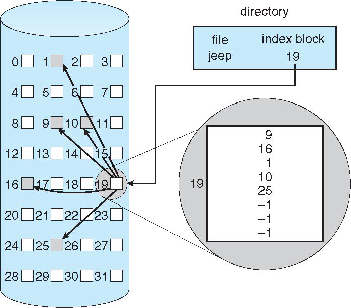
* Need a method to allocate index blocks - cannot too big or too small
    * linked index blocks: <u>link index blocks to support huge file</u>
    * multiple-level index blocks (e.g., 2-level)
        * Ex.
            * 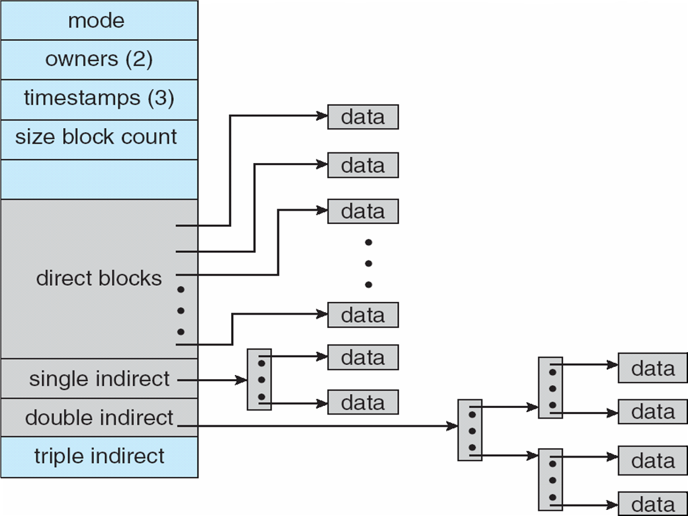
                * First 15 pointers are in inode
                * Direct block: first 12 pointers
                * Indirect block: next 3 pointers
                * BlockSize=512B, PtrSize=4B
            * ==Total Size = (12+128+128^2^+128^3^) × 512B==

## Alloc Conclusion

* Best allocation method depends on file access type
    * contiguous is great for sequential and random
    * linked is good for sequential, not random
    * indexed (combined) is more complex
        * single block access may require 2 index block reads then data block read
        * clustering can help improve throughput, reduce CPU overhead
        * cluster is a set of contiguous blocks
* Disk I/O is slow, reduce as many disk I/Os as possible
    * Intel Core i7 extreme edition 990x (2011) at 3.46Ghz = 159,000 MIps
    * typical disk drive at 250 I/Os per second
        * 159,000 MIps / 250 = 630 million instructions during one disk I/O
    * fast SSD drives provide 60,000 IOps
        * 159,000 MIps / 60,000 = 2.65 millions instructions during one disk I/O

# Free-Space Mangement

## Bitmap

* Use one bit for each block, track its allocation status
    * relatively easy to find contiguous blocks
    * bit map requires extra space
        * example: block size = 4KB = 2^12^ bytes
            disk size = 2^40^ bytes (1 terabyte)
            n = 2^40^/2^12^ = 2^28^ bits (or 256 MB)
            if clusters of 4 blocks -> 64MB of memory

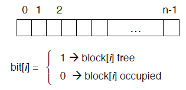

## Linked

* Keep free blocks in linked list
    * no waste of space, just use the memory in the free block for pointers
    * cannot get contiguous space easily
    * Usually no need to traverse the entire list: return the first one


# Performance

File system efficiency and performance dependent on:

* disk allocation and directory algorithms
* types of data kept in file’s directory entry
* pre-allocation or as-needed allocation of metadata structures
* fixed-size or varying-size data structures


To **improve** file system performance:

* keeping data and metadata close together (机械硬盘)
* use cache: separate section of main memory for frequently used blocks
* use **asynchronous writes**, it can be <u>buffered</u>/cached, thus faster
    * cannot cache synchronous write, writes must hit disk before return
    * synchronous writes sometimes requested by apps or needed by OS
* **free-behind and read-ahead**: techniques to optimize <u>sequential access</u> - remove the previous page from the buffer, read multiple pages ahead
* Reads frequently slower than write: really?

# ~~Recovery~~

并不是保持数据不丢失，而是保证metadata

# ~~Example~~

inode struct:

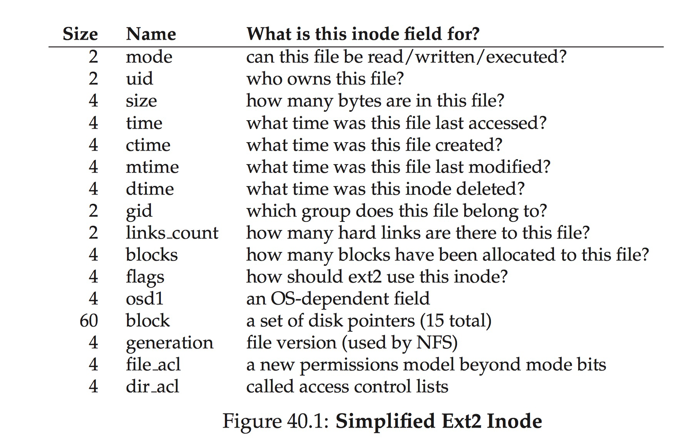

Read existed "/foo/bar":

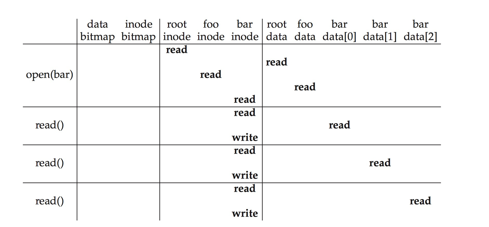

Write nonexisted "/foo/bar":

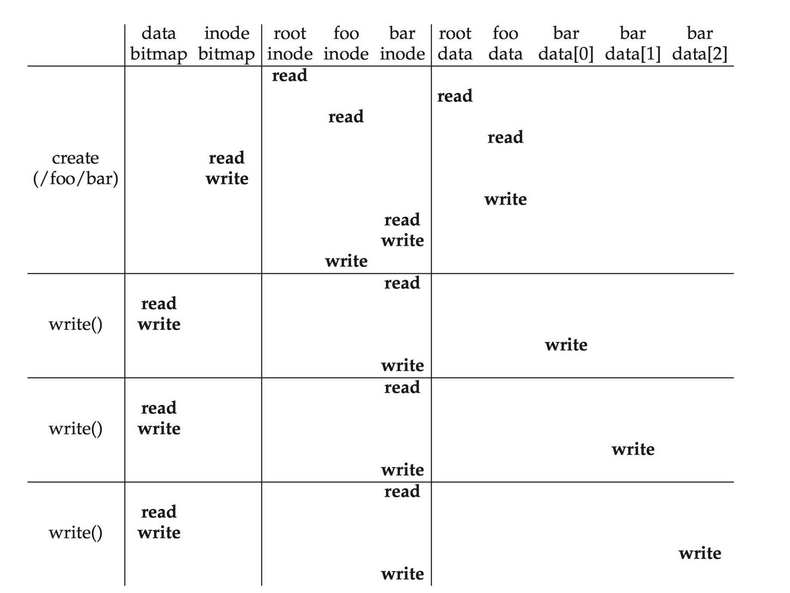

\>？为什么root的inode不用write

## Data Journaling

## Metadata Journaling