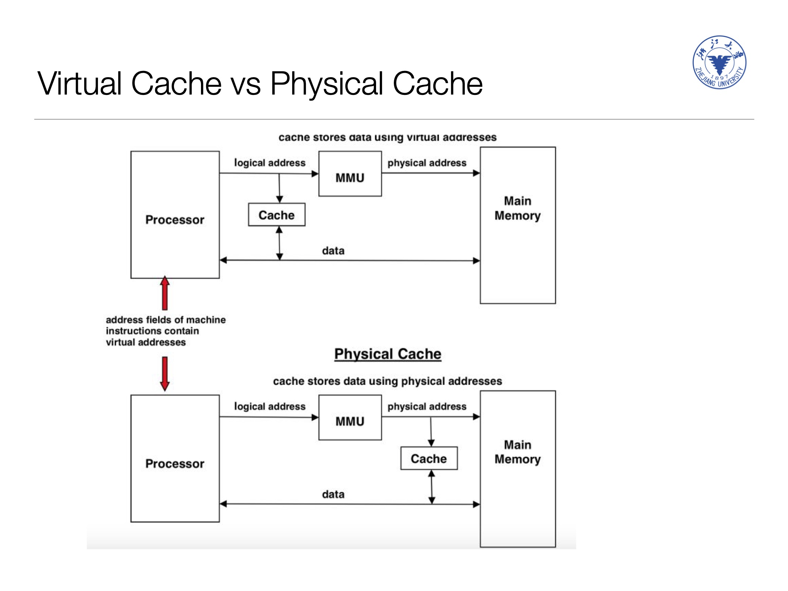
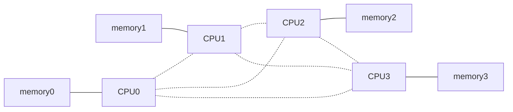
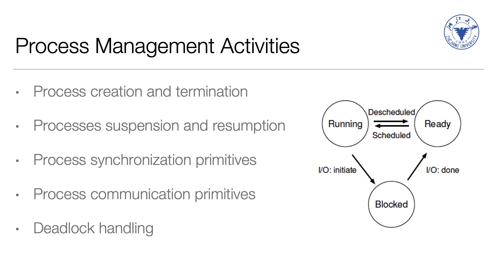
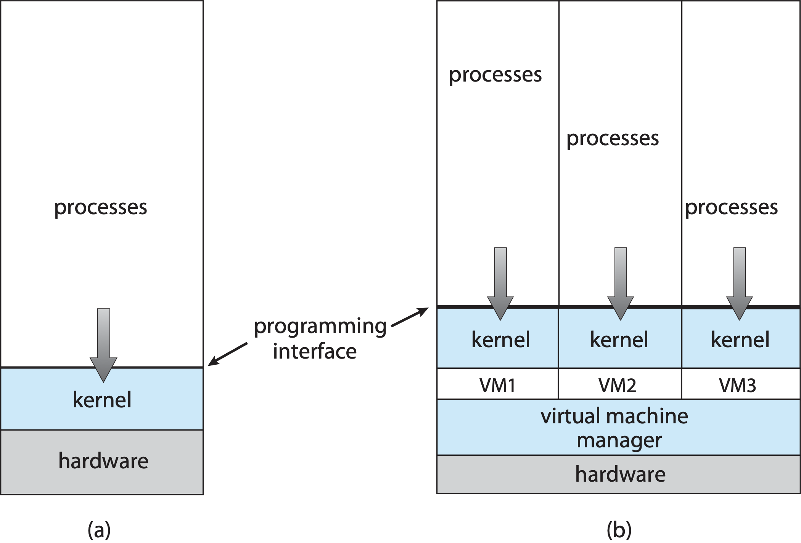
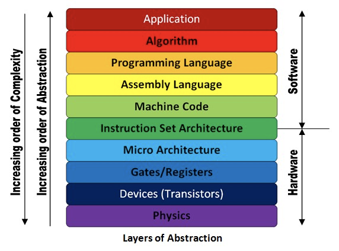

1111 0000: +=1;

1111 0010: -=1;

0101 1111: save reg to reg not(reg)

| PC        | Reg       | MemAddr   | MemData                         |
| --------- | --------- | --------- | ------------------------------- |
| 1000 0000 | 1111 0010 | 0000 1100 | <s>1111 0010</s> 1111 0011 |
| 1000 0001 | 1111 0011 | 0000 1101 | 0010 0001                       |
|           |           | ...       | ...                             |
|           |           | 1000 0000 | 1111 0000                       |
|           |           | 1000 0001 | 0101 1111                       |

Int & Trap

* 中断向量：中断控制器控制，知道是什么发生了中断，将PC跳到中断处理程序处
* interrupt是异步的；trap(软中断)是同步的，由程序来trap，例如`fopen`从硬盘取东西
    * 异步：被中断，特殊的，read的时候可以边拿数据边继续执行同一个进程
    * 同步：自己中断，read的时候等数据拿回来的时候执行别的进程

context(上下文)：保存的被中断时的程序的状态，如栈指针、

Cache

* 内存虚拟化，每个进程都认为自己完整地拥有所有的内存空间
* Cache是通过物理地址进行索引(才能唯一确定)，但是现代CPU都不用PA了，因为从VA到PA需要花时间。同时用VA从Cache拿，然后从MMU获取PA进行对比，如下面的上图 

**CMT** (Chip Multithreading)

多核和超线程

* 超线程：并行取指令，串行执行指令

**NUMA**

CPU之间有高速总线连接，

特殊的嵌入式操作系统：SSD里防止频繁擦除某一块导致的OS，网卡上用于硬件提速的OS

Dual-mode

* CPU提供
    * user mode(非特权模式)：不能access IO控制器所在的内存区域(不能操作设备)、不能换页表，只能做计算
        * 要特殊的事情可以调用kernel mode的接口去做
    * kernel mode(特权模式)：相反
* 简单的操作系统不提供双模式，如嵌入式系统

进程与线程的区别

* 进程是一个程序运行的instance，进程与进程之间是隔离的
    * 一个进程要做n个相对隔离的事务，则可以用n个线程并行执行这几个事务，例如网络App的网络访问和UI要隔离
* 线程是CPU执行的pipeline
    * 每个线程有自己的program counter，说明线程是被cpu调度的实体

并行与并发

* 并行：多个core
* 并发：一个core，轮流使用

* mechanism: how to do it
* policy: what/which will be done

缓冲buffering和缓存cache

* buffering：向更慢的
* cache：向更快的

由函数指针实现面向对象特性

内存虚拟化：软件实现的Virtual mem mangement在虚拟的操作系统之下，才能管理多个OS的kernel(如VPS服务器)

特殊的情况下App层会很低(外内核)，如DBMS

## HW1

* 同时运行两个cpu带来多线程的效果
* mem两次(虚拟)地址不一样，地址随机化，使用disable_aslr.sh可以关闭地址随机化
* thread，两个线程，每个n次，共2n次，但是当足够大时就不是2n了
    * `counter++` ==> `load counter; counter+=1; save counter;`
    * 一个语句至少要3个指令，而线程又不是原子的，因此两个线程同时调度会出现冲突，

