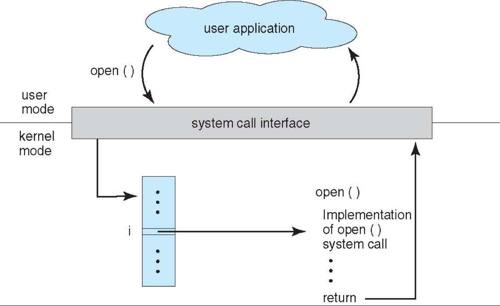
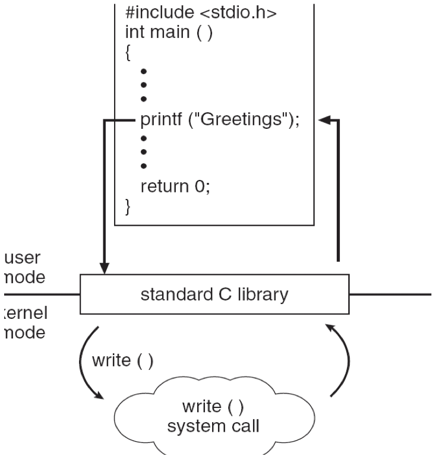
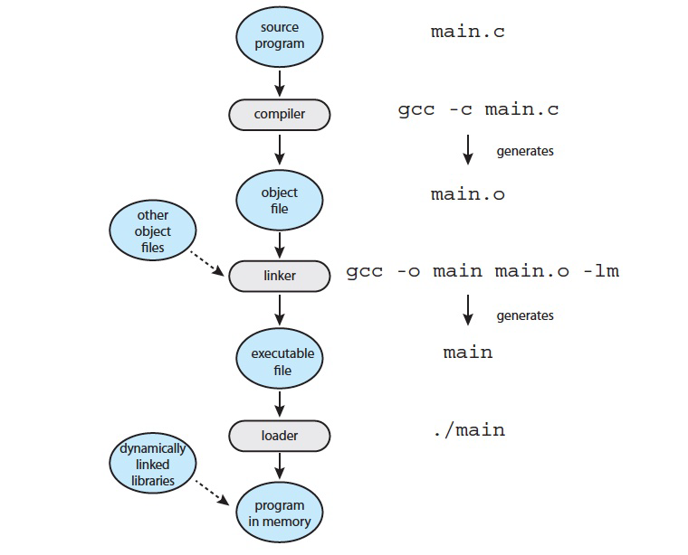
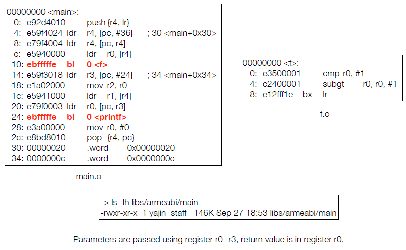
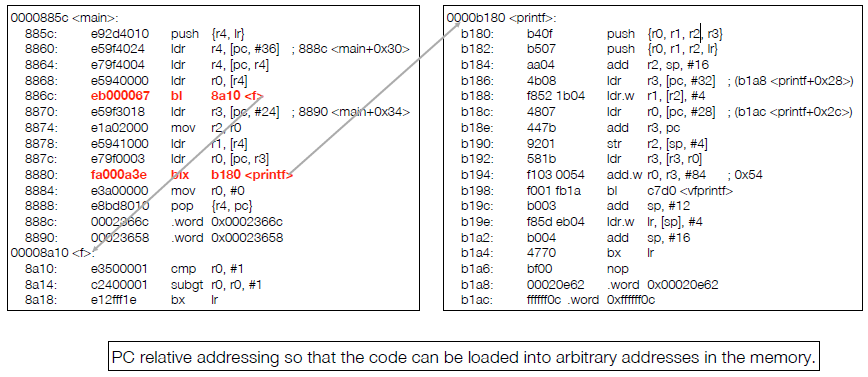
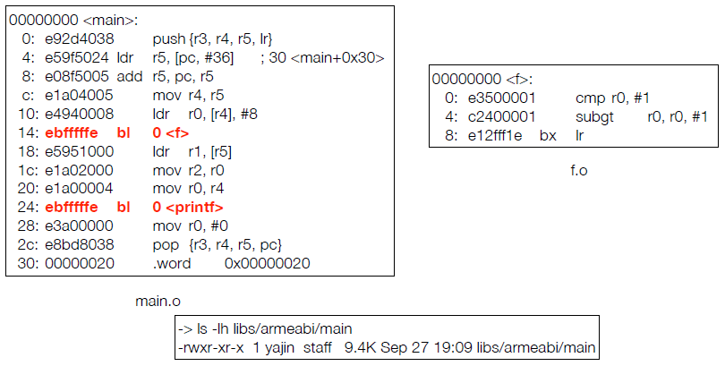
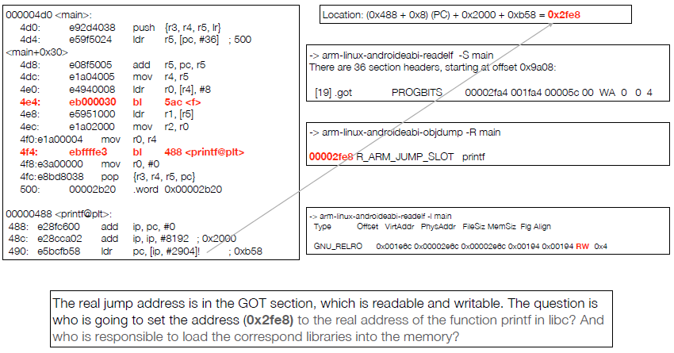
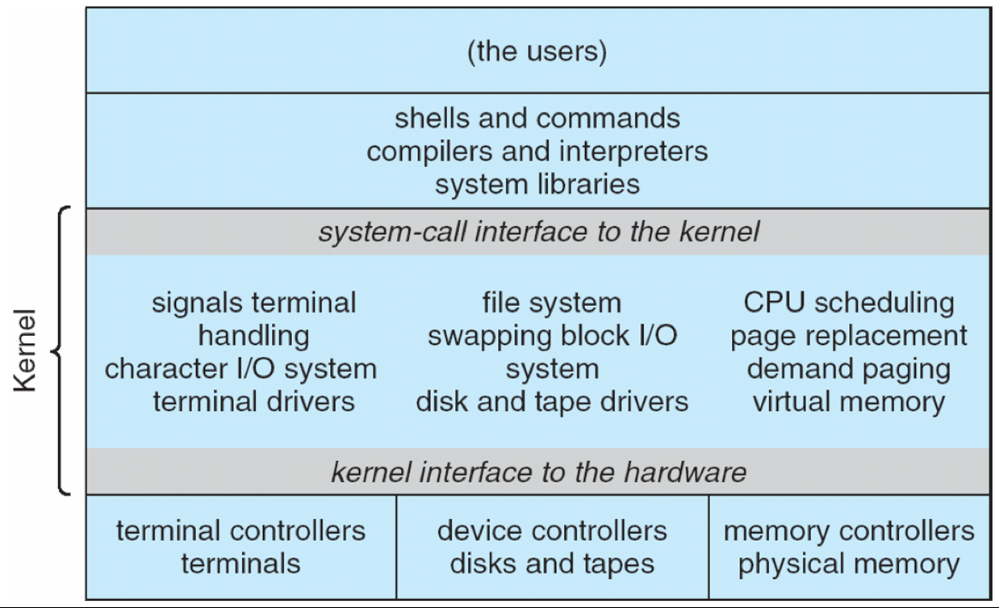
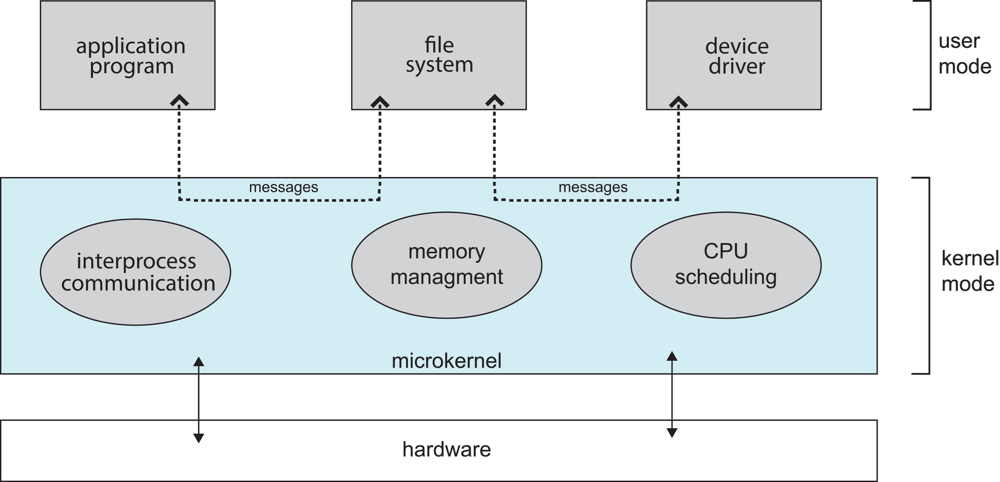
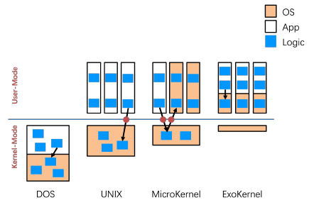

[TOC]

# System call

**Use API**

* Win32
* Posix
* JVM

Like, `open()`, `read()`, etc



C的`printf`调用API的`write`去进行系统调用：



**Parameter Passing**

* Reg
* Block/Table：将参数存在mem的block或table里，传block地址
* Stack


实际的调用方式(寄存器为例)

1. Store syscall number in eax
2. Save arg 1 in ebx, arg 2 in ecx, arg 3 in edx
3. Execute int 0x80 (or sysenter)，软中断
4. Syscall runs and returns the result in eax


**实例：ioctl**

`int ioctl(int fd, unsigned long request, ...);`

fd为open外设时得到的fd，request是要传给外设驱动的东西


MSDOS，FreeDSB

# Linker & Loader



linker for combining .o and .a to .out

loader for combing .lib and .out, then load to memory

* Static library: .a in linux, .lib in windows
* Dynamic library: .so in linux, .dll in windows

## Static link



printf跳转的位置先设为0

link之后：



直接跳到可执行文件的printf的位置

**特点**：由于自洽，文件会更大；且多个exe同时调用库会造成冗余，同时运行多个main的线程也会造成内存冗余（虽然OS可以优化）

Memory：

## Dynamic linking & Loading

### Dynamic linking

：

After dynamic linking：



调用printf：跳到488，设定dll的printf的program counter位置(\<printf@plt\>)

### Loader

**Loader** is the program of the **operating system** which **loads the executable from the disk into the primary memory(RAM) for execution**. It allocates the memory space to the executable module in main memory and then transfers control to the beginning instruction of the program. 

过程

When loading a binary

1. Load the PT_LOADED segments into memory
    * 标记哪些是code哪些是data，如果是code就要标记为可读可执行
2. Resolve the library dependencies and load the corresponding
    libraries into memory
3. Set the value in the GOT entry to the actual address of the
    function in the libraries (not necessary) - since these processes
    are performed when the binary is loading, it may slow the binary
    loading process

> PT_LOAD
>
> Specifies a loadable segment, described by p_filesz and p_memsz. The bytes from the file are mapped to the beginning of the memory segment. If the segment's memory size (p_memsz) is larger than the file size (p_filesz), the extra bytes are defined to hold the value 0 and to follow the segment's initialized area. The file size can not be larger than the memory size. Loadable segment entries in the program header table appear in ascending order, sorted on the p_vaddr member.

1. 查表
2. 获得dll中位置
3. 把dll中位置写到\<printf@plt\>处


# OS Structure

## ==Type==

Many structures:

* simple structure - MS-DOS
    * 没有隔离：因为资源有限，PC使用人群都是技术人员不会乱搞
* Monolithic structure -- UNIX / GNU/Linux
    * 整体内核<br />
        
    * 内核提供资源管理，控制等等，可以跑sys program
    * 缺点：有逻辑分层但是却混杂在一起因此难以管控
    * <u>但是快</u>
* layered structure - an abstraction
    * 层次内核
* microkernel system structure - L4
    * 将尽可能多的东西从内核态放到用户态
    * 优点：隔离，用户态的东西挂了不会影响到内核
    * 缺点：本来可以通过function call的事情变成了通过进程调用（需要通过内核的消息传递，**inter-process communication(IPC)**）才能实现
        * 如下：<br />
    * new trend
    * 
* hybrid: Mach, Minix
* exokernel
    * 内核很小，用户层有高权限

扩展性：微内核强，整体内核弱（通过提供内核模块来增强）

**比较**



## Tracing

Tools include

* strace – trace <u>system calls</u> invoked by a process
* gdb – source-level debugger
* perf – collection of Linux performance tools
* tcpdump – collects network packets

# System Call Ex

fork：返回值为负fork失败，为0为子进程，为正为父进程（返回值是子进程的pid），子进程会继承父进程的内存空间，堆是否会继承>？会继承，VA和PA都一样(显式拷贝)，但是如果子或父对malloc的东西进行了修改则OS才会进行深拷贝(==COW==)

fork+wait：等待父/子结束之后再执行

fork+wait+exec*：

```c++
char * const myargs[3];
myargs[0] = strdup("wc");
myargs[1] = strdup("p3.c");
myarsg[2] = NULL;
execvp(myargs[0], myargs);
```

`execvp`参数：可执行文件的路径；将可执行文件加载到当前内存

重定向：要先打开文件得到文件描述符（stdout是1）


Linux将exec和fork分开，因此可以在fork后exec前做其他事情，例如管道重定向中时，在fork之后将stdout(文件描述符为1)关闭，将另一个文件的设为1

==文件描述符fd：open()的返回值，012分别是stdin stdout stderr==


ptrace

## gdb

断点`(gdb) br *addr`: 通过加special inst（硬件提供指令的实现，直接执行）或undefined encoding（软中断-->中断向量-->操作系统-->gdb）实现