# Process concept

**Part**

* code(text section)
* CPU state: program counter, registers
* Mem
    * stack: arguments, local var, return addr?
    * data sectoin: global var
    * heap: allocated

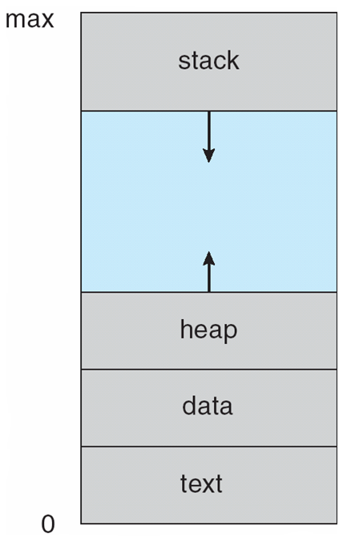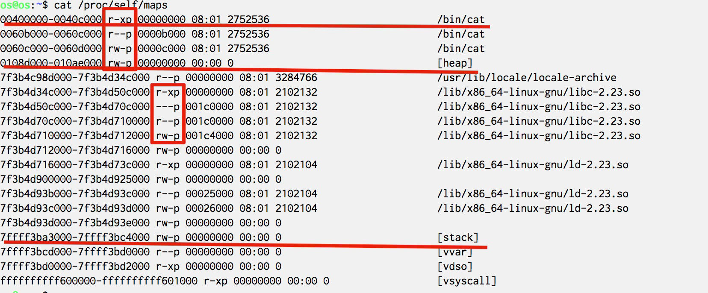

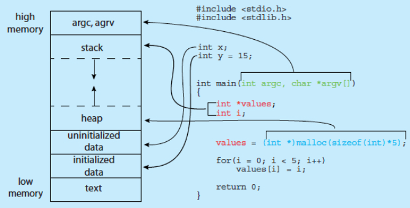

区分初始化和未初始化的全局变量可以节省可执行文件的空间，对于要初始化的，需要在一个段存下15这个数据，而对于不需要初始化的则不用

## Process State

* new: the process is being created
* running: instructions are being executed
* waiting/blocking: the process is waiting for some
event to occur
* ready: the process is waiting to be assigned to a
processor
* terminated: the process has finished execution

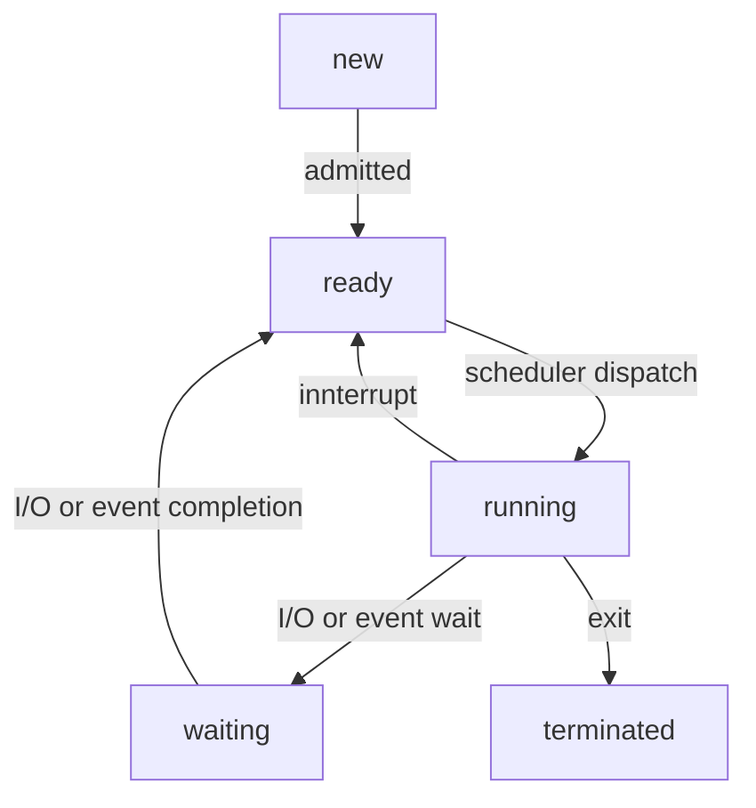

For single-core CPU, 

### PCB: Process Control Block

* In the kernel, ==each== process is associated with a PCB, which is a struct
    * process number (pid)
    * process state
    * program counter (PC)//, PCs if multi-thread
    * CPU registers
    * CPU scheduling information
    * memory-management data
    * accounting data
    * I/O status
* Linux’s PCB is defined in struct task_struct: http://lxr.linux.no/linux+v3.2.35/include/linux/sched.h#L1221

**Thread**

线程是被CPU调度的实体（可以多个PC同时执行），线程是获得资源分配的实体；平时说“进程被调度”时不区分两者，线程的调度也需要类似PCB的结构

# Process scheduling

<u>**CPU scheduler** selects which process should be executed next and allocates CPU</u>

* <u>invoked very frequently</u>, usually in milliseconds: it must be fast


kernel maintains scheduling queues of processes:

* job queue: set of all processes in the system
* ready queue: set of all processes residing in main memory, ready
and waiting to execute
* device queues: set of processes waiting for an I/O device

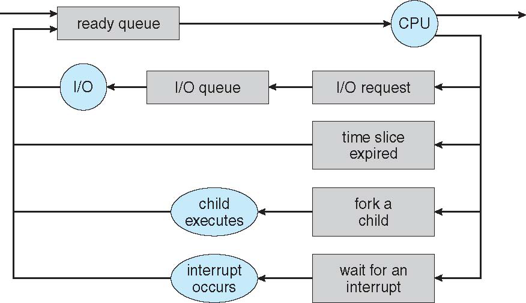


**Mid-term scheduler: Swap In/Out**

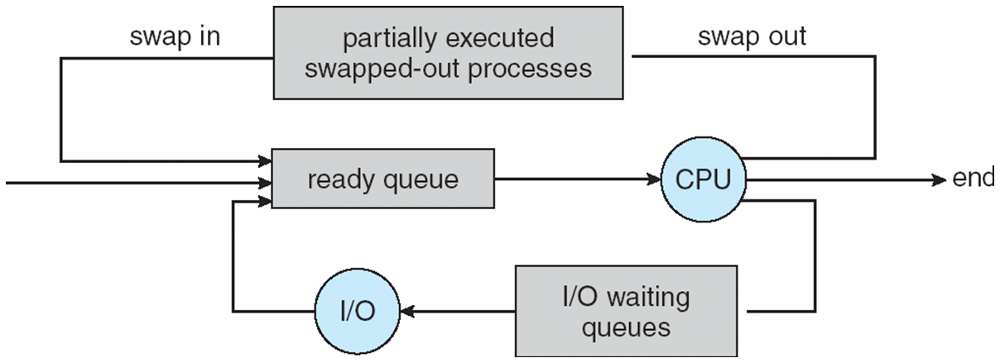

👉swap分区的作用，是以进程为单位进行swap I/O


Scheduler needs to **balance** the needs of:（如果一直在做调度，花在用户态程序上的CPU时间就会变少）
* I/O-bound process
    * spends more time doing I/O than computations
    * many short CPU bursts
* CPU-bound process
    * spends more time doing computations
    * few very long CPU bursts


## Context switch

* Context switch: the kernel switches to another process for execution
    * save the state of the old process
    * load the saved state for the new process
* Context-switch is overhead; CPU does no useful work while
  switching
  * 操作系统在做的事情不会让user process有任何进展
  * the more complex the OS and the PCB, longer the context switch
* Context-switch time depends on hardware support
    * some hardware provides multiple sets of registers per CPU: multiple contexts loaded at once

# Operations on processes

## Process Creation

* Parent process creates children processes, which, in turn create other processes, forming a tree of processes
* process identified and managed via a process identifier (pid)
* Design choices:
* three possible levels of resource sharing: all, subset, none
* parent and children’s address spaces
* child duplicates parent address space (e.g., Linux)
* child has a new program loaded into it (e.g., Windows)
* execution of parent and children
* parent and children execute concurrently
* parent waits until children terminate


UNIX/Linux system calls for process creation

* `fork` creates a new process
* `exec` overwrites the process’ address space with a new program
* `wait` waits for the child(ren) to terminate

Ex. 在bash中调用ls会fork出子进程并在子进程中exec ls(ls通过环境变量PATH获得)

What’s the benefit of separating fork and exec? 


## Process Termination

* Process executes last statement and asks the kernel to delete it (`exit`)
    * OS delivers the return value from child to parent (via `wait`)
    * process’ resources are deallocated by operating system
* Parent may terminate execution of children processes (`abort`), for example:
    * child has exceeded allocated resources
    * task assigned to child is no longer required
    * if parent is exiting, some OS does not allow child to continue（linux允许）
        * all children (the sub-tree) will be terminated - **cascading termination**


**zombie vs orphan**

When child process terminates, it is still in the process table until the parent process calls wait()

* zombie: child has terminated execution, but parent did not invoke wait()
    * 如果释放掉后父进程再调了wait则会出事，因此不能释放
* orphan: parent terminated without invoking wait
    * Systemd(这是个进程) will take over. Systemd will call wait() periodically

## Ex

**Android Process Importance Hierarchy**（不是创建的hierarchy）

* Mobile operating systems often have to terminate processes to reclaim system resources such as memory. From most to least important:
    * Foreground process: visible on screen
    * Visible process: not directly visible, but performing activity that foreground process is referring
    * Service process: streaming music
    * Background process: performing activity, not apparent to the user
    * Empty process: hold no activity
* <u>Android will begin terminating processes that are least important</u>

**Android Zygote**

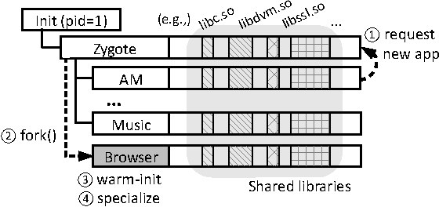

好处：init fork出Zygote的时候会慢（要读所有库），在执行Zygote的子进程的时候由于已经加载好库了，所以会很快

坏处：没有了ASLR，安全性问题

**Chrome**

Multiprocess Architecture

* Many web browsers ran as single process (some still do)
    * If one web site causes trouble, entire browser can hang or crash
    * 共享资源导致的安全问题，例如邮箱和恶意网站共享tab那邮箱内容有可能被窃取
* Google Chrome Browser is multiprocess with 3 different types of processes:
    * Browser process manages user interface, disk and network I/O
    * Renderer process renders web pages, deals with HTML, Javascript. A new renderer created for each website opened
        * Runs in sandbox restricting disk and network I/O, minimizing effect of security exploits
    * Plug-in process for each type of plug-in

# IPC

Inter-process communication

Cooperating process can affect or be affected by the execution of another process

* Advantages of process cooperation
* Information sharing
* Computation speed-up
* Modularity
* Convenience


**Producer-Consumer Problem**

* *Paradigm* for cooperating processes, <u>producer process produces information that is consumed by a consumer process</u>
* For information's communication
    * unbounded-buffer places no practical limit on the size of the buffer
    * bounded-buffer assumes that there is a fixed buffer size

## Models

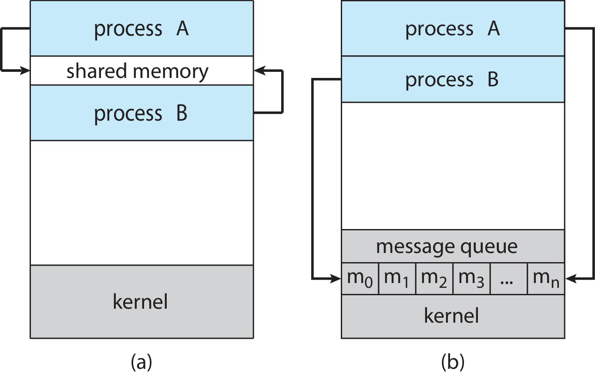

* a: shared memory<!--, aka double mapped-->
* b: message passing

### ShM

* An area of memory shared among the processes that wish to communicate
* The communication is under the control of the users processes not the operating system.
* <u>Major issues</u> is to provide mechanism that will allow the user processes to **synchronize** their actions when they access shared memory.
  * Synchronization：


#### Ex. POSIX ShM

About [Portable Operating System Interface](https://zh.wikipedia.org/wiki/%E5%8F%AF%E7%A7%BB%E6%A4%8D%E6%93%8D%E4%BD%9C%E7%B3%BB%E7%BB%9F%E6%8E%A5%E5%8F%A3)

* Process first creates shared memory segment. A successful call to `shm_open()` returns an integer file descriptor for the shared-memory object.
    * `shm_fd = shm_open(name, O_CREAT | O_RDWR, 0666);`
    * Also used to open an existing segment
* Set the size(bytes) of the object: `ftruncate(shm_fd, 4096);`
* Use `mmap()` to memory-map a file pointer to the shared memory object
    * Reading and writing to shared memory is done by using the pointer returned by `mmap()`.

```c
#include <stdio.h>
#include <stdlib.h>
#include <string.h>
#include <sys/shm.h>

// ftruncate
#include <sys/types.h>
#include <unistd.h>

// shm_open
#include <fcntl.h> /* For O_* constants */
#include <sys/mman.h>
#include <sys/stat.h> /* For mode constants */
// Link with -lrt.

int main() {
    /* the size (in bytes) of shared memory object */
    const int SIZE = 4096;
    /* name of the shared memory object */
    const char *name = "OS";
    /* strings written to shared memory */
    const char *message_0 = "Hello";
    const char *message_1 = "World!";
    /* shared memory file descriptor */
    int fd;
    /* pointer to shared memory obect */
    char *ptr;
    /* create the shared memory object */
    fd = shm_open(name, O_CREAT | O_RDWR, 0666);
    /* configure the size of the shared memory object */
    ftruncate(fd, SIZE);
    /* memory map the shared memory object */
    ptr = (char *)mmap(0, SIZE, PROT_READ | PROT_WRITE, MAP_SHARED, fd, 0);
    /* write to the shared memory object */
    sprintf(ptr, "%s", message_0);
    sprintf(ptr + strlen(message_0), "%s", message_1);

    printf("%s\n", ptr);
    return 0;
}
```

### MsPass

* Processes communicate with each other by exchanging messages
    * without resorting(诉诸、常去) to shared variables
* Message passing provides two operations:
    * send (message)
    * receive (message)
* If P and Q wish to communicate, they need to:
    * establish a <u>communication link</u> between them
        * e.g., a mailbox(indirect) or pid-based(direct)
    * exchange messages via send/receive


**Communication Link**

* Direct communication
    * symmetry addressing: send(P, Message), receive(Q, Message)
    * asymmetry addressing: send(P, message), receive(id, Message)
    * \>?
* Indirect communication
    * send(A, Message), receive(A, Message) mailbox A
    * Mailbox can be implemented in both process and OS
        * *Mailbox owner*: who can <u>receive</u> the message


**Synchronization**

* Message passing may be either blocking or non-blocking
* Blocking is considered synchronous
    * Blocking send. The sending process is blocked until the message is received.
    * Blocking receive. The receiver blocks until a message is available.
* Non-blocking is considered asynchronous
    * Nonblocking send. The sending process sends the message and resumes operation.
    * Nonblocking receive. The receiver retrieves either a valid message or a null.


**Buffering**

Whether communication is direct or indirect, messages exchanged by communicating processes reside in a temporary queue(*buffered message passing*). Basically, such queues can be implemented in three ways:
* zero capacity: 0 messages
    * sender must wait for receiver (rendezvous)
* bounded capacity: finite length of n messages
    * sender must wait if link full(最多m条)
* unbounded capacity: infinite length
    * sender never waits(它是locking的但实际上never blocks)

## Synchronization

我明白啦 shm的sync就是我说的那样 它能确保原子性；messagepass两者的用途不一样，async一般是用于那种对方要处理很久的事务，如果你一直在等对方的回信，就非常浪费时间；而sync一般是用于比如说对方只能接受并处理一个信息且正好现在就在接受或处理，而我现在给他发完就跑信息就直接丢了，所以得等待，这个可以通过*buffered message passing*的模型来使接收者能在处理一个消息的同时将新的消息存入缓存，以此来解决发送者等待时间过长的问题

https://www.cs.cmu.edu/afs/cs/academic/class/15671-f95/www/handouts/concurrency/node7.html

## Ex. Pipes

Pipe acts as a conduit allowing two <u>local</u> processes to communicate

Issues considered (同时也是不同种类的pipes)

* is communication <u>unidirectional</u> or <u>bidirectional</u>?
* in the case of two-way communication, is it <u>half</u> or <u>full-duplex</u>?
* must there exist a relationship (i.e. <u>parent-child</u>) between the processes?
* can the pipes be used over a <u>network</u>?
    * usually only for local processes


**Ordinary Pipes** (aka anonymous pipes in Windows)

* Ordinary pipes allow communication in the producer-consumer style
  * producer writes to the *write-end* of the pipe)
  * consumer reads from the *read-end* of the pipe)
  * ordinary pipes are therefore **unidirectional**
  * Two pipes are needed if we need bidirectional communication
      * Typically, a parent process creates a pipe and uses it to communicate with a child process that it creates via fork(). 
  * Once the processes have finished communicating and have terminated, the ordinary pipe ceases to exist.
* <u>Require parent-child relationship between communicating processes</u>
* Activity: review Linux `man pipe`


**Named Pipes**

* Named pipes are more powerful than ordinary pipes
    * communication is bidirectional
    * no parent-child relationship is necessary between the processes
    * several processes can use the named pipe for communication
    * Named pipes continue to exist after communicating processes have finished.
* Named pipe is provided on both UNIX and Windows systems
    * On Linux, it is called FIFO

Named Pipes到底是什么\>? 实际上Usually a named pipe appears as a file, and generally processes attach to it for IPC.([ref](https://en.wikipedia.org/wiki/Named_pipe)) 这里的named不是指记下process的name而是pipe自带name的意思（也正因如此其生命周期可以独立于进程的生命周期）


# Communication in client-server systems

## Sokcets

* A socket(套接字) is defined as an endpoint for communication
    * concatenation(串联) of IP address and port
    * socket 161.25.19.8:1625 refers to port 1625 on host 161.25.19.8
* Communication consists between a pair of sockets

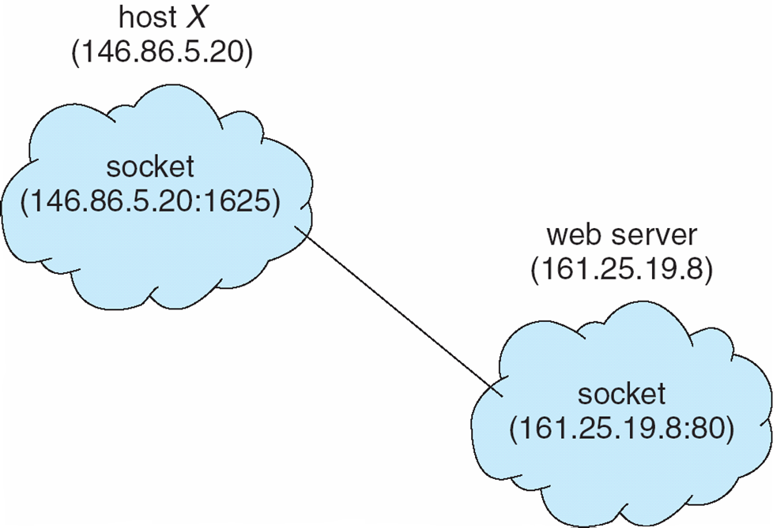


## RPC

Remote Procedure Calls

* Remote procedure call (RPC) abstracts function calls between processes across networks (<u>or even local processes</u>)
* Stub(存根): a proxy for the actual procedure on the remote machine
    * client-side stub locates the server and marshals the parameters
    * server-side stub receives this message, unpacks the marshalled parameters, and performs the procedure on the server
    * return values are marshalled and sent to the client

stub：通过stub与机器（本机或远端机）通信


过程：

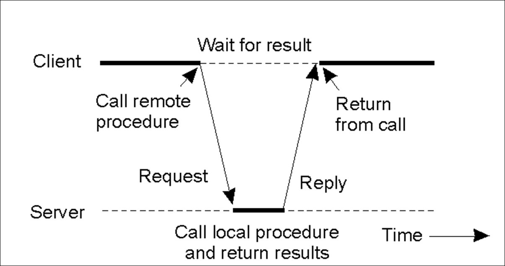

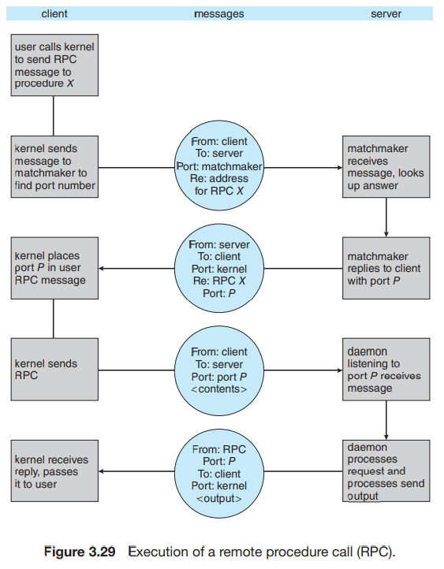

## Ex. \>?

当P1上的A()要调用一个P2上的B()打印'HelloW'，可以调用RPC.B('HelloW')，然后以此创建一个SDK，stub会截取，然后发给P2(如果本地直接发，远端用socket)，P2处理完将返回值返给P1

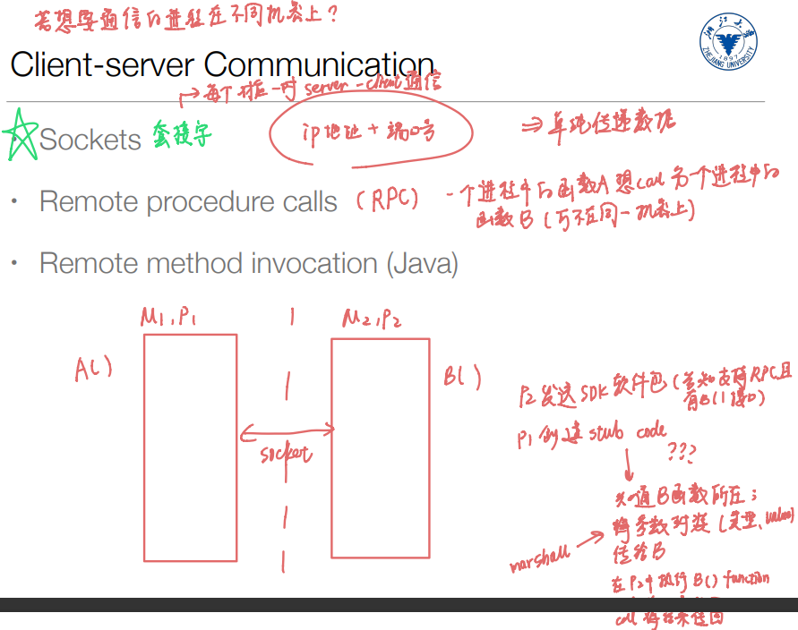

这个过程我还是有点混乱，等网络好了看看智云课堂

