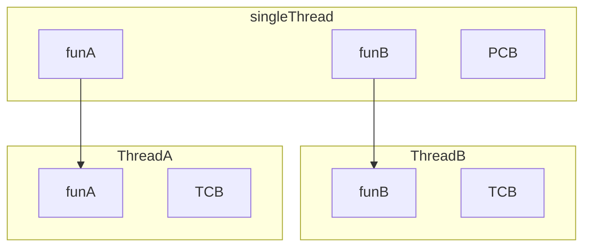

# Basis

## Benefit

* multiple tasks of an application can be implemented by threads
    * e.g., update display, fetch data, spell checking, answer a network request
* process creation is heavy-weight while thread creation is lightweight, why?
    * 线程天生共享资源，不需要重拷贝
* threads can simplify code, increase efficiency
* Kernels are generally multithreaded

## Def

<u>A thread is an **independent** stream of instructions that can be scheduled to run as such by the kernel</u>

Process contains many states and resources
* code, heap, data, file handlers (including socket), IPC
* process ID, process group ID, user ID
* stack, registers, and program counter (PC)

Threads exist within the process, and shares its resources

* each thread has its own essential resources (per-thread resources): **stack**(如果没有独立的栈，则funA和funB同时调用funC就会混乱), **registers**, **program counter**, **thread-specific data**(由于资源是共享的，所以如果线程A要独占某个全局变量，就需要加上修饰符TLS(Thread Local Storage)，但是这也不能阻止线程B通过dereference的方法来取得它)…
* access to shared resources need to be synchronized

Threads are individually scheduled by the kernel

* each thread has its own independent flow of control
* each thread can be in any of the scheduling states

**Benefits**

Responsiveness
* multithreading an interactive application allows a program to continue running
even part of it is blocked or performing a lengthy operation
* Resource sharing
* sharing resources may result in efficient communication and high degree of
cooperation. Threads share the resources and memory of the process by
default.
* Economy
* thread is more lightweight than processes: create and context switch
* Scalability
* better utilization of multiprocessor architectures: running in parallel

## Multi-thread Server Arch

**Nginx**

预先创先好n个进程，每个进程创建m个线程的线程池。

遇到请求先发给一个线程分发的机制，然后会将请求通过队列丢到线程池，

## Concurrency vs Parallelism

* Concurrency
    * 目的是为了节省时间，有时候可能T1执行时要读内存，这时候就可以先进行T2
    * 并发考虑的是切分任务，将其改为可以并发的执行顺序
    * 
* Parallelism
    * 强调同时执行，关注的是程序的结构是否能并行
    * 并行要考虑能否同时进行多个
    * 

**Ex**

* C
* P
* C+P
* Buffer(分发器): 

# Implementation

* *user threads* are supported above the kernel and managed without kernel support
    * three thread libraries: POSIX Pthreads, Win32 threads, and Java threads
    * 从内核角度考虑，由于内核调度的基本单元是进程，因此用户态的线程不能作为被单独调度的实体
* *kernel threads* are supported and managed directly by the kernel
  * all contemporary OS supports kernel threads
  * 线程可以作为内核调度的最基本单元

## Kernel

* To make concurrency cheaper, the execution aspect of process is separated out into threads. As such, the OS now manages threads and processes. All thread operations are implemented in the kernel and the OS schedules all threads in the system. OS managed threads are called kernel-level threads
* In this method, the kernel knows about and manages the threads. No runtime system is needed in this case. Instead of thread table in each process, the kernel has a thread table that keeps track of all threads in the system. In addition, the kernel also maintains the traditional process table to keep track of processes. Operating Systems kernel provides system call to create and manage threads.

* Advantages
    * Because kernel has full knowledge of all threads, scheduler may decide to give more time to a process having large number of threads than process having small number of threads.
    * Kernel-level threads are especially good for applications that frequently block. (block的时候可以换到其他线程
* Disadvantages
    * The kernel-level threads are slow and inefficient. For instance, threads operations are hundreds of times slower than that of user-level threads. (从create和maintain的角度
    * Since kernel must manage and schedule threads as well as processes. It require a full thread control block (TCB) for each thread to maintain information about threads. As a result there is significant overhead and increased in kernel complexity.

## User

用进程的概念进行线程调度

* Kernel-Level threads make concurrency much cheaper than process because, much less state to allocate and initialize. However, for fine-grained concurrency, kernel-level threads still suffer from too much overhead. Thread operations still require system calls. Ideally, <u>we require thread operations to be as fast as a procedure call.</u> Kernel-Level threads have to be general to support the needs of all programmers, languages, runtimes, etc. For such fine grained concurrency we need still "cheaper" threads.
* To make threads <u>cheap and fast</u>, they need to be implemented at user level. User-Level threads are managed entirely by the run-time system (user-level library). <u>The kernel knows nothing about user-level threads and manages them as if they were single-threaded processes.</u> User-Level threads are small and fast, each thread is represented by a PC, register, stack, and small threadcontrol block. Creating a new thread, switching between threads, and synchronizing threads are done via procedure call. i.e no kernel involvement. User-Level threads are hundred times faster than Kernel-Level threads.

* Advantages:
    * The most obvious advantage of this technique is that a user-level threads package can be implemented on an Operating System that does not support threads.
    * User-level threads does not require modification to operating systems.
    * Simple Representation: each thread is represented simply by a PC, registers, stack and a small control block, all stored in the user process address space.
    * Simple Management: This simply means that creating a thread, switching between threads and synchronization between threads can all be done without intervention of the kernel.
    * Fast and Efficient: Thread switching is not much more expensive than a procedure call. (不需要sys call)
* Disadvantages
  * User-Level threads are not a perfect solution as with everything else, they are a trade off. Since, User-Level threads are invisible to the OS they are not well integrated with the OS. As a result, Os can make poor decisions like scheduling a process with idle threads, blocking a process whose thread initiated an I/O even though the process has other threads that can run and unscheduling a process with a thread holding a lock. Solving this requires communication between between kernel and user-level thread manager.
  * There is a lack of coordination between threads and operating system kernel. Therefore, process as whole gets one time slice irrespect of whether process has one thread or 1000 threads within. It is up to each thread to relinquish control to other threads. (内核和用户线程之间无法沟通)
  * User-level threads requires non-blocking systems call i.e., a multithreaded kernel.   Otherwise, entire process will blocked in the kernel, even if there are runnable threads left in the processes. For example, if one thread causes a page fault, the process blocks.

## Model between KernelT and UserT

A relationship must exist between user threads and kernel threads

Kernel threads are the real threads in the system, so for a user thread to make progress the user program has to have its scheduler take a user thread and then run it on a kernel thread.

### Many-to-one

Many user-level threads mapped to a single kernel thread
* thread management is done by the thread library in user space
(efficient)
* entire process will block if a thread makes a blocking system call
    * convert blocking system call to non-blocking (e.g., select in
    Unix)?
* multiple threads are unable to run in parallel on multi-processors

Examples:

* Solaris green threads

## One-to-one

Each user-level thread maps to one kernel thread
* it allows other threads to run when a thread blocks
* multiple thread can run in parallel on multiprocessors
* creating a user thread requires creating a corresponding kernel thread
* it leads to overhead
    * 一个UserT必须有KernelT
* most operating systems implementing this model limit the number of
threads

Examples

* Windows NT/XP/2000
* Linux

## Mant-to-many

### Two-level

# Issues

* Semantics of `fork` and `exec` system calls
    * 是否要拷贝所有线程，是否要执行所有code
* Signal handling
    * 例如有线程注册了一个信号处理函数，那某个线程发出的异常的信号要发送到哪里？是自己的信号处理函数还是整个进程的信号处理函数
* Thread cancellation of target thread
* Thread-specific data
* Scheduler activations

## fork & exec

## Signal handling

* A signal can be synchronous (exceptions) or asynchronous (e.g., I/O)
    * synchronous signals are delivered to the same thread causing the signal
* Asynchronous signals(例如`kill -9`就是) can be delivered to:
    * the thread to which the signal applies
    * every thread in the process
    * certain threads in the process (signal masks)
    * a specific thread to receive all signals for the process

## Thread Cancellation

* Thread cancellation: terminating a (target) thread **before** it has finished
    * does it cancel the target thread immediately or later?
* Two general approaches:
    * asynchronous cancellation: terminates the target thread immediately
        * what if the target thread is in critical section requesting resources?
        * 可能会导致其他线程资源异常
    * deferred cancellation: allows the target thread to **periodically** check if it should be cancelled (周期性看是否有人请求，有的话就先释放资源然后再自杀
        * Pthreads: cancellation point

。。。

## Thread Specific Data

Different from local variables

* Local variables visible only during single function invocation
* TLS visible across function invocations

Similar to static data

* TLS is unique to each thread

<!--不用TLS如何实现：-->

<!--LWP课本上的与linux的概念冲突，在Linux里指的是内核线程-->

# OS Example

## WinXP

## Linux

* Linux has both fork and clone system call
* Clone accepts a set of flags which determine sharing between the parent and children
    * FS/VM/SIGHAND/FILES —> equivalent to thread creation
        * CLONE_FS, CLONE_VM, CLONE_SIGHAND, CLONE_FILES
    * no flag set no sharing (copy) —> equivalent to fork
        * fork可以带一些特殊的flag
    * Linux doesn’t distinguish between process and thread, uses term task rather than thread

Pthreads标准

同一个func被多个线程调用存在的问题