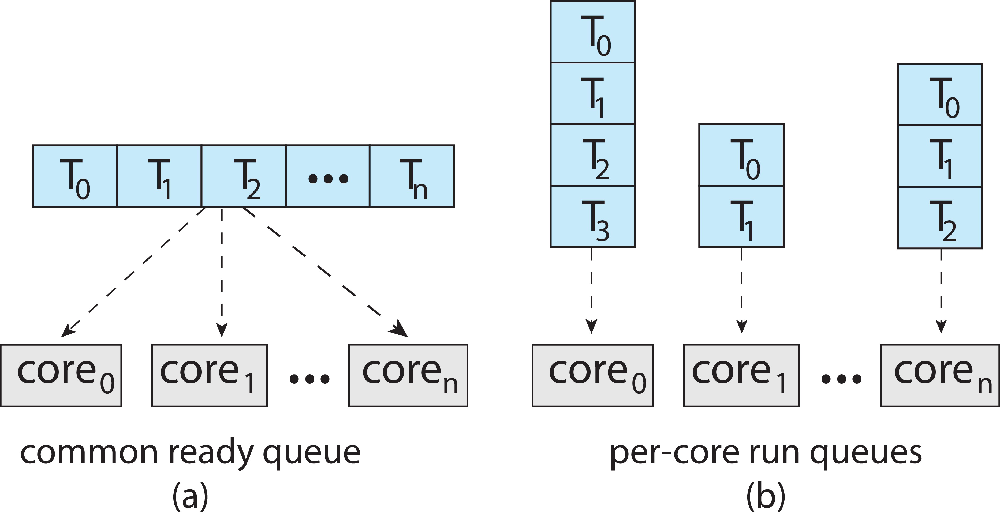
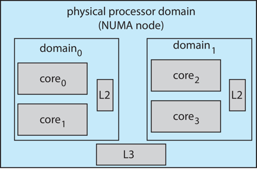

[TOC]

# Basis

## Burst

* Process execution consists of a cycle of CPU execution and I/O wait
    * [CPU burst and I/O burst](https://www.quora.com/What-is-meant-by-CPU-Burst-and-I-O-Burst) alternate (交替)
    * CPU burst distribution varies greatly from process to process, and from computer to computer, but follows similar curves
* Maximum CPU utilization obtained with multiprogramming
    * CPU scheduler selects another process when current one is in I/O burst

## CPU scheduler

* Circumstances 
    1. switches from running to waiting state (e.g., wait for I/O)
    2. switches from running to ready state (e.g., when an interrupt occurs)
    3. switches from waiting to ready (e.g., at completion of I/O)
    4. terminates 
* ==Scheduling under condition 1 and 4 only is **nonpreemptive**==
    * 因为这两种情况下，进程本来就不会再运行了 
    * once the CPU has been allocated to a process, the process keeps it until terminates or waiting for I/O
    * also called cooperative scheduling
* **Preemptive** scheduling schedules process also in condition 2 and 3
    * preemptive scheduling <u>needs hardware support such as a timer</u>
    * synchronization primitives are necessary 
* 可抢占式内核与不可抢占式内核
    * waiting either the system call or I/O block to complete
        * 例如，可抢占式的，P1调用了syscallX（正在执行），如果一个中断调用了P2（P1P2均为U态），P2又调用syscallX，如果前一次syscallX（这时候还没执行完）修改过global data（内核只有一份进程）了，则就可能会有问题
    * 现代内核都是抢占式的

## Kernel Preemption

* Preemption also affects the OS kernel design
    * kernel states will be inconsistent if preempted when updating shared data
    * i.e., kernel is serving a system call when an interrupt happens
* Two solutions:
    * waiting either the system call to complete or I/O block
        * ==kernel is nonpreemptive (still a preemptive scheduling for processes!)==
            * ==内核是非抢占的用户态仍可能是抢占的==
    * disable kernel preemption when updating shared data
        * recent Linux kernel takes this approach:
            * Linux supports SMP
            * shared data are protected by kernel synchronization
            * disable kernel preemption when in kernel synchronization
            * turned a non-preemptive SMP kernel into a preemptive kernel

## Dispatcher

The dispatcher is the module that <u>gives control of the CPU’s core to the process selected by the CPU scheduler</u>. This function involves the following:

* Switching context from one process to another
* Switching to user mode
* Jumping to the proper location in the user program to resume that program

Dispatch latency: the time it takes for the dispatcher to stop one process and start another running

# ==Scheduling criteria==

* **CPU utilization**: percentage of CPU being busy 🔼
* **Throughput**: # of processes that complete execution per time unit 🔼
* **Turnaround time**（交互时间）: the time to execute a particular process <u>from submission(开始) to completion</u> 🔽
    * 包括了waiting time和burst time
    * Turnaround Time = Completion Time – Arrival Time
        * Arrival Time: Time at which the process arrives <u>in the ready queue</u>.
        * Completion Time: Time at which process <u>completes</u> its execution.
* **Waiting time**: the total time spent waiting in the ready queue 🔽
    * Waiting Time = Turn Around Time – Burst Time
        * Burst Time: Time required by a process for <u>CPU execution</u>.
    * <u>调度算法的评估一般是考虑这个</u>
* Response time: the time it takes from when <u>a request was submitted until the first response is produced</u> 🔽
    * the time it takes to start responding

**Other Optmization Criteria**

* often consider average val
* but sometimes need the max/min val, real-time OS
* for interactive system, minimize <u>variance</u> in response time，用户体验才好

==怎么算看作业==

# Scheduling algorithms

==看作业==

* First-come, first-served scheduling (FCFS)
    * nonpreemptive
* Shortest-job-first scheduling (SJF)（弄懂就好了）
    * optimal: minimum average waiting time
    * preemptive or nonpreemptive (depends on algorithm)
        * preemptive: reschedule when a process <u>arrives</u> (因此只有新来的能抢别人)
        * nonpreemtive: PPT page21，注意P1执行了1单位时间就被替换
* Priority scheduling
    * preemptive or nonpreemptive (取决于是否交换调度)
    * 会有饥饿的问题（低优先级的任务一直得不到运行机会）。可以通过动态改优先级（aging，随时间逐渐增加优先级）解决
* Round-robin scheduling (RR)
    * 轮流，每个人给长度为Q的时间片（每Time Quantum个时间片轮一次），跑完了就给别人，没跑完还是得给
    * Q太大，没意义；Q太小：contex switch特别频繁
* Multilevel queue scheduling
    * 进程分类（放在不同queue里，永久），每个queue用不同的调度算法
    * 在不同的类之间还有个调度方法（如果是单核），例如可以：interactive: RR, batch: FCFS
* Multilevel feedback queue scheduling
    * 将进程先后进入不同的queue

# ~~Thread scheduling~~

前面都只考虑单线程进程。

* OS kernel schedules kernel threads
    * system-contention scope (SCS): competition among all threads in system
    * kernel does not aware user threads
* Thread library schedules user threads onto LWPs (这里指的是映射的LWP，处在用户态)
    * used in many-to-one and many-to-many threading model
    * process-contention scope (PCS): scheduling competition within the
    process
    * PCS usually is based on priority set by the user
    * user thread scheduled to a LWP do not necessarily running on a CPU
        * OS kernel needs to schedule the kernel thread for LWP to a CPU

## ~~Pthread~~

* API allows specifying either PCS or SCS during thread creation
    * pthread_attr_set/getscope is the API
        * PTHREAD_SCOPE_PROCESS: schedules threads using PCS scheduling : number of LWP is maintained by thread library
        * PTHREAD_SCOPE_SYSTEM: schedules threads using SCS scheduling
* Which scope is available can be limited by OS
    * e.g., Linux and Mac OS X only allow PTHREAD_SCOPE_SYSTEM

# Multiple-processor scheduling

## SMP

symmetric multiprocessing: each processor is self-scheduling

* scheduling data structure are shared, needs to be synchronized，需要锁
* used by common operating systems，per-core run queues 仍是一个OS的实例，但是多个core可以有不同的queue（不是有多个实例）
    * All threads may be in a common ready queue (a)
    * Or each processor may have its own private queue of threads (b)
    * 

## Other

### Load Balancing

If SMP, need to keep all CPUs loaded for efficiency

* Load balancing attempts to keep workload evenly distributed
* Push migration – periodic task <u>checks load</u> on each processor, and if found pushes task from overloaded CPU to other CPUs
* Pull migration – idle processors pulls waiting task from busy processor

### Processor Affinity

亲和性

* When a thread has been running on one processor, the <u>cache</u> contents of that processor <u>stores the memory accesses</u> by that <u>thread</u>.
    * We refer to this as a thread having affinity for a processor (i.e. “processor affinity”)
    * 一个进程从一个处理器迁移到另一个处理器得重构cache（本来的命中率是较高的），这很耗资源，因此要尽量使同一个进程在同一个处理器上运行
* Load balancing may affect processor affinity as a thread may be moved from one processor to another to balance loads, yet that thread loses the contents of what it had in the cache of the processor it was moved off of.
* Soft affinity – the operating system attempts to keep a thread running on the same processor, but <u>no guarantees</u>.
* Hard affinity – allows a process to <u>specify</u> a set of processors it may run on. (指定不允许转移)

### ==NUMA-aware==

If the operating system is NUMA-aware, it will assign memory closes to the CPU the thread is running on.

## ~~CMT~~

chip multithreading

如果有两套regs则只有ALU需要复用

## ~~Real-Time CPU Scheduling~~

* Can present obvious challenges
    * Soft real-time systems – <u>Critical</u> real-time tasks have the <u>highest priority</u>, but <u>no guarantee</u> as to when tasks will be scheduled
    * Hard real-time systems – task must be serviced by its <u>deadline</u>

# Operating systems examples

## Linnux

### CFS

* Completely Fair Scheduler (CFS)
* Scheduling classes
    * Each has specific priority
    * Scheduler picks highest priority task in highest scheduling class
    * Rather than quantum based on fixed time allotments, based on proportion of CPU time (nice value)
        * Less nice value will get high proportion of CPU time
    * 2 scheduling classes included, others can be added
        * default
        * real-time

### Scheduling domain

* Linux supports load balancing, but is also NUMA-aware.
* **Scheduling domain** is a set of CPU cores that can be balanced against one another.
* Domains are organized by what they share (i.e. cache memory.) Goal is to **keep threads from** migrating between domains.
* 

## Windows

* Windows uses priority-based preemptive scheduling
    * Highest-priority thread runs next
    * Dispatcher is scheduler
* Thread runs until (1) blocks, (2) uses time slice, (3) preempted by higher-priority thread
    * Real-time threads can preempt non-real-time
* **32-level** priority scheme: **Variable class** is 1-15, **real-time class** is 16-31
* Priority 0 is memory-management thread
* Queue for each priority
* If no run-able thread, runs idle thread

# ~~Mars~~

tracing：记录基本块的初始PC地址即可

抢占式线程调度：高优先级可以剥夺低优先级

其中优先级：天气记录<通讯<信息总线，三个线程都会往共享的资源里写东西（需要锁mutex）

当低优先级的线程拿到了mutex的锁，被中优先级的抢占了，中优先级的跑了很长时间，如果高优先级的要跑这个资源，就会被因为超时被系统rest

**优先级反转**

高优先级的在等一个被低优先级锁住的锁

修复：发送一个脚本给火星车，修改mutex的属性（二进制修改）