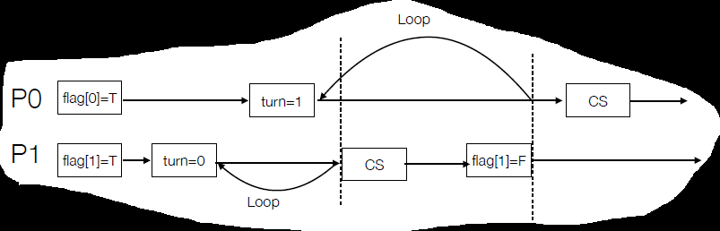

[TOC]

# Basis

**Uncontrolled Scheduling**

之前那个双线程运行`counter++`结果不对的demo就是个例子

==**Race Condition**==

Several processes (or threads) access and manipulate the same data concurrently and the <u>outcome</u> of the execution depends on the particular <u>order</u> in which the access takes place, is called a race condition


# Critical Section

临界区

**Def**

> * Consider system of n processes {p~0~, p~1~, … p~n-1~}
> * <u>Each process has a critical section segment of code</u>
>     * <u>e.g., to change common variables, update table, write file, etc.</u>
> * Only one process can be in the critical section
>     * when one process in critical section, no other may be in its critical section
>     * each process must ask permission to enter critical section in **entry section**
>     * the permission should be released in **exit section**
>     * Other is **remainder section**
>
> ```pseudocode
> do {
>     entry sec;
>         critical sec;
>     exit sec;
>         remainder sec;
> } while(true)
> ```


**内核中的race condition的例子**

fork需要用next_available_pid来找出\$\{字面意思\}，如果两个进程同时调用了fork，那么他们的子进程可能有同一个pid（如果没有Mutual Exclusion）


## Non/Preemptive Kernel

单核系统只要在修改共享资源时阻止中断就能防止临界区问题，但是对于多核系统，只阻止中断是没有用的

* Preemptive – allows preemption of process when running in kernel mode
* Non-preemptive – <u>runs until exits kernel mode, blocks, or voluntarily yields CPU</u>
    * Essentially free of race conditions in kernel mode


执行完中断是否检查有优先级更高的进程

* 是，抢占式：允许处于内核模式的进程被抢占
* 否，直接返回，非抢占式：不允许处于内核模式的进程被抢占
* 感觉这个的概念上不是traditional的抢占，确实，这是内核态抢占

Kernel preemption can occur

* When an interrupt handler exits, before returning to kernel-space
* When kernel code becomes preemptible again
* If a task in the kernel explicitly calls schedule()
* If a task in the kernel blocks (which results in a call to schedule())

抢占内核的好处

* 更适合实时编程
* 响应更快


## Solution to CS: 3 Reqs

==看看==

* Mutual Exclusion 互斥
    * only one process can execute in the critical section
* Progress 前进
    * 当cs空出来时，只有不在remainder sec的程序能选择谁下一个进入cs，且这个选择不能无限推迟
    * PPT: 06_sync(2)的16页
    * if no process is executing in its critical section and some processes wish to enter their critical section, then only <u>those processes that are not executing in their remainder sections can</u> participate in <u>deciding which will enter its critical section next</u>, and <u>this selection cannot be postponed indefinitely</u>
* Bounded waiting 有限等待
    * 不能无限等待：从一个进程发出进入临界区的请求到请求获得允许，其他进程进入他们的临界区的次数有上限
    * it <u>prevents starvation</u>


# Peterson's Sol（感觉不考）



```c
// P0
do {
    flag[0] = TRUE;
    turn    = 1;  // 这里不能是自己，否则可能会两个都进到CS
    while (flag[1] && turn == 1) ;
        critical section;
    flag[0] = FALSE;
        remainder section;
} while (TRUE);

// P1
do {
    flag[1] = TRUE;
    turn    = 0;
    while (flag[0] && turn == 0) ;
        critical section;
    flag[1] = FALSE;
        remainder section;
} while (TRUE);
```

* **Mutual Exclusion**：假设P0进，则turn==1，P1不可能进
* **Progress**：在cs和rs之间将flag复位是让另一个进入cs的语句
* **Bounded Waiting**：Pi最多等Pj一次


# Hardware Sync

```
x = 100;
flag = true;
```

被乱序执行（例如编译器优化）会导致线程错乱


## Sequential Consistency

Proram order: you write

Execution order: 编译器会优化，然后CPU可能会乱序执行

Perceived order: 


## Hardware support

1. Memory barriers
    * 两句中间加入一个特殊指令告诉CPU
2. Hardware instructions
    * test-and-set: either test memory word and set value
    * swap: swap contents of two memory words
    * 硬件级指令
3. Atomic variables
    * 原子性的自增变量

### Memory barriers

* Memory model are the memory guarantees a computer architecture makes to application programs.
* Memory models may be either:
    * **Strongly ordered** – where a memory modification of one processor is immediately visible to all other processors.
    * **Weakly ordered** – where a memory modification of one processor may not be immediately visible to all other processors.
* A memory barrier is an instruction that <u>forces any change in memory to be propagated</u> (made visible) to all other processors.

```c
// Thread 1 now performs
while (!flag)
    memory_barrier();
print(x);

// Thread 2 now performs
x = 100;
memory_barrier();
flag = true;
```

### ==Hardware instructions==

==要求本身的操作是原子的。虽然demo中用了多条C指令，但实际上CPU（hardware）中一条指令就能解决了==

#### Test-and-set

```c
// Def
bool test_set(bool *target) {
    bool rv = *target;
    *target = TRUE;
    return rv:
}

// shared variable: bool lock = FALSE
do {
    while (test_set(&lock)) ;  // busy wait
        /* critical section */
    lock = FALSE;
        /* remainder section */
} while (TRUE);
```

第一个进入的，由于返回FALSE，所以进入CS，由于在进入过程中顺便把lock置位了，所以其他的不能进入，直到第一个从CS出来然后把lock复位

#### Compare-and-swap

```C
// Def
int compare_and_swap(int *value, int expected, int new_value) { 
    int temp = *value;
    if (*value == expected)  // 这个好像没有也行
        *value = new_value;
    return temp;
}

// shared variable: bool lock = 0
const int exp_val = 0;
const int new_val = 1;
while (true) {
    while (compare_and_swap(&lock, exp_val, new_val) != exp_val) ; /* do nothing*/
        /* critical section */
    lock = exp_val;
        /* remainder section */
}
```

第一个进入cmp&swap的进程，返回exp_val，由于返回值==exp_val，所以进入CS。由于cmp&swap过程中被改为new_val，因此1. cmp&swap中val不会被改为new_val；2. cmp&swap的返回值是new_val!=exp_val；综合12，其他进程全部死循环

#### Atomic variables

Typically, <u>instructions</u> such as compare-and-swap are used as <u>building blocks</u> for other synchronization tools.

One tool is an atomic variable that provides atomic (uninterruptible) updates on basic data types such as integers and booleans.

For example, the increment() operation on the atomic variable sequence <u>ensures sequence is incremented without interruption</u>: `increment(&sequence);`

```c
void increment(atomic_int *v) {
    int temp;
    do {
        temp = *v;
    } while (temp != (compare_and_swap(v, temp, temp + 1)));  // 不相等表示*v被其他进程改过了（如果是自己改的，则返回值还是temp才对）
    return;
}
```

## Mutex Lock

==用hardware inst构建的上层API==

Mutex is the abbr of mutal exclusion，所以意即互斥锁


* Protect a critical section by first acquire() a lock then release() the lock
    * Boolean variable indicating if lock is available or not
* Calls to acquire() and release() must be atomic
    * Usually implemented via hardware atomic instructions such as compare-and-swap.
* But this solution <u>requires [busy waiting]()</u>
* This lock therefore called a <u>spinlock</u>


**Implementation** (Only spinning)

* acquire and release must be atomical
* Both test-and-set and compare-and-swap can be used to implement these functions. (>????)

```c
// Def
void acquire() {
    while(!available)  // other held ==> !available==true ==> dead-loop
        ;
    available = false;
}

void release() {
    available = true;
}

// Usage
while(true) {
    acquire();
        // critical section
    realease();
        // remainder section
}
```


**问题**：等待时间。例如线程T0刚拿到锁就被中断了，这是其他线程得全部等着(spin)直到T0从中断回来、执行完CS、释放锁，才能执行


**yield**

yield-> moving from running to ready，拿不到锁自动把位置让给其他人

```c
void init() {
    flag = 0;
}
void lock() {
    while(TestAndSet(&flag, 1) == 1)
        yield();  // Give up CPU
}
void unlock() {
    flag = 0;
}
```

但是yield效率仍然不够，例如有100个线程，T0拿到了锁 （PPT66页 什么意思哦）

## Semaphore

==用于多资源的共享，而不仅是0和1。<u>value表示可用资源的数量，不能为负。</u>（用另外的方式实现可以为负，那表示的意义就是多少个进程正在等待这个资源）==

* Semaphore S is an integer variable

    * e.g., to <u>represent how many units of a particular resource is available</u>

* It can <u>only be updated with two atomic operations: `wait` and `signal`</u>
    * spin lock can be used to guarantee atomicity of wait and signal

    * a simple implementation with busy wait can be: 

        * ```c
            wait(type &s) {
                while(s <= 0)
                    ;  // No avaiable resource
                s--;
            }
            ```

        * ```c
            signal(type &s) {
                s++;
            }
            ```

* 并不能保护共享资源，只是控制几个人能进入指定代码区域（如果要在代码区域内进行资源保护还是得通过锁来实现，或者将信号量的值设为1，此时就相当于一个锁

* 信号量在不同类型的进程之间进行同步


==**Type**==

* **Counting semaphore**: allowing arbitrary resource count，用于计数

* **Binary semaphore**: integer value can be only 0 or 1

    * 等同于mutex lock

    * ```c
        Semaphore mutex;  // initialized to 1
        do {
            wait(mutex);
            // critical
            signal(mutex);
            // remainder section
        } while (TRUE);
        ```


**Semaphore w/ Waiting Queue**

* Associate a waiting queue with each semaphore
    * place the process on the waiting queue if `wait` cannot return immediately
    * wake up a process in the waiting queue in `signal`
* There is no need to busy wait
* Note: wait and signal must still be atomic

```c
void wait(semaphore *S) {
    S->value--;
    if (S->value < 0) {  // 没位置了就加到waiting queue
        add this process to S->list;  // waiting queue
        block();
    }
}
void signal(semaphore *S) {
    S->value++;
    if (S->value <= 0) {  // 没东西了就从waiting queue里wake up一个
        remove a process P from S->list;  // wake up
        wakeup(P);
    }
}
```


### ==课本的实现==


## Other

* **Deadlock**: two or more processes are waiting indefinitely for an event that can be caused by only one of the waiting processes
* **Starvation**: indefinite blocking
    * a process may never be removed from the semaphore’s waiting queue
    * does starvation indicate deadlock?
        * ？感觉应该不会？
* **Priority Inversion**: a higher priority process is indirectly preempted by a lower priority task
    * e.g., three processes, P~L~, P~M~, and P~H~ with priority P~L~ < P~M~ < P~H~
        1. P~L~ holds a lock that was requested by P~H~ ➱ P~H~ is blocked
        2. P~M~ becomes ready and preempted the P~L~ (P~M~在P~H~之前执行，且没用锁)
    * It effectively "inverts" the relative priorities of P~M~ and P~H~ (P~M~ > P~H~)
    * Solution: **priority inheritance**
        * temporary assign the highest priority of waiting process (P~H~) to the process holding the lock (P~L~)