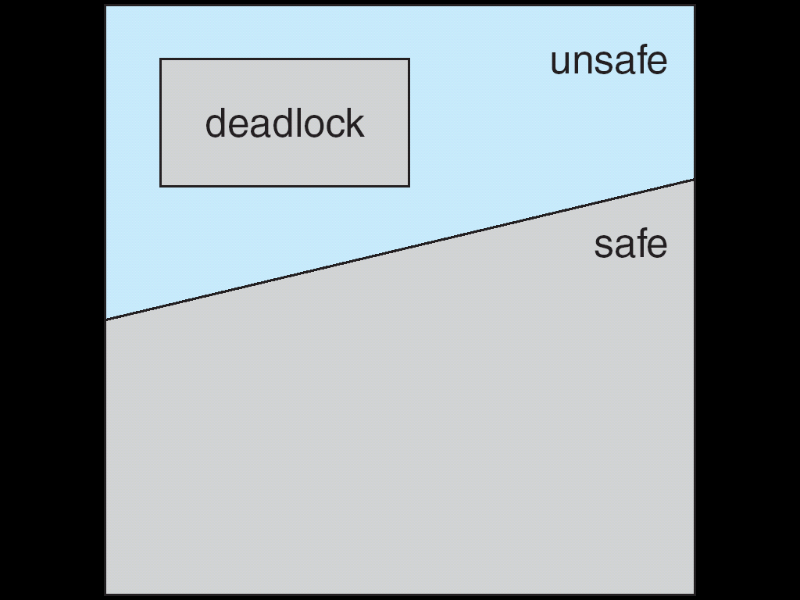
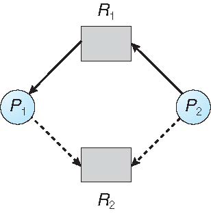
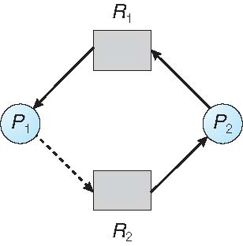

[TOC]

# Intro

## ==Four Conditions of Deadlock==

==是与的条件==

* **Mutual exclusion**: only one process at a time can use a resource
* **Hold and wait**: a process holding at least one resource is waiting to acquire additional resources held by other processes
* **No preemption**: a resource can be released only voluntarily by the process holding it, after it has completed its task
* **Circular wait**: there exists a set of waiting processes {P0, P1, …, Pn}
    * P0 is waiting for a resource that is held by P1
    * P1 is waiting for a resource that is held by P2
    * ...
    * Pn–1 is waiting for a resource that is held by Pn
    * Pn is waiting for a resource that is held by P0

## Resource Allocation Graph （~~似乎不考~~考啊，看课件）

* Two types of nodes:
    * P = {P1, P2, …, Pn}, the set of all the processes in the system
    * R = {R1, R2, …, Rm}, the set of all resource types in the system
        * 圆点表示资源实例
* Two types of edges:
    * request edge(申请边): directed edge Pi ➞ Rj（指向资源矩形
    * assignment edge(分配边): directed edge Rj.Ik ➞ Pi（由资源实例圆点指出
    * 当Pi在申请Rj时，就会在分配图中加入一条req边，当申请可以被满足时，req边马上被转换成ass边；当进程不需要访问资源时，就释放资源，删除ass边

[anchor to the deadlock avoidance algorithm](# Res-Alloc Graph(Sin Instance))

### Basic Facts

* If graph contains no cycles ➠ no deadlock
* If graph contains a cycle
    * if only one instance per resource type, ➠ deadlock
    * ==if several instances（存在） per resource type ➠ **possibility** of deadlock==

# How to handle deadlock

* Ensure that the system will never enter a deadlock state
    * Prevention
    * Avoidance
* Allow the system to enter a deadlock state and then recover - database
    * Deadlock detection and recovery:
* Ignore the problem and pretend deadlocks never occur in the system

# Deadlock Prevention

==提前预防，打破四个条件中一个即可（感觉似乎会考这几个的区别）==

* ==How to prevent **mutual exclusion**==
    1. not required for sharable resources (Ex. RO files)
    2. must hold for non-sharable resources
* ==How to prevent **hold and wait**==
    * whenever a process requests a resource, it doesn’t hold any other resources 保证当一个进程申请一个资源时，他不能占有其他(进程在申请的)资源
        1. <u>require process to request all its resources before it begins execution</u>
        2. <u>allow process to request resources only when the process has none</u> 要申请新的得先释放旧的
    * low resource utilization; starvation possible
* ==How to handle **no preemption**==
    * if a process requests a resource not available
        1. release all resources currently being held
        2. preempted resources are added to the list of resources it waits for
        3. <u>process will be restarted only when it can get all waiting resources</u>
* ==How to handle **circular wait**==
    1. impose a total ordering of all resource types(对资源按类型编号，同类资源不同实例也是同编号), require that each process requests resources in an increasing order(如果需要同类型多个实例的资源，得同时申请)
        * 如果要申请Rj，得先释放所有Ri where F(Ri)≥F(Rj)
        * Many operating systems adopt this strategy for some locks.

# Deadlock Avoidance

==运行时通过一些额外的已知信息防止因分配导致的死锁。（如果会死锁就不分配了）==

* Dead avoidance: require <u>extra information</u> about how resources are to be requested
    * Is this requirement practical?
* Each process declares a ==max number of resources it may need==
* Deadlock-avoidance algorithm ensure there can never be a circular-wait condition
* Resource-allocation state:
    * the number of available and allocated resources
    * the maximum demands of the processes

## Safe State

* When a process requests an available resource, system must decide if immediate allocation leaves the system in a safe state:
    * there exists a sequence \<P1, P2, …, Pn\> of all processes in the system
    * for each Pi, resources that Pi can still request can be satisfied(less than) by currently available resources + resources held by <u>all the Pj(where j<i)</u>
* Safe state can guarantee no deadlock
    * if Pi’s resource needs are not immediately available:
        * wait until all Pj have finished (j<i)
        * when Pj (j<i) has finished, Pi can obtain needed resources,
    * when P~i~ terminates, P~i+1~ can obtain its needed resources, and so on

只要在safe state就不会死锁，在unsafe state就有死锁<u>的可能</u>：

**Ex**.

Total=12

|      | Max Needs | Current Needs | Available | Extra Needs |
| ---- | --------- | ------------- | --------- | ----------- |
| T~0~ | 10        | 5             | 12-9=3    | 10-5=5      |
| T~1~ | 4         | 2             |           | 4-2=2       |
| T~2~ | 9         | 2             |           | 9-2=7       |

Safe Seq: \<T~1~, T~0~, T~2~>

If P~2~ get 1 more:

|      | Max Needs | Current Needs | Available | Extra Needs |
| ---- | --------- | ------------- | --------- | ----------- |
| T~0~ | 10        | 5             | 2         | 5           |
| T~1~ | 4         | 2             |           | 2           |
| T~2~ | 9         | 3             |           | 6           |

T~1~ gets(available) and returns(available+extra) 4 at most, but T~0~ needs at least 5. 所以0和2都得等着

## DL Avoidance Algorithms

* Single instance of each resource type ➠ use resource-allocation graph
* Multiple instances of a resource type ➠ use the banker’s algorithm

### Res-Alloc Graph(Sin Instance)

* [Resource-allocation graph](# Resource Allocation Graph) can be used for single instance resource deadlock avoidance
    * one new type of edge: claim edge (需求边)
        * claim edge Pi ➞ Rj indicates that process Pi <u>may request</u>(在将来某个时刻) resource Rj
        * claim edge is represented by a <u>dashed line</u>(虚线)
    * resources must be claimed a priority in the system
* Transitions in between edges
    1. *claim edge* converts to *request edge* when a process requests a resource
    2. *request edge* converts to an *assignment edge* when the resource is allocated to the process
    3. *assignment edge* reconverts to a *claim edge* when a resource is released by a process
* Suppose that process Pi requests a resource Rj
* The request can be granted only if:
    * converting the request edge to an assignment edge does not result in the formation of a cycle(把req变成ass不会导致环的出现)
    * no cycle ➠ safe state

$\Huge \Rightarrow$

### Banker’s Algorithm(Mul Instance) （具体算法不重复）

==要预先知道最多有多少个resource，在此前提下能保证不会引起死锁==

**Structure**

* n processes, m types of resources
* DS for basic info
    * `available`: an array of length m, instances of available resource
        * available[j] = k: k instances of resource type Rj available
    * `max`: n x m matrix
        * max [i,j] = k: process Pi may request at most k instances of resource Rj
    * `allocation`: n x m matrix
        * allocation[i,j] = k: Pi is currently allocated k instances of Rj
    * `need`: n x m matrix
        * need[i,j] = k: Pi may need k more instances of Rj to complete its task
        * <u>need+allocation = max</u>

#### BA: Safe State

* DS to compute whether the system is in a safe state
    * `work` (a vector of length m) to track allocatable resources
        * unallocated + <u>released by finished processes</u>
    * `finish` (a vector of length n) to track whether process has finished
* **initialize**: `work[] = available[]`, `finish[]= {false}`
* Algorithm:
    1. find an i such that finish[i] = false && need[i]\[j\] ≤ work[j] for all j（Pi需要的所有资源都是充足的）. If no such i exists, go to step 3
    2. work[:] = work[:] + allocation[i]\[:\], finish[i] = true, go to step 1
    3. if finish[i] == true for all i, then the system is in a safe state
* May be O(mn^2^)

**Example**.

System state:

* 5 processes: P0 through P4
* 3 resource types: A (10 instances), B (5instances), and C (7 instances)

Snapshot at time T0:

| fmt="ABC" | allocation | max  | available |
| --------- | ---------- | ---- | --------- |
| P0        | 010        | 753  | 332       |
| P1        | 200        | 322  |           |
| P2        | 302        | 902  |           |
| P3        | 211        | 222  |           |
| P4        | 002        | 433  |           |

need(max-alloc) at T0:

| fmt="ABC" | allocation | max  | available | need |
| --------- | ---------- | ---- | --------- | ---- |
| P0        | 010        | 753  | 332       | 743  |
| P1        | 200        | 322  |           | 122  |
| P2        | 302        | 902  |           | 600  |
| P3        | 211        | 222  |           | 011  |
| P4        | 002        | 433  |           | 431  |

The system is in a safe state since the sequence \<P1, P3, P4, P2, P0\> satisfies safety criteria. So why \<P1, P3, P4, P2, P0\> is in safe state?

Proof:
0) work=[3 3 2]
1) Finish[1]=true, needed[1]<work ==> work = work+allocation = [5 3 2]
2) Finish[3]=true, needed[3]<work ==> work = work+allocation = [7 4 3]
3) finish[4]=true, needed[4]<work ==> work = work+allocation = [7 4 5]
4) finish[2]=true, needed[2]<work ==> work = work+allocation = [10 4 7]
5) Finish[0]=true, needed[0]<work ==> work = work+allocation = [10 5 7]

#### BA: Res Alloc

* DS 
    * `request` vector for process Pi
        * request\[i\]\[j\] = k then process Pi wants k instances of resource type Rj
* Algorithm:
    1. if request[i]\[:\] ≤ need[i]\[:\] go to step 2; otherwise, raise error condition (the process has exceeded its maximum claim)
    2. if request[i]\[:\] ≤ available\[:\], go to step 3; <u>otherwise Pi must wait</u> (not all resources are not available)
    3. pretend to allocate requested resources to Pi by modifying the state:
        * available[:] -= request[i]\[:\]
        * allocation[i]\[:\] += request[i]\[:\]
        * need[i]\[:\] -= request[i]\[:\]
    4. use previous algorithm to test if it is a safe state
        * if so ➠ allocate the resources to Pi
        * if unsafe ➠ Pi must wait, and the old resource-allocation state is restored

# Deadlock Dection

==资源分配时不会看，而是分配完再去检测是否死锁。允许系统进入deadlock，但是能检测出来并想办法出来==

## ~~Single-instance resources~~

* periodically invoke an algorithm to search a cycle in the wait-for graph
* O(n^2^) to detect a cycle in a graph

## Multi-instance resources

==因为可能没有max矩阵的信息，所以有时候就没法avoidance，但是还是能detect的==

* Detection algorithm similar to Banker’s algorithm’s safety condition
    * to prove it is not possible to enter a safe state
    * 不需要max, need
* Data structure
    * `available`: a vector of length m, number of available resources of each type
    * `allocation`: an n x m matrix defines the number of resources of each type currently allocated to each process
    * `request`: an n x m matrix indicates the current request of each process
        * request [i, j] = k: process Pi is requesting k more instances of resource Rj
    * `work`: a vector of m, the allocatable instances of resources
    * `finish`: a vector of m, whether the process has finished
        * if allocation[i] ≠ 0 ➠ finish[i] = false; otherwise, finish[i] = true
* Algorithm
    1. Find an process i such that finish[i] == false && request[i] ≤ work
        * if no such i exists, go to step 3
    2. work = work + allocation[i]; finish[i] = true, go to step 1
    3. If finish[i] == false, for some i the system is in deadlock state
        * if finish[i] == false, then Pi is deadlocked

# Deadlock Recovery

## Option I

* Terminate deadlocked processes. options:
    * abort all deadlocked processes
    * abort one process at a time until the deadlock cycle is eliminated
    * In which order should we choose to abort?
        * priority of the process
        * how long process has computed, and how much longer to completion
        * resources the process has used
        * resources process needs to complete
        * how many processes will need to be terminated
        * is process interactive or batch?

## Option II

* Resource preemption
    * Select a victim
    * Rollback
    * Starvation
        * How could you ensure that the resources do not preempt from the same process?