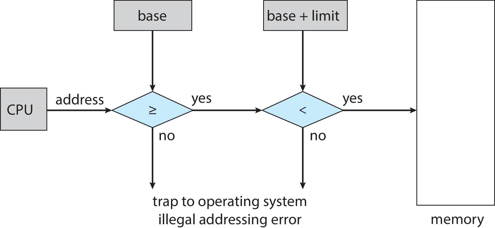
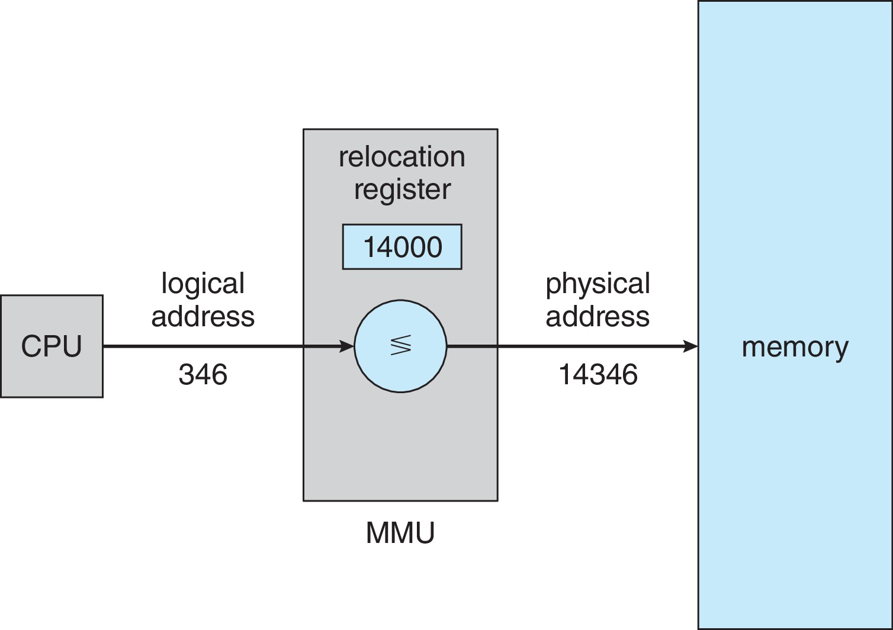
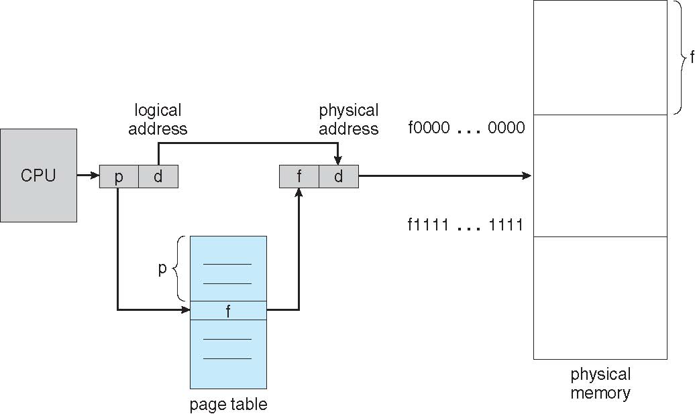
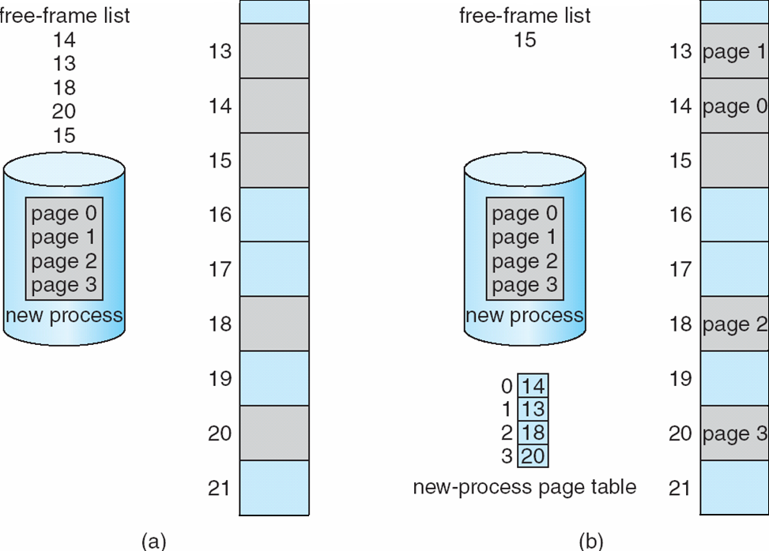
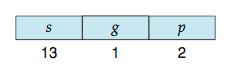
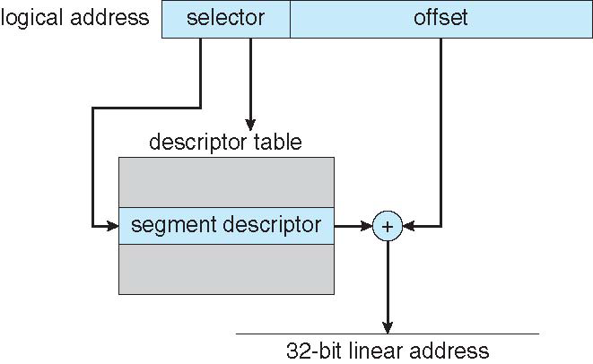
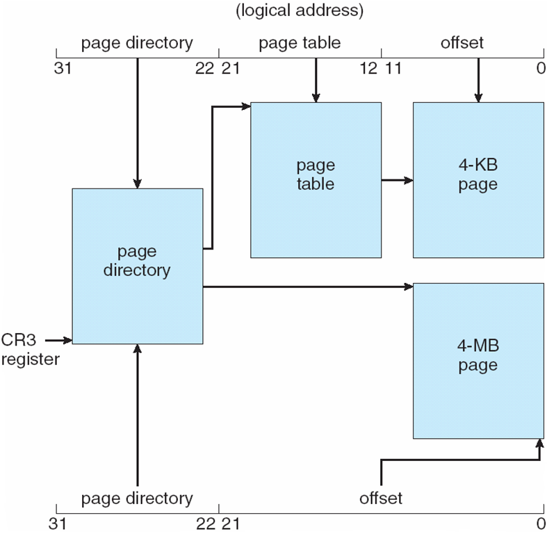
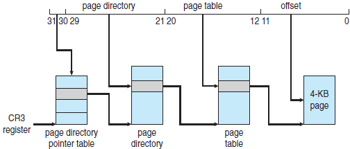
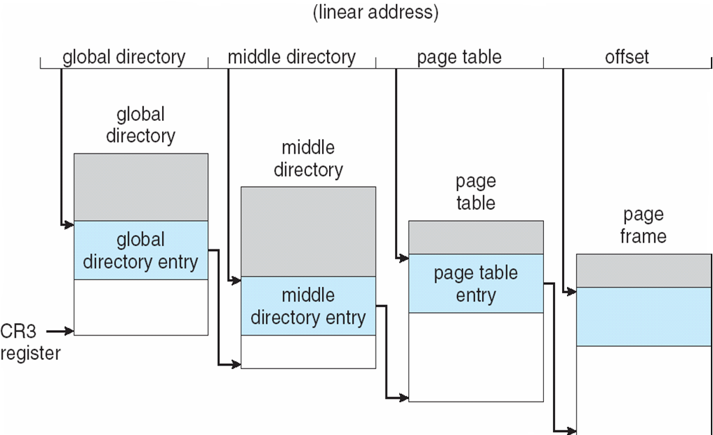

[TOC]

# Basis

## Hardware Addr Protection

* CPU must check every memory access generated in user mode to be sure it is between base and limit for that user
* the instructions to loading the base and limit registers are privileged

## Address Binding

Addr are represented in different ways at different stages

* **source code** addresses are usually <u>symbolic</u> (e.g., temp)
* **compiler** binds symbols to <u>relocatable addresses</u>
    * e.g., “14 bytes from beginning of this module” (偏移量)
* **linker** (or loader) binds relocatable addresses to <u>absolute addresses</u>
    * e.g., 0x0e74014
* Each binding maps one address space to another

Binding of I&D to Mem happens in 3 stages

* **Compile time**: If memory location known(在编译时就知道了进程在内存中的驻留地址), <u>absolute code</u> can be generated; must recompile code if starting location changes
* **Load time**: Must generate <u>relocatable code</u> if memory location is not known at compile time
* **Execution time**: Binding delayed until run time if the process can be moved during its execution from one memory segment to another (在执行时从一个内存段转移到另一个内存段)
    * Need hardware support for address maps (e.g., base and limit registers)

## Logi & Phy Addr

### MMU

* Consider simple scheme. which is a generalization of the base register scheme.
* The base register now called **relocation register**
* The value in the relocation register is <u>added</u> to every address generated by a user process at the time it is sent to memory
    * 
* The user program deals with logical addresses; it never sees the real physical addresses
    * Execution-time binding occurs when reference is made to location
        in memory
    * Logical address bound to physical addresses

## Dynamic Loading

* The entire program does need to be in memory to execute. Routine is not loaded until it is called
* All routines kept on disk in <u>relocatable load format</u>
* Advantage
    * Better memory-space utilization; unused routine is never loaded
    * Routine is loaded only when it is needed -> Useful when large amounts of code are needed to handle infrequently occurring cases
* No special support from the operating system is required
    * Implemented through program design
    * OS can help by providing libraries to implement dynamic loading

## Dynamic Linking

* Static linking – system libraries and program code combined by the loader into the binary program image
* Dynamic linking –linking postponed until execution time
    * Small piece of <u>code</u>, **stub**, used to locate the appropriate memory-resident library routine
        * stub仍然是代码，用以指出如何定位适当的内存驻留库程序，或者该程序不在内存时如何装入库
        * 不需要加载整个库，只需要用stub+PLT定位即可
    * Stub replaces itself with the address of the routine, and executes the routine
* Dynamic linking is particularly useful for:
    * shared libraries
    * patching system libraries
        * Versioning may be needed
        * 如果不用动态链接，则必须全部重新链接一遍
* Help from OS: share libraries between processes

# Contiguous Allocation

## Protection

采用[重定位寄存器+界限地址寄存器](# Hardware Addr Protection)的方法:

## Memory Allocation: Variable Partition

Variable Partition：可变分区方案

* Multiple-partition allocation
* Degree of multiprogramming limited by number of partitions
* Variable-partition sizes for efficiency (sized to a given process’ needs)
* Hole – block of available memory(一整块可用内存); holes of various size are scattered throughout memory
    * 一开始，所有内存都可用，因此有一大个孔，到后来，孔就变得小而分散
* Steps:
    * When a process arrives, it is allocated memory from a hole large enough to accommodate it
    * Process exiting frees its partition, adjacent free partitions combined
* Operating system <u>maintains information</u> about:
    * allocated partitions
    * free partitions (hole)

**Allocation Algorithm**

* **first-fit**: allocate from the first block that is big enough
* **best-fit**: <u>allocate from the smallest block that is big enough</u>
    * must search entire list, unless ordered by size
    * produces the smallest leftover hole
* **worst-fit**: allocate from the largest hole
    * must also search entire list
    * produces the largest leftover hole
* 三种方法现在不重要了
* 碎片化对于三个算法来说都是大问题

## Fragmentation

**外部碎片化**：空闲内存加起来够用，但是不连续

* sol
    * compaction (紧缩)
        * Shuffle memory contents to place all free memory in one large block
        * Program needs to be relocatable at runtime
        * Performance overhead, timing to do this operation
    * paging

**内部碎片化**：分配的比需要的还大（例如要500有502，为了不maintain2字节的信息，会把整个502一起分配；实际中都是以页为单位进行分配的，所以即使只有1B也得到1页）

Sophisticated algorithms are designed to avoid fragmentation

* none of the first-/best-/worst-fit can be considered sophisticated

# Paging

使内存在虚拟内存上连续（物理不一定连续）

页小：利于处理碎片化，但是页表的空间占用会变大

页大：DMA需要页大，由于内存空间很大

==Page与Frame：Page是Logic上的，Frame是Physical上的==

## Basic Methods

* Keep track of all free frames
* To run a program of size N pages, <u>need to find N free frames and load program</u>
* Set up a page table to translate logical to physical addresses
* Backing store likewise split into pages
* Still have Internal fragmentation

**Page Translation**

**Frame Table**: 追踪管理哪些frame（物理）是已分配的

跟踪以下：

* Which frame is free, and how many frames have been allocated
* One entry for each physical frame
* the allocated frame belongs to which process

**Free Frames**

当系统进程需要执行时，它将检查该进程的大小（按页算），n个page至少对应n个frame。如果有n个frame，就可以分配给新进程。进程的第一个page装入已分配的frame，frameNo装入这个进程的PageTable。

## Hardware Support

Simplest Case

* Page table is in a set of dedicated registers
    * Advantages: very efficient - access to register is fast
    * Disadvantages: the table size is very small, and the context switch need to save and restore these registers

Alternative Way

* 结构
    * 页表在Mem里
    * PTBR(page-table base register) 指向本进程的页表
    * PTLR(page-table length register) 存住页表的大小
* 每次mem access需要两次access：一次访问页表，一次访问数据
    * TLB用于加速查询

### TLB

用[associative memory](https://en.wikipedia.org/wiki/Content-addressable_memory)（并行查询优化）实现

* support parallel search
* not addressed by “addresses”, but **contents**
    * 类似哈希表字典，传给他key，返回value

由于TLB是硬件结构，进程切换的时候需要flush TLB。现代TLB中有[ASID](https://stackoverflow.com/questions/52713940/purpose-of-address-spaced-identifiersasids)会存储PID，查询时先看看ASID对不对，这样就省得每次都要context switch TLB中的内容

* 在Arm、x86等传统架构是由硬件flush的，在MIPS中有软中断抛出异常由软件实现（硬件结构简单）

**EAT** (Effective Access Time)

**Ex**. 主要是考虑访问PT导致的额外内存访问开销

> Suppose that 10 nanoseconds to access memory.
> * If we find the desired page in TLB then a mapped-memory access take 10 ns
> * Otherwise we need two memory access so it is 20 ns: page table + memory access

EAT = 0.80 x 10 + 0.20 x 20 = 12 nanoseconds (implying 20% slowdown in access time

( = Data/Inst access time + 0.2\*PT access time = 10+0.2\*10 )

## Protecion of Page

* Each page table entry has a present (aka. valid) bit
    * 表示物理内存上存在与这个page对应的frame
* Each page table entry contains some protection bits
    * kernel/user, read/write, execution?, kernel-execution?
* 其他protection位：NX, PXN (Privilege Exec Never)

## Page Sharing

例如对于libc，里面有code段、data段，其中code段是x且共享的，data段是rw的，且data段在不同进程之间不可共享（通过page的隔离实现）

* Paging allows to share memory between processes
    * e.g., one copy of code shared by all processes of the same program
        * text editors, compilers, browser...
        * 要求是不能自我修改的代码
    * shared memory can be used for inter-process communication
    * shared libraries
* Reentrant code: non-self-modifying code: never changes between execution
* Each process can, of course, have its private code and data

double mapping的问题：P1的code段在P2是rw的，危险

# PT Struct

## PT Hierarchy

**Multilevel Paging**

* 节省空间
    * 如果设计得当，一级页表可以存在一个页里，因此每次只要访问一个页就能获得一级的Frame Number

**Hashed PT**

用的是链表的那种（如果不是的话那个两倍的要求会导致页表太大）

**Inverted PT**

由Frame->Page的索引，要求物理内存比较小（因为要遍历整个页表）

## Swapping

* 不需要所有的pages都拿去swap，只需要部分即可（以page而不是process为粒度进行swapping）
* 对context switch的影响较大
    * disk太慢了
* mobile system一般不支持swapping（flash和mem之间的带宽较低）

# Example: The Intel 32 and 64-bit Architectures

## IA-32 Segmentation

段页

* First partition of up to 8 K segments are private to process (kept in local descriptor table (LDT))
* Second partition of up to 8K segments shared among all processes (kept in global descriptor table (GDT))

==逻辑地址：{selector[15:0], offset[31:0]}==

Selector given to segmentation unit

* Which produces linear addresses

* 

    * s-> segment number, g-> local/global, p->protection

* Segment selector is stored in the segment registers: CS, DS etc.

* GDTR, LDTR -> base address of the descriptor table

* descriptor: base, limit and other bits

==线性地址：segment.descriptor(got by seg.selector)+logical.offset==

## IA-32 Paging

实际就是双层页表，这个4M Page和PageTable在数据上是一样的，只不过理解起来要根据👇来区分

PageDirectory上会有个PageSize标志位，如果被置位，表示Page大小为4MB，PageDirectory上的PTE会直接绕过内层的PageTable指向一个4MB的页

### Page Addr Ext

* 32-bit address limits led Intel to create page address extension (PAE), allowing 32-bit apps access to more than 4GB of memory space
    * Paging went to a 3-level scheme
    * Top <u>two bits</u> refer to a **page directory pointer table**
    * Page-directory and page-table entries moved to 64-bits in size
    * Net effect is increasing address space to 36 bits – 64GB of physical memory

## Linux for Pentium

* Linux uses only 6 segments
    * kernel code, kernel data, user code, user data
    * task-state segment (TSS), default LDT segment
* Linux only uses two of four possible modes
    * kernel: ring 0, user space: ring 3
* Uses a generic four-level paging for 32-bit and 64-bit systems
    * for two-level paging, middle and upper directories are omitted
    * older kernels have three-level generic paging

**Three-level Paging in Linux**

# Linux Paging

## 

linear addr = logical addr + base addr