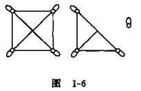
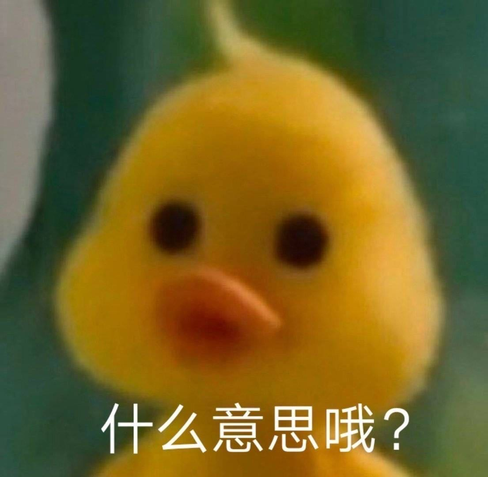
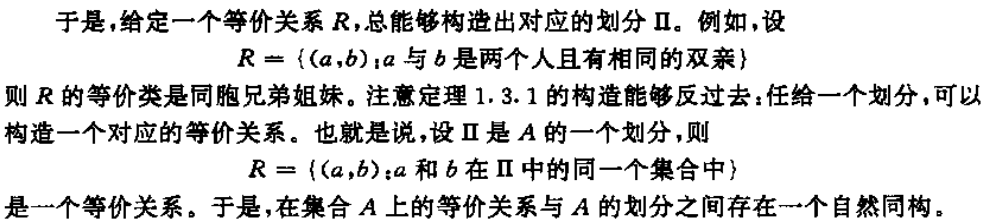
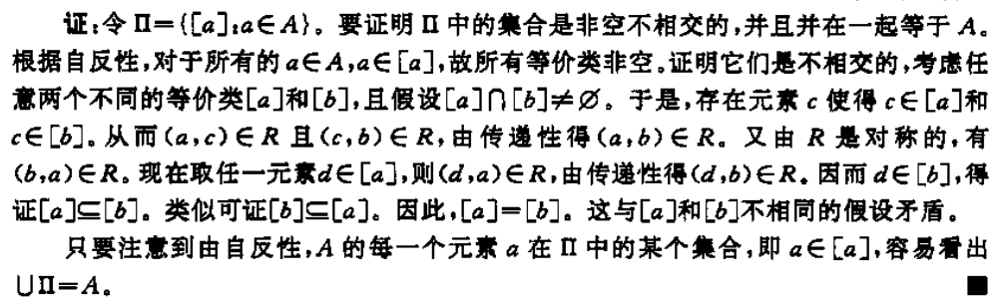
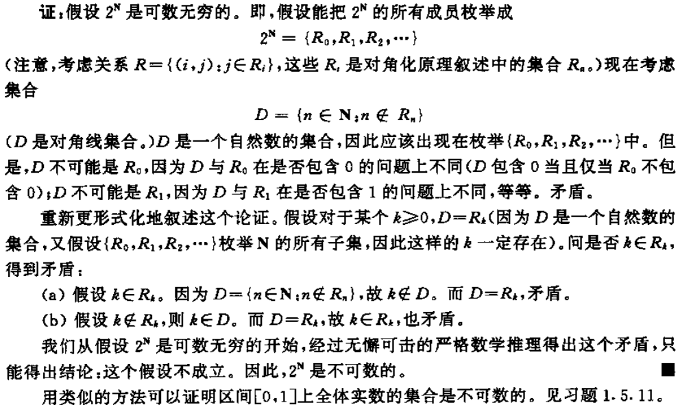

[TOC]

# Sets

**Set**

* an unordered collection of elements empty set $\emptyset$

**Subsets and proper subsets**

- Subset notation: $\subseteq$, $S \subseteq T \Leftrightarrow(\forall x \in S \Rightarrow x \in T)$
- Proper Subset: $\subset$
- Two sets are equal iff they contain the same elements $S=T \Leftrightarrow(S \subseteq T) \wedge(T \subseteq S)$

**Set Operations and Its Identities**

- Union, Intersection, Difference, Symmetric difference, complement
- Commutative Law, Associative Law, Distributive law, Absorption, DeMorgan's Law, Idempotent law

**Power Set**

$2^{S}=$ set of all subset of $S$, $2^{S}=\{T \mid T \subseteq S\}$

<a id="Partition"><b>Partition</b></a>

- A partition of a nonempty set $A$ is ==a subset $\Pi$ of $2^{A}$==(也就是A的部分子集的集和) such that
  1. $\emptyset \notin \Pi$：不含空集
  2. $\forall S, T \in \Pi,$ and $S \neq T, S \cap T=\emptyset$：$\Pi$的不同元素不相交
  3. $\cup \Pi=A$：保证有A所有元素

# Relations & Func

**Ordered Pair and Binary Relation**

* Ordered Pair: $(a, b)$
    $(a, b)=(c, d) \Leftrightarrow(a=c) \wedge(b=d)$
* Cartesian Product: $A \times B$
    $A \times B=\{(a, b) \mid a \in A \wedge b \in B\}$
* Binary Relation on $A$ and $B:$
    $R \subseteq A \times B$
* Inverse'eteq A \times B \Rightarrow R^{-1} \subseteq B \times A$

**Ordered Tuple and n-ary Relation (Omitted)**

**Function**

* Definition: A function $f: A \rightarrow B$ must satisfy:
    $f \subseteq A \times B$
    $ \forall a \in A, \exists$ exactly one $b \in B$ with $(a, b) \in f$
* Note: We write $(a, b) \in f$ as $f(a)=b$
* Domain, range
* Type
    * one-to-one function:
        $\forall a, b \in A \wedge a \neq b \Rightarrow f(a) \neq f(b)$
    * onto function: $f(A) = B$:
        $\forall b \in B, \exists a \in A$ such that $f(a)=b$
    * bijection function:
        one-to-one $+$ onto (one-to-one correspondence)

# Special Types of Binary Relations

**Representation of Relations**

- Directed graph: node, edge, path
- Matrix: Adjacency matrix

**Properties of Relations** $(R \subseteq A \times A)$

* reflexive: $\forall a \in A \Rightarrow(a, a) \in R$
* symmetric: $(a, b) \in R \wedge a \neq b \Rightarrow(b, a) \in R$
* antisymmetric: $(a, b) \in R \Rightarrow(b, a) \notin R$
* transitive: $(a, b) \in R,(b, c) \in R \Rightarrow(a, c) \in R$
    * Ex. a为b前辈、a小于等于b

**Equivalence Relation**

- <u>reflexive, symmetric, transitive</u>
- equivalence classes
    - [a]用来表示R上包含a的等价类，$[a]=\{b \mid(a, b) \in R\} = \{b \mid(b, a) \in R\}$
    - 如右图(每条线都是一个等价关系)中的三个等价类分别有4, 3, 1个元素

**Theorem**: Let $R$ be an equivalence relation on a nonempty set $A$. Then the equivalence classes of $R$(这里应该指的是A在关于R上所有的等价类的集和) constitute a <a href="#Partition">partition</a> of $A$ （反之亦可构造等价类）

：

---

证明：

**Partial Order** 

* reflexive, antisymmetric, transitive
* total order
    * $\text { 如果 } R \subseteq A \times A \text { 是一个偏序,并且对所有的 } a, b \in A满足:\\ \text { 或者 }(a, b) \in R \text { 或者 }(b, a) \in R, \text{则称}R\text{是一个全序}$
        * 即任意两人要有偏序关系
    * 前辈关系不是全序（兄弟），但是小于等于是
* minimal element and maximal element 极小元极大元

# Finite/Infinite sets

**Equinumerous**

* Sets $A$ and $B$ equinumerous $\Leftrightarrow \exists$ bijection $f: A \rightarrow B$
* Cardinality and generalized Cardinality
* Finite and Infinite Sets

**Countable and Uncountable Infinite**

* A set is said to be <u>countably infinite</u> $\Leftrightarrow$ it is equinumerous with $\mathbb{N}$.
* $S$ is an <u>uncountable</u> set $\Leftrightarrow|S|>|\mathbb{N}|$
* The union of a countably infinite collection of countably infinite sets is countably infinite.

**Example**: Show that $\mathbb{N} \times \mathbb{N}$ is countably infinite.

**Theorem**: $|\mathbb{R}|>|\mathbb{N}|$. Proof: See next section by diagonalization.

**Question**: Is $|\mathbb{R}|>|(0,1)|$? 不是，用$f(x)=\frac{1}{\pi} \arctan (x)+\frac{1}{2}$来映射

**Continuum Hypothesis**
$$
\begin{aligned}
&|\mathbb{N}|=\aleph_{0} \quad|\mathbb{R}|=\aleph_{1}\\
&\aleph_{0}<\aleph_{1}\\
&\exists ? w, \text { such that } \aleph_{0}<w<\aleph_{1}
\end{aligned}
$$

# 3 Proof Techniques

## The Principle of Mathematical Induction

> Let $A$ be a set of natural numbers such that
> 1) $0 \in A,$ and
> 2) for each natural number $n,$ if $\{0,1,2, \cdots, n\} \in A,$ then $n+1 \in A$

## The Pigeonhole Principle

> If $A$ and $B$ are finite sets and $|A|>|B|,$ then there is no one-to-one function from $A$ to $B$.
>

## The Diagonalization Principle

> Let $R$ be a binary relation on a set $A,$ and let $D,$ the diagonal set for $R,$ be $\{a: a \in A \wedge(a, a) \notin R\}$. For each $a \in A,$ let
> $$
> R_{a}=\{b: b \in A \wedge(a, b) \in R\}
> $$
> <u>Then $D$ is distinct from each $R_{x}$（目的就是要构造与$R_x$不同的）</u>
>
> **Example**: Let us consider the relation
>
> $R=\{(a, b),(a, d),(b, b), (b, c),(c, c),(d, b),(d, c),(d, e),(d, f),\\(e, e),(e, f),(f, a),(f, c)， (f, d),(f, e)\}$
>
> |      |  a   |  b   |  c   |  d   |  e   |  f   |
> | :--: | :--: | :--: | :--: | :--: | :--: | :--: |
> |  a   |  D   |  X   |      |  X   |      |      |
> |  b   |      |  X   |  X   |      |      |      |
> |  c   |      |      |  X   |      |      |      |
> |  d   |      |  X   |  X   |  D   |  X   |  X   |
> |  e   |      |      |      |      |  X   |  X   |
> |  f   |  X   |      |  X   |  X   |  X   |  D   |
>
> Notice that:
> $$
> \begin{array}{ll}
> R_{a}=\{b, d\}, & R_{b}=\{b, c\},\\
> R_{c}=\{c\}, & R_{d}=\{b, c, e, f\}, \\
> R_{e}=\{e, f\}, & R_{f}=\{a, c, d, e\}
> \end{array}
> $$
> The corresponds to the diagonal set is (R中不存在(a,a),(d,d),(f,f))
> $$
> D=\{a, d, f\}
> $$

**Theorem.** The set $2^\N$ is uncountable

证：

**Theorem.2** (0, 1)/[0, 1]为不可数集

[如何证明（0，1）不是可数集？ - 王飞的回答 - 知乎](https://www.zhihu.com/question/423811932/answer/1503396541)

# Closure

**The Transitive Closure**

the <u>"smallest"</u> relation that includes $R$ and is transitive (usually called $R^{+}$ )

e.g. If $R$ is Parent-of, then the transitive closure of $R$ is Ancestor-Of

More formally: $R^{+}$ is a relation such that

* $R \subseteq R^{+}$
* $R^{+}$ is transitive
* $\forall R^{\prime}, R \subseteq R^{\prime}$ and $R^{\prime}$ is transitive, $\Rightarrow R^{+} \subseteq R^{\prime}$

**Closures of Relations**

Given any binary relation $R,$ one can form closures with respect to any combinations of the properties:

* reflexive
* symmetric
* transitive

e.g. Symmetric, transitive closure of "Parent-Of" is:

 Reflexive, transitive closure of R is usually denoted R*.

# Alphabet & Language

**Alphabet**: finite set of symbols

e.g. $\sum_{1}=\{0,1\}, \sum_{2}=\{a, b, \cdots, x, y, z\}$

- *String* : finite symbol sequence
- *Length*: $\#$ of symbols
- *Empty string*: $e$

**Operations of Strings**

- Concatenation: $x \circ y$ or $x y$
  - substring, suffix, prefix
  - Example: $\forall w, w e=e w=w$

- **String exponentiation**

    - >$w^{0}=e,$ the empty string
        >$w^{i+1}=w^{i} \circ w,$ for each $i \geq 0$
        >\\				-definition by induction

- Reversal 翻转

  - > If $w$ is a string of length $0,$ then $w^{R}=w=e$
    >
    > IF $w$ is a string of length $n+1>0,$ then $w=u a$ for some $a \in \sum,$ and $w^{R}=a u^{R}$

**Language**: set of strings

* $\sum$ -alphabet, $\sum^{*}$ -the set of all strings $\left(e \in \Sigma^{*}\right)$
* Language $L \subseteq \sum^{*}$
* $\emptyset, \sum$ and $\sum^{*}$ are languages.
* Finite Language: by listing all the strings
* Infinite Language: specify by the following scheme $L=\left\{w \in \sum^{*}: w\right.$ has property $\left.P\right\}$

Example: $L=\{a b, a a b b, a a a b b b, \cdots\}=\left\{a^{n} b^{n} \mid n \geq 1\right\}$

==**Theorem**: <u>If $\sum$ is a finite alphabet, then $\sum^{*}$ is countably infinite set.</u>==

Proof: Construct a bijection $f: \mathbb{N} \rightarrow \sum^{*}$.
Fix some ordering of the alphabet, say $\sum=\left\{a_{1}, a_{2}, \cdots, a_{n}\right\}$
The member of $\sum^{*}$ can be enumerated in the following
way:
1) For each $k \geq 0$, all string of length $k$ are enumerated before
all strings of length $k+1$
2) The $n^{k}$ strings of length exactly $k$ are enumerated lexicographically.

## Operations of Languages

Union, Intersection, Difference, Complement

$\left(\bar{A}=\Sigma^{*}-A\right)$

**Concatenation**

$L_{1} L_{2}=\left\{w_{1} w_{2} \mid w_{1} \in L_{1} \wedge w_{2} \in L_{2}\right\}$

$L^{0}=\{e\}$

$L^{i+1}=L L^{i}, \text { for each } i \geq 0$

Example: (L1L2的concatenation只考虑L2={0, 1})

$L_{1}=\left\{w \in\{0,1\}^{*}: w\right.$ has an even number of 0 's $\}$

$L_{2}=\left\{w \in\{0,1\}^{*}: w\right.$ starts with a $0,$ the rest symbol are $1 '$

$L_{1} L_{2}=\left\{w \in\{0,1\}^{*}: w\right.$ has an odd number of 0 's $\}$

**Kleene Star**

所有长度为0到∞的串联

$$
\begin{aligned}
    L^{*} &=\left\{w \in \sum^{*}: w=w_{1} \cdots w_{k}, k \geq 0, w_{1}, \cdots, w_{k} \in L\right\} \\
    &=L^{0} \cup L^{1} \cup L^{2} \cup \cdots \\\\
    L^{+} &=L^{1} \cup L^{2} \cup L^{3} \cup \cdots
\end{aligned}
$$

Example: $L=\left\{w \in\{0,1\}^{*}: w\right.$ has an unequal number of 0 's and 1 's $\} .$ Then $L^{*}=\{0,1\}^{*}$.

Hint: $L_{1} \subseteq L_{2} \Rightarrow L_{1}^{*} \subseteq L_{2}^{*} \quad\{0,1\} \subseteq L$

**==Remark==**:

1) The use of $\sum^{*}$ to denote the set of all strings over $\sum$ is consistent with the notation for the Kleene star of $\sum$.
2) ==$\emptyset \ne \{e\}, \emptyset^* = \{e\}$==
3) $L^{+}=L L^{*}$
4) For any language $L,\left(L^{*}\right)^{*}=L^{*} ; L \emptyset=\emptyset L=\emptyset$

# Finite Representations of Language

**Finite Representations**

* must be a string
* different languages to have different representations
    * Representations $\Sigma^{*}$ countable $\Rightarrow \exists$ undescribable languages!
    * Languages $\large 2^{\Sigma^*}$ uncountable
* 用有限的字符串来表示无限的语言

## Regex

> **Definition**: The regular expressions are all strings over the alphabet $\sum \cup\{(,), \cup, \star\}$ that can be obtained as follows.
> 1) $\Theta$ and $\{x\}\left(\forall x \in \sum\right.$ ) is a regular expression.
> 2) If $\alpha$ and $\beta$ are regular expressions, then so are $(\alpha \beta)$, $(\alpha \cup \beta), \alpha^{\star}$
> 3) Nothing is regular expression unless it follows from 1 ) through 2 ).
> Example: $a^{*} b^{*}, a^{*} \cup b^{*}, a(a^{*} \cup b^{*}), (a^{*} \cup b^{*}) a(a^{*} \cup b^{*}), aaaaa^*$
>
> 定义：==包括空集$\empty$和单元集${a}$在union、concatenation和Kleene star下封闭的最小语言类==

**Example** Let $L=\left\{w \in\{0,1\}^{*}: w\right.$ has two or three occurrences of $1,$ the first and second of which are not consecutive $\}$.

* The language can be described using only singleton sets and the symbols $\cup, \circ,$ and $*$ as

$$
\{0\}^{*} \circ\{1\} \circ\{0\}^{*} \circ\{0\} \circ\{1\} \circ\{0\}^{*}\left(\left(\{1\} \circ\{0\}^{*}\right) \cup \emptyset^{*}\right)
$$

* The language can be written simply as $0^{*} 10^{*} 010^{*}\left(10^{*} \cup \emptyset^{*}\right)$
    *  $a^*\cup b^*$表示要么全是a要么全是b

### $\mathscr{L}$

The function $\mathscr{L}$ is defined as follows.
1) $\mathscr{L}(\Theta)=\emptyset,$ and $\mathscr{L}(a)=\{a\}$ for each $a \in \Sigma$.
2) If $\alpha$ and $\beta$ are regular expressions, then
$$
\begin{array}{l}
\mathscr{L}(\alpha \beta)=\mathscr{L}(\alpha) \mathscr{L}(\beta) \\
\mathscr{L}(\alpha \cup \beta)=\mathscr{L}(\alpha) \cup \mathscr{L}(\beta) \\
\mathscr{L}\left(\alpha^{\star}\right)=\mathscr{L}(\alpha)^{*}
\end{array}
$$
**Example**: What is $\mathscr{L}\left(\left((a \cup b)^{\star} a\right)\right) ?$ ?
$$
\begin{aligned}
    \mathscr{L}\left(\left((a \cup b)^{\star} a\right)\right) &=\mathscr{L}\left((a \cup b)^{\star}\right) \mathscr{L}(a) \\
    &=\mathscr{L}\left((a \cup b)^{\star}\right)\{a\} \\
    &=\mathscr{L}((a \cup b))^{*}\{a\} \\
    &=(\mathscr{L}(a) \cup \mathscr{L}(b))^{*}\{a\} \\
    &=(\{a\} \cup\{b\})^{*}\{a\} \\
    &=(\{a, b\})^{*}\{a\}\\
    &=\left\{w \in\{a, b\}^{*}: w\right.\text{ ends with an }\left.a\right\}
\end{aligned}
$$

Example: What language is represented by $\left(c^{\star}\left(a \cup\left(b c^{\star}\right)\right)^{\star}\right) ?$ $L=\left\{w \in\{a, b, c\}^{*}:\right.$ not have the substring $\left.a c\right\}$

**Regex Indentities**

* $S R \neq R S$
* $S \cup R=R \cup S$
* $R(S T)=(R S) T$
* $R(S \cup T)=R S \cup R T,(R \cup S) T=R T \cup S T$
* $\emptyset^{*}=\{e\}$
* $\left(R^{*}\right)^{*}=R^{*}$
* $\left(R^{*} S^{*}\right)^{*}=(R \cup S)^{*}$
* $(\{e\} \cup R)^{*}=R^{*}$

**==Remark==**

1. <u>Every language that can be represented by a regular expression can be represented by infinitely many of them.</u>
2. The class of regular languages over an alphabet $\sum$ is defined to consist of all languages $L$ such that $L=L(a)$ for some regular expression a over $\sum$. i.e. the class of regular languages over an alphabet $\sum$ is precisely the closure of the set of languages $\{\{\sigma\}: \sigma \in \Sigma\} \cup\{\emptyset\}$
3. he regular expressions are an inadequate specification method in general. For example, $\left\{0^{n} 1^{n}: n \geq 0\right\}$ cannot be described by regular expressions.
4. Two important and useful means of representing languages:
    * language recognition device to answer questions of the form "Is string $w$ a member of $L ?$
    * language generators