[TOC]

# DFA

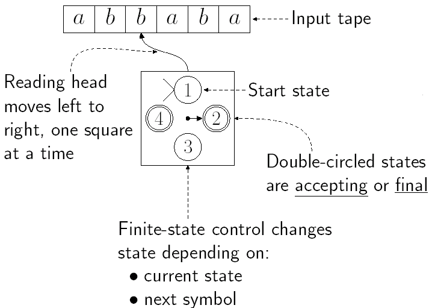

> <a id="compareDFA"></a><a href="#compareNFA">compare NFA</a>
>
> Definition: A **deterministic finite automata**(DFA) is a quintuple $(K, \Sigma, \delta, s, F),$ where
>
> * $K$ is a finite set of states: 1234
> * $\sum$ is an alphabet: ab
> * $s \in K$ is the initial state
> * $F \subseteq K$ is the set of final states
>     * 注意s是个元素，这个是集合
> * $\delta:$ transition function(转移函数), $K \times \sum \rightarrow K$
>
> **Remarks**: Transition function will determine unique next state based
> on current <u>input and state</u>.

**Remark**:

1. A configuration(格局，(我觉得翻译成配置还好一些)) of a DFA $(K, \Sigma, \delta, s, F)$ is any element of $K \times \Sigma^{*}$

    * 用`(控制器状态，未被处理的输入(包括当前的))`表示
2. The binary relation $\vdash_{M}$ between two configurations of $M$:<br />$(q, w) \vdash_{M}\left(q^{\prime}, w^{\prime}\right) \Leftrightarrow \exists a \in \Sigma, w=a w^{\prime},$ and $\delta(q, a)=q^{\prime}$

    * $\vdash_{M}$在$M$的两个格局之间成立，当且仅当$M$能一步从一个格局跳转到另一个格局

    * say $(q, w)$ yields $\left(q^{\prime}, w^{\prime}\right)$ in one step.
3. <u>The reflexive, transitive closure</u> of $\vdash_{M}$:  For $\vdash_{M}^{*}$, $(q, w) \vdash_{M}^{*}\left(q^{\prime}, w^{\prime}\right) \Leftrightarrow(q, w)$ yields $\left(q^{\prime}, w^{\prime}\right)$ after some number(possibly zero) of steps.
4. A string $w \in \sum^{*}$ is said to be accepted by $M$ iff there is a state $q \in F$ such that $(s, w) \vdash_{M}^{*}(q, e)$. The language accepted by $M, L(M)$ is the set of all strings accepted by $M$.


**Example**:

* $\sum=\{a, b\}$
* $K=\left\{q_{0}, q_{1}\right\}$
* $s=q_{0}$
* $F=\left\{q_{0}\right\}$

Transition function: 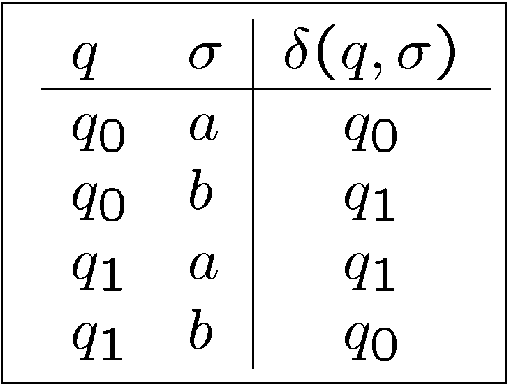

Consider the string aabba:
$$
q_{0} \xrightarrow a q_{0} \xrightarrow a q_{0} \xrightarrow b q_{1} \xrightarrow b q_{0} \xrightarrow a q_{0}
$$
$q_{0}$ is final, $aabba$ is accepted.

如果用$\vdash_{M}$的方式来证明就是：$\begin{aligned}\left(q_{0}, a a b b a\right) & \vdash_{M}\left(q_{0}, a b b a\right) \\ & \vdash_{M}\left(q_{0}, b b a\right) \\ & \vdash_{M}\left(q_{1}, b a\right) \\ & \vdash_{M}\left(q_{0}, a\right) \\ & \vdash_{M}\left(q_{0}, e\right) \end{aligned}$


## Graph Representation

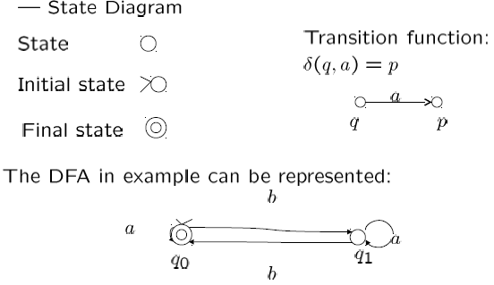

**Ex**.

$L_1 = \{w \in \{a, b\}^*: w\text{ does not contain three consecutive }b\text{'s}\}.$

* $\sum=\{q_0, q_1, q_2, q_3\}$
* $K=\left\{a, b\right\}$
* $s=q_{0}$
* $F=\left\{q_{0}, q_1, q_2\right\}$

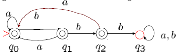

👆q3被称为停滞状态，称到达状态q3的M被俘获了。

$L_2 = \{w \in \{a, b\}^*: w\text{ contains three consecutive }b\text{'s}\}.$

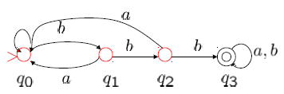

# NFA

Generalization of  determinism:<br />•  Many "next-states"<br />•  Computation is a "tree"<br />•  Acceptance: $\exist$ a path to accepting leaf

当前状态核输入符号不能完全决定下一个状态（给定当前状态和输入，允许多个可能的”下一个状态“的存在）

最小状态机

> <a id="compareNFA"></a><a href="#compareDFA">compare DFA</a>
>
> Definition: A nondeterministic finite automata(NFA) is a quintuple $(K, \Sigma, \Delta, s, F),$ where
>
> * $K$ is a finite set of states: 1234
> * $\sum$ is an alphabet: ab
> * $s \in K$ is the initial state
> * $F \subseteq K$ is the set of final states
> * $\Delta \subseteq K \times (\sum \cup \{e\}) \times K$ is transition relation (没有一一对应所以不能称为函数)
>     * (p, x, q)表示一个"*从p到q，输入符号为x* "的转移
>
> **Remark**: <u>For DFA, the transition function $\delta$ is a function, but for NFA, $\Delta$ is only a relation.</u>
>
> Other:
>
> * Configuration: $K \times \sum^*$
> * $\vdash_{M}$ and its refelxive transtive closure: $\vdash_{M}^{*}$
>     * A string $w \in \sum^{*}$ is said to be accepted by $M$ iff there is a state $q \in F$ such that $(s, w) \vdash_{M}^{*}(q, e)$.
>     * The language accepted by $M, L(M)$ is the set of all strings accepted by $M$.

## DFA & NFA

DFA $\subseteq$ NFA

**Example**: Consider the language $L  =  (ab \cup aba)^*$ which is accepted by the DFA and NFA: 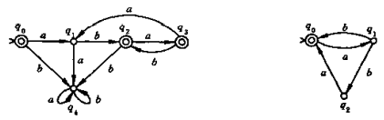

### NFA/DFA Equivalence

Definition: Two FA M~1~ and M~2~ (deterministic or non deterministic) are equivalent iff L(M~1~) = L(M~2~). (L(M)表示M接受的语言)

* To prove equivalence of DFAs and NFAs we must do two things:
    * For each DFA, produce an NFA that accepts the same language
        * 显然
    * For each NFA, produce a DFA that accepts the same language
        * 课本P42，定理2.2.1：**Theorem**: For each NFA, there is an equivalent DFA.
        * 关键：认为NFA在任一时刻并不处于某个状态，而是处于一个状态集合（即从s开始到当前消耗掉的所有输入所能达到的状态的集合）
        * 定义E(q)的目的：<u>找出NFA中从q开始不消耗字符进行转移能到的状态</u>，因为DFA的转移会消耗字符

**计算E(q)的算法**

```pseudocode
E(q) = {q}
while exists 转移(p, e, r) && p ∈ E(q) && r !∈ E(q):
    E(q) = E(q) ∪ r
```

### Formal Def of DFA

(Equialent DFA of NFA)

NFA $M=(K, \Sigma, \Delta, s, F)$
To construct an equivalent DFA $M^{\prime}=\left(K^{\prime}, \Sigma, \delta, s^{\prime}, F^{\prime}\right)$

* Let $K^{\prime}=2^{K}$
* Let $s^{\prime}=E(s)$
* Let $F^{\prime}=\{Q \mid Q \subseteq K, Q \cap F \neq \emptyset\}$
* For each $Q \subseteq K$ and $\forall a \in \sum$, Let $\delta(Q, a)=\cup\{E(p) \mid p \in K$ and $(q, a, p) \in \Delta$ for some $q \in Q\}$


[compiler construction - time complexity trade offs of nfa vs dfa - Stack Overflow](https://stackoverflow.com/questions/4580654/time-complexity-trade-offs-of-nfa-vs-dfa#:~:text=1%20Answer&text=The%20construction%20time%20for%20a,DFA%20for%20a%20given%20string.)


证明：M'是deterministic的；M'与M是等价的


**Example**:

> Convert the NFA in example(this section) to a DFA.
>
> 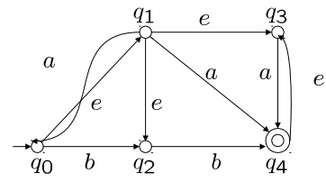
> $$
> {
> \begin{array}{l}
> E\left(q_{0}\right)=\left\{q_{0}, q_{1}, q_{2}, q_{3}\right\} \\
> E\left(q_{1}\right)=\left\{q_{1}, q_{2}, q_{3}\right\} \\
> E\left(q_{2}\right)=\left\{q_{2}\right\} \\
> E\left(q_{3}\right)=\left\{q_{3}\right\} \\
> E\left(q_{4}\right)=\left\{q_{3}, q_{4}\right\}
> \end{array}
> }
> $$

* $|K|=5 \Rightarrow\left|K^{\prime}\right|=2^{5}=32$
    * Only a few of these states will be relevant to the operation of $\mathrm{M}$.
* $s^{\prime}=E\left(q_{0}\right)=\left\{q_{0}, q_{1}, q_{2}, q_{3}\right\}$
* $\left(q_{1}, a, q_{0}\right),\left(q_{1}, a, q_{4}\right),\left(q_{3}, a, q_{4}\right)$ are all the transitions for some $q \in s'$
* $\delta\left(s^{\prime}, a\right)=E\left(q_{0}\right) \cup E\left(q_{4}\right)=\left\{q_{0}, q_{1}, q_{2}, q_{3}, q_{4}\right\}$
* $\delta(s, b)=E\left(q_{2}\right) \cup E\left(q_{4}\right)=\left\{q_{2}, q_{3}, q_{4}\right\}$
* $\delta\left(\left\{q_{0}, q_{1}, q_{2}, q_{3}, q_{4}\right\}, a\right)=\left\{q_{0}, q_{1}, q_{2}, q_{3}, q_{4}\right\}$
* $\delta\left(\left\{q_{0}, q_{1}, q_{2}, q_{3}, q_{4}\right\}, b\right)=\left\{q_{2}, q_{3}, q_{4}\right\}$
* $\delta\left(\left\{q_{2}, q_{3}, q_{4}\right\}, a\right)=\left\{q_{3}, q_{4}\right\}$
* $\delta\left(\left\{q_{2}, q_{3}, q_{4}\right\}, b\right)=\left\{q_{3}, q_{4}\right\}$
* $\delta\left(\left\{q_{3}, q_{4}\right\}, a\right)=\left\{q_{3}, q_{4}\right\}, \delta\left(\left\{q_{3}, q_{4}\right\}, b\right)=\emptyset$
* $\delta(\emptyset, a)=\delta(\emptyset, b)=\emptyset$

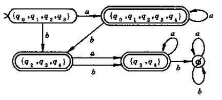

# FA and regex

个洞定理是regex的性质，只能作为判断语言不为regex的依据，不能用作肯定的依据

**Theorem**: The class of languages accepted by FA is closed under the following 5 operation (证明方法：给定M~1~, M~2~，能构造出所需的自动机M即可)
(a) Union, $\cup$, 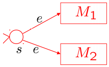
(b) Concatenation, $\circ$, 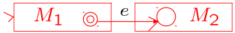
(c) Kleene star, $^*$, 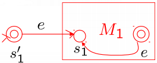
(d) Complementation, $L(M) = \overline{L(M_1)} = \Sigma^* - L(M_1)$
(e) Intersection, $L(M_1) \cap L(M_2) = \Sigma^* - (\Sigma^* - L(M_1)) \cup (\Sigma^* - L(M_2))$

（abc的封闭性是regex的定义本来就有的，de的是另外的）


**Theorem**: A language is regular iff it is accepted by a FA.

> **Proof**
>
> * $\Rightarrow$:
>     The class of regular languages is the smallest class of languages containing $\emptyset$ and the singletons $\{a \mid a \in \Sigma\},$ and closed under union, concatenation, and Kleene star.
>     $\emptyset$ and the singletons $\left\{a \mid a \in \sum\right\}$ are accepted by FA.
>     $\Rightarrow$ every regular language is accepted by some FA.
>* $\Leftarrow$:
>     Let $M=(K, \Sigma, \Delta, s, F)$ be a FA. To construct a regular expression $R,$ s.t. $L(M)=L(R)$
>     Let $K=\left\{q_{1}, \cdots, q_{n}\right\}$ and $s=q_{1}$
>     We'll do induction over $k$ for executions that use only states in $\left\{q_{1}, \cdots, q_{k}\right\}$


## R(i, j, k)

> **Definition**: For $i, j=1, \cdots, n$ and $k=0, \cdots, n,$ define $\begin{align*} R(i, j, k) =\{&w \mid w \in \Sigma^{*}, \delta(q_{i}, w)=q_{j}\text{ and for any prefix }x\text{ of }w, \\ & x \neq e, \delta(q_{i}, x)=q_{l} \wedge(l \leq k)\}\end{align*}$
>
> $\Sigma^*$ 中可以使M从状态q~i~到q~j~且不经过编号大于k的中间状态的所有**字符串**，其中i和j可以大于k。即为所有从q~i~到q~j~且秩小于等于k的通路拼成的字符串的集合。
>
> Note:
>
> * $R(i, j, 0)=\left\{\begin{array}{ll}\left\{a \mid \delta\left(q_{i}, a\right)=q_{j}\right\} & \text { if } i \neq j \\ \left\{a \mid \delta\left(q_{i}, a\right)=q_{j}\right\} \cup\{e\} & \text { if } i=j\end{array}\right.$
> * $R(i, j, n)=\left\{w \mid w \in \sum^{*},\left(q_{i}, w\right) \vdash_{M}^{*}\left(q_{j}, e\right)\right\}$
> * $L(M)=\cup\left\{R(1, j, n) \mid q_{j} \in F\right\}$


**Theorem**: $R(i, j, k)$ are regular languages.

> Proof: By induction on $k$.
>
> * Basis step: $k=0$
>     $R(i, j, 0)=\left\{\begin{array}{ll}\left\{a \mid \delta\left(q_{i}, a\right)=q_{j}\right\} & \text { if } i \neq j \\ \left\{a \mid \delta\left(q_{i}, a\right)=q_{j}\right\} \cup\{e\} & \text { if } i=j\end{array}\right.$
> * Induction step:
>     $R(i, j, k)=R(i, j, k-1) \cup R(i, k, k-1) R(k, k, k-1)^{*}R(k, j, k-1)$
>
> $\Rightarrow R(i, j, k)$ is regular for all $i, j, k$


**Ex**. 构造接受语言$\{w \in {a, b}^*: w有3k+1(k\in \N)个b\}$

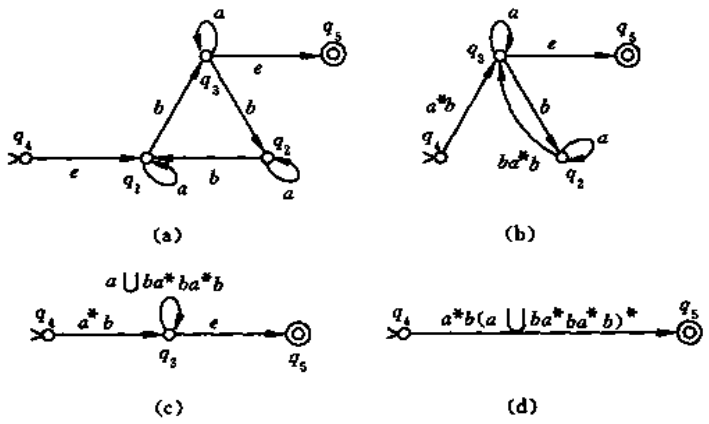


通用方式：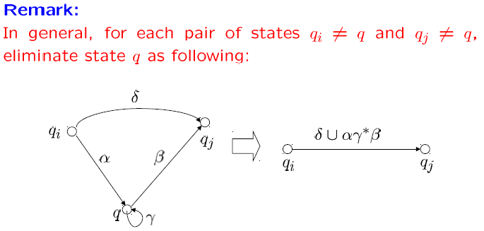


# Regular or not (Lang)

## Regular

To show a language is Regular

* Accepted by FA
* Specified by Regular Expressions
* Closure properties of Regular Languages


**Example**. 证明：已知$L \sube \Sigma^*=\{0, 1, ..., 9\}^*是可以被2或3整除的非负整数的十进制表示的集合（前面没有多余0）$，求证明L是正则的。

* $L_1 = 0 \cup \{1, 2, ..., 9\}\Sigma^*$为非负整数集合，正则
* $L_2 = L_1 \cap \Sigma^*\{0, 2, 4, 6, 8\}$为非负偶数集合（取交挺好，避免了前导0），正则
* $L_3$为非负3的倍数集合，为FA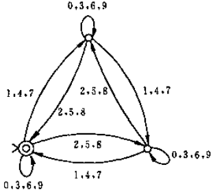所接受的语言，所以正则的
* $L = L_2 \cup L_3$，正则


## Irregular

凭直觉

* FA是有限状态的，因此只能记住有限的数字，例如$\{a^nb^n, n\geqslant0\}$就不正则，因为n可能无限大
* 如果一个语言是有无穷字符串的，则其一定具有某种重复构造而成的子集，例如$\{a^n: n为质数\}$就不是正则的，因为质数不存在周期性


### Pumping Theorem

(符合泵定理是语言正则必要不充分条件，一般用不符合泵定理来证明语言不正则)

> **Theorem**: $L是个正则语言，则\exists n\geqslant 1，\text{s.t.} \forall 字符串 w\in L只要满足|w|\geqslant n，就可以写成w=xyz，\\其中\begin{cases}y\neq e\\|xy| \leqslant n \\ \forall i, xy^iz \in L \end{cases}$(注：w是L接受的一个字符串，而不是L接受的字符串的子集)


**Ex.1** $\{a^nb^n, n\geqslant0\}$

假设正则，则$w=a^nb^n, x=a^{n-k}, y=a^k, z=b^n, xy^iz=a^{n+(i-1)k}b^n\notin L$


**Ex.2** $\{a^n: n为质数\}$

$x=a^p, y=a^q, z=a^r(p, r>0, q\geqslant 0), \text{then }p+iq+r \text{ must be prime.} \\ \text{But for }i=p+2q+r+2, \\ p+iq+r=p+pq+2q^2+qr+2q+r=(q+1)(p+2q+r) \text{ not prime.}$


**通用证明方法**

* Let *L* be the proposed regular language
* There is some *n*, by the pumping lemma
* Choose a string *s*, longer than *n* symbols, in the lan­guage *L*
* Using the pumping lemma, construct a new string *s*' that is not in the language


**Ex.3** $L = \{w\in\{a, b\}^*: w\text{ has an equal number of }a\text{'s and }b\text{'s}\}$

<u>使用正则的封闭进行证明</u>：因为$L \cap a^*b^* = \{a^nb^n, n\geqslant0\}$不正则，所以它必不正则


**Reprise on FA an Regular Languages**

Which  of  the  following  are  necessarily  regular?

* A finite language
* A union of a finite number of regular languages
* A union of a countable number of regular languages
* An intersection of a countable number of regular lan­guages
* $\{x: x \in L_1 \text{ and } x \notin L_2\}$ , $L_1$ and $L_2$ are both regular
* A subset of a regular language

$\displaystyle \color{red}{ \bigcup_{i=0}^{\infty} L_{i}=\overline{\bigcap_{i=0}^{\infty} \overline{L_{i}}}}$

