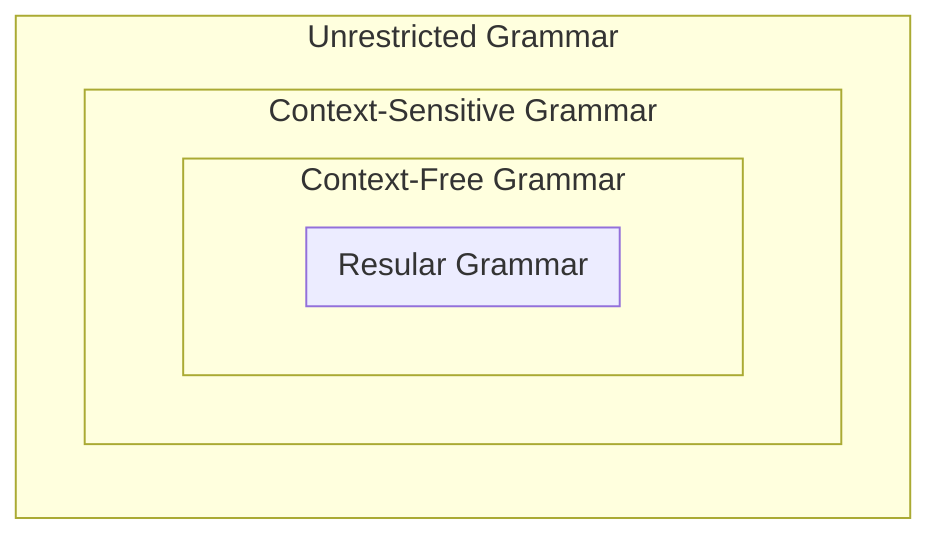

# CF Grammars

<u>用$\rightarrow$表示“可以是”</u>，语言生成式定义如下：从由一个符号$S$组成的字符串开始，在当前字符串中找到出现在已定规则中的"$\rightarrow$"左边的<u>符号</u>，并将其替换成"$\rightarrow$"右边的<u>字符串</u>，直到不存在"$\rightarrow$"左边的符号位置

**Ex**. 对于$a(a^* \cup b^*)b$，可以有$\begin{cases} S \rightarrow aMb \\ M \rightarrow A \\ M \rightarrow B \\ A \rightarrow e \\ A \rightarrow aA \\ B \rightarrow e \\ B \rightarrow bB \end{cases}$，则对于给定字符串$aaab$，$S \rightarrow aMb \rightarrow aAb \rightarrow aaAb \rightarrow aaaAb \rightarrow aaaeb=aaab$，不再存在"$\rightarrow$"左边的字符串，因此运算结束，且得到了结果

**Chomsky Hierarchy**

> Definition: A context-free grammar(CFG) is a quadruple $G=(V, \Sigma, R, S),$ where
>
> * $V$ is an alphabet
> * $\Sigma \subseteq V$ is the set of terminal symbols
> * $S \in V-\sum$ is the start symbol
> * $R$ is the set of rules, a finite subset of $\left(V-\sum\right) \times V^{*}$
>
> Remark:
>
> - The member of $V-\Sigma$ are called nonterminals. For any $A \in V-\Sigma$ and $u \in V^{*}$, $A \rightarrow_{G} u \Leftrightarrow(A, u) \in R$
> - ==For any strings $u, v \in V^{*}$, $u \Rightarrow_{G} v \Leftrightarrow \exists x, y \in V^{*},$ and $A \in V-\Sigma,$ such that $u=x A y, v=x v^{\prime} y, \text { and } A \rightarrow_{G} v^{\prime}$==
>     - ？
>     - $\Rightarrow_{G}^{*}$ is the reflexive, transitive closure of $\Rightarrow_{G}$
> - $w_{0} \Rightarrow_{G} w_{1} \Rightarrow_{G} \cdots \Rightarrow_{G} w_{n}$
>     - a derivation(推导) in $G$ of $w_{n}$ from $w_{0}$, $n$ is the length of the derivation.
> - The language generated by $G$, $L(G)=\left\{w \in \Sigma^{*}: S \Rightarrow_{G}^{*} w\right\}$, $L$ is a context-free language(CFL) $\Leftrightarrow \exists$ a context-free grammar(CFG) $G,$ such that $L=L(G)$

**Ex.1**. Consider the CFG $G=(V, \Sigma, R, S)$ where $V=\{S, a, b\}, \Sigma=\{a, b\}, R=\{S \rightarrow a S b, S \rightarrow e\}$

$L(G)=\left\{a^{n} b^{n}: n \geq 0\right\}$, <u>here *L(G)* is context-free but not regular.</u>

**Ex.2**. Let $G=(V, \Sigma, R, S)$ where $V=\{S,(,)\}, \Sigma=\{(,)\}, R=\{S \rightarrow e, S \rightarrow S S, S \rightarrow(S)\}$

$L(G)$ is the language containing all strings of balanced parentheses(圆括号).

**Ex.3**. Let $G=(\{S, a, b\},\{a, b\}, R, S),$ where $R= \{S \rightarrow e, S \rightarrow S S, S \rightarrow a S b, S \rightarrow b S a\}$

$L(G)=\left\{w \in\{a, b\}^{*}: w\right.$ has the same number of $a^{\prime} s$ and $\left.b^{\prime} s\right\}$

**Proof**:
$w \in L(G) \Rightarrow w$ has the same number of $a$ 's and $b$ 's.
<u>By Induction on length $k$ of derivation.</u>
(a) $k=1$
The derivation is $S \Rightarrow e \Rightarrow w=e$ has the same number of $a$ 's and $b$ 's.
(b) $k>1$
Then either:
$$
\begin{array}{l}
S \Rightarrow S S \Rightarrow^{*} x y=w \\
S \Rightarrow a S b \Rightarrow^{*} a x b=w \\
S \Rightarrow b S a \Rightarrow^{*} b x a=w
\end{array}
$$
since $S \Rightarrow^{*} x, S \Rightarrow^{*} y$ by derivations of length $<k$, $x, y$ have equal number of $a$ 's and $b$ 's(IH)
so do $x y, a x b,$ and $b x a . \quad \sqrt{ }$

