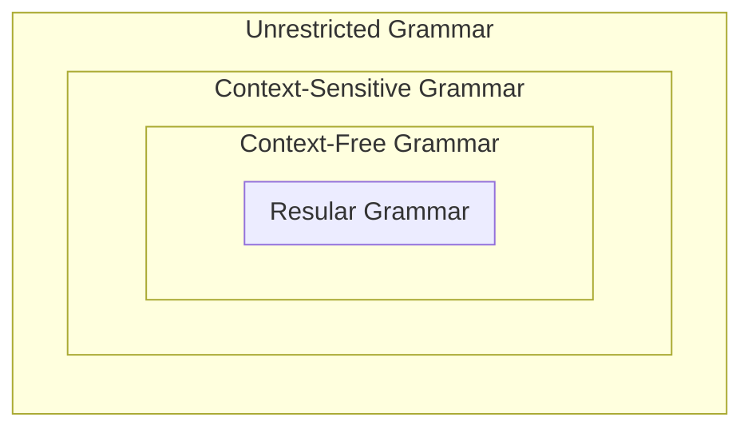
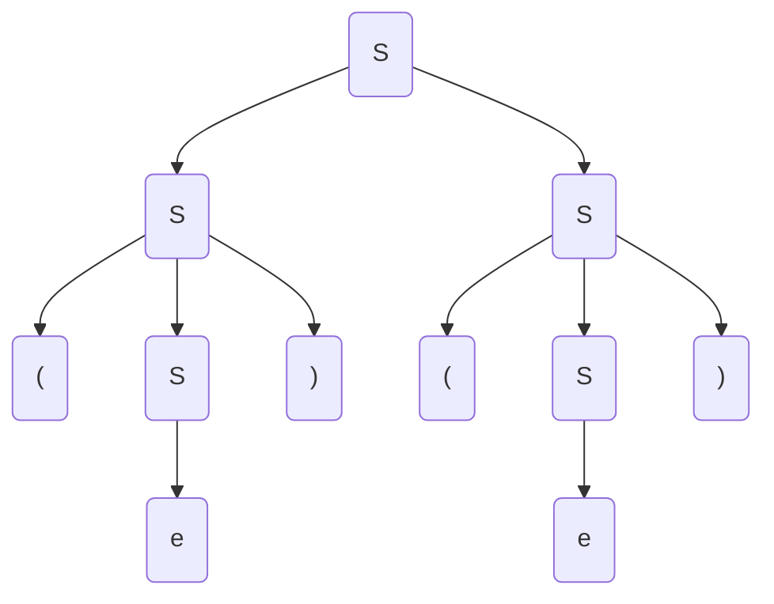
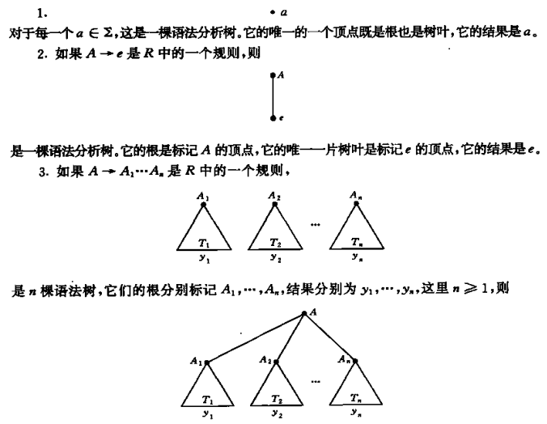
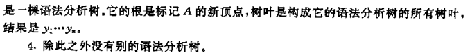
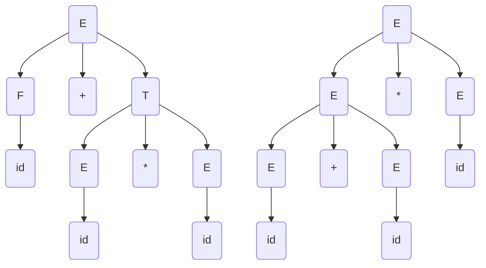
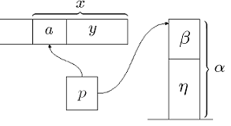
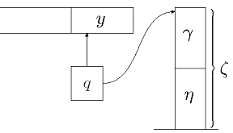
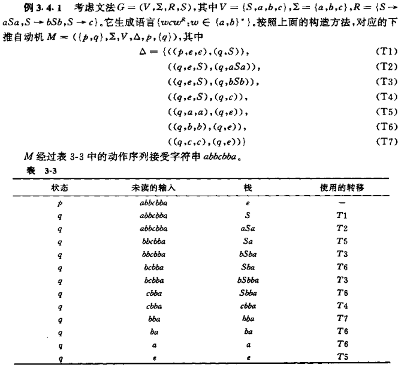
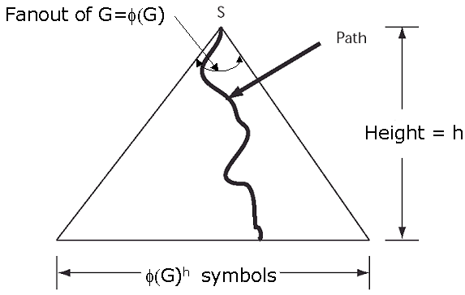

[TOC]

# CF Grammars

<u>用$\rightarrow$表示“可以是”</u>，语言生成式定义如下：从由一个符号$S$组成的字符串开始，在当前字符串中找到出现在已定规则中的"$\rightarrow$"左边的<u>符号</u>，并将其替换成"$\rightarrow$"右边的<u>字符串</u>，直到不存在"$\rightarrow$"左边的符号位置

**Ex**. 对于$a(a^* \cup b^*)b$，可以有$\begin{cases} S \rightarrow aMb \\ M \rightarrow A \\ M \rightarrow B \\ A \rightarrow e \\ A \rightarrow aA \\ B \rightarrow e \\ B \rightarrow bB \end{cases}$，则对于给定字符串$aaab$，$S \rightarrow aMb \rightarrow aAb \rightarrow aaAb \rightarrow aaaAb \rightarrow aaaeb=aaab$，不再存在"$\rightarrow$"左边的字符串，因此运算结束，且得到了结果

**Chomsky Hierarchy**

## CFG Formal Def

> Definition: A context-free grammar(CFG) is a quadruple $G=(V, \Sigma, R, S),$ where
>
> * $V$ is an alphabet
> * $\Sigma \subseteq V$ is the set of terminal symbol<u>s</u>
> * $S \in V-\Sigma$ is the start symbol
> * $R$ is the set of <u>rules</u>, a finite subset of $\left(V-\Sigma\right) \times V^{*}$
>
> **Remark**:
>
> - The member of $V-\Sigma$ are called nonterminals. For any $A \in V-\Sigma$ and $u \in V^{*}$, $A \rightarrow_{G} u \Leftrightarrow(A, u) \in R$
> - ==For any strings $u, v \in V^{*}$, $u \Rightarrow_{G} v \Leftrightarrow \exists x, y \in V^{*},$ and $A \in V-\Sigma,$ such that $u=x A y, v=x v^{\prime} y, \text { and } A \rightarrow_{G} v^{\prime}$==
>     - A是个非终结符，然后找到相应的x和y来构造出这样的u和v
>     - $\Rightarrow_{G}^{*}$ is the reflexive, transitive closure of $\Rightarrow_{G}$
> - $w_{0} \Rightarrow_{G} w_{1} \Rightarrow_{G} \cdots \Rightarrow_{G} w_{n}$
>     - a derivation(推导) in $G$ of $w_{n}$ from $w_{0}$, $n$ is the length of the derivation.
> - The language generated by $G$, $L(G)=\left\{w \in \Sigma^{*}: S \Rightarrow_{G}^{*} w\right\}$, $L$ is a context-free language(CFL) $\Leftrightarrow \exists$ a context-free grammar(CFG) $G,$ such that $L=L(G)$

## CFG Ex

**Ex.1**. Consider the CFG $G=(V, \Sigma, R, S)$ where $V=\{S, a, b\}, \Sigma=\{a, b\}, R=\{S \rightarrow a S b, S \rightarrow e\}$

$L(G)=\left\{a^{n} b^{n}: n \geq 0\right\}$, <u>here *L(G)* is context-free but not regular.</u>

**Ex.2**. Let $G=(V, \Sigma, R, S)$ where $V=\{S,(,)\}, \Sigma=\{(,)\}, R=\{S \rightarrow e, S \rightarrow S S, S \rightarrow(S)\}$

$L(G)$ is the language containing all strings of balanced parentheses(圆括号).

**Ex.3**. Let $G=(\{S, a, b\},\{a, b\}, R, S),$ where $R= \{S \rightarrow e, S \rightarrow S S, S \rightarrow a S b, S \rightarrow b S a\}$

$L(G)=\left\{w \in\{a, b\}^{*}: w\right.$ has the same number of $a^{\prime} s$ and $\left.b^{\prime} s\right\}$

**Proof**:
1 、$w \in L(G) \Longrightarrow w$ has the same number of $a$ 's and $b$ 's.
<u>By Induction on length $k$ of derivation.</u>
(a) $k=1$
The derivation is $S \Rightarrow e \Rightarrow w=e$ has the same number of $a$ 's and $b$ 's.
(b) $k>1$
Then either:
$$
\begin{array}{l}
S \Rightarrow S S \Rightarrow^{*} x y=w \\
S \Rightarrow a S b \Rightarrow^{*} a x b=w \\
S \Rightarrow b S a \Rightarrow^{*} b x a=w
\end{array}
$$
since $S \Rightarrow^{*} x, S \Rightarrow^{*} y$ by derivations of length $<k$, $x, y$ have equal number of $a$ 's and $b$ 's(IH)
so do $x y, a x b,$ and $b x a . \quad \sqrt{ }$

2、$w$ has the same number of $a$'s and $b$ 's $ \Longrightarrow w \in L(G)$
。。。PPT10

### CFL & RegexL

**Important Example**. <u>All regular languages are CFL</u>

* Proof 1
    * CFL是pushdown automata接受的语言，而pushdown automata是FA的推广<!--（Regex == FA  > PA > CFL)-->
* Proof 2
    * 由[后面的知识](#CFL Closure)，CFL在union、concatenation、K-star下是封闭的。而trival的语言$\empty$和$\{a\}$都是CF的（分别用R为空和R仅有一条S-->a的文法生成），因此CFL一定包括其在这些运算下的闭包（即所有正则语言）
* Proof 3：直接构造
    * DFA $M=(K, \Sigma, \sigma, s, F)$, For CFG $G(M) = (V, \Sigma, R, S)$,
        * $V = K \cup \Sigma$
        * $S = s$
        * $R=\{q \rightarrow a p: \delta(q, a)=p\} \cup\{q \rightarrow e: q \in F\}$
            * 将从p到q关于输入a的转移变为规则q-->ap
            * 将终结符q转变为规则q-->e

# Parse Tree

上面那个<a href="#Ex.3.1.4">例题</a>，有多种方式可以推导出"()()"，例如S=>SS=>(S)S=>()S=>()(S)=>()()和S=>SS=>S(S)=>(S)(S)=>(S)()=>()()，虽然推导顺序不同，但实际上使用的规则相同，在中间字符串中使用他们的地点也相同，如下图：

结构

* Node: V中符号
* Root：S
* Leaves：Σ中符号
* 从左到右连接叶节点得到的即是推导出来的终结符串，称为Parse Tree的结果

## PT Formal Def

**Formal Def of PT**

## PT similarity & precedence

**Formal Def of "Derivations D and D' are similar"**

Let $G=(V, \Sigma, R, S)$ be a CFG,
$$
\begin{array}{l}
D=x_{1} \Rightarrow x_{2} \Rightarrow \cdots \Rightarrow x_{n} \\
D^{\prime}=x_{1}^{\prime} \Rightarrow x_{2}^{\prime} \Rightarrow \cdots \Rightarrow x_{n}^{\prime}
\end{array}
$$
be two derivations, where $x_{i}, x_{i}^{\prime} \in V^{*}$ for $i=1 \cdots n, x_{1}, x_{1}^{\prime} \in$
$V-\Sigma,$ and $x_{n}, x_{n}^{\prime} \in \Sigma^{*}$

1. $D$ preceds $D^{\prime}\left(D \prec D^{\prime}\right) \Leftrightarrow \exists 1<k<n,$ such that
    * for all $i \neq k,$ we have $x_{i}=x_{i}^{\prime}$（<u>仅有一步不同</u>）
    * $x_{k-1}=x_{k-1}^{\prime}=u A v B w,$ where $u, v, w \in V^{*},$ and $A, B \in V-\Sigma$
    * $ x_{k+1}=x_{k+1}^{\prime}=u y v z w$
        * $x_{k}=u y v B w,$ where $A \rightarrow y \in R$（D左边先推导）
        * $ x_{k}^{\prime}=u A v z w,$ where $B \rightarrow z \in R$（D'右边先推导）
2. $D$ and $D^{\prime}$ are similar $\Leftrightarrow\left(D, D^{\prime}\right),$ belong in the reflexive, symmetric, transitive closure of $\prec$.

Remark:

- Similarity is an equivalence relation.
- Derivations in the <u>same equivalence class</u> under similarity have the <u>same parse tree</u>.

**leftmost derivation**: A derivation that is maximal under $\prec$. (similarly, rightmost derivation)

**Theorem**: Let $G=(V, \Sigma, R, S)$ be a $\mathrm{CFG},$ and let $A \in V-\Sigma$, and $w \in \Sigma^{*} .$ Then the following statements are equivalent:

* $A \Rightarrow * w$
* $\exists$ Parse tree with root $A$ and yield $w$.
* $\exists$ a leftmost derivation $A \stackrel{L}{\Rightarrow}^{*} w$.
* $\exists$ a rightmost derivation $A \stackrel{R}{\Rightarrow}^{*} w$.

**Example**: If $G$ is the CFG that generates language of balanced parentheses. Consider the following derivations $D_{1}, D_{2}$ and $D_{3}$:

$D_{1}=S \Rightarrow S S \Rightarrow(S) S \Rightarrow((S)) S \Rightarrow {\color{blue}(()) S} \Rightarrow(())(S) \Rightarrow(())()$
$D_{2}=S \Rightarrow S S \Rightarrow(S) S \Rightarrow((S)) S \Rightarrow{\color{blue}((S))(S)} \Rightarrow {\color{red}(())(S)} \Rightarrow(())()$
$D_{3}=S \Rightarrow S S \Rightarrow(S) S \Rightarrow((S)) S \Rightarrow((S))(S) \Rightarrow{\color{red}((S))()} \Rightarrow(())()$

$D_{1} \prec D_{2}, D_{2} \prec D_{3}$, but not the case $D_{1} \prec D_{3}$.（说明没有传递性）

$D_1, D_2, D_3$ are similar.

另外搞一个推导：$D=S \Rightarrow S S \Rightarrow S S S \Rightarrow S(S) S \Rightarrow S((S)) S \Rightarrow S(()) S \Rightarrow S(())(S) \\ \Rightarrow S(())() \Rightarrow(())()$

它与上面三个都不相似

## Ambiguity

Ambiguity是对CFG的限定词，表示a grammar in which some word has two parse trees.

Example: Consider the CFG $G^{\prime}=(V, \Sigma, R, S)$ where
$$
\begin{array}{l}
    V=\{+, *,(,), i d, E\} \\
    \Sigma=\{+, *,(,), i d\} \\
    R=\{E \rightarrow E+E, E \rightarrow E * E, E \rightarrow(E), E \rightarrow i d\}
\end{array}
$$

则$id, id, id$可以画出两个树

# Pushdown Automata

Motivation: 正则语言都是CFL（真子集），所以不是每一个CFL都能呗FA识别，所以需要一种能够识别任意CFL的机器，即PDA。

例如对于$\{ww^R: w \in \{a, b\}^*\}$，显然不是正则，但是是CF的，只需要加一个栈每次读一个w中字符push一个，之后w^R^中字符再取一个出来比较（甚至不需要支持随机访问的存储器，只要能访问栈顶的就行）

## PDA Formal Def

> Definition: A pushdown automata(PDA) is a sextuple $M=(K, \Sigma, \Gamma, \Delta, s, F)$, where
>
> * $K$ is a finite set of states
> * $\Sigma$ is an alphabet (the input symbols)
> * $\Gamma$ is an alphabet (the stack symbols)
> * $s \in K$ is the initial state
> * $F \subseteq K$ is the set of final states
> * $\Delta$, transition relation, is a subset of $\left(K \times\left(\Sigma \cup\{e\}\right) \times \Gamma^{*}\right) \times\left(K \times \Gamma^{*}\right)$
>
> 
>
> <u>转移：`((旧状态, 输入符号, 旧栈顶符号), (新状态, 新栈顶符号))`</u>
>
> * PDA execution: reading a symbol
>     Consider $((p, \alpha, \beta),(q, \gamma)) \in \Delta,$ Then the PDA can:
>     * enter some state $q$
>     * replace $\beta$ by $\gamma$ on the top of the stack
>     * advance the tape head
> * PDA execution: $e$-transition
>     Consider $((p, e, \beta),(q, \gamma)) \in \Delta,$ Then the PDA can:
>     * enter some state $q$
>     * replace $\beta$ by $\gamma$ on the top of the stack
>     * does not advance the tape head
>
> 
>
> **Remark**:
>
> * since several transition of $M$ may be simultaneously applicable at any point, the machines are **<u>nondeterministic</u>**.
> * ==<u>((p, u, e), (q, a)): push a; ((p, u, a), (q, e)): pop a</u>==
> * **Configuration** of a PDA: a member of $K \times \Sigma^{*} \times \Gamma^{*}$ `(状态，未输入所有符号，栈中所有符号)`
> * $(p, x, \alpha) \vdash_{M}(q, y, \zeta)$ (yield in one step) iff there is some transitions $((p, a, \beta),(q, \gamma)) \in \Delta$ such that
>     * $x=a y, a \in \Sigma \cup\{e\}$
>     * $\alpha=\beta \eta$
>     * $\zeta=\gamma \eta$ for some $\eta \in \Gamma^{*}$
>     *  $\Rightarrow$ 
> * $\vdash_{M}^{*}$ be the reflexive, transitive colsure of $\vdash_{M}$
>
> 
>
> **Acceptance conditions**
>
> A PDA $M$ accepts a string $w \in \Sigma^{*}$ iff
>
> * $(s, w, e) \vdash_{M}^{*}(p, e, e)$ for some $p \in F$
> * There is a sequence of configuration $C_{0}, \cdots, C_{n}(n>0)$, $(s, w, e)=C_{0} \vdash_{M} C_{1} \vdash_{M} \cdots \vdash_{M}(p, e, e)$ for some $p \in F$
>
> Note: Two traditional conditions
>
> - Process the input, and accept if the stack is empty
> - Accept if the PDA is in a final state
>
> The language accepted by $M$: $L(M)=\left\{w \mid(s, w, e) \vdash_{M}^{*}(p, e, e)\right.$ for some state $\left.p \in F\right\}$

既然有e-transition的存在，那PDA的终止条件是什么>？？

## PDA Ex

CW P34, TB P99

Also see example of <a id="Ex.3.4.1">constructing a PDA</a>

# PDA & CFA

## Equivalence

Theroem: The class of languages accepted by PDA is exactly the class of CFL

### CFA->PDA

**Lemma**: Each Context-Free language is accepted by some PDA.

Proof: To build the $\operatorname{PDA} M$ for CFG $G=(V, \Sigma, R, S)$ such that 

$L(M)=L(G)$

Main idea: Define PDA $M$ to mimics a leftmost derivation of the input string.

#### Construction of PDA

Define PDA $M=(K'=\{p, q\}, \Sigma, \Gamma'=V, \Delta', s=p, F=\{q\})$

- PDA $M$ has just 2 states.
    - $p$: start state
    - $q$: final state
- Stack alphabet $\Gamma=V$.
- Let $\Delta$ contains the following transitions:
1) $((p, e, e),(q, S))$
2) $((q, e, A),(q, x))$ for each rule $A \rightarrow x \in R$
3) $((q, a, a),(q, e)), \forall a \in \Sigma$.

See example [here](#Ex.3.4.1)

Verify $L(M)=L(G)$
Claim: Let $w \in \Sigma^{*}$ and $\alpha \in(V-\Sigma) V^{*} \cup\{e\} .$ Then 。。。
The claim will suffice to Lemma. Taking $\alpha=e$ that。。。。

### PDA->CFG

**Lemma**: If a language is accepted by a PDA, it's CFL

#### PDA -> SimPDA (construct)

> **Definition of Simple PDA**
>
> A PDA is simple if the following is true:
> Whenever $((q, a, \beta),(p, \gamma))$ is a transition of the PDA and $q$ is not the start state, then $\beta \in \Gamma$ and $|\gamma| \leq 2$
>
> In other words, A simple PDA always
>
> * consults its topmost stack symbol, and
> * replace it either $e,$ or with 1 or 2 stack symbols.

**Convert a PDA to an equivalent simple PDA**

Let $M=(K, \Sigma, \Gamma, \Delta, s, F)$ be any PDA,
$\Rightarrow$ construct a simple PDA $M^{\prime}=\left(K^{\prime}, \Sigma, \Gamma \cup\{Z\}, \Delta^{\prime}, s^{\prime},\left\{f^{\prime}\right\}\right)$ such that $L(M)=L\left(M^{\prime}\right)$

* $s^{\prime}, f^{\prime} \notin K$ be two new states, $Z \notin \Gamma$ be the *stack bottom symbol(栈底符)*.
* $K^{\prime}=K \cup \cdots$
* $\Delta^{\prime}$ contains:
    * the transition $\left(\left(s^{\prime}, e, e\right),(s, Z)\right)$ (start transition，将栈底符放在栈底)
    * for each $f \in F,\left((f, e, Z),\left(f^{\prime}, e\right)\right)$(final transition，pop栈底符)
    * all transition of $\Delta$
    * <u>replace with equivalent transitions that satisfy the simplicity condition.</u> (这里β是旧stack顶，γ是新栈顶)
        * Get rid of transitions with $|\beta| \geq 2$.
            * Consider any transition $((q, a, \beta),(p, \gamma)) \in \Delta^{\prime},$ where $\beta=B_{1} \cdots B_{n}$ with $n>1$.
            * Replace with the following transitions:
                * $\begin{array}{l}\left(\left(q, e, B_{1}\right),\left(q_{B_{1}}, e\right)\right) \\ \left(\left(q_{B_{1}}, e, B_{2}\right),\left(q_{B_{1} B_{2}}, e\right)\right) \\ ... \\ \left(\left(q_{B_{1} \cdots B_{n-2}}, e, B_{n-1}\right),\left(q_{B_{1} \cdots B_{n-1}}, e\right)\right) \\ \left(\left(q_{B_{1} \cdots B_{n-1}}, a, B_{n}\right),(p, \gamma)\right) \end{array}$
        * Get rid of transitions with $|\gamma|>2$(大于还是大于等于？), without introducing any transitions with $\beta \geq 2$.
            * Consider any transition $((q, u, \beta),(p, \gamma)) \in \Delta^{\prime},$ where $\gamma=$ $C_{1} \cdots C_{m},$ with $m \geq 2$
            * Replace with the following transitions:
                * $\begin{array}{l}\left((q, u, \beta),\left(r_{1}, C_{m}\right)\right) \\ \left(\left(r_{1}, e, e\right),\left(r_{2}, C_{m-1}\right)\right) \\ ... \\ \left(\left(r_{m-2}, e, e,\left(r_{m-1}, C_{2}\right)\right)\right. \\ \left(\left(r_{m-1}, e, e\right),\left(p, C_{1}\right)\right) \end{array}$
        * Get rid of transitions with $\beta=e,$ without introducing any transitions with $\beta \geq 2$ or $\gamma>2$
            * Consider any transition $((q, a, e),(p, \gamma))$ with $q \neq s^{\prime} .$
            * Replace any such transitions by all transitions of the form
                * $((q, a, A),(p, \gamma A) \text { for all } A \in \Gamma \cup\{Z\}$
            * It is easy to see that $L(M)=L\left(M^{\prime}\right)$.

#### SimPDA -> CFG (construct)

Construct A CFG from a simple PDA
$\Rightarrow$ Construct a CFG $G=(V, \Sigma, R, S)$ such that $L(G)=L\left(M^{\prime}\right)$

Let's look at how a PDA can consume $x=x_{1} x_{2} \cdots x_{k}$ and empty the stack.

> Definition:
> The nonterminals $\langle q, A, p\rangle$ represents any portion of the input string that might be read between a point when $M$ is in state *q* with $A$ on top of stack, and a point in time when $M$ removes the occurrence of $A$ from the stack and enters state $p$.
>
> $V=\{S\} \cup \Sigma \cup\{\langle q, A, p\rangle \mid \forall q, p \in K, A \in \Gamma \cup\{e, Z\}\}$

。。。

# CFL/nCFL

## CFL Closure

> **Theorem**: CFL are closed under <u>union</u>, <u>concatenation</u> and <u>K-star</u>. (Not under intersection, complement)
>
> 
>
> what about difference?

> **Theorem**: CFL $\cap$ Regex is a CFL.
>
> 此处交的定义如下：
>
> Let $M_{1}=\left(K_{1}, \Sigma, \Gamma_{1}, \Delta_{1}, s_{1}, F_{1}\right)$ be a aPDA nd $M_{2}=\left(K_{2}, \Sigma, \delta, s_{2}, F_{2}\right)$ be a DFA.
>
> Bulid PDA $M=(K, \Sigma, \Gamma, \Delta, s, F),$ where
>
> * $K=K_{1} \times K_{2}$
> * $\Gamma=\Gamma_{1}$
> * $s=\left(s_{1}, s_{2}\right)$
> * $F=F_{1} \times F_{2}$
> * $\Delta:$ For each $\left(\left(q_{1}, a, \beta\right),\left(p_{1}, \gamma\right)\right) \in \Delta_{1},$ and $q_{2} \in K_{2}$, $\left(\left(\left(q_{1}, q_{2}\right), a, \beta\right),\left(\left(p_{1}, \delta\left(q_{2}, a\right)\right), \gamma\right)\right) \in \Delta$

**Example**

$L=\left\{w: w \in\{a, b\}^{*}, w\right.$ has equal numbers of $a^{\prime} s$ and $b^{\prime} s$ but containing no substring $abaa$ or $b a b b\}$. Then $L$ is context-free.

Solution:

* $L_{1}=\left\{w: w \in\{a, b\}^{*}, w\right.$ has equal numbers of $a^{\prime} s$ and $\left.b^{\prime} s\right\}$ (CFL)
* $L_{2}=\left\{w \in\{a, b\}^{*}: w\right.$ containing no substring $a b a a$ or $\left.b a b b\right\}$ $=\{a, b\}^{*}-\{a, b\}^{*}(a b a a \cup b a b b)\{a, b\}^{*}$ (reL)
* $L=L_{1} \cap L_{2}$ be a context-free language.

## Pumping Theorem

> **Lemma** The yield(结果) of any parse tree of *G* of height *h* has length at most $\phi(G)^h$
>
> * $\phi(G)$：G的扇出，表示G的规则右边的最大符号数>？这定义什么意思？根据证明来看难道不就是每个节点的最大儿子数吗
> * Path：通路，字面意思，同DS
>     * Length：通路的线段数
> * Height：最大的Length值
>
> 

> **Theorem** (**Pumping Theorem**) Let $G=(V, \Sigma, R, S)$ be a CFG. Then any string $w \in L(G)$ of length greater than $\phi(G)^{\mid V-\Sigma\mid}$ can be rewritten as $w=u v x y z$ in such way that:
>
> * $|v y| \geq 1$
> * $u v^{n} x y^{n} z \in L(G)$ for every $n \geq 0$
>
> 
>
> **Remark**: Proving that a language is not CFL
>
> * Let *L* be the proposed CFL
> * There is some *n*, by the pumping lemma
> * Choose a string *s*, longer than *n* symbols, in the language *L*
> * Using the pumping lemma, construct a new string s that is not in the language
>
> **Remark**: Any CFL over a single-letter alphabet is regular.

> **Theorem**: The CFL are **not closed** under <u>intersection</u> or <u>complementation</u>

# Alg for CFG

> **Theorem**
>
> * There is a polynomial algorithm which, given a CFG, constructs an  equivalent PDA.
> * There is a polynomial algorithm which, given a PDA, constrcuts an equivalent CFG.
> * There is a polynomial algorithm which, given a CFG and a string $x$, decides whether $x \in L(G)$.
> 
>**Remark**
> 
>* There are no algorithms for two CFGs( or PDA) are equivalent(see Chapter 5).
> * For regualr language, there was no need for an analog of part (c) above, since regular languages are represented in terms of an efficient algorithm for deciding precisely the membership question in (c): a DFA.
>     * For CFL, we have so far introduced only non-algorithmic, nondeterministic acceptor-PDA.
>     * We will construct a deterministic acceptor algorithm in the next subsection that for any CFL.

