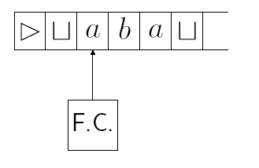

[TOC]

# Def of TM

## Intro

**Motivation**

DFA limitations
- Tape head moves only one direction
- Tape is read-only
- Tape length is a constant

PDA limitations
- Tape head moves only one direction
- Tape is read-only, but stack is writable
- Stack has only LIFO(last-in, first-out) access
- Tape length is constant, but stack is not bounded.

Imporvements

* writeable, 2-way tape (输入)
* random-access stack (栈)

**A rough def**

* Head can both read and write, and move 1n both di­ rections
* Tape has unbounded length.
* $\bigsqcup$ is blank symbol. In practice, all but a finite number of tape squares are blank.
* $\rhd$是左端符

## TM Formal Def

### TM itself

> **Definition**: A Turing Machine is a quintuple $(K, \Sigma, \delta, s, H),$ where
>
> * $K$ is a finite set of states
> * $\Sigma$ is an alphabet
>     * containing $\sqcup$ (blank symbol, no normal symbol at this place) and $\rhd$ (left end of tape)
>     * not containing the symbols $\leftarrow$ and $\rightarrow$
> * $s \in K$ is the *initial state*
> * $H \subseteq K$ is the set of *halting states*
> * $\delta:(K-H) \times \Sigma \rightarrow K \times\left(\Sigma \cup\{\leftarrow, \rightarrow\}\right)$ be the transition function
>     * $\forall q \in K-H$ if $\delta(q, \rhd)=(p, b),$ then $b=\rightarrow$
>     * $\forall q \in K-H$ and $a \in \Sigma,$ if $\delta(q, a)=(p, b),$ then $b \neq \rhd$

。。。

### TM Configuration

> **Definition**: A configuration of a TM $M=(K, \Sigma, \delta, s, H)$ is a member of $K \times \rhd \Sigma^{*} \times\left(\Sigma^{*}\left(\Sigma-\{\sqcup\}\right) \cup\{e\}\right)$. 二号位是从left end到所在状态的所有symbol，三号位是所在状态一直到最后一个非$\sqcup$字符
>
> Configuration $(q, \triangleright x, y)$: 
>
> 
>
> **Remark**: A configuration whose state component is in *H* will be called *halted configuration*.
>
> 
>
> A simplified notation of configuration: $(q, w a, u) \Rightarrow(q, w \underline{a} u)$

Example of TM conf:

### TM Computation

> **Definition**: Let $M=\left(K, \Sigma, \delta, s, H\right)$ be a TM and consider two configurations of $M\left(q_{1}, w_{1} \underline{a}_{1} u_{1}\right)$ and $\left(q_{2}, w_{2} \underline{a}_{2} u_{2}\right)$, where $a_{1}, a_{2} \in \Sigma$.
>
> Then $\left(q_{1}, w_{1} \underline{a_{1}} u_{1}\right) \vdash_{M}\left(q_{2}, w_{2} \underline{a_{2}} u_{2}\right)$, iff, for some $b \in \Sigma \cup\{\leftarrow, \rightarrow\}, \delta\left(q_{1}, a_{1}\right)=\left(q_{2}, b\right),$ either
>
> 1. $b \in \Sigma, w_{1}=w_{2},$ and $u_{1}=u_{2},$ and $a_{2}=b$ or
> 2. $b=\leftarrow, w_{1}=w_{2} a_{2}$ and either
>     1. $u_{2}=a_{1} u_{1},$ if $a_{1} \neq \sqcup$ or $u_{1} \neq e,$ or
>     2. $u_{2}=e,$ if $a_{1}=\sqcup$ and $u_{1}=e ;$
> 3. $b=\rightarrow, w_{2}=w_{1} a_{1}$ and either
>     1. $u_{1}=a_{2} u_{2},$ if $a 2 \neq \sqcup$ or $u_{2} \neq e,$ or
>     2. $u_{1}=e,$ if $a_{2}=\sqcup$ and $u_{2}=e .$
>
> 1 || 2 && (2.1 || 2.2) || 3 && (3.1 || 3.2)
>
> 分别的含义
>
> 1. 改写符号但是不移动带头
> 2. 将带头向左移一格，若正从(from)空格带向左移，则刚扫描的空格从格局里消失
>     * 
> 3. 将带头向右移一格，若正移到(to)空格带上，则新的空格符出现在新的格局里作为新的被扫描符号
>     * 
>
> 
>
> **Remark**:
>
> - For any Turing Machine $M,$ let $\vdash_{M}^{*}$ be the Reflexive, transitive closure of $\vdash_{M}$.
>     - Configuration $C_{1}$ yields configuration $C_{2}$ if $C_{1} \vdash_{M}^{*} C_{2}$.
> - A computation by $M$ is a sequence of configuration $C_{0}$, $C_{1}, \cdots, C_{n},$ for some $n \geq 0$ such that $C_{0} \vdash_{M} C_{1} \vdash_{M} \cdots \vdash_{M} C_{n}$, we say that the computation is of length $n$ or that it has $n$ steps, denoted by $C_{0} \vdash_{M}^{n} C_{n}$

## TM Notation

### Basic Machines

<u>Symbol-writing</u> and <u>hand-moving</u> Machines（字面意思）

$\Sigma$: a fixed alphabet, $a \in \Sigma \cup\{\leftarrow, \rightarrow\}-\{\rhd\},$ define a Turing Machine: $M_{a}=(\{s, h\}, \Sigma, \delta, s,\{h\})$, where for each $b \in \Sigma-\{\rhd\}, \delta(s, b)=(h, a)$.

Naturally, $\delta(s, \rhd)=(s, \rightarrow)$

==**Abbreviate**: $a$ instead of $M_{a}$; $L$ instead of $M_{\leftarrow}$,  and $R$ instead of $M_{\rightarrow}$.==

### Combined Machines

#### What is combined machines

* Start in the start state of M1.
* Compute until M1 reaches a halt state.
* Examine the tape and take the appropriate transition.
* Start in the start state of the next machine, etc.
* <u>Halt</u> if <u>any</u> component reaches a halt state and <u>has no place to go</u>.
* If <u>any component</u> fails to halt, then the entire machine may <u>fail to halt</u>.

> Formally, $M_{i}=\left(K_{i}, \Sigma, \delta_{i}, s_{i}, H_{i}\right),(i=1,2,3)$ be TMs. The combined machine(shown in mermaid above) would be $M=(K, \Sigma, \delta, s, H),$ where:
> * $K=K_{1} \cup K_{2} \cup K_{3}$
> * $s=s_{1}$
> * $H=H_{2} \cup H_{3}$
> * For each $\sigma \in \Sigma$ and $q \in K-H, \delta(q, \sigma)$ is defined as follows:
>     * If $q \in K_{1}-H_{1},$ then $\delta(q, \sigma)=\delta_{1}(q, \sigma)$（M1未停机
>     * If $q \in K_{2}-H_{2}$, then $\delta(q, \sigma)=\delta_{2}(q, \sigma)$（M2未停机
>     * If $q \in K_{3}-H_{3},$ then $\delta(q, \sigma)=\delta_{3}(q, \sigma)$（M3未停机
>     * If $q \in H_{1},$ then
>         * $\delta(q, \sigma)=s_{2}$ if $\sigma=a$;（跳转到M2的s
>         * $\delta(q, \sigma)=s_{3}$ if $\sigma=b$;（跳转到M3的s
>         * otherwise $\delta(q, \sigma) \in H$（无符号，直接到M2或M3的停机状态
>
> 
>
> 要构造更复杂的机器：组合单一机器称为组合机器，再把它看作独立的机器再去组合出更复杂的

#### Exs of combined machines

**Some**

* ==$\large R_{\sqcup}$: find the first blank square to the right of the current square==
* ==$\large L_{\sqcup}$: find the first blank square to the left of the current square==
* ==$\large R_{\overline{\sqcup}}$: find the first nonblank square to the right of the current square==
* ==$\large L_{\overline{\sqcup}}$: find the first nonblank square to the left of the current square==

**More**

* ==$\large L_a$: find the first occurrence of a to the left of the current square==
* ==$\large R_{a,b}$: find the first occurrence of a or b to the right of the current square==
* ==$\large M_2 \xleftarrow{b}L_{a,b} \xrightarrow{a} M_1$: find the first occurrence of a or b to the left of the current square, then go to M1 if the detected character is a; go to M2 if the detected character is b==
* ==$\large \large L_{x=a,b}$: find the first occurrence of a or b to the left of the current square and <u>set x to the value found</u>==
* ==$\large L_{x=a,b}R_x$: find the first occurrence of a or b to the left of the current square, set x to the value found, <u>move one square to the right, and write x (a or b)</u>==

<!--\begin{array}{}L_{a,b} & \xrightarrow{a} M_1 \\ b| &\\ \ \triangledown & \\ M_2 \end{array}-->

**Copying machine**

* $\underline{\sqcup}w\sqcup \Longrightarrow \sqcup w \sqcup w \underline{\sqcup}$
* w自己不含空格，而其他部分全是空格（左方要留出一个放带头），则经过复制机后带上会有$w\sqcup w$，其他部分都是空格
* 
    * a是w中的符号
    * 为什么$R_{\sqcup}$和$L_{\sqcup}$分别都要进行两次>？因为复制后w和w之间要有一个空格，一次的话正好移到空格上，所以要多一次移到另外一个w的尾

**Left-shifting machine**

* $\triangleright\sqcup w\underline{\sqcup} \Longrightarrow \triangleright w \underline{\sqcup}$
* 

**Machine that delete *a* in tape**

* 

# Computing with TM

这节讲如何使用TM

## Recognizer (Decide)

> **Definition**: Let $M=(K, \Sigma, \delta, s, H)$ is a TM.
>
> * ==$H=\{y, n\}$ consists of two distinguished halting states $(y$ $-$ "yes" and $n-$ "no" $)$==
> * accepting configuration: Any halting configuration whose state component is $y$
> * rejecting configuration: Any halting configuration whose state component is $n$
>
> 
>
> * $M$ accepts $w \in\left(\Sigma-\{\sqcup, \rhd\}\right)^{*}$ if
>     \\	$(s, \rhd\underline{\sqcup} w)$ yields an accepting configuration;
>     $M$ rejects $w$ if
>     \\	$(s, \rhd\sqcup w)$ yields an rejecting configuration.
> * Let $\Sigma_{0} \subseteq\left(\Sigma-\{\sqcup, \rhd\}\right.$ be a alphabet $-$ input alphabet of $M$.
> * $M$ decides $L \subseteq \Sigma^{*}$ if $\forall w \in \Sigma^{*}$ the following is true:
>     1. 能停机
>     2. 回答正确
>         * $w \in L$ <u>iff</u> $M$ accepts $w$
>         * $w \notin L$ <u>iff</u> $M$ rejects $w$
> * A *language* $L$ is <u>recursive</u> if $\exists$ a TM that decides $L$.

**Example** $\{a^nb^nc^n: n \geqslant 0\}$

## Recursive Func

**How a TM is used to compute <u>functions</u>**

> Definition: Let $M=(K, \Sigma, \delta, s, H)$ be a TM. Let $\Sigma_{0} \subseteq$ $\Sigma-\{\rhd, \sqcup\}$ be an alphabet and $w \in \Sigma_{0}^{*}$
> - Suppose that $M$ halts on input $w$ and that $(s, \triangleright \underline{\sqcup} w) \vdash_{M}^{*}(h, \triangleright\underline{\sqcup} y)$ for some $y \in \Sigma_{0}^{*} .$ Then $y=M(w)$ is called the output of $M$ on input $w$
> - Let $f$ be a function $f: \Sigma_{0}^{*} \rightarrow \Sigma_{0}^{*} . M$ computes function $f$ if, $\forall w \in \Sigma_{0}^{*}, M(w)=f(w)$
> - A function $f$ is recursive if $\exists$ a TM $M$ computes $f$.

**Recursive Functions**

> Definition: Let $M=(K, \Sigma, \delta, s,\{h\})$ is a TM.
>
> * $0,1, ; \in \Sigma$ and let $f: \mathbb{N}^{k} \rightarrow \mathbb{N}$ be any function for some $k \geq 1 . M$ computes $f$ if, $\forall w_{1}, \cdots, w_{k} \in 0 \cup 1\{0,1\}^{*}$, $\operatorname{num}\left(M\left(w_{1} ; \cdots ; w_{k}\right)\right)=f\left(\operatorname{num}\left(w_{1}\right), \cdots, \operatorname{num}\left(w_{k}\right)\right)$
> * $f: \mathbb{N}^{k} \rightarrow \mathbb{N}$ is recursive if $\exists$ a TM $M$ computes $f$.
>
> 
>
> **Remark**:
>
> * $M$ started with the binary representations of integers $n_{1}, n_{2}, \cdots, n_{k}$ as input.
> * <u>$M$ eventually halts.</u>
>     * FA是一定会停机的，PDA不一定（但是可以转成能停机的FA）
> * When it does halt, its tape contains a string that represents number $f\left(n_{1}, n_{2}, \cdots, n_{k}\right)$

**Example**: Binary Notation

**Example**. successor function(后继函数)

## Recursive Enumerable Languages (Semidecide)

> Definition: Let $M=\left(K, \Sigma, \delta, s, H\right)$ is a TM. Let $\Sigma_{0} \subseteq$ $\Sigma-\{\rhd, \sqcup\}$ be an alphabet and $L \subseteq \Sigma_{0}^{*}$
> - $M$ ==semidecides== $L$ if
>     \\	for $\forall w \in \Sigma^{*}$,
>     \\		the following is true:
>     \\			$w \in L \Leftrightarrow M$ halts on input $w$.
> - A language $L$ is <u>recursively enumerable</u> iff $\exists$ a TM $M$ that <u>semidecides</u> $L$.
>
> 
>
> **Remark**:
>
> * $L$ be a recursively enumerable:
>     * $w \in L \Leftrightarrow M$ halts.
>     * $w \notin L \Leftrightarrow M$ never enter the halting state.
>     * Recursion is related to recursion in programs
>     * Enumerable means there is some TM that can enumerate the strings in the language. ( [Later $\cdots$ ])
> * Extending the functional notation:
>     * $M(w)=\uparrow$ if $M$ fails to halt in input $w$
> * Turing Machine ==semidecides== $L$:
>     * $M(w)=\uparrow \Leftrightarrow w \notin L$ (以不能停机作为不属于L的依据)

**Example**

**Important Theroem**

* 语言*L*是递归的，则*L*还是递归可枚举的
* 语言*L*是递归的，则*L*的complement也是递归的

# Extension of TM

## Multiple Tapes

### MTTM Basis

> **MTTM Definition**: Let $k \geqslant 1$ be an integer. A **k-tape TM** is a quintuple $(K, \Sigma, \delta, s, H),$ where $K, \Sigma, s$ and $H$ are as in the definition of the ordinary $\mathrm{TM},$ and $\delta,$ the transition function:
> $$
> \delta:(K-H) \times \Sigma^{k} \rightarrow K \times\left(\Sigma \cup\{\leftarrow, \rightarrow\}\right)^{k}
> $$
> **MTTM Config Definition**: Let $M=(K, \Sigma, \delta, s, H)$ be a $k$ -tape TM. A configuration of $M$ is a member of:
> $$
> K \times\left(\triangleright \Sigma^{*} \times\left(\Sigma^{*}(\Sigma-\{\sqcup\}) \cup\{e\}\right)\right)^{k}
> $$
> 
>
> **Convention**(惯例):
>
> - The input string is placed on the first tape;
> - The other tapes are iniatially blank, with the head on the leftmost blank square($\sqcup$) of each;
> - At the end of the computation, the output on the first tape; the other tapes are ignored.

**Example**. Copying Machine

**Example**. Adder

### MTTM/TM Equivalence

> Theorem: Let $M=(K, \Sigma, \delta, s, H)$ be a k-tape TM($k \geq 1$). Then there is a standard TM $M=\left(K^{\prime}, \Sigma^{\prime}, \delta^{\prime}, s^{\prime}, H\right),$ where $\Sigma \subseteq \Sigma^{\prime}$ and such that the following holds:
>
> 1. For any input string $x \in \Sigma^{*}, M$ on input $x$ halt with output $y$ on the first tape iff $M^{\prime}$ on input $x$ halts as the same halting state, and with the same output $y$ on its tape.
> 2. If $M$ halts on input $x$ after $t$ steps, then $M^{\prime}$ halts on input $x$ after a number of steps which is $\mathscr{O}(t \cdot(|x|+t))$.

构造：令M'上有2k条带子，第2i-1条同M的第i条，第2i条记录带头位置（带头所在为1，其他全部为0）

## Two-way Infinite Tape

> 两边都是无穷长，除了输入，其他格初始都是blank，对于2WIT，$\rhd$的概念没有意义

## Multiple Heads

> 只有一个带，但是有多个heads，每个都独立读写并且不知道互相的存在。

使用普通TM构造：类似MTTM，有k+1个轨道，一个记录带，剩下k个记录k个带头的位置信息

## Two Dimensional Tape

# Nondeterministic TM

## NTM Def

Motivation：虽然NFA没有比DFA更强，但是NPDA确实比DPDA更强，因此想看看NTM是不是比DTM更强

> Definition: A nondeterministic Turing Machine(NTM) is a quintuple $M=(K, \Sigma, \Delta, s, H),$ where $K, \Sigma$ and $H$ are as for standard TMs, and $\Delta$ is a subset of
> $$
> \left((K-H) \times \Sigma\right) \times\left(K \times\left(\Sigma \cup\{\leftarrow, \rightarrow\}\right)\right)
> $$
> - Like TMs, but is now a relation rather than a function.
> - Configurations and the relations $\vdash_{M}$ and $\vdash_{M}^{*}$ are defined in the similar way in standard TM.
>     - $\vdash_{M}$ need not be single-valued.

**Accept**

> Definition: Let $M=(K, \Sigma, \Delta, s, H)$ is a NTM.
>
> * $M$ **accepts** an input $w \in\left(\Sigma-\{\rhd, \sqcup\}\right)^{*}$ if
>     \\	$(s, \rhd \underline\sqcup w) \vdash_{M}^{*} (h, u \underline{a} w)$ for some $h \in H$ and $a \in \Sigma, u, w \in \Sigma^{*}$
> * $M$ **semidecides** a language $L \subseteq\left(\Sigma-\{\rhd, \sqcup\}\right)^{*}$ if
>     \\	for all $w \in\left(\Sigma-\{\rhd, \sqcup\}\right)^{*}$,
>     \\		$w \in L$ iff $M$ **accepts** $w$.
>
> **Remark**:
>
> * NTM $M$ accepts an input $w$ as long as <u>at least one</u> halting computation exists.

==这半判定是个什么东西啊==

**Decides Languages/Computes Functions** (NTM)

> **Definition**: Let $M=(K, \Sigma, \Delta, s,\{y, n\})$ be a NTM.
>
> * $M$ **decides** a language $L \subseteq\left(\Sigma-\{\rhd, \sqcup\}\right)^{*}$ if the following two conditions hold for all $w \in\left(\Sigma-\{\rhd, \sqcup\}\right)^{*}$ :
>     1. $\exists N(M, w) \in \mathbb{N}$ such that there is no configuration $C$ satisfying $(s, \triangleright\underline{\sqcup} w) \vdash_{M}^{N} C$
>     2. $w \in L$ iff $(s, \triangleright\underline{\sqcup} w) \vdash_{M}^{*}(y, u \underline{a} v)$ for $a \in \Sigma,$ and $u, v \in \Sigma^{*}$.
> * $M$ **computes** a function $f:\left(\Sigma-\{\rhd, \sqcup\}\right)^{*} \rightarrow\left(\Sigma-\{\rhd, \sqcup\}\right)^{*}$
>     if the following two conditions hold for all $w \in\left(\Sigma-\{\rhd, \sqcup\}\right)^{*}$ :
>     1. $\exists N(M, w) \in \mathbb{N}$ such that there is no configuration $C$ satisfying $(s, \triangleright \underline{\sqcup} w) \vdash_{M}^{N} C$
>     2. $(s, \triangleright\underline{\sqcup} w) \vdash_{M}^{*}(h, u \underline{a} v)$ iff $u a=\triangleright\sqcup$ and $v=f(w)$
>
> **Remark**:
>
> * For NTM to decide a language and compute a function, all of its computations halt(condition 1). 必须能停止
> * For NTM decide a language, we only require that <u>at least one</u> of its possible computations end up accepting the input. 存在接受的即可，即使其他全部拒绝也没问题
> * For NTM to compute a function, we require that all possible computations agree on the outcome. 所有可能的输出都是同一个值的（不然就是多态了

**Ex.**

C = {num(pq): p, q >= 2}是合数集

一个semidecide C的NTM的操作如下：

1. 非确定选择两个大于1的二进制数p、q，将他们的二进制表示按位写在输入后面
2. 利用乘法机将带上的p和q改为它们的乘积（还是二进制
3. 看n和pq是否相等，是就停机（），否则就继续
    * 这n是啥东西？
    * 是半判定所以可以

## NTM/TM Equivalence

Theorem: If a NTM *M* semidecides or decides a language, or computes a function, then there is a standard TM *M'* semidecides or decides the same language, or computes the same function.

**MANY THINGS OMITTED**

# Grammars

## Grammars Def

> Definition: A **grammar** (or **unrestricted grammar**) is a quadruple $G=(V, \Sigma, R, S),$ where 
>
> * $V$ is an alphabet;
> * $\Sigma \subseteq V$ is the set of terminal symbols, and $V-\Sigma$ is called the set of nonterminal symbols;
> * $S \in V-\Sigma$ is the start symbol;
> * $R$ is the set of **rules**, a finite subset of $\left(V^{*}\left(V-\Sigma\right) V^{*}\right) \times V^{*}$.
>
> 
>
> * $u \rightarrow_{G} v \Leftrightarrow(u, v) \in R$
> * $u \Rightarrow_{G} v \Leftrightarrow \exists w_{1}, w_{2} \in V^{*},$ and some rule $u^{\prime} \rightarrow_{G} v^{\prime}$ such that $u=w_{1} u^{\prime} w_{2}, v=w_{1} v^{\prime} w_{2} .$
> * $\Rightarrow_{G}^{*}$ is the reflexive, transitive closure of $\Rightarrow_{G}$.
> - The **language generated by** $G$, $L(G)=\left\{w \in \Sigma^{*}: S \Rightarrow_{G}^{*} w\right\}$
> * $w_{0} \Rightarrow_{G} w_{1} \Rightarrow_{G} \cdots \Rightarrow_{G} w_{n}$
>     - a **derivation** in $G$ of $w_{n}$ from $w_{0}$. $n$ be the length of the derivation.
>
> 
>
> **Remark**:
>
> * Any context-free grammar is a grammar.