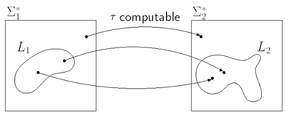

[TOC]

# Church-Turing Thesis

Intuitive(直觉的) notation of "computable" = Formal notation of "computable functions by TM"

不能被变换成《在所有输入上都能停机的TM》的任何东西都不能被认为是算法，而所有这样的机器都被正确地称为算法、

# Universal Turing Machine

**Turing Machines**

图灵机是不可编程的硬件，用于解决一个具体的问题，他的指令都是出场就固化了的

同时图灵机也是软件——认为图灵机的形式化是可用来写程序的编程语言，然后这种语言写的程序能被通用图灵机（同种语言写的另一段程序）解释执行


**The Ultimate Test**

*Can TM be programmed?*

- Can we design a "TM simulator" that is a TM?
- Can we design *U* that takes as input *M* and *w*, and produces the same result as runnning *M* on *w*?

## Representation of TM

**For tape symbols** $\Sigma \cup\{\leftarrow, \rightarrow\}$:

Let $j=\min \left\{j \mid j \in \mathbb{Z}\right.$ and $\left.2^{j} \geq\left|\Sigma\right|+2\right\}$
Each symbol in $\Sigma$ will be represented as <u>the letter *a* followed by a string of *j* bits</u>.
We fix the representations of the special symbols $\sqcup, \triangleright$, $\leftarrow,$ and $\rightarrow$ to be the lexicographically four smallest symbols, respectively:

* $\sqcup$: a0^j^ (00)
* $\rhd$: a0^j-1^1 (01)
* $\leftarrow$: a0^j-2^10 (10)
* $\rightarrow$: a0^j-2^11 (11)


**For states**:

Let $i=\min \left\{i \mid i \in \mathbb{Z}\right.$ and $\left.2^{i} \geq|K|\right\}$
Each state in $K$ will be represented as <u>the letter *q* followed by a binary string of length *i*</u>

Use $q 0^{i}$ to represent the start state.


**For the TM $M$ itself**:

* A list, in increasing lexicographic order, starting with $\delta(s, \sqcup),$ of the encoded quadruples.
* The set of halting states will be determined indirectly, by absence of its states as first components in any quadruple of "M". When $M$ decides a language, and thus $H=\{y, n\},$ we convent that $y$ is the lexicographically smallest of the two halt states.

## UTM

用*U*表示UTM，其有两个自变量：机器*M*的输入*"M"*，输入字符串*w*的描述*"w"*，要使*U*具有《*U*在输入*"M""w"*上停机 当且仅当 *M*在输入*w*上停机》的性质，可以记作 *U("M""w")="M(w)"*


用单带的*U*来模拟三带的*U'*，其中第一条存M当前带内容，第二条存M自身编码，第三条包含在被模拟的计算中M当前状态的编码


模拟方法

1. On input "M" "w", copy "M" to the second tape , align "w" at the left end of the first tape, and write "s" on the third.（"s"是"q0^i^"
2. Simulate one step of the computation by M by find­ ing on the second tape the quadruple corresponding to the current state and scanned symbol of M, and changing the first and third tapes accordingly.
3. Repeat step (2) until the third tape contains "h" (which may never happen).

# Halting Problem

**The motivation**: <u>to find a nonrecursive language.</u>


We know such languages exist, by a counting argument:

* Every recursive language is decided by a TM
* There are only countably（如何证明？？） many TMs (countably recursive languages)
* There are uncountably many languages

$\Longrightarrow$ Most languages are not recursive.


```python
def diagonal(X):
a:
    if halts(X, X) then
        goto a
    else
        halt

diagonal(diagonal) --> Uncertain State
```

## H

**Theorem**

<u>Let *H* = { *"M""w"* : TM *M* halts on input string *w* }.</u>

<u>The language *H* is not recursive;</u> therefore, the class of recursive languages ia a strict subset of the class of recur­ sively enumerable languages.

**Remark**:

* *H* is the formalized version of the halting problem
* *H* is recursively enumerable
    * because the universal TM semidecides *H(L(U) = H)*


**Main idea**: Every r.e. language is recursive iff <u>the particular r.e language</u> $H$ is recursive.

Suppose that $H$ is indeed decided by some TM $M_{0}$. Given any particular TM $M$ semideciding a language $L(M),$ then we could design a TM $M^{\prime}$ that decides $L(M)$ as follows:

1. transforms its input tape from $\color{blue}\triangleright \sqcup w \underline\sqcup$ to $\color{blue}\triangleright \sqcup "M""w" \underline{\sqcup}$
2. simulates $M_{0}$ on this input.

**Remark**: There are <u>reductions</u> from all r.e. languages to $H$ and $H$ is <u>complete</u> for the r.e. languages.


**Theorem**

The class of recursively enumerable languages is not closed under complement.

# Undecidable Problems about TM

* Any algorithm can be turned into a TM that halts on all inputs.
* **<u>Problems</u>** for which <u>no algorithms exist</u> are called <u>undecidable</u> or <u>unsolvable</u>
* *H* is not recursive.
    * The most famous undecidable problem is called the halting problem for TM.

## Reduction

> **Definition**
>
> Let $L_{1}, L_{2} \subseteq \Sigma^{*}$ be languages. A **reduction**(规约) from $L_{1}$ to $L_{2}$ is a recursive function $\tau: \Sigma^{*} \rightarrow \Sigma^{*}$ such that $x \in L_{1}$ iff $\tau(x) \in L_{2}$
>
> 
>
> **Theorem**: If $L_{1}$ is not recursive, and there is a reduction from $L_{1}$ to $L_{2}$, then $L_{2}$ is also not recursive.
>
> > Proof: Suppose that $L_{2}$ is recursive, say decided by TM $M_{2}$. Let $T$ be the TM that computes the reduction $\tau$. Then the TM $T M_{2}$ would decide $L_{1}$. But $L_{1}$ is undecidable. $\longrightarrow$ a contradiction.
>
> **Remark**:
>
> * 注意规约的方向是从 已知非递归 到 未知非递归
> * If there is a reduction of $L_{1}$ to $L_{2},$ then
>     * if $L_{2}$ is decidable, then so is $L_{1}$;
>     * if $L_{1}$ is undecidable, then $\mathrm{so}$ is $L_{2}$.

==recursive和decidable的关系？？<font color="gren">Recursive languages are also called **decidable**</font>，即能停机且输出与对应的TM相匹配（见chap4）==

## Some Undecidable Problems

**Theorem**: The following <u>problems</u> about TM are <u>undecidable</u>.
(a) Given a TM $M$ and an input $w$, does $M$ halt on input $w$ ?
(b) Given a TM $M,$ does $M$ halt on the empty tape?
(c) Given a TM $M$, is there any string at all on which $M$ halts?
(d) Given a TM $M$, does $M$ halt on every input string?
(e) Given two TM $M_{1}$ and $M_{2}$, do they halt on the same input strings?
(f) Given a TM $M$ is the language that $M$ semidecides regular? Is it context-free? Is it recursive?
(g) Furthermore, there is a certain fixed machine $M,$ for which the following problem is undecidable: Given $w,$ does $M$ halt on $w$ ?

# Properties of Recursive Language

**Theorem**: $L$ is recursive iff $L$ and $\overline L$ are both regex

> Proof:
> - $\Longrightarrow$
>     - If $L$ is recursive then $L$ is r.e. (proved already).
>     - <u>If $L$ is recursive then $\bar{L}$ is recursive</u> and hence $\bar{L}$ is r.e. (proved already).
> - $\Longleftarrow$
>   - If $L$ and $\bar{L}$ are both r.e. then here is a decision procedure for $L$:<br />Given $w \in \Sigma^{*}$, run semidecision procedures for $L$ and $\bar{L}$ simultaneously (on alternate steps, for example). Since either $w \in L$ or $w \in \bar{L},$ one of these semidecision procedures will halt eventually.

## Turing-enumerable

> **Definition**: We say that a Turing machine $M$ **enumerates** the language $L$ iff for some fixed state $q$ of $M$,<br />$L=\left\{w:(s, \triangleright \underline{\sqcup}) \vdash_{M}^* (q, \triangleright \underline{\sqcup} w)\right\} .$<br />（设*M*是一台图灵机，若在输入串*w*上*M*运行后<u>可进入接受状态并停机</u>，则称*M*接受串*w*。*M*所接受的所有字符串的集合称为*M*所识别的语言，<u>简称*M*的语言，记作*L(M)*</u>。设$S\subseteq \Sigma ^{*}$是一个语言，若存在图灵机*M*使得*L(M)=S*，则称图灵机*M*识别*S*，且*S*称为图灵可识别语言。）
>
> A language is **Turing-enumerable** iff there is a Turing machine that enumerates it.
>
> 
>
> **Theorem**: <u>A language is **recursively enumerable** iff it is **Turing-enumerable**.</u>

## Lexicographically Turing-enumerable

> **Definition**: Let $M$ be a Turing machine $M$ enumerating a language $L$. We say $M$ lexicographically enumerates $L$ if the following is true, where $q$ is the special "display" state:
> Whenever $(q, \triangleright \sqcup w) \vdash_{M}^{+}\left(q, \triangleright \sqcup w^{\prime}\right),$ then $w^{\prime}$ comes lexicographically after $w$.
>
> A language is lexicographically Turing enumerable iff there is a Turing machine that lexicographically enumerates it.
>
> 
>
> **Theorem**: <u>A language is **recursively** iff it is **lexicographically Turing-enumerable**.</u>

## Rice Theorem

### Index & Index Set

**Index**

Def: An index is a string *"M"* for some TM *M​*
- where *"M"* is an index for the r.e. set *L(M)​*

Example:

| Set         | Index (example)                                              |
| ----------- | ------------------------------------------------------------ |
| *H*         | *"U"*（*U*指undecidable的TM，因为*H*是非递归的）             |
| $\emptyset$ | *"M"* where *M* is any TM that has no transitions to the halt state |


**Index Set**

An index set $\mathscr{I}$ is the set of <u>**all**</u> indices for some collection of r.e. sets

That is: if $\mathscr{C}$ is a class of r.e. sets, $\mathscr{I}(\mathscr{C})=\left\{{ }^{\prime \prime} M^{\prime \prime}: L(M) \in \mathscr{C}\right\}$

Example:

| $\mathscr{C}$                                               | $\mathscr{I}(\mathscr{C})$                                   |
| ----------------------------------------------------------- | ------------------------------------------------------------ |
| $\{\emptyset\}$                                             | The indices of all TM that halt on no input                  |
| $\{S: S\text{ is finite}\}$                                 | The indices of all TMs that halt on only a finite number of input strings |
| $\{S \subseteq \Sigma^{*}:  S\text{ is r.e. and }e \in S\}$ | The indices of all TMs that halt on the empty string         |

### Rice

**Theorem**: If $S$ is a class of recursively enumerabale languages such that $\mathscr{I}(S)$ is <u>neither empty nor the set of all indices</u>(非空真子集), then $\mathscr{I}(S)$ is undecidable

i.e. almost all questions 《of the form "Here is a TM *M*; Does *M* halt on this kind of input?"》 are undecidable.

e. g.

* Is $L(M)=\emptyset$?
* Is $L(M)=$ finite?
* Is $L(M)=\Sigma^{*}$?
* Is $e \in L(M)$?